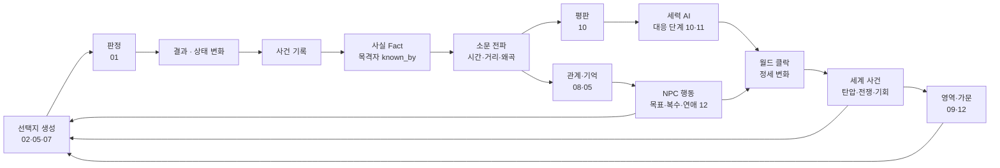

# 00. 시스템 연동도 — 모든 것이 하나로 움직이는 법

> 이 게임에는 판정, 아이템, 계승, 대사, 재능, 지도, 관계망, 영역, 평판, 음모, 연애·가족, 월드 클락이 있다.
> 이것들이 "따로 노는 미니게임"이 되지 않으려면 **같은 데이터를 읽고 같은 데이터에 쓰는** 구조여야 한다.
> 이 문서는 그 공통 구조와, 한 번의 선택이 모든 시스템을 거쳐 퍼지는 흐름을 정리한다.

---

## 1. 조화의 다섯 규칙

| 규칙 | 의미 |
|------|------|
| **① 하나의 세계 상태** | 모든 시스템은 하나의 세계 상태(인물·관계·사실·영역·평판·클락)를 읽고 쓴다. 시스템별 별도 저장소를 두지 않는다 |
| **② 모든 변화는 사건(Event)으로** | 칼에 찔린 것도, 연애 고백도, 영지 확장도 "사건"으로 기록된다. 다른 시스템은 사건을 구독해 반응한다 |
| **③ 결과는 사실(Fact)로 남고, 소문으로 퍼진다** | 목격되지 않은 일은 아무도 모른다. 퍼지는 데 시간이 걸리고, 퍼지면서 왜곡된다 |
| **④ 특별 규칙 금지** | "이 인물은 죽일 수 없다", "이 땅은 가질 수 없다" 같은 예외를 만들지 않는다. 어려움은 데이터(보안 등급, 대응 단계)로 표현한다 |
| **⑤ 대가는 늦게, 멀리서 온다** | 한 선택의 결과는 즉시가 아니라 소문·세력 AI·클락을 거쳐 며칠~몇 년 뒤, 다른 곳에서 돌아온다 |

---

## 2. 공통 데이터 (세계 상태)

```
세계 상태
├─ 시간·날씨·계절                     (GAME_DESIGN §3.1)
├─ 지도 그래프 + 플레이어 지도 지식     (07)
├─ 인물 (NPC 등급 S/A/B/C)            (08)
│   ├─ 능력치·스킬·성향·상태           (01)
│   ├─ 소지품·장비                     (02)
│   └─ 일정·목표·기억 태그              (05, 08)
├─ 관계 (방향 있는 엣지)                (08, 12)
├─ 사실(Fact)과 인식(누가 아는가)        (08)
├─ 평판 (인지도·시선·칭호·위협도·정체)   (10)
├─ 영역·가문                           (09, 12)
├─ 세력 상태 (대응 단계·우호 단계·목표)  (10, 11)
├─ 월드 클락 (+ 무혈자의 찬가)          (WORLD_BIBLE §10~11)
└─ 주인공
    ├─ 현재 몸 (= 인물 하나)
    ├─ 잔향: 재능 포인트, 해금, 전생 기억, 각성도   (03, 06)
    └─ 인물 수첩 (플레이어가 아는 관계·사실)        (08)
```

> 주인공의 "현재 몸"도 그냥 **인물 데이터 하나**다. 그래서 영혼이 자녀에게 옮겨가는 것은
> "플레이어 조종 대상을 다른 인물로 바꾸는 것"일 뿐이고, 나머지 모든 시스템은 그대로 돌아간다.

---

## 3. 한 번의 선택이 흘러가는 길



- 모든 화살표 끝은 결국 **다시 선택지 생성(A)** 으로 돌아온다. 세계의 변화는 플레이어가 고를 수 있는 것을 바꾼다.

---

## 4. 시간 척도별 루프

| 척도 | 루프 | 주로 쓰는 시스템 |
|------|------|------------------|
| **순간** (분) | 선택 → 판정 → 결과 | 01, 02, 05 |
| **하루** | 일·배급·관계·위험·이동 | 03 (생활비), 07, 08, 12 (데이트) |
| **계절** | 영역 방침, 가문 결정, 정세 변화, 수확·기근 | 09, 10, 11, 12, 클락 |
| **생애** (수년~수십 년) | 성장, 사랑, 가족, 영지, 죽음, 영혼 이동 | 03, 06, 12 |
| **시대** (수십~백여 년) | 무혈자의 찬가, 맹약의 균열 | 전부 |

---

## 5. 시스템 연동 표

행 시스템이 열 시스템에 **주는 것**.

| ↓주는 쪽 / 받는 쪽→ | 판정·성장 | 아이템 | 대사 | 관계망 | 평판 | 영역 | 음모 | 연애·가족 | 클락 | 계승 |
|---|---|---|---|---|---|---|---|---|---|---|
| **판정·성장 (01)** | — | 내구도 소모 | 결과별 대사 | 성공·실패 기억 | 목격된 결과 | 관리자 수완 | 작전 판정 | 고백·출산 판정 | — | 스킬 → 제자 |
| **아이템 (02)** | 장비보정 | — | 보이는 장비 반응 | 선물 | 위험한 소지품 | 시설 재료 | 수단(독·문서) | 선물·가보 | — | 가보의 메아리 |
| **대사 (05)** | — | — | — | 대화 사건 | 소문 전달 | 보고·요청 | 회유·협박 대사 | 연애 장면 | 소문 대사 | — |
| **관계망 (08)** | 관계보정 | — | 기억 조건 | — | 시선 계산 근거 | 관리자 충성 | 정보·접근 경로 | 끌림 기준 | NPC 목표 | 영혼 이동 대상 |
| **평판 (10)** | — | 가격 | 칭호 대사 | 첫인상 | — | 추종자 유입·노출 | 대응 단계 | 금지된 사랑의 반향 | 세력 행동 | 전설의 이름 |
| **영역 (09)** | 스승·시설 | 생산 | 보고 대사 | 공동체 관계 | 인지도 | — | 은신처·퇴로 | 가족 은신처 | 찬가 진척 | 영역 상속 |
| **음모 (11)** | 실전 경험 | 전리품 | — | 원한·배신 | 위협도 급변 | 진압 유발 | — | 인질 위험 | 클락 급변 | — |
| **연애·가족 (12)** | 양육 → 스킬 | 가보 | 연인 대사 | 혈연·혼인 | 혼인 동맹 | 가족 관리자 | 정략 혼인 | — | 인간 귀족 형성 | **다음 몸** |
| **클락** | — | 물가 | 세계 사건 대사 | 전쟁·죽음 | 정세 창 | 탄압·기회 | 정세 창 | 이별·징발 | — | — |
| **계승 (03·06)** | 재능 | 남겨진 소지품 | 전생 대사 | 인물 수첩 일부 | 가면·전설 | 15년 공백 결과 | 여러 생애 작전 | 자녀로 깨어남 | — | — |

---

## 6. 예시 — 한 생애의 연쇄

> 회색여울의 농노로 깨어난 주인공. 아래는 실제로 여러 시스템을 거치는 한 가지 흐름이다.

1. **[대사·관계]** 성채 하녀 사라와 친해진다. 사라는 글을 배우고 싶어 한다 (끌림 기준: 글을 읽어주는 것).
2. **[아이템·판정]** 브람의 지하실에서 몰래 글자를 가르친다. 매번 은신 판정 — 발각되면 둘 다 사형.
3. **[연애]** 사라와 연인이 된다. 그런데 남작의 아들 오웬(용인)도 사라를 연모한다 (관계 데이터, 비밀).
4. **[사실·소문]** 집사 마르타가 둘의 관계를 알아챈다 (`known_by` 추가). 마르타는 목줄단 목줄장이다.
5. **[음모]** 마르타는 이 비밀로 주인공을 협박한다: "탈주자들이 숨은 곳을 말해."
6. **[선택]** 주인공은 ① 탈주자를 판다 ② 마르타를 침묵시킨다 ③ 마르타의 딸(그녀의 약점)을 지렛대로 쓴다 ④ 사라와 함께 도망친다.
7. **[평판·클락]** ③을 골라 마르타를 포섭한다. 마르타는 관리자 후보가 된다 (수완 75, 충성 낮음).
8. **[영역]** 굶주린 언덕의 숨은 마을을 키운다. 마르타의 장부 조작으로 은폐가 올라간다.
9. **[클락]** 용황 병세 악화 → 남작이 빚을 갚으려 농노를 세렌에 팔기 시작한다. 사라가 매각 명단에 오른다.
10. **[음모]** 주인공은 남작의 노예 매매 증서를 훔쳐 불태운다 (파괴 작전). 성공, 하지만 목격자가 있었다.
11. **[평판]** "노예 장부를 태운 자" 소문이 퍼진다 → 인간 노예 시선 +, 레이번 가문 증오, 지역 현상금 (대응 1단계).
12. **[가족]** 사라가 임신한다. 노예의 아이는 주인의 재산이다.
13. **[대응]** 바르그 사냥대가 온다 (대응 2단계). 주인공은 사냥대를 숨은 마을에서 먼 쪽으로 유인하다 죽는다.
14. **[계승]** 영혼은 인연을 따라 옮겨갈 곳을 찾는다. 아이는 아직 태어나지 않았다. 그 사이 딸을 지켜준 주인공을 믿게 된 동료(신뢰 72) — **마르타**.
15. **[다음 생애]** 플레이어는 마르타로 깨어난다. 목줄장의 신분, 딸, 장부, 그리고 주인공이 남긴 숨은 마을과 사라와 아직 태어나지 않은 아이.

> 이 흐름은 스크립트가 아니다. 모든 단계가 이 문서의 시스템들이 데이터를 주고받은 결과다.

---

## 7. 엔진 구조 (요약)

```
engine/core/events.ts      사건 버스 — 모든 시스템이 발행·구독
engine/core/facts.ts       사실·인식 저장소 + 소문 전파
engine/core/state.ts       하나의 세계 상태 (직렬화 = 세이브)
engine/checks/             판정 (01)
engine/items/              아이템·태그 (02)
engine/dialogue/           대사 규칙 DB (05)
engine/actors/             NPC·관계·연애·가족 (08, 12)
engine/reputation/         평판·정체 (10)
engine/factions/           세력 AI·대응 단계·음모 대응 (10, 11)
engine/domains/            영역·관리자 (09)
engine/clocks/             월드 클락·찬가
engine/legacy/             죽음·영혼 이동·재능·연대기 (03, 06)
engine/map/                지도 그래프·안개 (07)
```

- 각 모듈은 **다른 모듈을 직접 호출하지 않고** 사건 버스와 세계 상태를 통해서만 소통한다 → 시스템을 추가해도 기존 시스템을 고치지 않는다.
- 헤드리스 시뮬레이션: 플레이어 없이 수십 년을 돌려 **연쇄가 폭주하거나 멈추지 않는지** 검증한다 (전쟁이 끝없이 이어지거나, 아무 일도 안 일어나는 세계를 잡는다).
