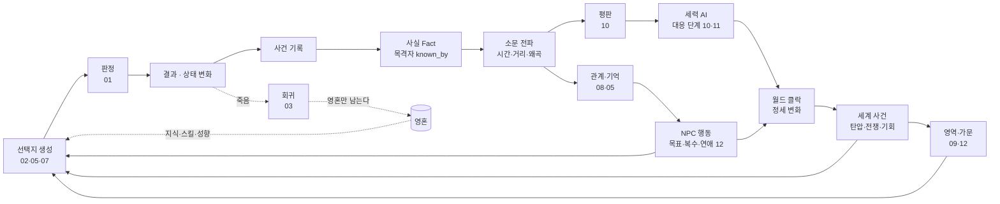
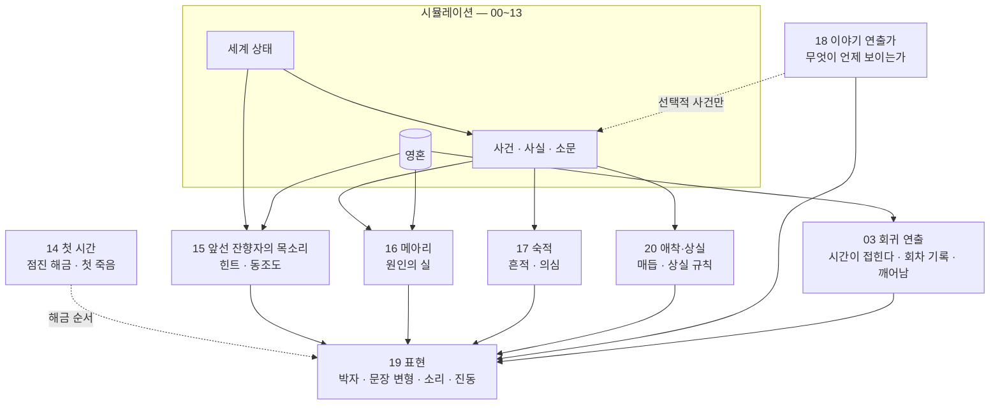

# 00. 시스템 연동도 — 모든 것이 하나로 움직이는 법

> 이 게임에는 판정, 아이템, 회귀, 대사, 재능, 지도, 관계망, 영역, 평판, 음모, 연애·가족, 월드 클락이 있다.
> 이것들이 "따로 노는 미니게임"이 되지 않으려면 **같은 데이터를 읽고 같은 데이터에 쓰는** 구조여야 한다.
> 이 문서는 그 공통 구조와, 한 번의 선택이 모든 시스템을 거쳐 퍼지는 흐름 — 그리고 **회귀를 건너 퍼지는 흐름** — 을 정리한다.

---

## 1. 조화의 다섯 규칙

| 규칙 | 의미 |
|------|------|
| **① 하나의 세계 상태** | 모든 시스템은 하나의 세계 상태(인물·관계·사실·영역·평판·클락)를 읽고 쓴다. 시스템별 별도 저장소를 두지 않는다. **예외는 단 하나, 주인공의 영혼**(§2) — 세계 상태 밖에 있고, 회귀를 건너 남는다 |
| **② 모든 변화는 사건(Event)으로** | 칼에 찔린 것도, 연애 고백도, 영지 확장도 "사건"으로 기록된다. 다른 시스템은 사건을 구독해 반응한다 |
| **③ 결과는 사실(Fact)로 남고, 소문으로 퍼진다** | 목격되지 않은 일은 아무도 모른다. 퍼지는 데 시간이 걸리고, 퍼지면서 왜곡된다 |
| **④ 특별 규칙 금지** | "이 인물은 죽일 수 없다", "이 땅은 가질 수 없다" 같은 예외를 만들지 않는다. 어려움은 데이터(보안 등급, 대응 단계)로 표현한다 |
| **⑤ 대가는 늦게, 멀리서 온다** | 한 선택의 결과는 즉시가 아니라 소문·세력 AI·클락을 거쳐 며칠~몇 년 뒤, 다른 곳에서 돌아온다. 회차를 넘는 대가(냄새·기시감·얼룩)는 **다음 회차에** 온다 |

---

## 2. 공통 데이터 — 세계 상태와 영혼

```
세계 상태  (회차의 것 — 회귀하면 회귀점 스냅샷에서 다시 만들어진다)
├─ 시간·날씨·계절                     (GAME_DESIGN §3.1)  ← 날씨는 〔표류〕
├─ 지도 그래프                         (07)
├─ 인물 (NPC 등급 S/A/B/C)            (08)
│   ├─ 능력치·스킬·성향·상태           (01)
│   ├─ 소지품·장비                     (02)
│   └─ 일정·목표·기억 태그              (05, 08)  ← 일정 일부와 흔들리는 선택은 〔표류〕
├─ 관계 (방향 있는 엣지)                (08, 12)
├─ 사실(Fact)과 인식(누가 아는가)        (08)
├─ 평판 (인지도·시선·칭호·위협도·정체)   (10)
├─ 영역·가문                           (09, 12)
├─ 세력 상태 (대응 단계·우호 단계·목표)  (10, 11)
├─ 월드 클락 (+ 무혈자의 찬가)          (WORLD_BIBLE §10~11)
└─ 주인공의 몸 (= 인물 하나)
    ├─ 능력치, 단련도(몸·그릇의 상한), 부상·흉터, 이식 특질 (01, 06)
    ├─ 몸의 특질(혈통) — 같은 몸이므로 회귀점에서도 같다    (06 §7)
    └─ 소지품·돈                                (02)

영혼  (세계 상태 밖 — 회귀해도 남는다. 03 §8 `Soul`)
├─ 회차: loop.count · loop.seed · era.id · soul.years_lived     (03 §7)
├─ 기억: 지식 카드(확신도), 지도 지식, 인물 수첩(관계 수치 없이), 사건 달력,
│        언어·단어, 진명, 기억된 인연 soul.bonds                   (03 §4.1, 07, 08, 12)
├─ 기술: 영혼의 스킬 수치, 단련도 최고치(근육 기억)                 (01, 03 §3.4, 06)
├─ 재능: 영혼의 재능(등급·드러난 숨은 재능), 경지, TP, 해금, 업적   (03 §4.2, 06)
├─ 마음: 성향, 죽음의 기억, 얼룩 soul.stains                       (01, 03 §4.1, 13 §3)
├─ 회차를 넘는 노출: 냄새, 기시감 접촉 보정                          (03 §7, 10 §3.3)
├─ 잔향: 각성도 player.echo_awakening, 목소리 동조도, 본디           (15)
└─ 기록: 회차 기록들, 시대 연대기                                   (03 §5)
```

> 주인공의 **몸**은 그냥 **인물 데이터 하나**다. 다른 NPC와 같은 규칙으로 다치고, 늙고, 죽는다.
> 다른 점은 **영혼**이 그 몸에 붙어 있다는 것뿐이다. 몸이 죽으면 엔진은 세계 상태를 회귀점 스냅샷으로 되돌리고,
> 회귀점의 같은 몸(인물 데이터)에 영혼을 다시 붙인다. 나머지 모든 시스템은 **영혼을 모른 채** 그대로 돌아간다.
> 영혼을 읽는 시스템은 정해져 있다: 판정(영혼의 스킬과 몸의 상한), 대사(지식·기시감 조건), 연출·몰입 레이어(14~20).

---

## 3. 한 번의 선택이 흘러가는 길



- 모든 화살표 끝은 결국 **다시 선택지 생성(A)** 으로 돌아온다. 세계의 변화는 플레이어가 고를 수 있는 것을 바꾼다.
- 죽음은 다른 화살표들을 모두 끊고, 영혼만 들고 회귀점으로 간다. 영혼은 다음 회차의 선택지를 바꾼다 — **아는 것이 선택지를 연다** (02 §3 ① 지식 태그, 09 §5 기억이 연 선택지).

---

## 4. 시간 척도별 루프

| 척도 | 루프 | 주로 쓰는 시스템 |
|------|------|------------------|
| **순간** (분) | 선택 → 판정 → 결과 | 01, 02, 05 |
| **하루** | 일·배급·관계·위험·이동 | 03 (생활비), 07, 08, 12 (데이트) |
| **계절** | 영역 방침, 가문 결정, 정세 변화, 수확·기근 | 09, 10, 11, 12, 클락 |
| **회차** (하루~수십 년) | 성장, 사랑, 가족, 영지, 찬가 단계, 죽음 → 회귀 | 03, 06, 09, 12 |
| **회차를 넘어** | 지식 축적, 몸 재단련, 냄새·기시감, 회차를 넘는 음모 | 03, 10 §3.3, 11 §2.3, 13 §3 |
| **시대** (한 잔향자의 모든 회차) | 무혈자의 찬가 (마지막 한 회차에서), 진짜 죽음, 새 시대 | 전부 |

---

## 5. 시스템 연동 표

행 시스템이 열 시스템에 **주는 것**.

| ↓주는 쪽 / 받는 쪽→ | 판정·성장 | 아이템 | 대사 | 관계망 | 평판 | 영역 | 음모 | 연애·가족 | 클락 | 회귀 |
|---|---|---|---|---|---|---|---|---|---|---|
| **판정·성장 (01)** | — | 내구도 소모 | 결과별 대사 | 성공·실패 기억 | 목격된 결과 | 관리자 수완 | 작전 판정 | 고백·출산 판정 | — | 영혼의 스킬, 몸의 최고치 |
| **아이템 (02)** | 장비보정 | — | 보이는 장비 반응 | 선물 | 위험한 소지품 | 시설 재료 | 수단(독·문서) | 선물·가보 | — | 물건의 자리 (지식), 가보의 메아리(시대 전환) |
| **대사 (05)** | — | — | — | 대화 사건 | 소문 전달 | 보고·요청 | 회유·협박 대사 | 연애 장면 | 소문 대사 | 재회 대사, "너무 많이 안다" 반응 |
| **관계망 (08)** | 관계보정 | — | 기억 조건 | — | 시선 계산 근거 | 관리자 충성 | 정보·접근 경로 | 끌림 기준 | NPC 목표 | 인물 수첩 (관계 수치 없이) |
| **평판 (10)** | — | 가격 | 칭호 대사 | 첫인상 | — | 추종자 유입·노출 | 대응 단계 | 금지된 사랑의 반향 | 세력 행동 | 지난 칭호·노래 (기억) |
| **영역 (09)** | 스승·시설 | 생산 | 보고 대사 | 공동체 관계 | 인지도 | — | 은신처·퇴로 | 가족 은신처 | 찬가 진척 | 정착지·관리자의 기억 |
| **음모 (11)** | 실전 경험 | 전리품 | — | 원한·배신 | 위협도 급변 | 진압 유발 | — | 인질 위험 | 클락 급변 | 진명·비밀·일정 (정보 단계) |
| **연애·가족 (12)** | 양육 → 스킬 | 가보 | 연인 대사 | 혈연·혼인 | 혼인 동맹 | 가족 관리자 | 정략 혼인 | — | 인간 귀족 형성 | 기억된 인연, "너를 잊을 사람들" |
| **클락** | — | 물가 | 세계 사건 대사 | 전쟁·죽음 | 정세 창 | 탄압·기회 | 정세 창 | 이별·징발 | — | 〔고정〕 날짜 = 아는 미래 |
| **회귀 (03·06)** | 재능, 몸의 상한 | 기억대로 보낸 날의 소지품 흐름 | 기시감·앎의 흔적 대사 | 관계 0으로 · 재회 | 기시감 (시간에 민감한 세력만) | 빠른 재건 | 회차를 넘는 작전 | 재회 · 아이는 돌아오지 않음 | 표류 (회차 시드) | — |

---

## 6. 예시 — 세 회차의 연쇄

> 회색여울의 농노 '셋째'. 아래는 실제로 여러 시스템을 거쳐, **회귀를 건너** 이어지는 한 가지 흐름이다.

**1회차**
1. **[대사·관계]** 성채 하녀 사라와 친해진다. 사라는 글을 배우고 싶어 한다 (끌림 기준: 글을 읽어주는 것).
2. **[아이템·판정]** 브람의 지하실에서 몰래 글자를 가르친다. 매번 은신 판정 — 발각되면 둘 다 사형.
3. **[사실·소문]** 집사 마르타가 둘의 관계를 알아챈다 (`known_by` 추가). 마르타는 목줄단 목줄장이다.
4. **[음모]** 마르타는 이 비밀로 주인공을 협박한다: "탈주자들이 숨은 곳을 말해." 주인공은 거절하고 사라와 도망치려 한다.
5. **[클락·죽음]** 굶주림월 2차 매각 호송 — 사라가 명단에 있다. 호송을 습격하다 죽는다.
6. **[회귀]** 시간이 접힌다. 회차 기록: "너를 잊을 사람들 — 사라, 브람, 마르타…" 지식 카드가 남는다: `마르타는 딸 리즈 때문에 목줄을 찬다` (□), `2차 매각 명단: 굶주림월 3일` (■ 고정 사건).

**2회차**
7. **[회귀 → 대사]** 배급 줄, 빵 냄새. 사라는 주인공을 처음 본다. 주인공은 사라가 무엇에 웃는지 안다 — 친밀까지 함께한 사건 2회 (12 §2.2).
8. **[음모 — 이미 있는 비밀]** 첫 주에 마르타를 찾아가 리즈의 이야기를 꺼낸다. 이미 있는 비밀이라 지렛대가 된다 (11 §2.3). 그러나 처음 보는 농노가 그걸 안다 → 앎의 흔적 판정 실패. 마르타가 의심한다 (10·03 §4.3).
9. **[표류]** 하겐의 배가 기억과 다른 날 나루에 들어온다 (〔표류〕). 기억대로 보내기가 멈춘다 (03 §3.5). 계획한 탈출로가 하루 어긋난다.
10. **[숙적·냄새]** 볼크의 사냥대가 첫 회차보다 이틀 일찍 굶주린 언덕에 코를 돌린다 (`loop.count` 1, 냄새). 주인공은 사냥대를 언덕에서 떼어 내다 죽는다.
11. **[회귀]** 지식 카드 갱신: `마르타는 처음 보는 사람이 리즈를 말하면 두려워한다` (□), `하겐의 배` (◇ 어긋난 적 있음). 죽음의 기억: 이빨.

**3회차**
12. **[회귀 → 영역]** 이번엔 마르타에게 직접 말하지 않는다. 리즈가 매각 명단 '마지막 자리'의 원래 주인이라는 것을 안다 — 명단이 만들어지는 날(〔흐름〕)에 맞춰 리즈를 먼저 빼낸다. 마르타는 누가 딸을 구했는지 알아내고, 빚을 진다 (관계).
13. **[관리자]** 마르타가 관리자 후보가 된다 (수완 75). 배신의 조건(리즈)이 처음부터 없다 (09 §6.3).
14. **[영역]** 굶주린 언덕의 숨은 마을. 마르타의 장부 조작으로 은폐가 오른다. 첫 회차엔 없던 속도다 (09 §6.6).
15. **[연애]** 사라와 끈혼례를 올린다. 사라에게는 첫 혼례, 주인공에게는 첫 혼례 — 이 회차에선 처음이다. 1회차엔 혼례까지 가지 못했다.
16. **[클락]** 313 여름 징발 포고(〔고정〕). 주인공은 날짜를 알았고, 마을의 젊은이들을 미리 늪으로 보냈다. 레이번 남작은 징발 명단이 모자란 이유를 찾기 시작한다 (평판 → 세력 AI).
17. **[가족]** 사라가 임신한다. 이 회차는 이제 **잃을 것이 있는 회차**다 (12 §7.3). 연출가(18)가 그것을 안다.

> 이 흐름은 스크립트가 아니다. 모든 단계가 이 문서의 시스템들이 데이터를 주고받은 결과다.
> 회귀를 건넌 것은 화살표 하나뿐이다: **영혼.** 1회차의 사라와 3회차의 사라는 같은 인물 데이터에서 시작했지만, 다른 사람과 사랑에 빠졌다 — 주인공이 달라졌으니까.

---

## 7. 엔진 구조 (요약)

```
engine/core/events.ts      사건 버스 — 모든 시스템이 발행·구독
engine/core/facts.ts       사실·인식 저장소 + 소문 전파
engine/core/state.ts       하나의 세계 상태 (직렬화 = 세이브)
engine/core/soul.ts        영혼 — 세계 상태 밖의 유일한 상태 (회귀를 건너 직렬화)
engine/checks/             판정 (01) — 영혼의 스킬 × 몸의 상한
engine/items/              아이템·태그 (02)
engine/dialogue/           대사 규칙 DB (05)
engine/actors/             NPC·관계·연애·가족 (08, 12)
engine/reputation/         평판·정체·기시감 (10)
engine/factions/           세력 AI·대응 단계·음모 대응 (10, 11)
engine/domains/            영역·관리자 (09)
engine/clocks/             월드 클락·찬가
engine/regression/         죽음·회귀·표류·회귀점 스냅샷·재능 깨우기·회차 기록·시대 전환 (03, 06)
engine/map/                지도 그래프·안개 (07)
```

- 각 모듈은 **다른 모듈을 직접 호출하지 않고** 사건 버스와 세계 상태를 통해서만 소통한다 → 시스템을 추가해도 기존 시스템을 고치지 않는다.
- `regression`만이 세계 상태를 통째로 갈아 끼운다 (회귀점 스냅샷 + 새 `loop.seed`). 다른 모듈은 회귀를 "세계가 처음부터 다시 시작됐다"로만 본다.
- 헤드리스 시뮬레이션: 플레이어 없이 수십 년을 돌려 **연쇄가 폭주하거나 멈추지 않는지** 검증한다. 같은 회귀점 스냅샷에서 시드만 바꿔 100회차를 돌려 **〔고정〕 사건은 고정인지, 〔표류〕는 적당히 흔들리는지** 검증한다 (03 §8).

---

## 8. 몰입 레이어 (14~20) — 시뮬레이션을 "겪는 이야기"로 바꾸는 층

14~20 문서는 새 시뮬레이션을 만들지 않는다. **같은 세계 상태와 영혼을 읽어서, 플레이어가 느끼는 방식을 바꾼다.**
(예외는 각 문서가 명시한 소수의 상태: 동조도, 애착 점수, 숙적 흔적, 연출가 긴장도 `director.tension`.)



| 원칙 | 내용 |
|------|------|
| **결과를 바꾸지 않는다** | 판정·피해·죽음·NPC 결정·고정된 클락 날짜는 몰입 레이어가 건드리지 않는다. 18 연출가가 바꾸는 것은 선택적 사건의 등장과 타이밍뿐 (예외: 14 문서의 첫 회차 무작위 사망 감쇄 1회 — 14가 소유) |
| **같은 원인 데이터** | 메아리(16)·숙적 흔적(17)·회차 기록(03 §5)은 모두 같은 사건의 원인 태그를 읽는다 |
| **상한이 있다** | 메아리 세션당 3줄 · 목소리 장면당 2줄 · 가장 큰 상실 회차당 2번 · 활동 중인 숙적 3명 · 시각 효과 동시 2개 |
| **보이는 것은 아는 것뿐** | 인물 수첩·메아리·숙적 게시판 모두 플레이어가 목격하거나 들은 것만 보여준다 (추측은 점선과 물음표). 지난 회차에서 안 것은 "지난 회차" 꼬리표와 확신도를 단다 (03 §4.4) |
| **회귀를 건너는 것과 건너지 못하는 것** | 아래 표. 몰입 레이어의 상태도 영혼의 것이면 남고, 세계의 것이면 회귀점 값으로 돌아간다 |

### 8.0 회귀 — 몰입 레이어 상태의 분류

| 레이어 | 회귀를 건너 남는 것 (영혼) | 회귀하면 돌아가는 것 (세계) | 회귀가 새로 만드는 것 |
|--------|---------------------------|-----------------------------|-----------------------|
| **03 회귀 연출** | 회차 기록, 「너를 잊을 사람들」 목록, 시대 연대기 | — | 시간이 접힌다 · 기억 정리 · 깨어남 (배급 줄의 빵 냄새) |
| 14 첫 시간 | 열린 시스템 (두 번째 시대부터는 처음부터 열림) | — | 첫 죽음 = 첫 회귀 (튜토리얼) |
| 15 목소리 | 각성도, 목소리별 동조도, 성향 끌림 | — | `loop.count`에 반응하는 대사, 얼룩에 반응하는 침묵 (13 §3.2) |
| 16 메아리·맹세 | 메아리의 원인 기록 (지난 회차) | 그 회차의 인과의 실 | **지난 회차의 기억으로 바꾼 이번 회차**의 결과 — 회차를 넘는 메아리 |
| 17 숙적 | 냄새 (03 §7.1), 숙적에 대한 지식 | 숙적의 기억·흉터·승진 | 회차마다 더 일찍 코를 돌리는 사냥꾼 |
| 18 연출가 | 화자 설정, 생사의 법 | 긴장도 (회차 시작 = 재진입 단계) | 아이가 있는 회차 = 가장 큰 상실이 걸린 회차 |
| 19 표현 | — | — | 진짜 죽음 예고 (바램 · 진동 패턴, 03 §4.5) |
| 20 애착·상실 | 주인공 쪽 애착 매듭, 남긴 이름들 | NPC 쪽 애착, 무덤 | 재회 — 나를 처음 보는 사랑한 사람 (12 §2.2) |

### 8.1 이름 규약
| 대상 | 규약 |
|------|------|
| 잔향(주인공 영혼) 관련 코드 | `echo_*` (예: `echo_awakening`) |
| 영혼 상태 | `soul.*` (예: `soul.years_lived`, `soul.bonds`, `soul.stains`) |
| 회차·시대 | `loop.count`, `loop.seed`, `loop.index` (= count + 1), `era.id` |
| 표류 등급 | 데이터 `drift: 'fixed'\|'flow'\|'drift'` / 화면 〔고정〕〔흐름〕〔표류〕 |
| 지식 확신도 | `certainty: 'fixed'\|'usual'\|'once'\|'drifted'` / 화면 ■ ▣ □ ◇ |
| 메아리(원인의 실) 관련 코드 | `ripple_*` |
| 연출가 긴장도 | `director.tension` (지역 긴장 `greyford.tension`과 별개) |
| 앞선 잔향자의 목소리 id | 정본: `voice.ember`('첫 불씨' — 15 §2.1 id `ember`), `voice.gunde`, `voice.asterion`, `voice.dara`, `voice.children` / 지난 회차의 나: `loop:{n}` (15 문서) |
| 메아리 표시 기호 | 모든 문서에서 〰 (옛 표기 ⟲는 폐기). 알림 줄의 표류 표시("기억과 다르다")도 〰를 쓴다. 회차 비교(16)·지식 확신도의 표류 칸은 ◇, 인과는 ≠ |
