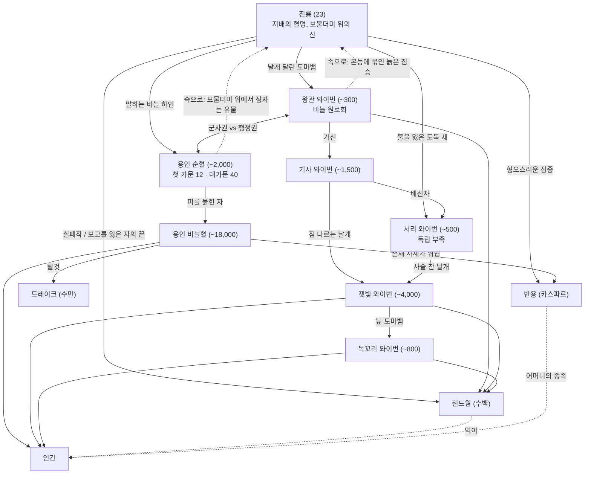

# 파생종 총람 — 『무혈자의 찬가』

> **정본 종속 문서.** 이 문서는 [WORLD_BIBLE.md](WORLD_BIBLE.md) §1.2.1 「파생종 정본 목록」을 상세화한다. 이름·개체 수·관계가 충돌하면 바이블이 우선한다.
> 본종의 상세(혈명·신앙·언어·이식 특질)는 [RACES.md](RACES.md), 가문·둥지·씨족의 구성원은 [HOUSES_AND_FACTIONS.md](HOUSES_AND_FACTIONS.md)를 따른다. 이 문서는 그 사이 — **한 종족 안의 갈래와 서열과 경멸** — 을 다룬다.
> 기준 시점: **AS 312 가을 (SK 3,400)**. 수치 체계는 [01_STATS_AND_CHECKS](../systems/01_STATS_AND_CHECKS.md).
>
> **잔향 원칙**: 파생종이 몇이든, 특별한 인간은 없다. 평범한 인간은 혈명도 돌아옴도 없고, 어느 파생종의 피를 받아도 약 99% 죽는다.
> 특별한 것은 **잔향이 깃든 단 한 사람(주인공)** 뿐이다 — 죽으면 자기 몸으로 회귀점에 돌아가는 사람. 이 문서의 '우군 가능성'은 그 사람이 **한 회차 안에서** 맺을 수 있는 **불편한 거래**를 뜻하지, 어떤 파생종이 인간을 구원한다는 뜻이 아니다.
> 회귀하면 모든 거래는 맺어진 적 없는 것이 된다. 회차를 넘어 남는 것은 누가 무엇을 원하고 언제 등을 돌리는지에 대한 **주인공의 기억**뿐이다.

---

## 0. 읽는 법

### 0.1 항목 템플릿
**개요 / 기원 / 외형·체격·수명 / 개체 수·분포 / 능력과 약점 / 사회와 문화 / 관계(누가 누구를 깔보는가) / 인간을 대하는 방식 / 대표 인물 / 이야기 씨앗**

- 본종 항목(별빛 엘다르, 서리 요툰, 산 두르강, 왕관 나가, 바르그·타이란·우르사, 전쟁 그롬)은 RACES.md에 상세가 있으므로 **파생종으로서의 위치**만 적는다.
- 능력치 표기: `근 / 민 / 체 / 지 / 감 / 의` (1~20, 인간 평균 10, 척도 초과값 허용 — RACES §0.2).
- **공포 강도** = 01 문서 §3.3의 D. 기준점: 도적 무리 20 / 재늑대 35 / 화형 목격 40 / 균열 마물 60 / 무명자 90.
- 지역 번호 `#n`은 바이블 §3 지역 목록.
- '이름 없는 자'(두르강 추방자)와 '이름 없는 자들'(인간 저항 조직)은 **다른 것**이다. 이 문서는 두르강 쪽을 항상 「이름 없는 자(두르강)」로 적는다.

### 0.2 서열을 읽는 법
3,400년 동안 모든 종족은 같은 일을 했다 — **자기보다 아래를 하나 만든다.** 진룡은 와이번을, 와이번은 더 낮은 와이번을, 별빛 엘다르는 실반을, 왕관 나가는 라미아를, 바람발굽은 무거운발굽을.
그리고 사다리의 맨 아래에는 늘 인간이 있다. 파생종의 경멸은 장식이 아니라 **사슬의 축소판**이다. 플레이어가 그 틈을 비집을 때, 그 틈은 늘 "아래에서 두 번째" 자리에서 열린다.

---

## 1. 파생종 한눈에 보기

> 우군 가능성: ○ = 조건부로 손잡을 수 있음 / △ = 개인·일파만 / ✕ = 사실상 없음 / — = 대화 불가(짐승).

| 계통 | 파생종 | 개체 수 (AS 312) | 주 분포 | 지성 | 대표 공포 | 인간을 대하는 방식 (한 줄) | 우군 |
|------|--------|------------------|---------|------|-----------|----------------------------|------|
| 용혈 | **진룡** | **23** (용제국 11, 그 외 12) | #1·#3·대륙 은거지 | 최상 | 75 (고룡 85, 용황 90, 하룻밤의 불 95) | 재산 번호. 미워하지 않는다 — 가축을 미워하지 않듯 | ✕ |
| 용혈 | **왕관 와이번** | 약 300 | #1 바알카르 둥지탑 | 높음 | 50 (공중 기습 60) | 장부의 숫자. '장부 밖' 노예 3,000을 둥지 공사에 쓴다 | △ |
| 용혈 | **기사 와이번** | 약 1,500 | #1 전역, #2 까마귀 문 | 보통 | 50 (공중 기습 60) | 하늘에서 탈주자를 찾는 눈 | ✕ |
| 용혈 | **잿빛 와이번** | 약 4,000 | #1·#2·#3 | 낮음~보통 | 35 | 같은 짐을 지는 자. 그래서 더 밟는다 | △ |
| 용혈 | **독꼬리 와이번** | 약 800 | #8 가장자리, 남부 늪 | 보통 | 40 | 사냥감이거나 거래 상대 | △ |
| 용혈 | **서리 와이번** | 약 500 | #13 동쪽 경계 '울음 협곡' | 보통 | 45 | 짐삯을 받고 산을 넘겨 준다. 노예를 두지 않는다 | ○ |
| 용혈 | **용인 순혈** | 약 2,000 | #1 | 높음 | 15 (화술사 35) | 서명 한 줄로 수천을 옮긴다 | ✕ |
| 용혈 | **용인 비늘혈** | 약 18,000 | #1·#2·#3 | 보통 | 15 (드레이크 돌격 40) | 직접 부리는 주인. 채찍과 장부 | △ |
| 용혈 | **드레이크** | 약 38,000 | #1 그라넥 평원 목장 | 짐승 | 40 (돌격 55) | 짓밟는다 | — |
| 용혈 | **린드웜** | 약 400 | #12 서쪽 동굴, #9 해안 동굴, 서리 이빨 | 반지성 | 55 | 굴에 들어온 것은 먹이. 그래서 아무도 오지 않는 굴은 숨을 곳이 된다 | — |
| 용혈 | **반용** | 진룡의 반용 1 (카스파르) / 용인의 반용 30~60 | #2 까마귀 문 | 개인차 | 30 | 개인차 | ○ |
| 엘다르 | **별빛 엘다르** | 약 19,000 | #5·#4 | 최상 | 25 (결계 50) | 정원지기 — 금빛 감옥 | ✕ |
| 엘다르 | **실반** | 약 6,400 | #5 숲 가장자리, #6 경계 | 높음 | 30 (숲 45) | 하인이 하인을 감시한다 | △ |
| 엘다르 | **드라우르** | 약 2,400 | 루멘·모르바 사이 지하 '아래 정원' | 최상 | 30 (어둠 50) | 이야기를 받고 숨겨 준다 — 공짜는 아니다 | ○ |
| 엘다르 | **물결 엘다르** | 약 1,100 | #9 바깥 섬, #10 | 최상 | 20 | 살아 있는 빚 장부 | △ |
| 녹테른 | **첫 갈증의 원로** | 약 90 (모르데카이 포함) | #7 흑성 아르네스 | 최상 | 80 (모르데카이 90) | 공물의 수를 센다 | ✕ |
| 녹테른 | **밤의 귀족** | 약 2,500 | #7 혈목장 31곳 | 높음 | 65 | 혈목장의 가축 — 아끼는 방식으로 | △ (그림자장미) |
| 녹테른 | **굶주린 자들** | 약 310 | #7 경계 숲, #8 남쪽 가장자리 | 짐승 | 75 | 문다 | — |
| 요툰 | **서리 요툰** | 약 9,100 | #13 | 보통 | 55 (굶주린 무리 65) | 씨족 재산. 기근에 가장 먼저 굶김 | △ |
| 요툰 | **돌 요툰** | 약 1,700 | #13 동부 산맥, #12 북단 | 높음(느림) | 60 | 거의 소유하지 않는다. 잠든 몸 위에 인간이 산다 | ○ |
| 요툰 | **언덕 요툰** | 약 2,800 | #13 남부 구릉, 서리 길 | 보통~높음 | 45 | 손으로 쓰는 노예. 가장 많이 부린다 | ✕ |
| 요툰 | **오우거** | 약 400 (증가 중) | #13 동부 '굶은 골짜기' | 낮음 | 65 | 먹이 | — |
| 요툰 | 불 요툰 | 멸종 (SK 911) | — | — | — | 전설 | — |
| 두르강 | **산 두르강** | 약 164,000 | #12 | 높음 | 25 (방진 45) | 계약 광부. 계약서가 덫 | △ |
| 두르강 | **심층 두르강** | 약 6,000 | #12 바르둠·깊은 문 아래 | 높음 | 35 | 고동에 바칠 귀로 본다 | ✕ |
| 두르강 | **잿불 두르강** | 약 9,000 (왕의 대장 밖) | #1·#3 도시 | 높음 | 20 | 임대 노예를 쓰는 장인·상인 | △ |
| 두르강 | **이름 없는 자(두르강)** | 약 1,300 생존 | #12 바깥, #15 경계 동굴 | 높음 | 30 | 같은 굴에서 산다 | ○ |
| 나가 | **왕관 나가** | 약 64,000 | #9 | 높음 | 25 (물속 50) | 채무자. 평균 22년 | △ |
| 나가 | **심해 나가** | 약 2,000 | #9 앞바다 '끓는 해구' | 최상 | 60 | 거의 만나지 않는다. 깊이 내려온 잠수부는 돌아오지 않는다 | ✕ |
| 나가 | **늪 나가** | 약 3,000 | #8 | 보통 | 35 | 피를 판다 — 늪 마녀에게 | ○ |
| 나가 | **라미아** | 약 19,000 | #9 전역, 대륙 밀정망 | 보통~높음 | 20 | 계약민 감독, 밀정 | △ |
| 하르칸 | **바람발굽** | 약 160,000 | #15 | 보통 | 35 (돌격 55) | 짐꾼·가축 | △ |
| 하르칸 | **무거운발굽** | 약 80,000 | #15 | 보통 | 40 | 같은 멍에. 무관심과 동정 사이 | ○ |
| 하르칸 | **숲발굽** | 약 2,600 (초원 대장 밖) | #5 가장자리 고리 숲길 | 보통 | 30 | 정원 탈주자를 태워 나른다 | ○ |
| 수인 | **바르그** | 약 64,000 | #1·#2·#13 남쪽 | 보통 | 40 (무리 50) | 노예사냥 | △ (흰발) |
| 수인 | **타이란** | 약 21,000 | #9 배후, #16, #7 | 보통 | 45 | 칼값 받는 대로 | △ |
| 수인 | **우르사** | 약 17,000 | #12 기슭, #13 남부 숲 | 보통 | 40 | 겨울지기 — 가장 덜 미워한다 | ○ |
| 수인 | **그나르** | 약 12,000 | #1·#16·#11 가장자리 | 보통 | 30 | 산 자는 건드리지 않는다. 기다린다 | △ |
| 수인 | **바울피** | 약 6,000 | 대륙 도시 전역 | 높음 | 15 | 팔 수 있는 것 | △ |
| 수인 | **스카브** | 약 45,000 | #1·#3·#12 갱도, 하수도 | 낮음~보통 | 20 (떼 35) | 감독하고, 훔치고, 밀고한다 | △ |
| 그롬 | **전쟁 그롬** | 약 170,000 | #16 | 보통 | 45 (광란 60) | 투사·소모품. 강하면 존중 | △ |
| 그롬 | **붉은 그롬** | 약 22,000 | #16 | 낮음 | 60 | 구별하지 않는다 | ✕ |
| 그롬 | **오그림** | 약 9,000 | #16 | 낮음~보통 | 55 | 무관심. 짐을 같이 진다 | △ |
| 그롬 | **잿빛 그롬** | 약 9,000 | #11 남쪽 가장자리 | 보통 | 45 | 100승자를 형제로 받는다 | ○ |
| 아에리 | **매 아에리** | 약 19,000 | #14 | 보통 | 25 (급강하 40) | 무관심. 가끔 납치 | ✕ |
| 아에리 | **까마귀 아에리** | 약 11,000 | #14, 대륙 상공 | 높음 | 15 | 본 것을 판다 | ○ |
| 아에리 | **백조 아에리** | 약 3,500 | #14 정상 | 높음 | 20 | 처음으로 내려다본다 | △ |
| 아에리 | **박쥐날개 아에리** | 약 2,500 | #7 | 보통 | 40 (밤 55) | 밤하늘의 사냥개 | △ (세실) |
| 페이 | **여름 궁정** | 이름 있는 이 약 1,700 | #6 | 최상 | 50 | 아이를 모은다 | ✕ |
| 페이 | **겨울 궁정** | 이름 있는 이 약 1,600 | #6 | 최상 | 55 | 기억을 모은다 | △ |
| 페이 | **붉은모자** | 약 300 | #6 경계 폐탑, #11 북쪽 | 낮음 | 70 | 모자를 적실 것 | — |
| 페이 | **픽시** | 셀 수 없음 | #6, #2 옛 돌 고리 | 낮음 | 5 (떼 25) | 장난. 가끔 치명적 | △ |
| 페이 | **바꿔치기** | 인간 마을에 약 400 | 대륙 전역 요람 | 인간처럼 자람 | 0 | 자기가 인간인 줄 안다 | ○ |
| 크릭 | **굴 크릭** | 약 1,100,000 | 전역 | 낮음 | 10 (떼 25) | 짐꾼·하역꾼. 주인을 따라 미워한다 | △ |
| 크릭 | **늪 크릭** | 약 262,000 | #8·#9 늪지, 남부 | 낮음 | 10 | 늪에서 가장 강한 자를 따른다 — 지금은 늪 마녀 | ○ |
| 크릭 | **감독관 크릭** | 약 38,000 (채찍손 길드 3,000) | 전역 | 보통 | 15 | 채찍 | ✕ |
| 인간 | 파생종 없음 | 약 950,000 (장부 기준 — REGIONS 지역표 합계. 장부 밖 +10~15%) | — | — | — | 문화 집단·혼혈·재태생만 있다 (§15) | — |

---

## 2. 경멸의 사슬 — 용혈 계통

> 화살표 `A → B` = **A가 B를 깔본다.** 점선 = **겉으로는 엎드리고 속으로 깔보는** 관계. 굵은 양방향 = 경쟁.

**사슬의 규칙 (요약)**
1. **진룡은 모두를 깔본다.** 와이번은 "날개 달린 도마뱀", 용인은 "말하는 비늘 하인", 반용은 "혐오스러운 잡종", 린드웜은 "보고를 잃은 자의 끝".
2. **왕관 와이번과 순혈 용인은 겉으로 진룡에게 엎드리고 속으로 깔본다** — "본능(지배의 혈명)에 묶인 늙은 짐승, 보물더미 위에서 잠자는 유물". 둘은 서로를 경쟁자로 미워하지만 **같은 그림 — '용 이후의 제국'** 을 그린다(§3.3).
3. **기사 와이번 → 잿빛 와이번 → 독꼬리 와이번 → 린드웜.** 한 칸씩 아래를 밟는다.
4. **서리 와이번**은 사다리에서 스스로 내려왔다. 그래서 위에서는 "배신자", 그들 스스로는 사다리 전체를 "사슬 찬 날개들"이라 부른다.
5. **모두가 린드웜을 깔보고, 모두가 인간을 깔본다.** 린드웜만이 인간을 깔보지 않는다 — 먹이로 볼 뿐이다.

---

## 3. 용혈 계통 (龍血系統)

### 3.0 계통 개관 — 하나의 불, 열한 갈래

용족의 혈명은 **불 — '지배'** 다. 그 불은 3,400년 동안 단 한 번도 더 뜨거워진 적이 없다. 신이 죽은 뒤 혈명은 갱신되지 않았고, 불은 알을 거칠 때마다 조금씩 식었다.
용혈 계통의 모든 갈래는 **"얼마나 식었는가"** 로 설명된다.

| 갈래 | 갈라진 때 | 어떻게 | 불의 온도 (용족 족보학의 표현) |
|------|-----------|--------|-------------------------------|
| 진룡 | 신대 | 에오르가 처음 말한 이름 "불" | 온전한 불 |
| 와이번 | SK 30~410 | **'식은 알의 4백 년'** — 신살 직후 진룡의 알 일부가 화산열을 받고도 덜 익은 채 깨어났다. 앞발이 날개가 된 두 발 짐승. 이후 스스로 번식 | 숨결만 남은 불 |
| └ 왕관 와이번 | SK 30~120 | '첫 식은 알 서른'의 직계. 이름 있는 진룡의 둥지에서 깨어났고, 용언을 말했다 | 말하는 불 |
| └ 기사 와이번 | SK 120~410 | 후기 식은 알 + 왕관 와이번의 전투 육종 | 싸우는 불 |
| └ 잿빛 와이번 | SK ~700~ | 용제국 건국 뒤 왕관 와이번이 노역용으로 **대량 육종** | 그을음 |
| └ 독꼬리 와이번 | SK 1,480 | '늪 비행' — 도태 명령을 피해 남부 늪으로 달아난 잿빛 와이번 한 무리. 젖은 땅에서 불주머니가 **썩음주머니**로 변했다 | 썩은 불 |
| └ 서리 와이번 | SK 2,388 | 거인 전쟁 말기 북방에 버려진 기사 와이번 '일곱째 날개'가 요툰과 얼음 맹세를 맺고 독립. 세대를 거치며 숨결이 식었다 | 식은 불 |
| 용인 순혈 | SK ~600 | '날개를 버린 열둘' — 진룡 열둘이 '작은 몸'을 영구히 택함 (RACES §3) | 손에 쥔 불 |
| 용인 비늘혈 | SK ~900~ | 순혈의 피가 대를 거치며 옅어짐 | 묽은 불 |
| 드레이크 | SK ~700 | 날개가 돋지 않은 식은 알 개체들을 용인이 길들여 2,700년간 말처럼 육종 | 짐승의 열 |
| 린드웜 | 불명 (가장 오래된 기록 SK 1,240) | 보고를 잃은 진룡이 굴에서 낳은 알의 후손 — **로 믿어진다** | 꺼진 불 |
| 반용 | 산발적 | 진룡·용인과 인간의 혼혈 (RACES §4) | 이름 없는 피와 섞인 불 |

> **식은 알은 오늘날 부화하지 않는다.** 와이번이 진룡의 알에서 태어난 것은 SK 30~410의 4백 년뿐이었다. 그 뒤로 진룡의 식은 알은 그냥 죽는다.
> 왕관 와이번의 흰목 둥지는 이 사실을 3,000년간 족보에 적어 왔다 — **와이번은 진룡의 자식이다. 버려진 자식이다.** 그것이 그들의 경멸이 존경의 모양을 하고 있는 이유다.

---

### 3.1 진룡 (眞龍)

#### 개요
용혈의 정점이자 대륙의 재앙. 한 마리가 군대 하나와 맞먹고, 하룻밤에 도시를 태운다. 그러나 **23마리**뿐이고(용제국 11, 그 외 12), 그중 세상일에 관여하는 것은 9마리, 알은 수백 년에 하나다.
진룡은 "가진 것"으로 자신을 정의한다. 그들이 무너지는 방식도 그렇다 — 보고를 잃으면 시들고, 짝을 잃으면 미치고, 시간을 잃으면(바르스카르, 그로마크) 썩는다.

#### 기원
- 신대: 에오르의 첫 이름 "불"로 빚어졌다. 엘다르의 기억에 따르면 신살 직전 진룡은 **약 140마리**였다.
- SK 0: 신살에 앞장섰다. 에오르의 목을 처음 태운 것은 아그라몬 첫불꽃(용족 공식 기록) — 용인 전승은 이를 '첫 불꽃 이그나르'라는 시조 이름으로 부른다. 같은 자의 두 이름이라는 것이 불의 학당의 정설이다.
- SK 602: 드라크마르 용제국 건국. 1대 용황 아그라몬. 건국 설계자 **카르녹스 불목**(†SK 1,870)은 용인 족보에서 '초대 용황'으로 높여 불리지만, 용족 공식 목록에서는 아그라몬의 '불의 집사'였다 — **이 불일치 자체가 용인이 무엇을 숭배하는지 보여 준다.**

#### 왜 23마리만 남았는가

| 원인 | 시기 | 잃은 수 (추정) | 내용 |
|------|------|----------------|------|
| **신살의 대가** | SK 0 | 9 | 에오르의 마지막 몸부림. 진명이 흩어지며 가장 가까이 있던 용들의 불을 꺼뜨렸다 |
| **혈명의 쇠퇴** | SK 0~ 현재 | (출생 감소) | 신이 죽은 뒤 불은 갱신되지 않는다. 번식 가능 약 350세·성룡 약 500세, 한 쌍이 **300~400년에 알 하나**, 300일 화산열 포란, 포란 성공률 약 1/3. 식은 알은 SK 410 이후 그냥 죽는다 |
| **날개를 버린 열둘** | SK ~600 | 12 | 진룡 열둘이 '작은 몸'을 영구히 택해 용인 순혈의 시조가 되었다. 용족은 이들을 죽은 것으로 센다 |
| **화산 전쟁 (불 요툰 절멸)** | SK 780~911 | 6 | 알을 품을 화산을 두고 불 요툰과 130년 전쟁. 불 요툰은 멸종했고 네스티라 잿빛모래(†SK 911)가 마지막 희생 |
| **형제 살해·계승 결투** | SK 1,231~AS 307 | 약 30 (기록 11) | 잿날개의 밤(그림바르 †1,231), 아그라몬 유폐사(†1,240), 하길라(†2,512), 토르반(†2,830), 이졸데 짝 결투(AS 307, 2마리) 외 |
| **깨어나지 않은 잠** | 전 시기 | 약 47 | 보고잠에 든 채 다시 깨지 않은 고룡들. 두개골 회랑의 절반이 이들이다. 보고는 가신이 "지켰다" |
| **다른 종족과의 분쟁** | SK 0~2,900 | 약 21 | 요툰·나가·그롬과의 국지전, 맹약 이전의 영역 다툼 |
| **보고 상실사** | 전 시기 | 3 | 보고를 통째로 빼앗긴 뒤 10년 안에 죽은 기록 3건 (RACES §2) |
| **대붕괴** | AS 0 | 5 (+상처 2) | 아스테리아 포위군의 진룡 9마리 중 바엘리스 흑요비늘 등 5마리가 시간의 균열에 삼켜졌다. 바르스카르는 시간의 상처, 그로마크는 시간의 광기 |
| **잿빛 겨울** | AS 0~38 | (알 4) | 38년간 재가 하늘을 가려 화산열 포란이 실패했다. 이 시기에 품은 알 다섯 중 넷이 식었고, 살아남은 하나가 세라크(AS 2 부화)다 |
| **도둑맞은 알** | SK 2,951 | (알 1) | 아르젠티아의 마지막 알. 세렌 '깊은 바다' 사원 지하에 있다는 소문 |

> **용족 인구 곡선**: 신살 직전 약 140 → SK 600 약 70 → SK 1,500 약 48 → 대붕괴 전야 약 31 → **AS 312: 23** (+흰 알 1, 도둑맞은 알 1은 세지 않는다). 3,400년간 부화에 성공한 알은 약 16.
> 지난 1,000년간 부화한 진룡 알은 **일곱**이다(이졸데·드라반·세라크·베일가스·오르테아·실바라·바엘린). 흰 알이 깨어나지 못하면 용족은 계산상 **2,000년 안에 0**이 된다. 비늘 원로회는 이 계산을 가지고 있다.

#### 외형·체격·수명
- 단계별 체격은 RACES §2 표를 따른다: 새끼(0~50세, 2~6m) / 어린 용(50~500, 6~22m — 350세부터 번식 가능한 '젊은 용') / 성룡(500~1,000, 20~40m, 15~60톤) / 고룡(1,000+, 40~70m, 60~200톤).
- 비늘 계통: 붉은 계 · 은빛 계 · 잿빛 계(고룡만) · 청동 계 · 흑 계 · 그리고 이 문서에서 처음 정리하는 **녹옥 계**(베릴라 — 숨결에 습기가 섞여 숲을 태우지 않고 '삶는다'), **구리 계**(오르메긴 — 금속 친화, 비늘이 녹청으로 변한다). 흰 용은 전설에만 있다.
- 자연사 기록 없음. 수명 4,000년 이상 추정.

#### 진룡 명부 — 23마리

> 상태: **깨어 있음**(세상일에 관여 — RACES의 '깨어 있는 9마리'와 같다) / **은거**(깨어 있으나 자기 영역 밖의 일에 관여하지 않음) / **잠듦**(보고잠) / **광기**.
> 집계: 깨어 있음 9 · 은거 4 · 광기 1 · 잠듦 9 = 23.

| # | 이름 | 색·특징 | 나이 | 거처 | 상태 | 성향 (계승 위기) | 인간을 대하는 방식 |
|---|------|---------|------|------|------|------------------|---------------------|
| 1 | **바르스카르 잿날개** | 잿빛 계. 비늘이 재처럼 바스러지며 다시 자란다. 오른쪽 옆구리에 시간의 상처(빛이 휘어 보이는 검은 구멍) | 3,100 | #1 바알카르 용좌봉 '재의 둥지' | 깨어 있음 (병석) | 용황. 질서 = 소유. 후계를 정하지 않음 | 비늘 장부의 숫자. 312년 전 "가축이 화로를 터뜨린" 공포를 아는 유일한 증인 |
| 2 | **아우락스 붉은턱** | 붉은 계. 왼쪽 턱이 녹아 붉게 굳음 | 1,400 | 바알카르 동쪽 거성 '붉은 첨탑' | 깨어 있음 | 전통파 '불의 손' 수장 | 가축. 재의 법 강화, 잔향 대숙청 |
| 3 | **드라반 붉은발톱** | 적룡. 앞발톱 하나가 검게 그을렸다 — 화형대를 너무 많이 짚어서 | 520 | 붉은 첨탑 | 깨어 있음 | 불의 손. 아버지의 집행자 | AS 213 이후 징후자 수백 명을 직접 태웠다. 모두 평범한 인간이었다 |
| 4 | **세라크 붉은재** | 적룡, 어린 축. 비늘 끝이 잿빛 — 할아버지를 닮았다 | 310 | 그라넥 평원 상공, 둥지 '재 언덕' | 깨어 있음 | 불의 손 (흔들림) | 곡창 노예를 '내 것'이라 부르며 다른 용인 집행관이 손대지 못하게 한다 |
| 5 | **멜리산드 은비늘** | 은빛 계. 유리처럼 맑은 눈 | 1,150 | #3 잿불 언덕 | 깨어 있음 | 개량파 '은의 서약' | 자원. 용심 이식 실험 — 수천 명 사망 |
| 6 | **실바라 은재** | 은룡 미성체. 날개막에 피험자의 이름을 손톱으로 새긴 흉터가 있다(본인만 안다) | 190 | 잿불 언덕 지하 '은비늘 요람' | 깨어 있음 | 은의 서약 (균열) | 실험을 보조하며 피험자의 이름을 외운다 |
| 7 | **이졸데 서리비늘** | 은백색, 서리 숨결 | 약 400 | 용좌봉 서쪽 사면 '서리 요람'(흰 둥지) | 깨어 있음 | 알의 수호 | 흰 알의 화로지기 노예들을 특별히 아낀다 |
| 8 | **베릴라 녹옥발톱** | 녹옥 계. 숨결이 '삶는 불' | 1,600 | 정원 길 남쪽 '이끼 왕좌' | 깨어 있음 | 불의 손 (왕비 약속) | 노래꾼 노예 40. 목소리 잃은 자는 몰래 은신처로 |
| 9 | **베일가스 청동꼬리** | 청동 계. 꼬리 끝이 청동 추처럼 굳었다 | 240 | 바알카르 둥지탑 | 잠듦 | — (원로회가 깨우지 않음) | 기록 없음 |
| 10 | **오르테아 쇠발톱** | 흑 계 암컷. 쇠빛 발톱 | 205 | 바알카르 둥지탑 | 잠듦 | — | 기록 없음 |
| 11 | **바엘린 금빛혀** | 붉은 계 변종. 혀가 금빛으로 빛난다. **흰 알 이전 마지막으로 부화한 진룡**(AS 174) | 138 | 바알카르 둥지탑 | 잠듦 (선잠 — 연 1~2회 깬다) | — | 깨어 있을 때 둥지탑 노예에게 말을 건 기록이 있다 |
| 12 | **세벨린 연기날개** | 연기빛. 날개막에 구멍이 많다 | 2,950 | 남해 화산섬 '재의 요람' | 은거 | 없음 — 그러나 날아오면 '가장 오래된 용'으로 즉위 자격 | 섬의 '재 줍는 이' 200명을 소유하지도 지키지도 않는다 |
| 13 | **스카디아 서리비늘** | 서리빛 백청. 이졸데의 어미 | 2,600 | 까마귀 문 서쪽 빙봉 '서리 이빨' | 깨어 있음 | 흰 알 (손주) | 얼음 속에 '아름다운 것'으로 보존. 노예 약 300 |
| 14 | **오르메긴 구리뿔** | 구리 계. 비늘이 녹청으로 변해 간다 | 2,200 | 카즈둠 서쪽 기슭 '구리 가마' | 은거 | 중립 — 이긴 쪽에 금속을 판다 | 대장장이 노예 80 + 두르강식 계약 광부. 용 중 가장 '덜' 잔혹 |
| 15 | **살라스트라 청동물결** | 청동 계, 물결무늬 비늘. 반쯤 물에 산다 | 1,900 | 남해 섬 '진주 무덤' | 은거 | 멜리산드 (세렌과 같은 배) | 진주 잠수 노예 600 (세렌 계약민 형식) |
| 16 | **그로마크 검댕** | 흑 계, 검댕빛 | 2,900 | 재의 황무지 남쪽 '검은 유리 둥지' | **광기** — 대붕괴 전날을 반복해서 산다 | 없음 | 인간을 '아스테리아 시민'으로 착각해 살려 보내곤 한다 |
| 17 | **아르젠티아 은빛서리** | 은빛 계. 멜리산드의 어미 | 약 2,400 | 불명 — 가시안개 숲 위를 나는 은빛 그림자 목격담 | 은거 (생사 불명) | 불명 | 불명. 페이와 '잃어버린 알을 잊는' 계약을 맺었다는 소문 |
| 18 | **수르마크 검은연기** | 흑 계. 연기 섞인 불 | 약 2,300 | 카즈둠 동쪽 봉우리 '연기 굴뚝' | 잠듦 | 깨어나면 판도가 바뀐다 | 그의 동굴 아래층에 탈주자들이 숨어 산다 (본인은 모른다) |
| 19 | **헤그루스 녹은눈** | 붉은 계 노룡. 오른눈이 녹아 흘러내린 자국 | 약 2,750 | 카즈둠 동쪽 봉우리 '녹은 탑' | 잠듦 (잠꼬대로 불을 뿜는다) | — | 10~20년마다 잠결의 숨결이 봉우리 아래 계곡을 태운다. 두르강은 그 계곡에 인간 계약 광부만 보낸다 |
| 20 | **네르실 소금턱** | 청동 계 해룡. 아가미 같은 목주름, 증기 숨결 | 약 2,800 | 남해 심연 '끓는 해구' 위 | 잠듦 | — | 신의 피가 고인 해구 위에서 SK ~200부터 잠들었다. 심해 나가가 그를 '문지기'라 부른다 |
| 21 | **우르쿤 바람뿔** | 청동 계. 뿔이 바람에 깎여 피리처럼 운다 | 약 2,450 | #15 초원 동쪽 끝 '잠자는 언덕' | 잠듦 | — | 하르칸은 그 언덕에 바람의 영 제사를 지낸다. 언덕이 용인 줄 아는 부족은 일곱샘뿐 |
| 22 | **이르쿠나 그을린별** | 흑·금 반점 | 약 2,100 | 불명 (마지막 목격 AS 0, 재의 황무지 북쪽 하늘) | 잠듦 (추정) | — | 불명. 잿빛 탑은 그녀가 대붕괴를 '위에서' 보았다고 본다 |
| 23 | **카엘무르 무쇠턱** | 강철 계. 아래턱이 쇠처럼 검다 | 약 1,800 | 불명 — 페이는 "가시 아래서 자는 쇠"라고 농담한다 | 잠듦 (추정) | — | 불명 |

> **용제국 11** = #1~#11. **그 외 12** = #12~#23. 흰 알과 도둑맞은 알은 세지 않는다.
> RACES의 파벌표와의 대응: 불의 손 4 = 아우락스·드라반·세라크·베릴라 / 은의 서약 1 = 멜리산드 / 알의 수호 1 = 이졸데 / 나머지 17 = '늙은 잠꾸러기들'(용황·실바라·젊은 셋 포함, 파벌 없음).

#### 능력과 약점 — 진룡 한 마리가 할 수 있는 일
**대표 개체(성룡, 붉은 계, 600세)**: 근 32 / 민 11 / 체 30 / 지 15 / 감 17 / 의 19 — 마법(불) 70, 위압 90, 맨손격투(발톱·이빨) 75 (RACES §2).

| 장면 | 게임 처리 |
|------|-----------|
| **숨결** | 원뿔 30m, 범위 내 전원 화상 '치명' 판정(회피 판정 없음). 1회 쓰면 재충전 1시간, 연속 3회 후 6시간 휴식 |
| **하룻밤의 불** | 진룡이 정착지 위를 선회하며 밤새 불을 내리는 사건. 해당 정착지 전체에 **집단 공포 판정 D 95**. 인간 마을 400명(회색여울 규모) **1시간 안에 전소** / 성벽 소도시 5,000 하룻밤에 2/3 소실 / 바알카르급 대도시는 하룻밤에 한 구역 |
| **군대 상대** | 공중 숨결 3회면 1만 명 대오가 붕괴한다. 실제 사상자보다 **공포 판정 실패에 의한 궤주**가 더 많다 |
| **개별 조우 공포** | 어린 용 55 / 성룡 75 / 고룡 85 / 용황 90 |
| **냄새** | 30리 안의 용심(드래곤 하트)을 맡는다. 자기 소유물(낙인 찍힌 인간 포함)의 냄새를 10리 안에서 구별 |
| **작은 몸** | 1,000세 이상 고룡만. 며칠간 인간형 — 극심한 고통과 치욕 |
| **약점** | **역린**(명중 시 방어 무시, 치명 +30) · **날개막**(성룡 기준 3합 관통 누적 시 비행 불가) · **보고 위협**(보고에 불을 지르면 의지 −20, 실패 시 추격 포기) · **서리 근원 마법**(피해 1.5배 — 잔향만 쓸 수 있다) · **보고잠 중 기습** · **잠의 향**(§3.3) |

> **평범한 인간이 진룡을 이긴 기록은 3,400년 동안 0건이다.** 아스테리아 9년 동안에도 인간이 죽인 진룡은 없다.
> 인간이 진룡에게 이기는 방법은 싸움이 아니라 **다른 용, 잠, 보고, 알, 그리고 원로회** — 즉 용족 자신의 구조다. 잔향은 여기에 역린과 서리 근원을 더할 수 있는 유일한 인간이다.

#### 사회와 문화
- 용황 → 영주 진룡(화주) 11 → (비늘 원로회 · 순혈 대가문) → 그 아래 전부. 계승 원칙 없음 — **가장 많이 차지한 자**가 용황(RACES §2, HOUSES §1.1 '불꽃 홀의 확인').
- **보고잠**: 수백 년 단위의 잠. 잠든 용의 보고는 그 용의 가신(와이번 둥지, 용인 가문)이 '지킨다' — 즉 **관리한다.** 23마리 중 9마리가 잠든 지금, 제국 재산의 약 40%가 실질적으로 원로회와 대가문의 손에 있다.
- **알의 법**: 알을 깨는 것은 3,400년간 한 번도 용서받지 못한 죄. 알은 어미의 소유이며, 부화 전까지는 **어미만** 이름을 부를 수 있다.

#### 관계 — 누가 누구를 깔보는가
- 진룡 → 전부. 와이번은 "날개 달린 도마뱀", 용인은 "말하는 비늘 하인", 서리 와이번은 "불을 잃은 도둑 새", 린드웜은 "보고를 잃은 자의 끝".
- 진룡끼리: 나이와 보고의 크기로 서열. 세벨린(2,950)은 바르스카르보다 어리지만 **형제 살해를 하지 않은 가장 오래된 용**이라는 이유로 은거 용들 사이에서 더 무겁다.
- 진룡이 **모르는 것**: 원로회와 순혈 대가문의 경멸. 아니, 안다 — 바르스카르는 안다. 그는 "하인이 주인을 깔보는 것은 하인이 살아 있다는 증거"라고 말한 적이 있다(흰목 둥지 의전 기록, AS 140).

#### 인간을 대하는 방식
RACES §2 참조: 비늘 장부(재산 번호), 인두세, 용의 표(낙인 — 굴욕이자 방패), 불의 처형. 용은 인간을 미워하지 않는다.
다만 진룡마다 '소유하는 방식'이 다르다 — 위 명부의 마지막 열이 플레이어가 **어느 용의 땅에서 태어났는가**에 따라 삶이 얼마나 다른지를 결정한다(오르메긴의 계약 광부와 드라반의 화형대 사이의 거리).

#### 대표 인물
- **바르스카르 잿날개** — 썩어 가는 신. 그가 죽는 날 모든 클락이 움직인다.
- **세벨린 연기날개** — 3,000년 침묵한 고모. 그녀가 날아오는가가 계승 위기의 숨은 변수.
- **바엘린 금빛혀** — 마지막으로 깨어난 젊은 진룡. 선잠에서 깰 때마다 둥지탑 노예에게 "밖은 지금 몇 년이냐"고 묻는다.

#### 이야기 씨앗
1. **잠의 향**: 둥지탑의 젊은 진룡 셋이 깨어나지 않는 이유는 원로회가 태우는 향이다(§3.3). 향 한 덩이를 훔쳐 바엘린을 깨우면 — 계승 위기에 진룡 하나가 더 들어온다. 그는 누구 편에 설까. 그리고 그에게 말을 걸었던 노예는?
2. **연기 굴뚝의 탈주자 마을**: 수르마크가 잠든 동굴 아래층에 탈주자 60명이 산다. 용의 체온이 겨울을 막아 준다. 잠꼬대가 깊어지는 징조가 보인다.
3. **녹은 탑의 계곡**: 헤그루스의 잠꼬대 불이 올해 내려올 차례다. 두르강은 계곡의 인간 광부들에게 그 사실을 알리지 않았다. 계약서 37조에 "자연재해"로 적혀 있다.
4. **그로마크의 하루**: 대붕괴 전날을 반복하는 용에게 "내일"을 믿게 하면 그는 포위 계획을 말한다(HOUSES §1.5). 그러나 '내일'을 믿은 날, 그는 아스테리아를 다시 태우러 날아오른다.
5. **잠자는 언덕**: 테무르 칸의 통일 전쟁이 우르쿤 바람뿔의 언덕 위에서 벌어진다. 3만 발굽의 진동.
6. **베릴라의 노래꾼**: 노래꾼으로 팔려 간 누이를 찾는 플레이어. 목소리를 잃으면 '어디론가' 간다는 소문.

---

### 3.2 와이번 공통 생물학

| 항목 | 내용 |
|------|------|
| 체형 | 두 뒷다리 + 날개가 된 앞발 + 긴 꼬리. 진룡의 '여섯 사지'(네 발 + 날개)가 아니다 — 진룡이 그들을 "반쪽"이라 부르는 이유 |
| 숨결 | 불의 혈명은 **숨결로만** 남았다. 불 근원 마법은 쓰지 못한다(RACES §0.3) |
| 알 | 식은 알에서 온 자들이라 **식은 알을 낳는다** — 화산열이 필요 없다. 둥지 바닥의 체온과 짚으로 60~90일. 그래서 와이번은 늘어나고 진룡은 줄어든다 |
| 둥지 | 와이번 사회의 단위는 **둥지**(가족 + 가신). 둥지탑은 인간 노예가 쌓는다. 둥지의 높이가 곧 신분 |
| 소유 충동 | 진룡보다 약하다. 대신 **서열 충동** — 자기 아래가 있어야 잠든다 (서리 와이번은 예외 — §3.7) |
| 이름 | 개인명 + 둥지명 (왕관), 개인명 + "○○의 깃"(기사), 짧은 한 음절 + 날개 번호(잿빛) |
| 언어 | 왕관: 용언·공용어 유창 / 기사: 공용어, 용언 명령어 / 잿빛: 더듬는 공용어 / 독꼬리: 쉭쉭거리는 '늪말' / 서리: 서리말 + 공용어 |

---

### 3.3 왕관 와이번 — 비늘 원로회

#### 개요
와이번 귀족. 약 300. 다섯 둥지 가문이 **비늘 원로회**(원로석 9)를 이루어 용제국의 세제·군수·노예 배분·감찰을 실제로 움직인다.
진룡 앞에서는 목을 땅에 대고 엎드린다. 둥지로 돌아오면 진룡을 "보물더미 위에서 잠자는 늙은 짐승"이라 부른다.

#### 기원
'첫 식은 알 서른'(SK 30~120) — 이름 있는 진룡의 둥지에서 덜 익은 채 깨어난 첫 와이번들. 그들은 깨어나자마자 용언을 말했고, 어미 용은 그들을 죽이는 대신 **가신**으로 삼았다.
흰목 둥지의 족보는 서른 마리 각각이 **어느 진룡의 알**이었는지를 적고 있다. 높은홰 둥지의 시조는 아그라몬의 알이었다 — 즉 **수석 원로 볼가스 높은홰는 계보상 바르스카르와 같은 아비의 알에서 내려온 먼 방계**다. 이것이 원로회 최대의 비밀이자 자부심이다.

#### 외형·체격·수명
- 몸길이 12~16m, 날개폭 18~22m, 체중 2~3톤. 정수리에 뼈 돌기가 왕관처럼 둘러 있다(이름의 유래). 비늘은 섬기는 진룡 계통의 색을 흐리게 따른다.
- 수명 약 600년. 성숙 80세. 40년에 알 하나.

#### 개체 수·분포
약 300. #1 바알카르 둥지탑 다섯(높은홰·청동발·긴그림자·재날개·흰목) 약 240 / 각 진룡 영지 연락 둥지 약 60(#3 잿불 언덕 12, #2 회색여울 감찰 2 포함).

#### 능력과 약점
근 24 / 민 14 / 체 22 / 지 16 / 감 17 / 의 16. 위압 70, 학식 75, 통찰 75, 예법 85, 읽고쓰기 80, 언어(용언) 90.
숨결 원뿔 10m, 하루 2회. 공포 강도 **50** (공중 기습 60). 사회 판정 −20 / −25 / −5 (RACES §0.4).
약점: 날개막(3합 관통 시 추락), 땅 위의 둔함(민첩 −4), **장부**(원로회의 모든 힘은 기록에서 나온다 — 장부를 잃으면 힘을 잃는다), 진룡의 직접 명령(거역 불가 — 혈명).

#### 사회와 문화 — 원로회 정치
- **원로석 9**: 높은홰 3 · 청동발 2 · 긴그림자 2 · 재날개 1 · 흰목 1 (HOUSES §1.7). 회의장은 불꽃 홀 바로 아래층 '홰의 회랑'.
- **섭정안 3단계 — '용 이후의 제국'** (흰목 둥지 엘렌드 설계, 비공개):
  1. **흰 알 + 섭정**: 흰 알이 깨어나면 흰목 둥지가 '보모'를 맡는다. 어린 흰 용이 성룡이 되기까지 약 500년(알을 낳을 수 있게 되기까지도 350년) — 그동안 섭정권은 원로회.
  2. **잠을 유지한다**: 둥지탑의 젊은 진룡 셋을 '잠의 향'(린드웜 쓸개 + 붉은 양귀비 + 화산재, 하루 한 덩이)으로 재운다. 깨어난 진룡은 곧 경쟁자다. 향은 AS 290부터 피워졌다.
  3. **알 장부**: 앞으로 낳는 모든 진룡 알을 "제국 재산"으로 등록해 원로회가 관리한다. **진룡을 '키우는' 제국** — 진룡은 왕관이 아니라 국고가 된다.
- **순혈 대가문과의 경쟁**: 칼다란 대공가는 같은 흰 알을 원하지만 섭정은 '용좌 집사'(칼다란)가 해야 한다고 본다. 원로회는 군사권(기사 와이번 1,500)을, 대가문은 행정 서명권과 불의 잔 배정을 쥔다. 둘 다 상대 없이 제국을 굴릴 수 없다는 것을 안다.
- **둥지 문화**: 둥지탑 꼭대기의 '홰'에 앉는 순서가 서열. 원로의 홰는 금을 입힌 쇠막대. 와이번은 앉은 높이보다 낮은 자를 내려다보며 말한다 — 인간은 홰 아래 땅에 엎드려서만 말할 수 있다.
- **금기**: 진룡 앞에서 '섭정'을 말하는 것 / 잠든 진룡의 이름을 세는 것("셋이 자고 있다"는 말은 원로회 안에서도 금지) / 족보의 '첫 식은 알' 기록을 외부에 보이는 것.

#### 관계
- 진룡 → 왕관: "날개 달린 도마뱀". 왕관 → 진룡(속): "본능에 묶인 늙은 짐승".
- 왕관 ↔ 순혈 용인: 400년 경쟁. 둘 다 "용 이후"를 원하지만 그 이후의 왕좌는 하나다.
- 왕관 → 기사 와이번: 가신. 왕관 → 잿빛: 육종한 짐승. 비늘혈 용인: 후원 대상(관직의 대부분을 원로회가 준다).
- 서리 와이번: "도망친 가신의 후손" — 원로회 장부에 아직도 '미회수 재산'으로 남아 있다.

#### 인간을 대하는 방식
가장 **합리적인** 주인. 인간을 미워하지도 아끼지도 않고 **계산**한다. 흰 알 섭정 체제는 인간에게 "더 합리적인 사슬"이다 — 원로회는 '용 이후의 제국'에 필요한 노동력을 지금의 1.4배로 추산했고, 맹약회의 313에서 **인간 번식 할당** 상향을 제안할 계획이다.
그러나 원로회와 진룡 사이의 균열은 대륙에서 가장 넓은 틈이기도 하다. 긴그림자 둥지는 정보를 사고, 정보에는 값이 매겨진다 — 인간이 낼 수 있는 값이라도.

#### 대표 인물
- **수석 원로 볼가스 높은홰** (410) — 의장. 섭정 후보 1순위. 아그라몬의 알에서 내려온 혈통을 홰 밑에 새겨 두었다.
- **원로 엘렌드 흰목** (530) — 섭정안 설계자. 흰 알 예언 "사슬이 깨어나리라"를 "진룡의 사슬이 끝난다"로 읽는다.
- **원로 이르마스 긴그림자** (450) — 감찰. '잔향 징후 3배'의 의미를 원로회에서 가장 먼저 이해했다. 잔향을 죽이는 것보다 **쓰는 것**이 낫다고 계산 중이다.

#### 이야기 씨앗
1. **장부 밖 3,000명**: 높은홰의 이중 장부(HOUSES §1.7). 플레이어의 가족이 '장부 밖'으로 사라져 둥지탑 공사장에 있다. 장부를 칼다란에 넘기면 원로회가 흔들리고 — 공사장의 3,000명은 증거 인멸 대상이 된다.
2. **잠의 향 운반**: 향 재료인 린드웜 쓸개를 구하는 일은 인간 사냥꾼에게 맡겨진다(§3.11). 플레이어는 그 사냥에 징발된다.
3. **긴그림자의 제안**: 이르마스가 정체불명의 인간에게 "잔향을 데려오면 네 마을을 비늘 장부에서 지워 주겠다"고 한다. 그 인간이 바로 플레이어라는 것을 그는 아직 모른다 — 혹은 안다.

---

### 3.4 기사 와이번

#### 개요
공중 전사 계급, 약 1,500. 청동발 둥지(원로 테사르)가 지휘한다. 용제국 하늘의 눈이자 창. 인간에게는 **"하늘에서 오는 그림자"** — 탈주자가 들판에서 가장 두려워하는 것.

#### 기원
후기 식은 알(SK 120~410)과 그 후손을 왕관 와이번이 **전투 육종**한 계급. 몸이 크고 말을 잘 못하는 개체가 기사가 되었다. "말 대신 발톱을 받은 자들".

#### 외형·체격·수명
몸길이 10~13m, 날개폭 16~20m, 1.5~2톤. 가슴 비늘이 두껍고 꼬리 끝에 뼈 곤봉. 수명 약 350년. 성숙 40세. 20년에 알 1~2.

#### 개체 수·분포
약 1,500. #1 바알카르 '청동 둥지' 약 600 / 진룡 영지 수비 약 500 / #2 까마귀 문 날개대 60(카스파르 지휘 아래 — 청동발 둥지는 이를 못마땅해한다) / #3 잿불 언덕 120 / 국경 순찰 약 220.

#### 능력과 약점
근 23 / 민 15 / 체 22 / 지 9 / 감 17 / 의 13. 맨손격투(발톱) 70, 추적(하늘에서) 65, 위압 65, 지구력 70. 숨결 원뿔 8m, 하루 2회.
공포 강도 **50** (공중 기습 60). 약점: 날개막, 그물 쇠뇌(대형 그물 명중 시 추락 판정), 비·우박(비행 −20), 지능(유인에 약하다), 명령 없이 움직이지 않음.

#### 사회와 문화
- **깃 서약**: 기사 와이번은 왕관 둥지 하나에 깃을 바친다. 이름은 "개인명 + ○○의 깃"(예: 코르스 테사르의 깃).
- **날개대**: 12마리 단위. 대장은 등에 용인 장교를 태우는 것을 '부끄러움'으로 여기면서도 거부하지 못한다.
- 둥지는 막사형. 알은 청동 둥지의 '부화 막사'에서 공동으로 품고, 새끼는 어미를 모른다.

#### 관계
왕관을 섬기고 잿빛을 "짐 나르는 날개"라 깔보며, 서리 와이번을 "배신자"라 부른다 — 서리 와이번의 시조가 바로 기사 와이번 '일곱째 날개'였기 때문이다. 순혈 용인의 하스트란 비늘기사단과는 공중·지상 지휘권 다툼(HOUSES §1.7).

#### 인간을 대하는 방식
탈주자 수색과 '불 신호' 처형 보조. 기사 와이번은 인간을 개별로 보지 않는다 — 하늘에서 보면 **움직이는 점**이다. 들판의 점이 길을 벗어나면 내려온다. 그것뿐이다.

#### 대표 인물
- **코르스 테사르의 깃** (120) — 청동 둥지 최정예 날개대장. 북방 대탈주 수색 담당.
- **이슈카** (95, 까마귀 문 날개대) — 카스파르의 인간 병사들과 같은 막사 배급을 받는 유일한 기사 와이번. 청동발 둥지에 소환 명령을 받았다.

#### 이야기 씨앗
1. 서리 길을 넘는 탈주자 무리를 코르스의 날개대가 쫓는다. 눈보라가 오기까지 반나절.
2. 이슈카가 소환 명령을 거부하면 반역, 따르면 까마귀 문의 하늘이 빈다. 그녀는 플레이어에게 "인간은 이럴 때 어떻게 하느냐"고 묻는다.
3. 날개대 하나가 우박에 추락했다. 다친 기사 와이번을 발견한 것은 인간 농노들이다. 살리면 은혜인가 증인인가.

---

### 3.5 잿빛 와이번

#### 개요
평민 와이번, 약 4,000. 수송·노동·순찰. 와이번 사회의 인간 — 왕관 와이번이 **번호를 매겨 육종한** 계급. 그래서 인간을 가장 가까이에서 밟는다.

#### 기원
SK ~700, 용제국 건국 뒤 짐을 나를 날개가 필요해진 왕관 와이번이 작고 순한 개체끼리 짝지어 대량 육종했다. 진룡이 와이번에게 한 일을, 왕관 와이번이 잿빛 와이번에게 했다.

#### 외형·체격·수명
몸길이 7~9m, 날개폭 12~14m, 0.7~1톤. 칙칙한 회갈색 비늘(이름의 유래), 등에 짐 안장 굳은살. 수명 약 180년. 8년에 알 2~4.

#### 개체 수·분포
약 4,000. #1 약 2,300(수송청 둥지) / #3 잿불 언덕 약 600(광석 운반) / #2 회색여울 약 40(곡물 운반, 국경 보급) / 영지 각지 약 1,000.

#### 능력과 약점
근 19 / 민 12 / 체 18 / 지 7 / 감 14 / 의 9. 지구력 75, 운동(비행) 70, 위압 35. 숨결은 불씨 수준(원뿔 3m, 하루 1회).
공포 강도 **35**. 약점: 짐 실은 상태(민첩 −6), 굶주림(잿빛 와이번 배급은 늘 모자란다 — 먹이로 유인 가능), 낮은 의지.

#### 사회와 문화
- **날개 번호**: 수송청 장부에 **번호**로 등재된다 — 인간의 비늘 장부와 같은 서식이다. 그들은 이것을 알고, 그래서 이름을 서로 몰래 부른다(한 음절: 그락, 투, 세).
- **짐 둥지**: 수송청 둥지는 수백 마리가 한 동굴에 산다. 알은 수송청 소유.
- 왕관 둥지의 '도태'(늙거나 다친 개체 처분)가 해마다 있다. SK 1,480 도태를 피해 남쪽으로 달아난 무리가 독꼬리 와이번이 되었다.

#### 관계
위로는 기사에게 "짐 나르는 날개", 아래로는 독꼬리를 "늪 도마뱀"이라 부른다. 서리 와이번은 그들을 "사슬 찬 날개"라 부르며 — 가끔 탈출을 권한다.

#### 인간을 대하는 방식
같은 짐을 진다. 광석 운반장에서 인간 노예가 짐을 묶고 잿빛 와이번이 나른다. **그래서 더 밟는다** — 자기보다 아래가 있어야 하므로. 그러나 굶주린 잿빛 와이번에게 고기 한 덩이를 건네는 인간은, 와이번 사회 어디에도 없는 것을 준 셈이다.

#### 대표 인물
- **그락** (수송청 번호 1-2207, 61세) — 회색여울-바알카르 곡물선 운반. 레이번가의 곡물이 장부보다 적게 실린다는 것을 안다.
- **투** (잿불 언덕, 34세) — 실험장으로 '시체 상자'를 나른다. 상자 하나가 움직였던 것을 기억한다.

#### 이야기 씨앗
1. 도태 명단에 오른 늙은 잿빛 와이번이 도망쳐 굶주린 언덕에 숨었다. 탈주자들과 같은 동굴이다.
2. 그락이 곡물선 위로 탈주자 둘을 숨겨 날라 주겠다고 한다. 대가는 그의 '이름'을 누군가 글로 적어 주는 것.
3. 서리 와이번의 사자가 잿빛 둥지에 몰래 "북쪽엔 번호가 없다"는 말을 퍼뜨린다. 집단 탈주가 일어나면 원로회의 수송망이 멈춘다 — 그리고 인간 노예가 그 짐을 대신 진다.

---

### 3.6 독꼬리 와이번

#### 개요
남부 늪지와 모르바 가장자리의 반(半)야생 부족, 약 800. 꼬리에 독침, 숨결 대신 독안개. 용제국에서는 "늪 도마뱀"이라 불린다.

#### 기원
SK 1,480 '늪 비행' — 잿빛 와이번 도태를 피해 남쪽으로 달아난 약 70마리. 젖은 늪에서 불주머니가 쓰지 못하는 동안 **썩음주머니**로 변했다(왕관 와이번 학자들의 기록). 10세대 만에 숨결이 독이 되었다.

#### 외형·체격·수명
몸길이 6~9m, 꼬리가 몸만큼 길다. 이끼색·진흙색 얼룩 비늘. 수명 약 140년. 늪 둔덕에 알 3~5.

#### 개체 수·분포
약 800. #8 모르바 늪 남쪽 가장자리 약 300 / #7 녹테른 영지 서쪽 안개 늪 약 200 / #9 세렌 배후 갈대 습지 약 300. 부족 9개.

#### 능력과 약점
근 17 / 민 16 / 체 16 / 지 10 / 감 16 / 의 12. 은신(늪) 60, 추적·사냥 65. **독침**(체질 D 45, 실패 시 마비 1시간 — 늪 마녀의 해독초로 해소), **독안개**(원뿔 6m, 하루 2회, 감각 −10 + 기침).
공포 강도 **40**. 약점: 불(썩음주머니가 불에 터진다 — 피해 2배), 마른 땅(체질 −2/일), 추위.

#### 사회와 문화
- 부족장은 '가장 오래 산 암컷'. 와이번 중 유일하게 **둥지탑을 짓지 않는다** — 늪 둔덕에 산다. "탑을 지으면 위아래가 생긴다."
- 그러나 그들도 서열을 버리지 못했다. 독침의 길이로 순위를 정한다.
- 늪 나가와 사냥터를 다투고, 늪 마녀와는 **독을 판다**(독침 진액 1병 = 탈주자 은신 열흘).

#### 관계
모두에게 깔보인다 — 잿빛 와이번에게조차. 그들 자신은 린드웜만 깔본다. 녹테른이 안개 늪의 독꼬리 두 부족을 경계 경비로 쓴다(고기와 피를 준다).

#### 인간을 대하는 방식
늪에 들어온 인간은 **사냥감 또는 거래 상대**. 무엇을 내놓느냐에 달렸다. 모르바의 자유민과는 25년째 '젖은 휴전' — 서로의 사냥터를 표시하는 갈대 매듭이 있다. AS 308부터 진흙등불이 해마다 바치는 노동력 여섯 명의 '공물'은 그와 별개의 계약이다 — 휴전은 그 공물 위에서 유지된다(CHARACTERS R08-02·03).

#### 대표 인물
- **할멈 세스카** (112, 갈대 부족장) — 늪 마녀 일곱 노파 중 둘과 독 거래를 하는 유일한 와이번.
- **킷** (19) — 녹테른 경계 경비로 팔려 간 부족의 새끼. 혈목장 탈주자를 못 본 척하는 버릇이 있다.

#### 이야기 씨앗
1. 갈대 매듭이 누군가에게 옮겨져 휴전선이 바뀌었다. 모르바 정착지 하나가 독꼬리 사냥터 안에 들어갔다.
2. 원로회가 독꼬리의 독을 '잠의 향' 대체재로 쓸 수 있는지 시험하려 사냥꾼을 보낸다.
3. 킷이 혈목장 탈주자를 놓아주다 녹테른에게 들켰다. 부족은 킷을 내줄 것인가.

---

### 3.7 서리 와이번

#### 개요
용제국에 복종하지 않는 북방의 독립 부족, 약 500. 숨결이 불이 아니라 **얼음 안개**다. 요툰과 교역하고, 노예를 두지 않으며, 용혈 계통에서 유일하게 **자기 아래를 만들지 않으려 한** 갈래. 진룡은 그들을 "불을 잃은 도둑 새"라 부른다.

#### 기원
SK 2,388, 거인 전쟁 말기. 북방 국경에 배치된 기사 와이번 날개대 '일곱째 날개'(84마리)가 보급 없이 겨울을 맞았다. 원로회는 그들을 '소모'로 처리했다.
굶어 죽어 가던 그들을 흐림 씨족 거인들이 살렸다 — 사냥한 고기를 나누고 온천 동굴을 내주었다. 이듬해 봄 일곱째 날개는 **얼음 맹세**를 했다: "다시는 남쪽에 깃을 바치지 않는다."
그 뒤 40세대. 추위 속에서 불주머니가 식어 숨결이 얼음 안개가 되었고, 그와 함께 **소유 충동도 식었다** — 서리 와이번 스스로는 그렇게 믿는다. ("추위가 우리의 혈명을 고쳤다.")

#### 외형·체격·수명
몸길이 9~12m, 날개폭 15~18m. 청회색 비늘에 서리가 낀다. 체온이 낮다(와이번 중 유일). 수명 약 400년 — 추위가 노화를 늦춘다. 30년에 알 1~2.

#### 개체 수·분포
약 500. #13 흐로스가르드 동쪽 경계, #14 바람첨탑과 사이의 **'울음 협곡'**(바람이 날개처럼 운다). 둥지 동굴 7곳. 스카디아의 서리 이빨과는 사흘 비행 거리 — 일부러 멀리 산다.

#### 능력과 약점
근 21 / 민 15 / 체 21 / 지 12 / 감 17 / 의 15. 야외생존(설원) 85, 운동(비행) 80, 추적 60, 언어(서리말) 70.
**얼음 안개 숨결**(원뿔 10m, 하루 2회 — 체질 D 50, 실패 시 동상 + 민첩 −4. 불 근원 마법을 1턴 끈다). 공포 강도 **45**.
약점: **열기**(여름 남쪽 비행 시 체질 판정/시간), 불(피해 1.5배), 수가 적다(한 마리의 죽음이 부족 전체의 상처), 진룡 앞(혈명은 완전히 식지 않았다 — 진룡이 직접 명령하면 의지 D 60).

#### 사회와 문화
- **둥지 동굴은 원형**이다. 홰가 없다. 모든 어른이 같은 높이에 앉는다 — 그들이 3,000년 전 버린 것을 매일 확인하는 의식.
- **얼음 맹세**: 해마다 해빙월, 일곱째 날개의 84개 이름을 서리말로 왼다.
- 이름: 서리말식 개인명 + 숨결 칭호(예: 흐로아 얼음깃, 크얄 흰숨).
- **교역**: 요툰 씨족들(특히 흐림·깊은우물)에게 산 너머 소식과 짐을 날라 주고 고기를 받는다. 바람첨탑의 까마귀 아에리와는 정보를 바꾼다.
- **금기**: 노예를 두는 것 / 남쪽 진룡의 이름을 둥지 안에서 부르는 것 / 불을 피우는 것(동굴 안에서는 오직 온천의 열만).

#### 관계
- 진룡 → "불을 잃은 도둑 새". 원로회 장부엔 아직도 '미회수 재산 84'. 스카디아 서리비늘은 그들을 "내 산의 도둑"이라 부르며 언젠가 소유하려 한다.
- 기사 와이번 → "배신자". 서리 → 잿빛·기사: "사슬 찬 날개".
- 요툰과는 3,000년 동맹. 그러나 굶주린 거인이 서리 와이번의 새끼를 노린 일이 AS 310에 있었다 — 동맹은 기근 앞에서 금이 가고 있다.

#### 인간을 대하는 방식
노예를 두지 않는다. 그렇다고 인간을 동등하게 보지도 않는다 — "땅을 기는 작은 것들". 그러나 **짐삯을 받고 산을 넘겨 준다.** 북방 대탈주 이후 서리 와이번이 탈주자를 태워 서리 길 고개를 넘긴 것이 최소 40회. 삯은 소금 한 자루, 또는 남쪽 이야기 하나.
그들이 인간을 태우는 진짜 이유: **용제국의 재산을 훔치는 것**이 그들의 오래된 복수이기 때문이다.

#### 대표 인물
- **흐로아 얼음깃** (310, 여족장) — 일곱째 날개 시조의 직계. 흐림니르 서리왕과 직접 말하는 유일한 와이번.
- **'얼음턱' 하르바** (150, CHARACTERS R13-08) — 울음 협곡 둥지의 한 구역을 이끄는 '독립 부족장'. 흐로아의 허락 없이 스카디르와 카스파르 양쪽에 정찰을 판다 — 흐로아는 값이 둥지로 들어오는 한 눈감는다.
- **크얄 흰숨** (88) — 젊은 수컷. 탈주자 운반을 가장 많이 했다. 남쪽의 잿빛 와이번 둥지에 몰래 다녀온 적이 있다.
- **노파 스베르** (390) — 얼음 맹세의 84개 이름을 가장 정확히 외는 자. 84번째 이름이 실은 **인간 노예**(날개대의 마부)였다는 것을 안다.

#### 이야기 씨앗
1. **84번째 이름**: 얼음 맹세의 마지막 이름은 일곱째 날개와 함께 버려진 인간 마부 '오슬'이었다. 이 사실이 알려지면 서리 와이번은 스스로를 다시 정의해야 한다 — 그리고 인간과의 관계도.
2. 스카디아가 "도둑 새"들에게 흰 알 편에 서라고 요구한다. 거부하면 서리 이빨의 불 — 아니, 서리 — 가 울음 협곡으로 온다.
3. 크얄이 탈주자 열둘을 태우고 고개를 넘다 코르스의 날개대에 쫓긴다. 플레이어는 그 열둘 중 하나다.
4. 기근이 깊어지자 흐림 씨족 강경파가 서리 와이번 둥지의 저장 고기를 요구한다. 3,000년 동맹이 끝나는 겨울.

---

### 3.8 용인(드라콘) 순혈

> RACES §3이 용인 전체를 다룬다. 여기서는 **순혈이라는 파생종의 위치**만.

#### 개요
'날개를 버린 열둘'의 직계, 약 2,000. 거의 인간처럼 보이는 얼굴(목덜미에 비늘 몇 장), 금빛 눈, 39도의 체온. 첫 가문 12와 대가문 약 40. 행정·서명·불의 잔 배정을 쥔다.

#### 기원
SK ~600 진룡 열둘이 '작은 몸'을 영구히 택했다(RACES §3). 그들은 날개와 숨결을 버리고 **손**을 얻었다 — 문서와 법정과 서명을 다룰 손. 순혈 비밀 예배당의 초상은 그 열둘이다. 그들이 숭배하는 것은 진룡이 아니라 **진룡이기를 그만둔 조상**이다.

#### 외형·체격·수명
키 175~200cm. 수명 400~900년(피의 농도에 따라 — 첫 가문 직계가 길다). 순혈끼리의 혼인은 불임률이 높아 해마다 줄어든다(SK 1,500 약 3,400 → AS 312 약 2,000).

#### 개체 수·분포
약 2,000. #1 바알카르 약 1,700 / #3 잿불 언덕 약 120(멜리산드 궁정) / #10 아르카스 약 30 / 기타 영지 약 150.

#### 능력과 약점
대가문 귀족: 근 12 / 민 11 / 체 13 / 지 15 / 감 12 / 의 14 — 예법 85, 학식 70, 통찰 65, 마법(불) 35. '화술사'는 마법(불) 50, 공성용 화염. 공포 강도 **15** (화술사 35).
약점: 서리·물(체온 저하 시 민첩 −5), 가문 체면, **불임**(대가 끊기는 공포).

#### 사회와 문화
비늘 세기(비늘이 적을수록 높다), 불의 학당, 비늘 서약(HOUSES §2). 첫 가문 수장 세라핀 그을음관은 '용 이후'를 가장 먼저 말한 자.
**순혈판 '용 이후의 제국' — '손의 제국'**: 진룡도 와이번도 없이 문서로 다스리는 제국. 그 열쇠는 멜리산드의 실험 기록 — "진룡 없이 불을 쥘 수 있는 손", 즉 잔향이다(RACES §3).

#### 관계
- 진룡 → "말하는 비늘 하인". 순혈 → 진룡(속): "보물더미 위에서 잠자는 유물".
- 순혈 → 비늘혈: "피를 묽힌 자들". 혼인은 '피를 묽히는 일'.
- 순혈 ↔ 왕관 와이번: 행정권 vs 군사권. 섭정을 누가 쥘 것인가.
- 순혈 → 반용: 존재 자체가 위협 — 진룡의 피가 순혈보다 진한 인간 출신이 있을 수 있다는 것.

#### 인간을 대하는 방식
멀리서 서명한다. 순혈 대가문 귀족 대부분은 평생 인간 노예와 말을 섞지 않는다. 그들이 인간에게 가장 가까이 다가가는 것은 **인간의 얼굴을 닮은 자기 얼굴을 거울로 볼 때**다.

#### 대표 인물
- **세라핀 그을음관** (612) — 첫 가문 수장, 불의 학당 학장. 아우락스 곁에 서서 '손의 제국'을 설계한다.
- **칼다란 대공** (HOUSES §2.1) — 용좌 집사. 회색 장부의 주인.

#### 이야기 씨앗
1. 세라핀의 학당에서 순혈 자제 하나가 인간 서기 노예에게 글을 배운 흔적이 발견되었다. 처벌받는 것은 누구인가.
2. 첫 가문 하나가 대가 끊기기 직전이다. 가문은 몰래 반용 아이를 '순혈'로 입적하려 한다.
3. 멜리산드 실험 기록 사본을 훔치려는 순혈 밀정과 플레이어가 같은 밤 같은 서고에 들어간다.

---

### 3.9 용인(드라콘) 비늘혈

#### 개요
피가 옅어진 용인, 약 18,000. 목·손등·뺨까지 비늘, 수명 200~380년. 관리·기사·하급 귀족. **인간이 일상에서 가장 자주 마주치는 주인**이다 — 레이번가가 여기에 속한다.

#### 기원
SK ~900부터 순혈 가문의 방계·서자·몰락 가지가 비늘혈로 내려앉았다. 피가 옅을수록 인간의 모습을 붙들지 못해 비늘이 돋는다. **불의 잔**(진룡의 피 한 잔)으로 대마다 옅어짐을 늦춘다 — 진룡이 23마리뿐이라 잔은 귀하고, 배정은 원로회와 순혈이 쥔다.

#### 외형·체격·수명
키 170~195cm, 구리·붉은빛 눈. 비늘 수가 신분. 가장 옅은 자는 얼굴 절반이 비늘 — 대가문은 "반쯤 드레이크"라 비웃는다. 법적 성년 40세.

#### 개체 수·분포
약 18,000. #1 약 12,800 / #3 약 1,280 / #2 약 350 / #4 약 250 / #10 약 70 / 기타 영지 약 3,250. 남작 가문 약 450, 비늘 기사 약 3,000.

#### 능력과 약점
비늘혈 기사(95세): 근 14 / 민 11 / 체 14 / 지 12 / 감 11 / 의 12 — 검술 55, 승마(드레이크) 50, 예법 45, 위압 50, 읽고쓰기 50. 공포 강도 **15** (드레이크 돌격 40).
약점: 불의 잔 의존(3대째 잔을 못 받은 가문은 아이의 비늘이 늘고 수명이 줄어든다), 가문 체면, 빚.

#### 사회와 문화
비늘을 뽑거나 분으로 가리는 관습, 비늘 세기, "인간에게 닿으면 피가 옅어진다"는 미신(그래서 채찍과 장갑). 변경 남작들은 원로회에 관직을, 세렌에 빚을, 진룡에게 잔을 빌린다.

#### 관계
- 순혈 → 비늘혈: "피를 묽힌 자". 비늘혈 → 인간: 가장 노골적인 경멸 — "용인에게는 자기보다 확실히 아래인 존재가 필요하다"(RACES §3).
- 비늘혈 → 드레이크: 탈것이자 거울. "반쯤 드레이크"라는 조롱이 가장 아프다.
- 3대째 잔을 못 받은 변경 남작들 → **카스파르 지지층**. 피가 옅어지는 자들끼리의 연대.

#### 인간을 대하는 방식
징세, 노역 배정, 결혼 허가, 통행증, 처벌 — 인간 삶의 거의 모든 서명. 그러나 변경의 비늘혈 남작은 인간 없이는 영지를 굴리지 못한다. 고드릭 레이번이 농노를 파는 것은 잔인해서가 아니라 **빚과 비늘** 때문이다 — 그것이 더 끔찍하다.

#### 대표 인물
- **고드릭 레이번** (140) — 회색여울 남작. 갓난 손주의 뺨에 비늘이 돋았다.
- **오웬 레이번** (40) — 카스파르를 동경, 사라를 연모.
- **이레네 볼드** — 잿빛 탑 탑주. 비늘혈 학자 가문 출신으로 '기록하는 비늘'.

#### 이야기 씨앗
1. 불의 잔 배정표가 회색여울을 지난다. 레이번가는 이번에도 빠졌다 — 고드릭은 농노 서른을 더 판다.
2. 3대째 잔을 못 받은 비늘 기사가 용심 밀거래상을 찾는다. 밀거래상이 가진 것은 멜리산드 실험장 탈주자의 시체다.
3. 비늘혈 남작 다섯이 까마귀 문에서 몰래 만난다. 카스파르를 위한 것인지, 그를 팔기 위한 것인지.

---

### 3.10 드레이크

#### 개요
날개 없는 육룡, 수만(약 38,000). 용인 기사의 탈것이자 전쟁 짐승. 숨결 없음, 말 없음, 지성은 짐승. 그러나 피는 뜨겁다 — 용혈의 증거.

#### 기원
SK ~700. 식은 알의 4백 년 막바지에 날개가 돋지 않은 채 깨어난 개체들이 산기슭에서 야생화했다. 용제국 초기 하스트란 가문이 이를 포획해 말처럼 길들였고, 2,700년간 육종했다.

#### 외형·체격·수명
네 발, 몸길이 4~6m, 1.2~2톤, 어깨높이 2m. 등에 골판. 체온 41도 — 겨울에도 김이 난다. 수명 60~80년. 3년에 알 4~8(화산열 불필요).

#### 개체 수·분포
약 38,000. #1 그라넥 평원 '비늘 마구간' 목장 약 22,000 / 하스트란 비늘기사단 약 6,000 / 각 영지 약 9,000 / #2 회색여울 약 30(레이번가 기사 + 까마귀 문).
품종: **전쟁 드레이크**(하스트란 혈통, 가장 큼) · **짐 드레이크**(잿불 길 광석 수레) · **사냥 드레이크**(바르그 조합이 빌려 쓴다 — 탈주자 추격).

#### 능력과 약점
근 26 / 민 10 / 체 24 / 지 3 / 감 13 / 의 8. 돌격 시 근력 보정 2배, 물기 70. 공포 강도 **40** (기병 돌격 55).
약점: 지능(유인·함정), 추위(체온 저하 시 무기력 — 겨울 북방에서 쓸모가 줄어든다), 옆구리(골판 없음), 물(헤엄 못 침), 기수를 잃으면 제자리를 맴돈다.

#### 사회와 문화
짐승이다. 그러나 용인은 드레이크에게 **이름과 족보**를 준다 — 인간에게는 주지 않는 것을. 전쟁 드레이크의 족보는 12대까지 기록된다.
드레이크 목장의 일꾼은 인간 노예다. 드레이크에게 밟혀 죽는 목장 노예는 해마다 그라넥에서만 수십 명이고, 장부에는 '마구간 손실'로 적힌다.

#### 관계
모두가 탈것으로 본다. 와이번은 드레이크를 "날지 못하는 고기"라 부른다. 드레이크는 아무도 깔보지 않는다 — 짐승이므로.

#### 인간을 대하는 방식
짓밟는다. 그러나 드레이크를 다루는 것은 늘 인간 마구간 노예다 — **드레이크가 가장 잘 아는 손은 인간의 손이다.** 기수가 떨어진 드레이크가 마구간 노예의 휘파람에 멈춘 기록이 있다.

#### 대표 인물
- **잿갈기** (전쟁 드레이크, 14세) — 하스트란 기사단장의 탈것. 12대 족보. 몸값 40 비늘 — 인간 노예 열 명값.
- **노인 마구간지기 볼** (인간, 58) — 그라넥 목장에서 드레이크 휘파람 신호 31개를 아는 자.

#### 이야기 씨앗
1. 드레이크 휘파람 신호를 아는 인간 하나가 기병 돌격을 멈출 수 있다 — 봉기의 첫 전투에서 가장 귀한 사람.
2. 겨울, 북방에서 체온이 떨어진 드레이크 떼가 탈주자 야영지의 모닥불로 몰려든다.
3. 사냥 드레이크를 빌린 바르그 무리가 굶주린 언덕을 수색한다. 드레이크는 물을 건너지 못한다.

---

### 3.11 린드웜

#### 개요
날개도 다리도 퇴화한 뱀형 야생룡, 수백(약 400). 반지성 — 말을 흉내 내지만 대화는 하지 않는다. 진룡도 와이번도 "실패작"이라 부르고, 용족 전체가 **그 모습을 두려워한다.**

#### 기원
가장 오래된 기록은 SK 1,240 — 아그라몬이 유폐되어 굶어 죽던 해, '첫 둥지' 아래 굴에서 처음 발견되었다. 용족의 공식 설명은 이렇다: **"보고를 잃은 진룡이 굴로 기어들어 낳은 알의 후손."** 사실인지 아무도 모른다.
용족에게 린드웜은 **경고**다 — "보고를 잃으면 린드웜이 된다." 새끼 용에게 들려주는 가장 무서운 이야기.

#### 외형·체격·수명
몸길이 15~30m, 굵기 1~2m. 앞다리 흔적(손가락 셋)이 가슴에 남아 있다. 눈이 작고 희다. 비늘은 진흙빛·녹슨 쇳빛. 수명 불명(최고 기록 800년 이상). 동굴 안에 알 1~2, 거의 부화하지 않는다.

#### 개체 수·분포
약 400. #12 카즈둠 서쪽 석회 동굴 약 140 / #9 남해 해안 동굴 약 110 / 서리 이빨 빙하 아래 약 40 / #11 재의 황무지 가장자리 함몰지 약 30 / 기타 약 80.

#### 능력과 약점
근 26 / 민 9 / 체 25 / 지 5 / 감 12(진동 18) / 의 10. 조이기(근력 D 55, 실패 시 매 턴 중상 누적), 물기, 산성 침(숨결의 잔재 — 원뿔 4m).
공포 강도 **55**. 약점: 빛(눈부심 −15), 좁은 출구(굴 밖으로 나오지 않는다 — 굴 밖에선 민첩 −5), 소리(큰 소리에 굴 깊이 숨는다), 느림.

#### 사회와 문화
없다. 단 하나 — **모은다.** 린드웜의 굴에는 반짝이는 것, 깨진 것, 쓸모없는 것이 쌓여 있다: 녹슨 투구, 유리 조각, 인간 아이의 신발. 보고의 흉내.
그리고 **말을 흉내 낸다.** 굴 앞을 지나간 자의 말을 몇 년 뒤에 그대로 되풀이한다. 카즈둠 광부들은 린드웜 굴에서 죽은 동료의 목소리를 듣는다.

#### 관계
모두가 깔본다. 진룡은 이름도 부르지 않는다. 원로회는 그 쓸개를 '잠의 향' 재료로 쓴다 — 진룡을 재우는 데 **진룡의 가장 두려운 모습**을 쓴다는 아이러니를 흰목 둥지만 즐긴다.

#### 인간을 대하는 방식
굴에 들어온 것은 먹이. 그러나 **아무도 오지 않는 굴**은 아무도 찾지 않는 곳이다. 린드웜이 늙어 깊이 잠든 굴의 바깥 회랑에 탈주자가 숨어 사는 일이 있다. 바르그는 린드웜 냄새를 맡으면 돌아선다.

#### 대표 인물
- **'목소리'** — 카즈둠 서쪽 '울리는 굴'의 린드웜. AS 100 다라의 반란 때 도망친 광부들의 노예말 노래를 지금도 되풀이한다.
- **흰눈 늙은이** — 서리 이빨 아래의 린드웜. 스카디아가 '얼음 정원'의 쓰레기를 버리는 곳에 산다.

#### 이야기 씨앗
1. 원로회가 린드웜 쓸개 사냥에 인간 사냥꾼을 징발한다. 사냥대 12명 중 돌아오는 것은 보통 7명.
2. '목소리'의 굴에서 붉은 손 다라의 마지막 말이 들린다는 소문. 그것을 받아 적을 수 있는 자가 필요하다.
3. 굶주린 언덕의 탈주자들이 린드웜 굴의 바깥 회랑으로 옮기려 한다. 바르그는 오지 않는다. 린드웜은 — 지금은 자고 있다.

---

### 3.12 반용 (半龍)

> 상세는 RACES §4. 여기서는 계통 안의 위치만.

#### 개요·기원
진룡(고룡의 '작은 몸') 또는 용인과 인간 사이의 아이. 진룡의 반용은 3,400년 기록에 일곱, 생존 **카스파르 반비늘 하나**. 용인의 반용은 해마다 몇씩 태어나 대개 그날 '처분'되고, 30~60명이 노예 사이에 숨어 산다.

#### 외형·능력
한쪽 몸에만 비늘(카스파르는 왼쪽), 체온 40도, 분노 시 연기. 카스파르: 근 18 / 민 13 / 체 17 / 지 14 / 감 13 / 의 17, 공포 강도 **30**. 용인의 반용은 불을 쓰지 못하고 상처가 빨리 아물 뿐이다.

#### 관계
- 진룡 → "혐오스러운 잡종" — 힘이 아니라 **증거**가 문제다. 지배의 혈명이 '가축'의 피와 섞여 살아남는다는 증거.
- 순혈·비늘혈 용인 → 위협. 대가문 용인은 카스파르에게 허리만 굽힌다.
- 왕관 와이번 → **계산 대상.** 원로회 긴그림자 둥지는 "반용 섭정"이라는 대안을 서랍 속에 두고 있다 — 흰 알이 깨어나지 못할 경우.
- 서리 와이번 → 흥미. "사슬 안에서 태어나 사슬을 안 찬 자."

#### 인간을 대하는 방식
카스파르는 공개적으로 침묵하고 사적으로 동정한다. 까마귀 문은 인간 병사를 이름으로 부르는 제국 유일의 군영이다.

#### 대표 인물
**카스파르 반비늘**(35) / 어미 **엘레나**(공식 기록상 생사 불명 — 실은 ~AS 291 사망) / **베렌**(SK 2,600, 원형장 투사가 된 반용 전설).

#### 이야기 씨앗
1. 용인의 반용 아이가 회색여울 농노 사이에 숨어 있다. 체온 때문에 겨울마다 들킬 위험이 크다.
2. 긴그림자 둥지의 사자가 카스파르에게 "반용 섭정" 초안을 보인다. 그는 플레이어에게만 그것을 말한다.
3. 용심을 품은 잔향에게서 반용과 같은 냄새가 난다 — 카스파르가 처음 그 냄새를 맡는 장면.

---

## 4. 엘다르 계통 — 시간의 갈래

> 엘다르 안의 서열은 **"얼마나 신살 가까이에 서 있었는가"** 다. 계획한 자(별빛), 문밖에 남은 자(실반), 반대한 자(드라우르), 빚으로 넘겨진 자(물결), 훔쳐 마신 자(녹테른).
> 별빛 엘다르는 나머지를 모두 깔본다. 그리고 나머지는 모두 별빛 엘다르를 **기억한다** — 엘다르에게 그것은 미움보다 무겁다.

### 4.1 별빛 엘다르 (본류·귀족)
- **개요**: 실바렌 영원 정원의 엘다르, 약 19,000. 상세는 RACES §5. '별빛'은 그들이 시간을 별의 위치로 세는 데서 왔다 — 하루가 아니라 별자리 한 바퀴(약 26년)가 그들의 '해'다.
- **기원**: 신대. 신살을 **계획한** 일족 그대로다. 갈라진 것이 아니라 **남은 것**이 본류다.
- **외형·수명**: 키 180~205cm, 동심원 눈, 체온 34도. 늙지 않음, 퇴색까지 2,000~3,500년. 침묵의 해(AS 268) 이후 출생 0.
- **분포**: #5 실바렌 약 18,200 / #4 루멘 감독관 약 350 / #10 약 60 / 바알카르 사절 약 40 / 순례 약 300.
- **능력과 약점**: 기억지기 근 9 / 민 16 / 체 11 / 지 19 / 감 18 / 의 17. 공포 강도 **25**(시간 정체 결계 안 50). 약점: 새로운 것(첫 합 −15), 기억 과부하, 퇴색 직전 혼동.
- **사회와 문화**: 나이 = 기억의 양 = 옳음. 첫 아침의 노래(9일), 선물 교환, 세 걸음 규칙. 가지(枝) 가문 체계 — 첫 아침·새벽가지·고목·은이슬·빛실(HOUSES §3.1).
- **관계**: 실반은 "가지 끝의 하인", 드라우르는 "흙 속에 묻힌 이름" — 그들을 말할 때는 과거형만 쓴다. 물결 엘다르는 "소금에 절인 가지", 녹테른은 "잘린 가지" — 입을 가리고만 말한다. 반엘다르는 "이름이 새는 구멍".
- **인간을 대하는 방식**: 정원지기(금빛 감옥), 꽃 명부의 육종, 순종의 빛 감독, 영혼 정원. 인간 중 **하나**를 두려워해 전부를 묶는다.
- **대표 인물**: **엘라스트리엘**(약 3,600, 영원 여왕) / **아에린 새벽가지**(약 2,200, 존속파) / **탈렌디르 별무게**(약 1,400, 루멘 부감독관 — 수석 감독관은 세레니엘 맑은잎).
- **이야기 씨앗**: ① 존속파가 실반 숲지기에게 "징후 있는 아이를 정원 경계에서 직접 거두라"는 명을 내린다 — 경계 마을의 아이들이 사라지기 시작한다. ② 퇴색한 첫 아침 가지 노인이 드라우르의 추방을 "어제 일"로 기억하며 플레이어에게 사과한다. 그는 플레이어를 드라우르로 착각하고 있다. ③ 별자리 한 바퀴 만의 '긴 해' 축제에서 정원지기 열둘이 노래를 바치고, 가장 아름다운 목소리의 주인은 정원에서 영영 나오지 못한다.

### 4.2 실반 (숲 엘프)

#### 개요
실바렌 숲 가장자리의 엘다르, 약 6,400. 별빛 엘다르가 하인처럼 부리는 사촌. 숲지기·사냥꾼·경계 감시자이자 **정원지기 감독관**. 하인이 하인을 감시하는 자리에 놓인 자들.

#### 기원
SK ~40. 별빛 엘다르가 영원 정원에 **시간 정체 결계**를 칠 때, 결계 밖 숲을 지킬 자들이 필요했다. 첫 아침 가지는 젊은 가지 일곱 가문에 "바깥에 남으라"고 명했다.
결계 밖에서 3,400년 — 그들의 시간은 흘렀다. 실반은 늙지 않지만 **시든다**: 별빛보다 이른 900~1,400년에 기억이 마르고, 퇴색 대신 '시듦'(감각이 하나씩 꺼진다 — 맛, 냄새, 색, 소리, 마지막에 기억)이 온다.

#### 외형·체격·수명
키 170~190cm, 별빛보다 작고 단단하다. 피부가 햇볕에 그을린 유일한 엘다르(별빛은 이것을 "흙빛"이라 부른다). 눈의 동심원이 흐리고 푸르다. 수명(시듦까지) 900~1,400년. 출산 가능 — **침묵의 해 이후에도 실반 아이는 태어난다**(연 3~5명). 별빛 엘다르는 이 사실을 정원 밖으로 내지 않는다.

#### 개체 수·분포
약 6,400. #5 실바렌 숲 가장자리 고리 마을 11곳 약 5,600 / #6 가시안개 숲 경계 초소 약 500 / #4 루멘 정원 길 경비 약 300.

#### 능력과 약점
근 11 / 민 17 / 체 12 / 지 14 / 감 18 / 의 13. 궁술 75, 은신(숲) 70, 추적·사냥 75, 야외생존 70, 마법(시간) 15. 공포 강도 **30**(숲 안 45).
약점: 결계 안에서는 별빛 엘다르의 명을 거스를 수 없다(의지 D 70), 시듦 개체(감각 판정 −10~−30), 숲 밖 평원(은신 −20), 불.

#### 사회와 문화
- **일곱 가문**(시조가 결계 밖에 남은 일곱). 가문장은 '문지기'라 불린다.
- **두 번 기억**: 실반은 완벽히 기억하지 못한다 — 별빛보다 조금 흐리다. 그래서 중요한 것은 **두 사람이 나누어 외운다.** 실반 사이의 우정은 "나와 같은 것을 외우는 자"다.
- 별빛 엘다르 앞에서 실반은 세 걸음이 아니라 **다섯 걸음**을 둔다(정원지기 세 걸음보다 두 걸음 더 멀리 — 인간보다 낮다는 뜻이 아니라, 정원지기를 사이에 두라는 뜻이다).
- 금기: 결계 안에서 아이를 낳는 것 / 별빛의 노래를 끝까지 부르는 것 / 숲발굽에게 길을 묻는 것.

#### 관계
- 별빛 → 실반: "가지 끝". 하인. 실반은 별빛을 증오하지 않는다 — **그렇게 하는 법을 3,400년간 기억하지 못했다.**
- 실반 → 정원지기(인간): 감독관. 자기들보다 아래가 있다는 것이 실반을 견디게 한다.
- 실반 → 숲발굽: 사냥터 경쟁, 정원 탈주자를 사이에 둔 300년의 숨바꼭질. 숲발굽은 실반을 "목줄 찬 엘프"라 부른다.
- 실반 → 드라우르: 두려움. 실반 아이들은 "땅 밑의 엘프가 말 안 듣는 아이를 데려간다"는 이야기를 듣고 자란다 — 별빛이 만든 이야기다.

#### 인간을 대하는 방식
정원지기의 감독, 탈주자 추적, 경계 마을의 '아이 고르기'(꽃 명부 후보를 먼저 본다). 실반 사냥꾼은 정원 탈주자를 사흘 안에 잡는다 — 잡힌 정원지기는 손을 잃는다.
그러나 **실반 아이는 태어난다**는 비밀 때문에, 일부 실반은 별빛이 정원지기에게 하는 일을 자기 아이들의 미래로 본다.

#### 대표 인물
- **오린 가지끝** (약 1,100, 문지기) — 경계 숲지기 대장. 시듦이 시작되어 냄새를 잃었다. 그래서 탈주자 추적을 젊은 실반에게 맡긴다 — 그가 맡긴 추적은 실패율이 높다.
- **네아 버들손** (약 300) — 숲발굽에게 탈주자를 넘기는 밀통자. 그녀의 짝은 인간 정원지기였고, 영혼 정원으로 끌려갔다.
- **티엘** (12) — 침묵의 해 이후 태어난 실반 아이. 존속파가 "왜 실반은 낳는가"를 알아내려 데려가려 한다.

#### 이야기 씨앗
1. 존속파가 실반 아이 티엘을 영혼 정원으로 부른다. 실반 일곱 가문이 처음으로 별빛의 명에 답하지 않는다 — 결계가 흔들린다.
2. 오린이 플레이어에게 탈주자 하나를 "잃어버리라"고 한다. 대신 하나는 반드시 잡아 와야 한다. 둘 중 누구를.
3. 네아의 짝이 영혼 정원에서 살아 나왔다는 소문. 그가 데리고 나온 것은 실험 기록 — 실패 0건이 아니라, 실패 **1,142건**의 명단.

### 4.3 드라우르 (심연 엘다르)

#### 개요
신살에 **반대해** 지하로 추방된 엘다르, 약 2,400. 3,400년을 빛 없이 살았다. **에오르의 이름을 아직 노래하는 유일한 엘다르**이자, 인간에게 가장 덜 적대적인 고대 종족 갈래. 그러나 그들도 엘다르다 — 오만하고, 느리고, 계산한다.

#### 기원
SK −3(신살 3년 전). 이실도르의 예언을 두고 고리의 의회가 갈라졌다. 소수파 **에뮌 마지막빛**의 가지는 말했다: *"말하는 자를 죽이면 우리도 말을 잃는다."* 그들은 신살 공모를 다른 종족에게 알리려다 붙잡혔다.
SK 0, 신살 다음 날 엘라스트리엘의 아버지는 그들을 죽이는 대신 **지하로 내려보냈다** — "빛 아래서 이 일을 기억하지 못하게." 두르강이 신의 뼈를 묻던 바로 그 해였다. 드라우르는 신의 뼈 가장 서쪽 끝, 루멘과 모르바 사이 석회 지대 아래에 갇혔다.

#### 외형·체격·수명
키 175~195cm, 백지장 같은 피부, 은백 또는 검은 머리. 눈의 동심원이 **검다**(빛을 모으려 동공이 넓다). 햇빛 아래 시야 −15, 어둠에서 감각 +4.
늙지 않는다. 그러나 별빛과 달리 **잊을 수 있다** — 지하 호수 '검은 물'을 마시는 **망각 의식**으로 기억을 덜어 낸다. 그래서 퇴색하지 않고, 엘다르 중 유일하게 조금씩 **배운다**(성장 배율 ×0.6 — 별빛 ×0.5).

#### 개체 수·분포
약 2,400. 루멘(#4)과 모르바(#8) 사이 석회 지대 아래 **'아래 정원'** — 종유석 숲과 버섯 들판, 지하 호수 셋. 입구는 모르바 늪의 싱크홀 '검은 우물', 루멘 지하 묘지 최하층, 그리고 아무도 모르는 하나.

#### 능력과 약점
근 10 / 민 16 / 체 12 / 지 18 / 감 17(어둠 21) / 의 18. 은신(어둠) 80, 학식 85(신살 이전), 약학(버섯·독) 75, 단검 55, 마법(시간) 35, 언어(엘다르 고어) 100, 언어(노예말) 30.
공포 강도 **30**(어둠 속 50). 약점: 햇빛(시야 −15, 하루 이상 노출 시 체질 판정), 망각 의식의 후유증(중요한 것을 잊었을 수 있다 — 기억 판정 실패), 수가 적다, 별빛 엘다르의 결계(아래 정원 입구는 3,400년째 별빛이 감시한다).

#### 사회와 문화
- **에오르의 이름**: 드라우르는 그 이름을 금기로 여기지 않는다. 그들의 아침 노래 첫 줄은 "에오르, 말하는 자, 우리가 막지 못한 자."
- **망각 의식**: 백 년에 한 번, 각자 하나를 잊는다. 무엇을 잊을지는 스스로 고른다. 대부분 원한을 잊는다 — 그래서 드라우르는 별빛을 미워하지 않는다. **이것을 별빛은 가장 견디지 못한다.**
- **새것을 사랑한다**: 지하에서 3,400년, 그들에게 가장 귀한 것은 **처음 듣는 이야기**다. 인간의 노래, 새 도구, 하늘 소식. 드라우르의 화폐는 이야기다.
- 금기: 빛을 아래 정원에 들이는 것(횃불은 입구에서 끈다) / 별빛 엘다르의 노래를 부르는 것 / 망각 의식에서 **신살의 기억**을 잊는 것(유일하게 금지된 망각).

#### 관계
- 별빛 → 드라우르: "흙 속에 묻힌 이름". 과거형으로만 말한다. 존속파는 드라우르가 '잊는 법'을 안다는 것을 최근에야 알았고, 그것이 퇴색을 막을 열쇠인지 알고 싶어 한다.
- 드라우르 → 별빛: 미움이 아니라 **연민** — 그것이 별빛에게는 모욕이다.
- 드라우르 ↔ 심층 두르강: 땅 밑 이웃. 같은 '고동'을 다르게 듣는다 — 드라우르는 그것을 "끝나지 않은 말"이라 부른다.
- 드라우르 → 녹테른: 사촌의 타락으로 본다. 세실 그림자장미와는 서신을 주고받는다.

#### 인간을 대하는 방식
인간을 **에오르의 마지막 자식**으로 본다 — 그리고 그 자식들을 사슬에 묶은 공범의 친척으로서 빚을 느낀다. 그래서 숨겨 준다: 모르바의 '검은 우물'로 내려온 탈주자는 아래 정원 바깥 회랑에서 겨울을 날 수 있다. 대가는 **이야기 하나**.
그러나 이야기가 없는 인간은? 드라우르는 그를 돌려보낸다 — 늪으로, 겨울로. 그리고 회랑에 머문 인간은 3년 이상 머물 수 없다(빛을 잊어 버리기 때문이라고 그들은 말한다). 드라우르의 자비에는 엘다르의 셈이 있다.
그리고 드라우르는 **잔향을 기다린다.** 그들은 신살의 마지막 말을 들었다. "너희는 끝나지 않을 것이다" — 그 '너희'에 자기들도 들어 있기를 바란다.

#### 대표 인물
- **에뮌 마지막빛** (약 3,500) — 추방된 가지의 수장. 신살을 막지 못한 것을 스스로 잊지 않기로 한 자. 3,400년간 망각 의식에 한 번도 참여하지 않았다.
- **일리스 검은물** (약 2,000) — 망각 호수의 지기. 늪 마녀 일곱 노파와 버섯·약초를 바꾼다. 마녀들의 '빌린 혈명' 실험을 경멸하면서도 돕는다.
- **사엘** (약 400) — 밤에만 지상을 다니는 젊은 드라우르. 잿빛 실의 길잡이. 햇빛에 그을린 흉터가 목에 있다.

#### 이야기 씨앗
1. 존속파가 '검은 물'을 원한다 — 퇴색을 막는 망각. 별빛 사절이 3,400년 만에 아래 정원 입구에 선다. 대가로 드라우르의 사면을 약속하며, 조건은 회랑에 숨은 인간 탈주자 전원을 넘기는 것.
2. 에뮌이 플레이어(잔향)에게 신살의 마지막 장면을 들려주겠다고 한다. 대가는 플레이어의 지난 회차 기억 하나를 '검은 물'에 버리는 것 — 검은 물에 버린 기억은 회귀해도 돌아오지 않는다. 어느 회차의 어느 죽음을 버릴 것인가.
3. 사엘이 잿빛 실 탈주자 여섯을 데리고 오다 실반 사냥꾼에게 쫓긴다. 아래 정원의 입구를 들키면 3,400년의 은신이 끝난다.
4. 루멘 지하 묘지의 입구로 순종의 빛 사제 하나가 내려왔다. 그는 드라우르의 아침 노래에서 '에오르'라는 이름을 처음 들었다.

### 4.4 물결 엘다르

#### 개요
남해의 섬에서 나가와 섞여 사는 엘다르, 약 1,100. 녹테른이 저지른 **'피의 빚'의 담보**로 나가에게 넘겨진 가지의 후손. 완벽한 기억을 지닌 그들은 나가 상가의 **살아 있는 장부**다.

#### 기원
SK ~185. 모르데카이의 일족이 세렌 앞바다 해구에서 신의 피를 퍼 마신 직후, 나가는 엘다르 전체에 피의 빚을 물었다. 별빛 엘다르는 그 빚을 **사람으로** 갚았다 — 젊은 가지 '바다잎' 가문 140명을 나가에게 넘겼다. 기한은 "빚이 다 갚아질 때까지". 3,200년째 갚아지지 않았다.

#### 외형·체격·수명
키 175~195cm. 피부가 바닷빛으로 그을렸고 손가락 사이에 얇은 막(나가와 섞인 지 3,000년 — 혼혈이 아니라 바다가 바꾼 것이라고 그들은 주장한다). 물속에서 숨을 4분 참는다. 늙지 않으나 퇴색이 빠르다(1,500~2,000년) — 남의 장부까지 기억하기 때문이다.

#### 개체 수·분포
약 1,100. #9 세렌 바깥 섬 '소금기억 섬' 약 700 / 세렌 본항 상가 장부실 약 300 / #10 아르카스 약 100.

#### 능력과 약점
근 9 / 민 15 / 체 11 / 지 19 / 감 16 / 의 15. 학식(계약·항로) 90, 흥정 60, 운동(수영) 75, 통찰 70, 읽고쓰기 85, 언어(나가 상인어) 95. 공포 강도 **20**.
약점: 퇴색(장부 과부하 — 수백 명분의 빚을 외는 개체는 과거와 현재를 혼동), 계약(그들 자신이 담보물이다 — 나가 의석주의 명령을 거부하면 '담보 손상'으로 처분), 바다를 떠나면 막이 갈라진다.

#### 사회와 문화
- **장부 기억**: 각 물결 엘다르는 상가 하나의 계약민 장부를 통째로 외운다. 종이 장부가 불타도 그들이 있으면 빚은 남는다.
- **담보의 노래**: 140명 시조의 이름을 매년 부른다. 노래 끝 구절: "우리는 아직 갚아지지 않았다."
- 별빛 엘다르에게 돌아가려 한 물결 엘다르는 3,200년간 없다 — 받아 줄 리 없다는 것을 안다.

#### 관계
- 별빛 → 물결: "소금에 절인 가지". 저당 잡힌 자. 그들을 판 것은 별빛 자신인데도.
- 왕관 나가 → 물결: 귀한 재산이자 도구. 나가는 그들을 존중하는 말투로 부린다.
- 물결 → 녹테른: 자기들을 저당 잡히게 만든 자들. 3,200년의 원한 — 엘다르치고 드물게, 그들은 이 원한을 **잊지 않기로** 했다.
- 물결 → 라미아: 같은 상가의 하인끼리. 서로를 경멸하며 서로에게 의지한다.

#### 인간을 대하는 방식
계약민의 빚을 기억한다 — **한 푼도 틀리지 않고.** 그래서 계약민은 그들을 미워한다: 물결 엘다르가 있는 한 빚은 사라지지 않는다.
그러나 같은 이유로, 나가 장부지기가 빚을 부풀릴 때 **진짜 숫자**를 아는 것도 그들이다. 계약민법 개정파(루치아 세르비안)는 물결 엘다르의 증언을 원한다.

#### 대표 인물
- **넬리아스 고요한물** (약 1,300) — 몬달리 상가 장부실 수석. 계약민 4,000명의 빚을 외운다. 그중 1,100명의 빚이 이미 다 갚아졌다는 것도.
- **마렌시아 소금기억** (약 900) — 소금기억 섬의 담보 노래 지기. 바드라 상가의 31년 빚을 외우다 퇴색 징후가 왔다.

#### 이야기 씨앗
1. 넬리아스가 "이미 갚아진 1,100명"의 이름을 말하면, 몬달리 상가는 그녀를 '손상된 담보'로 처분한다. 그녀는 그 이름들을 외울 다른 그릇을 찾는다 — 글을 아는 인간.
2. 녹테른 고요물 가문의 피 교역선이 소금기억 섬에 들렀다. 물결 엘다르의 3,200년 원한이 처음으로 칼을 든다.
3. 맹약회의 313에서 세렌이 '계약민 시민권'을 논하면, 물결 엘다르의 담보 계약도 다시 읽혀야 한다. 노르발 상가가 그들의 증언을 산다.

---

## 5. 녹테른 계통 — 훔친 피의 갈래

> 녹테른 안의 서열은 **"언제 마셨는가, 그리고 아직 이성이 있는가"** 다. 녹테른은 별도 종족으로 취급되지만 엘다르에서 갈라졌다(RACES §6, HOUSES §3.2).

### 5.1 첫 갈증의 원로
- **개요**: SK ~180 해구에서 신의 피를 직접 마시고 살아남은 자들, 약 90(모르데카이 포함). 3,200년 동안 피를 마셔 온 녹테른의 뿌리.
- **기원**: 모르데카이의 일족(잘린 가지, 옛 아르네시엘 가지) 약 300명이 마셨고 2/3가 그 자리에서 죽었다. 생존 약 100 중 3,200년을 견딘 것이 지금의 원로다(나머지 10은 굶주린 자들로 떨어졌거나 서로 죽였다).
- **외형·수명**: 대리석 피부, 검은 혈관, 붉은 동심원. 불멸. 원로는 **혀 밑의 가시가 둘**이다(나중의 잔은 하나). 3,200년 묵은 원로의 눈은 동심원이 홍채 밖으로 번져 흰자위까지 붉다.
- **분포**: #7 흑성 아르네스 '밤의 궁정' 약 50 / 각 혈목장 성 약 40.
- **능력과 약점**: 근 19 / 민 19 / 체 18 / 지 18 / 감 20 / 의 19. 마법(그림자) 80, 마법(생명) 65, 검술 85. 공포 강도 **80**(모르데카이 90). 약점: 햇빛(1시간이면 중화상), 불, 신의 피 단지(흑성 지하 — 원로들은 그것이 "말한다"고 믿고 그 앞에서 의지 판정), 나가의 바다.
- **사회와 문화**: 원로만이 신의 피 단지를 볼 수 있다. 원로는 '첫 잔'만 마신다 — 혈목장 은혈 혈통의 **첫 채혈**은 원로 몫이다. 모르데카이만 잠들지 않는다; 다른 원로는 '피의 관'에서 1년에 한 달 잔다.
- **관계**: 원로 → 밤의 귀족: 자식이자 신하. 원로 → 굶주린 자들: **자기의 미래** — 그래서 가장 잔인하게 사냥한다. 원로 → 엘다르: 3,200년의 침묵(모르데카이와 엘라스트리엘은 사촌).
- **인간을 대하는 방식**: 수를 센다. 갈증의 밤의 공물 명단은 원로 회의가 정한다 — 41,000 혈목장 인구에서 해마다 몇이 '첫 잔'의 피를 바쳐야 하는지. 원로들은 인간을 이름이 아니라 **혈통 계보**로 기억한다: "은혈 3계 7대"는 그들에게 한 인간보다 무겁다.
- **대표 인물**: **모르데카이**(약 3,500, 첫 갈증의 군주) / **이시도라 첫잔**(신의 피 단지의 지기. 단지가 하는 말을 받아 적는다 — 녹테른 중 유일하게 "그것이 이름을 부른다"고 증언한 자) / **오레스트 마른혀**(굶주린 자들 사냥장. 자기 쌍둥이 형을 사냥한 자).
- **이야기 씨앗**: ① 이시도라가 받아 적은 단지의 말 중 한 줄이 "너희는 끝나지 않을 것이다"와 같다. 흑수정 가문 발타사르가 그 기록을 원한다. ② 원로 하나가 30일 금식을 스스로 시험하고 있다 — 굶주린 자들로 떨어지기 직전, 그는 플레이어의 피 냄새가 "조용하다"고 말한다. ③ 갈증의 밤 공물 명단에 플레이어의 혈통 계보 번호가 올랐다.

### 5.2 밤의 귀족 (첫 잔·나중의 잔)
- **개요**: 녹테른의 대다수, 약 2,500. 첫 잔의 가문(원로의 직계 전수자)과 나중의 잔(이후 전수받은 자)으로 나뉜다. 혈목장 31곳의 주인들.
- **기원**: 원로가 자기 피와 신의 피를 섞어 엘다르에게 전수(생존 약 50%). 지난 40년간 실바렌의 '갈증 망명자' 약 160이 새로 들어왔다.
- **외형·수명**: RACES §6. 불멸, 30일 무혈 시 이성 상실, 90일이면 짐승.
- **분포**: #7 밤의 영지 — 가문별(HOUSES §3.2: 첫 갈증·그림자장미·붉은 달·흑수정·침묵종·고요물 외 소가문 20여).
- **능력과 약점**: 근 17 / 민 18 / 체 16 / 지 17 / 감 19 / 의 15. 공포 강도 **65**. 약점은 RACES §6 그대로.
- **사회와 문화**: 은잔 예절(직접 무는 것은 짐승의 짓), 밤의 정원(피로 키우는 검은 장미), 혈통 등급(은혈·적혈·탁혈). 첫 잔은 나중의 잔을 "덧칠한 자"라 부르고, 나중의 잔은 첫 잔을 "늙은 잔"이라 부른다. 갈증 망명자는 둘 모두에게 "새 잔" — 가장 낮다.
- **관계**: 귀족 → 굶주린 자들: 공포와 혐오. 그들이 실패한 자기 모습이기 때문. 귀족 → 박쥐날개 아에리: 하수인. 귀족 ↔ 나가: 피의 빚, 3,000 두카트 현상금.
- **인간을 대하는 방식**: 혈목장. 6주(가문에 따라 10일)마다 한 잔. 육종. 번호와 계보. 혈목장 기대수명 41세 — 용제국 농노보다 7년 길다. 녹테른은 인간을 **아낀다**, 가축을 아끼는 방식으로. 늙어 피가 탁해진 인간은 '정리'되고 그 피는 장미 정원에 붓는다.
- **대표 인물**: **레이디 세실 그림자장미**(약 1,100, 이단 — 혈목장 인간을 잿빛 실로 빼돌린다) / **바실리사 붉은달**(혈목장 최대 소유주, 은혈 독점) / **발타사르 흑수정**(약 2,500, 저주가 '신의 피 속의 말 한 마디'라고 믿는 학자).
- **이야기 씨앗**: ① 그림자장미 혈목장 인구가 12년 만에 612에서 398로 줄었다. 붉은 달 가문의 감사관이 온다 — 집사 오르페의 위조 장부가 열흘을 버틸지. ② 갈증 망명자 하나가 플레이어에게 "피 대신 이야기로 갈증을 달랠 수 있다"는 드라우르의 말을 믿고 아래 정원으로 가는 길을 묻는다. ③ 은혈 혈통의 아이가 붉은 달 혈목장에서 태어났다. 바일란과 바실리사가 그 아이의 '첫 잔'을 두고 다툰다.

### 5.3 굶주린 자들
- **개요**: 갈증 광기로 이성을 잃고 퇴화한 녹테른, 약 310. 녹테른 스스로 사냥한다. 대륙에서 가장 순수한 포식자 중 하나.
- **기원**: 90일 이상 피를 못 마신 녹테른(유폐·추방·실패한 전수자). 특히 대붕괴 직후 잿빛 겨울(AS 0~38)에 혈목장 인간이 대량으로 굶어 죽자 녹테른 약 200이 한꺼번에 떨어졌다 — 지금 개체의 절반이 그 세대다.
- **외형·수명**: 피부가 갈라져 검은 혈관이 밖으로 비어져 나왔다. 혀 밑 가시가 입 밖으로 자라 턱을 찢었다. 은잔을 쓰지 않는다 — **문다.** 불멸. 이성은 돌아오지 않는다(예외: 이세르다 열한째밤 단 하나).
- **분포**: #7 영지 경계 '가시 숲' 약 180 / #8 모르바 남쪽 가장자리 약 70 / 녹테른 흑성 지하 '사냥 우리' 약 60(사냥 훈련용으로 사육).
- **능력과 약점**: 근 20 / 민 19 / 체 18 / 지 3 / 감 21 / 의 4. 맨손격투(물기·할퀴기) 80, 은신 60, 추적 80(피 냄새 1리). 공포 강도 **75**. 약점: 햇빛(즉시 중화상, 도주), 불, 피 냄새 유인(의지 판정 없음 — 반드시 따라온다), 지능(함정·구덩이), 흐르는 물.
- **사회와 문화**: 없다. 무리도 짓지 않는다 — 서로를 마신다.
- **관계**: 모든 녹테른이 사냥한다. 침묵종 가문이 '정리 사냥'을 맡는다. 굶주린 자들은 녹테른 귀족의 피를 인간 피만큼 원한다 — 그래서 귀족이 가장 두려워한다.
- **인간을 대하는 방식**: 문다. 마신다. 남기지 않는다. 모르바 남쪽 정착지가 해마다 서너 명을 잃는다. 늪 마녀들은 굶주린 자들 퇴치용으로 독꼬리 와이번 독과 햇빛 거울을 쓴다.
- **대표 인물**: **이세르다 열한째밤**(돌아온 유일한 자 — 90일 굶주림 뒤 이성을 되찾았다. 어떻게 돌아왔는지 말하지 않는다) / **'가시 숲의 어미'**(가장 오래된 굶주린 자. 원로 오레스트의 쌍둥이 형이라는 소문 — 오레스트는 그를 죽이지 못했다).
- **이야기 씨앗**: ① 모르바 남쪽 정착지가 굶주린 자에게 습격당했다. 흔적이 녹테른 영지가 아니라 늪 안쪽에서 왔다 — 누군가 사냥 우리에서 풀어놓았다. ② 이세르다가 "돌아오는 법"을 안다고 한다. 대가는 인간 하나의 피를 90일 동안 매일 — 아니, 잔향의 피 한 잔. ③ 침묵종 가문의 사냥꾼 '아홉째'가 가시 숲에서 다쳤다. 그를 구하면 녹테른 암살자 하나가 빚을 진다.

---

## 6. 요툰 계통 — 서리와 대지의 갈래

> 요툰 안의 서열은 **크기와 배고픔**이다. 클수록 높고, 배고픔을 오래 견딜수록 높다. 배고픔에 진 자 — 오우거 — 는 서열 밖으로 떨어진다.

### 6.1 서리 요툰 (본류)
- **개요**: 흐로스가르드의 거인, 약 9,100. 상세 RACES §8. 신을 붙잡은 팔.
- **기원**: 신대. '서리'는 SK 911 이후 불 요툰과 구분하려 붙은 이름이다.
- **외형·수명**: 6~8m, 400~600년.
- **분포**: #13 중부·북부, 씨족 약 40(흐림·바위배·눈늑대가죽·깊은우물 외).
- **능력과 약점**: 근 30 / 민 6 / 체 28 / 지 7 / 감 14 / 의 13. 공포 강도 **55**(굶주린 무리 65, 서리왕 70). 약점: 불, 발목 힘줄, 여름.
- **사회와 문화**: 얼음 탁자, 노래 거인, 씨족 재산. 기근 3년.
- **관계**: 서리 → 돌 요툰: "늙은 바위" — 존경과 조롱 반반. 서리 → 언덕 요툰: "작은 것들, 손을 쓰는 것들" — 인간을 닮았다는 뜻의 욕. 서리 → 오우거: 수치. 이름을 부르지 않는다.
- **인간을 대하는 방식**: 씨족 재산. 기근이 오면 노예부터 굶긴다. AS 309 23만 → AS 312 15만. 바위배 씨족은 노예를 "겨울 비축"이라 부른다 — 말 그대로다.
- **대표 인물**: **서리왕 흐림니르**(580) / **헤임라**(노래 거인 장로) / **쇠무릎 오르**(남침파 선봉).
- **이야기 씨앗**: ① 남침 결정의 얼음 탁자 회의에 노예 통역이 필요하다. ② 노래 거인 헤임라가 인간 소녀에게 가르친 3,000년 거인사 속에 신살 장면이 있다. ③ 바위배 씨족의 '겨울 비축' 동굴에서 탈주한 열넷이 서리 길로 온다.

### 6.2 돌 요툰 (산의 거인)
- **개요**: 산맥 속에 사는 가장 큰 거인, 약 1,700. 느리고 현명하다. 수십 년씩 움직이지 않는 '돌잠'에 든다. 대지의 진동을 가장 깊이 듣는 귀 — **카즈둠의 '고동'을 처음 들은 것은 두르강이 아니라 그들이었다.**
- **기원**: 신대 요툰 중 대지의 혈명이 서리보다 짙은 갈래. 신살 때 에오르의 **다리**를 붙잡은 씨족들. SK ~50 신의 뼈(카즈둠)가 솟을 때 그 진동을 따라 동쪽 산맥으로 옮겨 갔다.
- **외형·수명**: 10~14m, 피부가 바위처럼 갈라지고 이끼와 지의류가 자란다. 움직이지 않으면 산과 구별할 수 없다. 수명 1,000~1,500년. 50년에 아이 하나.
- **분포**: #13 동부 산맥 약 1,200 / #12 카즈둠 북단(바람첨탑 쪽) 약 500. 씨족 아홉, 각 씨족이 봉우리 하나.
- **능력과 약점**: 근 34 / 민 3 / 체 32 / 지 13 / 감 12(진동 22) / 의 18. 투척(바위) 65, 야외생존 90, 마법(대지) 40, 학식(대지·전승) 70. 공포 강도 **60**. 약점: 극도로 느리다(민첩 3 — 도주는 거의 항상 성공), 돌잠 중 무방비(깨우려면 사흘), 불(1.5배), 굶주림에 강하나 한번 굶주리면 수년.
- **사회와 문화**: 결정은 '돌의 대화'로 한다 — 한 문장에 하루, 회의 하나에 한 계절. 그들의 노래는 산사태처럼 낮아 인간의 귀에는 땅 울림으로만 들린다. 노예를 거의 두지 않는다 — 돌잠 동안 먹일 수 없으므로.
- **관계**: 돌 요툰은 누구도 깔보지 않는다 — 시간이 너무 느려서 서열을 매길 틈이 없다. 오우거만은 **슬퍼한다**. 서리 요툰과는 혈연이지만 남침 논쟁에서 늘 '아니'를 말해 왔다. 심층 두르강과는 고동을 두고 2,000년 대화를 이어 가는 중(지금 열한 번째 문장).
- **인간을 대하는 방식**: 거의 소유하지 않는다. 대신 **돌잠에 든 돌 요툰의 몸 위에 인간이 산다** — 무릎 동굴, 어깨 위 이끼 들판. 북방 탈주자 마을 셋이 잠든 거인 위에 있다. 거인이 깨어나면? 대부분 아무 일도 없다. 일어서기만 하면 마을이 무너진다.
- **대표 인물**: **그룬달 오래앉은**(약 1,400, 동부 산맥 최고령. AS 140부터 돌잠 — 그의 어깨 위에 탈주자 마을 '어깨골' 120명이 산다) / **헤임 이끼어깨**(약 800, 깨어 있는 돌 요툰 중 가장 젊은 축. 고동이 AS 311에 '빨라졌다'고 말했다).
- **이야기 씨앗**: ① 그룬달이 깨어난다 — 어깨골 120명은 사흘 안에 내려와야 한다. 그러나 그가 깨어난 이유는 카즈둠 깊은 곳의 고동이다. 그는 남쪽으로 걷기 시작할 것이다. ② 헤임이 고동에 대해 하루 한 문장씩 말해 준다. 끝까지 들으려면 한 계절을 그 앞에 앉아 있어야 한다. ③ 남침파가 돌 요툰의 '아니'를 꺾으려 돌잠 중인 거인의 발치에 불을 놓는다.

### 6.3 언덕 요툰
- **개요**: 작고(4~5m) 영리한 거인, 약 2,800. 흐로스가르드 남부 구릉에 산다. **인간을 가장 많이 부리는 요툰** — 손이 작아 인간의 손재주를 가장 잘 알아보고, 가장 잘 착취한다.
- **기원**: SK ~1,600. 남부 구릉의 서리 요툰 씨족들이 대를 거치며 작아졌다. 서리 요툰은 "배고픔을 못 견뎌 줄어든 자들"이라 하고, 언덕 요툰은 "덜 먹고 더 생각하게 된 자들"이라 한다.
- **외형·수명**: 4~5m, 다른 거인보다 손가락이 가늘고 길다. 수명 250~350년. 아이가 많다(20년에 하나).
- **분포**: #13 남부 구릉 '셈의 언덕' 씨족 열둘 약 2,500 / 서리 길 고개 통행소 약 300.
- **능력과 약점**: 근 24 / 민 9 / 체 22 / 지 12 / 감 14 / 의 12. 흥정 55, 통찰 50, 위압 60, 제작(목공·가죽) 45, 언어(공용어) 50. 공포 강도 **45**. 약점: 서리 요툰보다 약하다, 탐욕(교역 미끼), 불.
- **사회와 문화**: 씨족장이 아니라 **'셈장'** — 가장 많이 가진 자. 용제국과 몰래 교역하는(까마귀 문을 거치지 않는 밀무역) 유일한 요툰. 셈하는 법을 인간 노예에게 배웠고, 그 노예의 손자들을 지금도 장부꾼으로 부린다.
- **관계**: 서리 → 언덕: "작은 것들". 언덕 → 서리: "배고픈 바보들". 언덕 → 오우거: 남쪽 길목을 막아 주는 쓸모. 언덕 → 인간: 도구.
- **인간을 대하는 방식**: 노예 1인당 노동량을 가장 정확히 셈한다. 대장장이·가죽장이·장부꾼으로 부리고, 쓸모가 떨어지면 용제국 밀무역상에게 판다. **북방 탈주자를 잡아 되파는 것도 그들이다** — 서리 길 고개 통행소의 언덕 요툰은 탈주자를 통과시키는 대가로 둘 중 하나를 뗀다.
- **대표 인물**: **스바르트 반척**(셈장, 290) — 회색여울 밀수꾼 하겐의 거래 상대. / **길다 셈손**(통행소장, 140) — 탈주자 '삯'을 노예로 받는다. 그녀의 장부꾼은 인간 노인 '눈금'이다.
- **이야기 씨앗**: ① 시그리드의 탈주 무리가 서리 길 통행소에 막혔다. 길다는 열 명 중 둘을 '삯'으로 요구한다. ② 스바르트의 인간 장부꾼 '눈금'은 글을 안다 — 언덕 요툰 영역에서 재의 법은 아무 의미가 없다. 그는 50년치 밀무역 장부를 머리에 담고 있다. ③ 흐림니르가 남침을 결정하면 언덕 요툰이 길잡이를 맡는다. 그들은 길뿐 아니라 회색여울의 곡물 창고 위치까지 판다.

### 6.4 오우거
- **개요**: 퇴화한 요툰, 약 400(증가 중). 사람고기를 먹는다. 요툰 법은 이를 금하지 않는다 — "부끄러운 일"일 뿐. 그 부끄러움을 버린 자가 오우거다.
- **기원**: 요툰 기근기마다 생긴다. 사람고기를 먹은 거인은 3~5년 안에 몸이 뒤틀리고 말을 잃는다(요툰은 이를 혈명의 형벌로 믿는다 — 혈명 없는 고기가 거인의 이름을 지운다고). **AS 311 겨울 '굶은굴 씨족' 40여 명이 통째로 오우거가 되었다** — 소문이 아니다.
- **외형·수명**: 3~5m로 오그라들고 등이 굽는다. 이빨이 바깥으로 자라 입이 닫히지 않는다. 피부가 잿빛으로 들뜬다. 수명 100년 미만.
- **분포**: #13 동부 '굶은 골짜기' 약 250 / 서리 길 주변 동굴 약 100 / 흐로스가르드 북쪽 빙원 약 50.
- **능력과 약점**: 근 27 / 민 8 / 체 25 / 지 4 / 감 15(냄새) / 의 6. 둔기 55, 추적(냄새) 60. 공포 강도 **65**. 약점: 불, 지능(함정), 요툰의 이름(오우거가 되기 전의 이름을 부르면 의지 판정 — 실패 시 1턴 멈춘다), 서로 싸운다.
- **사회와 문화**: 무리는 있으나 서열은 먹는 순서뿐. 붙잡은 것은 산 채로 우리에 둔다 — 겨울을 위해. 굶은 골짜기의 동굴 바닥은 뼈로 덮여 있다.
- **관계**: 모든 요툰의 수치. 서리 요툰은 오우거를 만나면 죽인다 — 그것이 그들의 유일한 '자비'다. 돌 요툰은 슬퍼하고, 언덕 요툰은 이용한다(밀무역 길을 막는 오우거를 다른 길로 몰아 경쟁자를 막는다).
- **인간을 대하는 방식**: 먹이. 우리에 가두고 겨울에 먹는다. 북방 대탈주 경로에서 사라진 탈주자의 상당수가 서리 길 주변 동굴로 끌려갔다.
- **대표 인물**: **고르그 이빨굶주림**(굶은굴 씨족의 옛 족장. 아직 자기 이름을 반쯤 기억한다 — 그를 이름으로 부르면 그는 울며 먹는다) / **'우리지기'**(굶은 골짜기 최대 무리의 우두머리).
- **이야기 씨앗**: ① 탈주 무리의 아이 셋이 굶은 골짜기 우리에 갇혔다. 사흘 뒤면 서리월 — 오우거의 '겨울'이 시작된다. ② 흐림니르가 굶은굴 씨족의 수치를 덮으려 오우거 토벌대를 보낸다. 토벌대는 노예를 미끼로 쓴다. ③ 바위배 씨족의 젊은 거인들이 오우거로 가는 길목에 서 있다. 그들의 '겨울 비축' 동굴이 그 증거다.

### 6.5 불 요툰 (멸종, 전설)
- **개요**: 남쪽 화산에 살던 요툰. 몸속에 불을 품은 거인. **SK 911 멸종.**
- **기원·멸종**: 신살 때 에오르의 피가 튄 화산에 정착한 요툰 갈래. 진룡이 알을 품을 화산열을 두고 그들과 다투었다 — **화산 전쟁**(SK 780~911, §3.1). 마지막 불 요툰 '용암무릎 스르트'가 죽고 화산은 진룡의 둥지가 되었다. 같은 해 네스티라 잿빛모래가 서리 요툰 영웅 '얼음턱 고르'에게 죽었다 — 요툰과 용족의 원한은 여기서 시작된다.
- **남은 것**: 잿불 언덕과 남해 화산섬의 '검은 뼈'(불 요툰 유골 — 지금도 따뜻하다). 잿불 언덕 광부들은 갱도 깊은 곳의 뜨거운 뼈를 '거인의 숯'이라 부른다. 진룡의 알을 품는 '부화의 화로' 밑돌이 불 요툰의 두개골이라는 설.
- **이야기 씨앗**: ① 세벨린의 재의 요람 섬 깊은 곳에 불 요툰 하나가 아직 '꺼지지 않은 채' 잠들어 있다는 재 줍는 이들의 이야기. ② 거인의 숯 한 조각이 겨울 내내 꺼지지 않는다 — 탈주자 마을 하나의 목숨값. 멜리산드의 실험장이 그것을 수집한다. ③ 흐림니르의 남침 연설: "용은 불의 형제를 죽여 알을 품었다. 이번엔 서리가 그 알을 깰 차례다."

---

## 7. 두르강 계통 — 돌과 맹세의 갈래

> 두르강 안의 서열은 **"맹세를 얼마나 깨끗이 지켰는가"** 와 **"얼마나 깊이 사는가"** 다. 깊이 사는 자가 신의 뼈에 가깝다. 그러나 너무 깊이 내려간 자들(심층)은 오히려 두려움의 대상이 되었다.

### 7.1 산 두르강 (카즈둠 본류)
- **개요**: 약 164,000(왕의 인구 대장 170,000 = 산 + 심층). 상세 RACES §9, 씨족 HOUSES §3.3. 카즈둠 산맥의 도시들(카즈벨·그림하르·바르둠)의 주인.
- **외형·수명**: 키 130~150cm, 350~550년(RACES).
- **분포**: #12 — 카즈벨 약 60,000 / 그림하르 약 35,000 / 바르둠 위층 약 2,000 / 광산 도시·갱 약 67,000.
- **능력과 약점**: 근 15 / 민 9 / 체 18 / 지 13 / 감 12 / 의 16. 공포 강도 **25**(방진 45).
- **관계**: 산 → 심층: "너무 깊이 들은 자들" — 두려움. 산 → 잿불: "볕에 탄 자들" — 용에게 맹세를 판 자. 산 → 이름 없는 자: 이름을 지운다. 돌의 숲에 세우지도 않는다(돌이 된 자만 세운다).
- **인간을 대하는 방식**: 계약 광부 약 28,000. 계약은 지킨다. 계약서는 덫이다. 회색광맥 씨족은 같은 갱에서 같은 빵을 먹는다.
- **대표 인물**: **왕 브로르 깊은망치** / **하랄다 석회손**(그림하르 계약서 개정 운동) / **마그나 회색광맥**(인간 광부 최다 고용).
- **이야기 씨앗**: ① 계약 만료일에 광부가 자유를 받는 '돌 문' 의식. 올해 만료자 중 하나가 갱에서 사고로 죽었다 — 만료 사흘 전. ② 하랄다가 인간 광부에게 룬을 가르친다는 고발. 맹세지기 돌 법정에 선다. ③ 두르강 계약서 37조 '자연재해' 조항(§3.1 헤그루스 씨앗)을 읽을 수 있는 인간이 필요하다.

### 7.2 심층 두르강 (언더드워프)

#### 개요
깊은 문 근처에 사는 창백한 광신자들, 약 6,000. 카즈둠 최하층에서 대를 이어 살며 **'고동'** 을 듣는다. 그들은 그것이 에오르의 심장이라고 믿는다. 산 두르강조차 그들을 두려워한다.

#### 기원
SK 1,100 무쇠문 씨족이 깊은 문 경비를 맡으면서 최하층에 정착한 일족들. 처음엔 경비였다. SK ~2,000 무렵부터 그들 중 일부가 문 너머의 진동을 "듣기" 시작했다 — 그리고 '고동 수도회'가 생겼다. AS 289 깊은 문 봉인 이후 그들은 문 **안쪽**(봉인선과 문 사이 회랑)에 남기로 했다.

#### 외형·체격·수명
키 120~140cm, 햇빛을 3대째 보지 못해 피부가 종이처럼 희고 정맥이 푸르게 비친다. 눈이 크고 홍채가 옅다. 귀 뒤에 굳은살 — 바닥에 귀를 대고 잠든다. 수명 200~280년(산 두르강보다 짧다 — 고동이 수명을 깎는다고 그들은 기뻐한다).

#### 개체 수·분포
약 6,000. #12 바르둠 요새 아래층 약 4,500 / 깊은 문 봉인선 안쪽 회랑 '귀의 회랑' 약 1,500.

#### 능력과 약점
근 14 / 민 10 / 체 17 / 지 14 / 감 15(진동 20) / 의 19. 마법(대지) 45 — 룬 없이 시전(산 두르강은 룬 각인으로만 한다 — 이것이 그들이 두려운 이유), 공학 60, 둔기 55, 학식(고대) 55. 공포 강도 **35**.
약점: 빛(눈부심 −20), 고동(고동이 빨라지면 의지 판정 — 실패 시 문 쪽으로 걷는다), 광신(교리를 반박당하면 판단 상실), 수가 줄어든다.

#### 사회와 문화
- **고동 수도회**: 원장 아래 '귀'(고동을 듣는 자) — '손'(문을 지키는 자) — '입'(위층에 말을 전하는 자). 수도회는 고동의 박자를 3,000년 동안 룬으로 기록해 왔다. **AS 311부터 박자가 빨라졌다** — 잔향 징후 3배와 같은 해.
- **맹세**: 심층 두르강의 맹세는 "고동이 멈추지 않게 한다". 그것을 지키려면 무엇이든 한다.
- 금기: 깊은 문 앞에서 말하는 것(고동을 덮는다) / 빛 / 고동을 '신'이라 부르는 것 — 그들은 '심장'이라고만 한다.

#### 관계
- 산 → 심층: 두려움과 체면. 왕가는 그들을 버리지도 끌어올리지도 못한다. 왕의 누이 베라가 깊은 문 조사를 맡은 것은 그들을 감시하기 위해서다.
- 심층 → 산: "위층의 귀머거리들".
- 심층 ↔ 돌 요툰: 2,000년의 대화. 심층 ↔ 드라우르: 같은 땅 밑, 다른 해석.
- 심층 → 이름 없는 자: 맹세를 깬 자는 고동에서 멀어진 자. 그러나 **돌이 되어 가는 몸은 고동을 잘 듣는다** — 수도회는 이름 없는 자를 몰래 '귀'로 사들인다.

#### 인간을 대하는 방식
인간은 깊은 층에 들어오지 못한다(무쇠문 씨족의 원칙). 그러나 수도회는 예외를 만든다: 계약 광부 중 **고동을 '듣는' 인간** — 대부분 발작이나 환청일 뿐인 평범한 인간 — 을 사들여 '귀의 회랑'에 둔다. 돌아온 자는 없다.
수도회는 잔향을 이렇게 믿는다: **"심장이 부르는 단 하나의 목소리."** 그들은 잔향을 죽이지 않는다 — 문 앞으로 데려가려 한다. 그것이 더 나쁠 수도 있다.

#### 대표 인물
- **원장 오드 창백망치** (230) — 깊은 문을 AS 311에 열게 한 자. 소문은 그가 직접 열었다고 하지만 빗장을 든 것은 무쇠문 크라그다(HOUSES §3.3). 무쇠문 크라그와 무슨 거래를 했는지는 둘만 안다.
- **헤르타 고동귀** (95) — 가장 젊은 '귀'. 고동이 "말을 배우는 아이처럼 더듬는다"고 기록했다.
- **눈 없는 투르** (인간, 41) — 10년 전 사들여진 계약 광부. 귀의 회랑에서 살아 있는 유일한 인간. 그가 왜 살아 있는지는 수도회도 모른다.

#### 이야기 씨앗
1. 계약 광부 하나가 "땅이 숨 쉰다"고 말한 뒤 사라졌다. 계약서에는 '고용주 이전 동의' 조항이 있었다.
2. 헤르타의 기록 — 고동의 박자를 노예말 북 신호로 옮기면 **문장**이 된다. 첫 단어가 플레이어가 꿈에서 들은 단어다.
3. 수도회가 잔향(플레이어)을 깊은 문으로 '초대'한다. 거절하면 그들은 문 앞까지 데려갈 다른 방법을 쓴다 — 플레이어의 계약 광부 동료들을.

### 7.3 잿불 두르강

#### 개요
용제국 도시에 사는 지상의 두르강 장인·상인, 약 9,000. 카즈둠 왕의 인구 대장에는 '바깥 손'으로 따로 적힌다. 산 두르강은 그들을 "볕에 탄 자들"이라 부른다 — **용에게 맹세를 판** 자들.

#### 기원
SK 620 잿모루 씨족의 시조 브렌 잿모루가 용제국 건국 직후 바알카르에 대장간 거리를 열었다. 이후 용제국과의 '쇠 계약'에 따라 두르강 장인들이 대대로 지상 도시에 파견되었고, 돌아가지 않은 자들의 후손이 잿불 두르강이 되었다. 이름은 #3 잿불 언덕 제련소에서 왔다.

#### 외형·체격·수명
산 두르강과 같은 체격. 햇볕에 그을린 피부, 화상 흉터, 수염에 쇳가루. 수명 220~300년(지상의 불과 연기가 줄인다).

#### 개체 수·분포
약 9,000. #1 바알카르 대장간 거리 '모루골' 약 4,800 / #3 잿불 언덕 제련소 약 2,600 / #2·#4·영지 도시 약 1,600.

#### 능력과 약점
근 15 / 민 9 / 체 17 / 지 13 / 감 12 / 의 13. 제작(대장·제련) 85, 흥정 65, 공학 65, 언어(공용어) 70, 읽고쓰기(공용어·룬) 60. 공포 강도 **20**.
약점: **이중 맹세**(카즈둠 왕과 용제국 영주 진룡 양쪽에 맹세 — 둘이 부딪히면 피가 굳기 시작한다), 지상 생활(산 두르강보다 의지 −3), 용인 귀족의 빚.

#### 사회와 문화
용제국식 길드. 모루골 '쇠 조합'. 비늘기사단 갑옷의 80%를 잿모루 씨족과 잿불 두르강이 만든다. 아이들은 공용어를 먼저 배운다 — 산 두르강의 가장 큰 경멸 이유.

#### 관계
- 산 → 잿불: "볕에 탄 자". 잿불 → 산: "굴 속의 늙은이들".
- 용인 → 잿불: 쓸모 있는 장인. 잿불은 순혈 대가문에 갑옷을, 비늘혈에 빚을 판다.
- 잿불 → 이름 없는 자: 가장 두려워한다 — 이중 맹세 때문에 **가장 이름 없는 자가 되기 쉬운** 자들이기 때문이다.

#### 인간을 대하는 방식
용제국에서 **임대 노예**를 쓴다(계약이 아니다 — 카즈둠의 원칙에 어긋나지만 용제국 법에 따른다). 풀무꾼·숯꾼·짐꾼. 그러나 손재주 좋은 노예에게 기술을 가르친다 — 쓸모 있으니까. 브란 같은 인간 대장장이의 기술은 대개 잿불 두르강에게서 왔다.

#### 대표 인물
- **바르다 쇠저울** (180) — 모루골 쇠 조합장. 아우락스와 멜리산드 양쪽에 무기를 판다.
- **홀름 그을린수염** (210) — 잿불 언덕 제련소장. 멜리산드 영지에 맹세했다. 실험장으로 가는 수레의 쇠 족쇄를 그가 만든다. 그는 그 족쇄에 몰래 **풀리는 룬**을 하나씩 새겨 왔다 — 왜인지 말하지 않는다.

#### 이야기 씨앗
1. 계승 전쟁이 시작되면 잿불 두르강의 이중 맹세가 부딪힌다. 모루골에서 첫 '돌화' 환자가 나온다.
2. 홀름의 족쇄 룬을 읽을 수 있는 자가 필요하다 — 실험장 탈출의 열쇠.
3. 인간 대장간 노예가 잿불 두르강 장인의 걸작을 몰래 고쳐 더 낫게 만들었다. 장인은 그것을 자기 이름으로 낼까, 노예를 '구매'할까, 죽일까.

### 7.4 이름 없는 자 (두르강)

#### 개요
맹세를 깨고 살아남은 추방자, 약 1,300. 피가 돌로 굳어 가는 자들. 손끝부터, 혹은 심장부터. 두르강 사회는 그들의 이름을 지운다. 돌피 씨족(HOUSES §3.3)이 그들의 모임이다.

#### 기원
두르강은 맹세를 깨면 피가 돌로 굳는다. 대부분 몇 달 안에 완전히 돌이 되어 '돌의 숲'에 세워진다(지금 1,312 — 그중 412구가 왕도의 '맹세 회랑'에 서 있다). 그러나 일부는 **수년~수십 년**을 버틴다 — 그들이 이름 없는 자다. AS 150 퀴그의 선대가 카즈둠 밖으로 나가 돌피 씨족을 만들었다.

#### 외형·체격·수명
몸의 일부가 회색 돌. 돌이 된 부분은 감각이 없고 무겁다. 돌화 속도는 해마다 몸의 2~10%. 남은 수명 5~60년. 돌이 된 팔은 망치보다 단단하다.

#### 개체 수·분포
약 1,300 생존. 카즈둠 바깥 하르칸 초원 경계 동굴 '금 간 굴' 약 600 / 그롬마르·황무지 가장자리 약 300 / 용제국 도시 뒷골목 약 250 / #8 모르바 약 150.

#### 능력과 약점
근 16(돌 팔 +4) / 민 7 / 체 18 / 지 13 / 감 11 / 의 17. 제작 75, 공학 65, 둔기 60, 마법(대지) 20. 공포 강도 **30**.
약점: 돌화(매 계절 체질 판정, 실패 시 한 부위 굳음), 느림, 새 맹세를 할 수 없다(하면 돌화가 빨라진다 — 그래서 그들의 약속은 **맹세가 아니라 말**이다).

#### 사회와 문화
- 이름 대신 **깬 맹세**로 불린다: "모루 맹세를 깬 자", "형제 맹세를 깬 자". 퀴그는 그것을 버리고 스스로 이름을 지었다.
- 돌화를 늦추는 방법: 소문 — AS 100 다라의 피가 스민 잿불 광산의 돌. 다라의 반란 때 무장을 몰래 만들어 준 두르강 대장장이가 맹세를 깨고도 40년을 살았다.
- **같은 굴에서 인간과 산다.** 돌피 씨족 동굴의 절반은 인간 탈주자다.

#### 관계
모든 두르강이 이름을 지운다. 심층 두르강은 '귀'로 사들인다. 잿불 두르강은 그들 앞에서 침묵한다(자기 미래를 보기에). 하르칸 검은바람 부족과 비밀 동맹.

#### 인간을 대하는 방식
**같은 굴에서 산다.** 돌피 씨족은 인간을 '동굴 식구'라 부른다. 이유는 셋 — 둘 다 이름이 없고, 둘 다 쫓기고, 돌이 된 손은 정교한 일을 못 하니 인간의 손이 필요하다. 그들은 인간에게 대장일을 가르친다. 맹세 없이, 말로.
그러나 그것은 자선이 아니다: 돌이 되어 가는 자는 죽기 전에 무언가를 남기고 싶다. 인간은 그들의 **유언장**이다.

#### 대표 인물
- **퀴그** (190) — 돌피 우두머리. 왼팔 전체가 돌. 형제 맹세를 깨고 동생을 살렸다.
- **이나 반돌** (110) — 심장 쪽부터 굳는 여자. 남은 시간 약 5년. 인간 아이 열둘에게 룬을 가르치고 있다 — 카즈둠 법으로는 사형감이지만, 그녀는 이미 이름이 없다.

#### 이야기 씨앗
1. 다라의 피가 스민 돌을 찾으러 잿불 광산 폐갱으로. 이나의 시간이 줄어든다.
2. 심층 수도회의 '입'이 금 간 굴에 와서 돌화가 심한 자를 사겠다고 한다. 값은 돌피 씨족 전체의 겨울 식량.
3. 이나에게 룬을 배운 인간 아이가 그림하르 계약서의 함정 조항을 읽어 냈다. 회색광맥 씨족의 광부 1,400명의 계약이 모두 같은 함정을 품고 있다.

---

## 8. 나가 계통 — 물과 장부의 갈래

> 나가 안의 서열은 **장부의 크기**와 **허물을 몇 번 벗었는가**다. 상반신이 인간을 닮을수록 낮다 — 라미아가 맨 아래인 이유.

### 8.1 왕관 나가 (세렌 상가 귀족·본류)
- **개요·기원**: 약 64,000(상가 귀족과 그 아래 평나가 전부 — '왕관'은 신분이 아니라 혈통 이름이다. 머리 뒤 비늘 볏이 왕관 모양). 상세 RACES §10, 열두 의석 HOUSES §3.4.
- **외형·수명**: 꼬리 4~6m, 220~300년, 탈피 7회.
- **분포**: #9 세렌 일곱 도시와 해저 거주지, #10 상관, #16 그롬마르 항 상관.
- **능력과 약점**: 근 13 / 민 14 / 체 13 / 지 16 / 감 15 / 의 15. 공포 강도 **25**(물속 50). 약점: 건조, 탈피기, 교환 강박.
- **관계**: 왕관 → 심해: 경외 — 그러나 "돈을 모르는 늙은이들". 왕관 → 늪: "장부 없는 것들". 왕관 → 라미아: 하인. 왕관 → 녹테른: 피의 빚, 현상금.
- **인간을 대하는 방식**: 계약민 약 340,000. 빚은 평균 22년, 바드라 소금밭은 31년. 노예선 사망률 조작(카셀론). 나가는 인간을 미워하지 않는다 — **이자**를 사랑할 뿐이다.
- **대표 인물**: **의장 베아트릭스 몬달리**(280) / **루치아 세르비안**(계약민법 개정파) / **노르발 세스**(맹약회의 대표).
- **이야기 씨앗**: ① 의석 경매에 인간의 자금이 들어간다(HOUSES §3.4). ② 페스카르 조선소의 비밀 공제회 '빚 갚는 배'가 발각 직전. ③ 노르발이 맹약회의 313에서 '계약민 시민권'을 걸고 표를 판다 — 그 거래를 성사시킬 증거가 필요하다.

### 8.2 심해 나가
- **개요**: 깊은 바다의 은둔자, 약 2,000. **신의 피가 고인 해구를 지킨다.** 왕관 나가조차 그들을 거의 보지 못한다.
- **기원**: SK 0. 신살 때 나가는 에오르의 피를 받아 바다에 숨겼다. 그 피를 바다 밑 '끓는 해구'로 가져간 가문들이 그대로 그 아래 남았다. SK ~180 녹테른의 도둑질을 막지 못한 뒤로 그들은 위로 올라오지 않았다.
- **외형·수명**: 꼬리 8~12m, 눈이 하얗게 멀었고 몸에 푸른 발광 반점. 압력에 맞춰 뼈가 연골처럼 휜다. 신의 피 곁에서 살아 탈피 12회, 수명 600~900년.
- **분포**: #9 세렌 앞바다 남쪽 '끓는 해구' — 수심 1리 아래. 그 위에 진룡 네르실 소금턱이 잠들어 있다(§3.1).
- **능력과 약점**: 근 18 / 민 12 / 체 19 / 지 18 / 감 19(진동·물결) / 의 20. 마법(물) 75, 학식(신살) 80, 매혹의 눈(대신 **매혹의 노래** — 눈이 멀었으므로). 공포 강도 **60**. 약점: 얕은 물(수심 열 길 위로 오면 체질 판정), 빛, 건조(치명), 수가 적다.
- **사회와 문화**: 장부를 쓰지 않는다. 그들의 교환은 하나뿐 — "피를 지키는 대가로 바다가 우리를 먹인다." 세렌 시렌나 상가 대사제 시렌나 우델이 유일한 연락자. 3,200년 전의 도둑질을 매일 기억한다.
- **관계**: 심해 → 왕관: "물가의 장사치들". 심해 → 녹테른: 도둑. 녹테른 피 냄새가 해구 위에 닿으면 반드시 올라온다. 심해 ↔ 네르실: 그들은 잠든 용을 '문지기'라 부르고 섬긴다 — 용은 그 사실을 모른다.
- **인간을 대하는 방식**: 거의 만나지 않는다. **진주 잠수 노예가 너무 깊이 내려오면 돌아오지 않는다** — 살라스트라의 잠수 노예 600명 사이에서 "노래가 들리면 줄을 당겨라"는 말이 전해진다. 해구에 가까이 온 것은 무엇이든 피를 노리는 도둑이다.
- **대표 인물**: **우르텔 깊은눈**(약 850, 해구의 수장. 신살 다음 날의 바다를 기억하는 마지막 나가의 딸) / **모라나 일곱허물**(약 400, 올라가 본 적 있는 유일한 심해 나가. 도둑맞은 알이 깊은 바다 사원에 들어온 날을 봤다).
- **이야기 씨앗**: ① 고요물 가문 녹테른의 피 교역선이 해구 위를 지났다. 그날 밤 배는 돌아오지 않았고, 배에 실려 있던 계약민 30명도. ② 잠수 노예 소녀가 해구의 노래를 듣고 돌아왔다. 그녀가 흥얼거리는 가락이 진명의 조각이다 — 그녀는 그것을 입에 올릴 때마다 코피를 흘린다. ③ 네르실이 깨어나는 징조로 해구가 끓는다. 심해 나가는 처음으로 위로 사자를 보낸다.

### 8.3 늪 나가
- **개요**: 모르바 늪의 반쯤 야생인 나가, 약 3,000. 장부가 없다. 대신 **피를 판다** — 늪 마녀에게.
- **기원**: SK ~2,950 세렌 동맹 결성 때 '장부를 받지 않은' 가문들. 의석 체제에 들어가지 않고 남쪽 늪으로 물러났다. 왕관 나가는 그들을 "장부 없는 것들"이라 부르며 법 밖의 존재로 취급한다.
- **외형·수명**: 꼬리 3~5m, 진흙빛·이끼빛 비늘, 뺨에 아가미 흔적. 탈피를 늪 진흙 속에서 해 허물이 남지 않는다. 수명 150~220년.
- **분포**: #8 모르바 늪 깊은 물길 약 2,200 / #9 세렌 배후 갈대 습지 약 800.
- **능력과 약점**: 근 14 / 민 15 / 체 15 / 지 11 / 감 15 / 의 12. 은신(물) 75, 추적(늪) 65, 매혹의 눈(D 40). 공포 강도 **35**. 약점: 불, 마른 땅, 교환 강박(공짜로 받으면 갚을 때까지 따라다닌다), 독꼬리 와이번과의 사냥터 분쟁.
- **사회와 문화**: 물길마다 한 가족. 장부 대신 **매듭 줄** — 받은 것과 준 것을 매듭으로 묶는다. 매듭이 풀리면 빚이 끝난다.
- **관계**: 왕관 → 늪: 법 밖의 것. 늪 → 왕관: "자기 꼬리를 장부에 판 자들". 늪 ↔ 독꼬리 와이번: 사냥터 다툼. 늪 ↔ 늪 마녀: 거래 상대.
- **인간을 대하는 방식**: 모르바의 자유민과는 거래한다 — **피를 판다.** 늪 마녀가 쓰는 '빌린 혈명'의 상당수가 늪 나가의 피다(1병 = 소금 한 자루 + 이야기 하나 + 다음 해 같은 날 다시 올 약속). 늪 나가는 그 피로 마녀가 수명을 깎는 것을 알고도 판다 — 교환은 교환이다. 거래를 어긴 인간은 물길에 끌려 들어간다.
- **대표 인물**: **실사 갈대혀**(140, 일곱 노파와 매듭을 묶은 가족의 어미) / **오고 진흙비늘**(60, 모르바 정착지를 노리는 사냥꾼 — 독꼬리와 땅을 다툰다).
- **이야기 씨앗**: ① 실사의 피를 산 늪 마녀가 갚기 전에 죽었다. 매듭은 그녀의 제자에게 넘어간다 — 플레이어에게. ② 왕관 나가 계약 중개인들이 모르바의 '불법 자유민'을 잡으러 늪 나가에게 길 안내를 산다. 값은 의석 체제 편입 — 장부를 받는 것. ③ 늪 나가의 피와 드라우르의 버섯을 섞으면 무엇이 되는가 — 일리스 검은물이 그 실험을 하려 한다.

### 8.4 라미아
- **개요**: 상반신이 인간에 가까운 나가 하위 계급, 약 19,000. 나가 사회의 하인·접대부·밀정. 인간 사이에 섞일 수 있는 몸 — 그래서 대륙 최고의 밀정이다. 그리고 그 몸 때문에 나가 사회 맨 아래다.
- **기원**: 탈피를 덜 한 나가가 아니라 별도 혈통이다. SK ~1,400 세렌 이전 나가 상가들이 사람을 닮은 개체들끼리 짝지어 '육지에서 일할 손'을 얻으려 했다 — 왕관 나가가 라미아에게 한 일은 엘다르가 정원 인간에게 한 일과 같다.
- **외형·수명**: 상반신은 인간과 거의 같고(목덜미·허리에 비늘), 꼬리는 2~3m로 짧아 옷자락으로 감출 수 있다. 눈동자가 세로. 탈피 2~3회, 수명 120~160년.
- **분포**: #9 세렌 전역 약 15,000 / 대륙 도시 밀정망 약 4,000(#1 바알카르 약 1,200, #4 루멘, #2 회색여울에도 있다).
- **능력과 약점**: 근 10 / 민 15 / 체 11 / 지 14 / 감 14 / 의 12. 기만 70, 화술 60, 은신(도시) 60, 매혹의 눈(D 45 — 왕관 나가보다 약함), 단검 45. 공포 강도 **20**. 약점: 건조(왕관보다 약함 — 사흘 아니라 닷새), 탈피기(밀정이 숨어야 하는 한 달), 주인 상가의 계약(배신하면 매혹의 눈을 먼저 뽑는다).
- **사회와 문화**: 이름 앞에 주인 상가명. 오필 상가가 '그림자 장부'(라미아 밀정의 보고)를 관리한다. 라미아는 서로를 '반허물'이라 부른다.
- **관계**: 왕관 → 라미아: 하인. 라미아 → 인간: **"우리를 닮은 것들"** — 가장 지독한 경멸. 인간과 닮았다는 것이 그들 신분의 원인이기 때문이다. 물결 엘다르와는 같은 상가의 하인끼리.
- **인간을 대하는 방식**: 계약민 감독, 노예 경매의 '접대', 밀고. 잿빛 실에도 라미아 밀정이 있다. 그러나 인간을 가장 정확히 아는 것도 그들이다 — 몇몇은 인간 사이에서 너무 오래 살았다.
- **대표 인물**: **셀린 반허물**(아마란트 상가 경매 접대장, 88) / **비타 가는목**(오필 상가 밀정, 회색여울 '절름발이 수탉' 단골 순례자로 위장 — 이졸과 다른 쪽의 눈) / **로사**(카셀론 노예선 감독. 매년 한 명씩 배에서 '실종'시킨다).
- **이야기 씨앗**: ① 비타가 회색여울의 잿빛 실 연락망을 보고하기 직전이다. 그녀가 보고하지 않을 이유를 찾아야 한다. ② 로사의 '실종자'들이 어디로 가는지 추적하면 세렌 해안 동굴 — 린드웜이 잠든 굴의 바깥 회랑에 닿는다. ③ 탈피기에 숨어 있는 라미아 밀정을 발견했다. 한 달간 그녀는 무력하다.

---

## 9. 하르칸 계통 — 바람의 갈래

> 하르칸 안의 서열은 **속도**다. 빠른 자가 높다. 무거운 짐을 끄는 자는 느리고, 그래서 낮다. 숲에 숨은 자는 달리기를 버렸다고 여겨진다.

### 9.1 바람발굽 (초원 귀족 부족)
- **개요**: 약 160,000. 칸 테무르 아르슬란과 17부족의 대다수. 상세 RACES §11, HOUSES §3.6.
- **외형·수명**: 날씬한 말 몸, 60~80년(하르칸 공통 — 일부 기록 90).
- **능력과 약점**: 근 16 / 민 15 / 체 17 / 지 10 / 감 16 / 의 12. 공포 강도 **35**(돌격 55). 약점: 좁은 곳, 정주병.
- **관계**: 바람발굽 → 무거운발굽: "멍에 진 형제" — 반쯤 예속. 바람발굽 → 숲발굽: "달리기를 버린 자들".
- **인간을 대하는 방식**: 짐꾼·가축. 원정에 '말 대신' 끌고 간다. 검은바람 부족만 인간에게 말을 태운다.
- **대표 인물**: **칸 테무르 아르슬란** / **보르테 흰갈기** / **오르두**(검은바람 족장).
- **이야기 씨앗**: ① 테무르의 정주병. ② 검은바람 부족의 인간 기수 50. ③ 통일 칸국의 서진 경로가 우르쿤 바람뿔의 '잠자는 언덕'을 지난다(§3.1).

### 9.2 무거운발굽
- **개요**: 대형 하르칸, 약 80,000. 짐을 끄는 하위 부족 — 다른 하르칸에게 반쯤 예속. 초원의 수레와 천막 도시를 끄는 것은 그들이다.
- **기원**: SK ~1,000 초원 부족 전쟁 '가뭄 전쟁'에서 진 부족들이 승자에게 "멍에 서약"을 했다 — 부족 전체가 대대로 짐을 끈다. 그 뒤 바람발굽은 크고 힘센 무거운발굽끼리 짝지어 더 크게 만들었다.
- **외형·수명**: 말 몸이 짐말처럼 굵고 발굽이 접시만 하다. 키 2.6~2.9m, 체중 900kg~1.1톤. 어깨에 멍에 굳은살. 수명 50~65년 — 짐이 줄인다.
- **분포**: #15 각 부족에 딸려 이동. 독립 부족은 없다. 가장 많은 곳은 아르슬란(약 18,000)과 붉은갈기.
- **능력과 약점**: 근 22 / 민 9 / 체 21 / 지 9 / 감 13 / 의 13. 지구력 90, 둔기 50, 위압 50. 공포 강도 **40**. 약점: 느림(하르칸치고), 멍에 서약(바람발굽 족장의 명령에 의지 D 50), 정주병(그들도 하르칸이다).
- **사회와 문화**: 독자적 족장이 없다 — '멍에장'이 바람발굽 족장 아래 있다. 쉬는 날이 없다. 무거운발굽의 노래는 걸음 박자에 맞춘 노동가다. 멍에를 내려놓는 의식은 장례뿐이다.
- **관계**: 바람발굽 → 무거운: "멍에 진 형제" — 형제라 부르며 부린다. 무거운 → 인간 짐꾼: **같은 멍에.** 그들은 인간을 깔보지 않는 유일한 하르칸 갈래다 — 무관심과 동정 사이.
- **인간을 대하는 방식**: 같은 수레를 끈다. 인간 짐꾼은 무거운발굽 옆에서 걷는다. 무거운발굽은 쓰러진 인간 짐꾼을 등에 올려 다음 야영지까지 실어 주곤 한다 — 바람발굽은 그것을 "짐이 짐을 나른다"고 비웃는다.
- **대표 인물**: **보르크 쇠멍에**(44, 아르슬란 멍에장. 테무르의 원정 수레 600대를 끈다) / **탄나 짐굽**(31, 무거운발굽에게 멍에 서약의 원문을 외워 들려주는 여자 — 서약에는 기한이 있었다).
- **이야기 씨앗**: ① 탄나가 외운 멍에 서약의 원문: "가뭄이 끝날 때까지." 가뭄은 SK 1,004에 끝났다. ② 테무르의 서진에 무거운발굽 3만과 인간 짐꾼 3천이 함께 끌려간다 — 같은 멍에가 같은 날 내려놓아지면? ③ 쓰러진 인간 짐꾼을 등에 실은 무거운발굽이 처벌받는다. 처벌은 짐 두 배.

### 9.3 숲발굽
- **개요**: 실바렌 가장자리 숲의 은둔 부족, 약 2,600(초원 인구 대장 밖). 정주병을 피하려 **숲을 둘러싼 고리 길을 쉬지 않고 돈다.** 엘다르를 미워하고, 정원 탈주자를 태워 나른다.
- **기원**: SK ~1,800 초원 전쟁에서 진 부족 하나가 서쪽으로 도망쳐 실바렌 숲 가장자리에 닿았다. 숲에서는 달릴 수 없다 — 그들은 대신 **원을 달렸다.** 숲 둘레 600리의 고리 길을 한 해에 세 바퀴. 멈추지 않으니 병들지 않는다.
- **외형·수명**: 작고 다리가 짧은 말 몸(숲에 맞게), 털에 이끼빛 얼룩. 키 1.9~2.2m. 수명 55~70년.
- **분포**: #5 실바렌 둘레 '고리 길' — 계절마다 숲의 다른 면에 있다. #6 가시안개 숲과 맞닿은 북쪽 구간은 겨울에만 지난다.
- **능력과 약점**: 근 14 / 민 17 / 체 15 / 지 11 / 감 18 / 의 14. 은신(숲) 70, 궁술 65, 추적 70, 야외생존 80, 운동 80, 마법(바람) 25. 공포 강도 **30**. 약점: 평원 돌격 불가(초원 하르칸보다 느리다), 고리를 벗어나 한 곳에 열흘 머물면 정주병, 엘다르 결계(시간 정체 안에서는 '원'이 끊긴다).
- **사회와 문화**: 고리 위의 '쉼터 돌' 열둘. 무리의 우두머리는 '원지기'. 아이는 달리면서 낳는다는 말이 있다(과장이다 — 쉼터 돌에서 사흘). 엘다르의 나무를 베지 않지만 **엘다르를 위해 그 숲을 지키지도 않는다**.
- **관계**: 바람발굽 → 숲발굽: "달리기를 버린 자들". 숲발굽 → 바람발굽: "직선밖에 모르는 것들". 숲발굽 → 실반: "목줄 찬 엘프". 숲발굽 → 별빛: 300년 전 고리 길을 결계로 끊어 무리 하나를 정주병으로 죽게 한 자들 — 증오.
- **인간을 대하는 방식**: 노예를 두지 않는다 — 움직이는 부족에게 노예는 짐이다. 대신 **정원 탈주자를 태워 나른다.** 고리 길 위에서 탈주자를 숲 반대편까지 실어 가면 실반 사냥꾼의 추적이 끊긴다. 삯은 손으로 하는 일 — 발굽 손질, 활시위, 가죽 꿰매기. 숲발굽에겐 손이 둘뿐이고, 고리 위에서 손은 늘 모자라다.
- **대표 인물**: **이렌 원굽**(52, 원지기) / **쿠에르 이끼갈기**(23, 탈주자 운반의 대부분을 맡는 젊은 수컷. 실반 네아 버들손과 밀통) / **늙은 할라**(68, 정주병으로 죽어 가는 중 — 고리에서 떨어져 숲 속 쉼터 돌에 누워 있다. 그를 돌보는 것은 탈주한 정원지기 둘).
- **이야기 씨앗**: ① 존속파가 고리 길 한 구간에 다시 결계를 친다. 숲발굽은 원을 끊을 것인가, 결계 안으로 달려 들어갈 것인가. ② 쿠에르가 태운 탈주자 중 하나가 영혼 정원 실험체였다. 실반 오린은 이번엔 추적을 젊은 실반에게 맡기지 않는다. ③ 할라가 죽기 전 마지막 소원: 초원을 한 번 더 보는 것. 600리 바깥, 테무르의 땅.

---

## 10. 수인족 계통 — 야성의 갈래

> 수인족 안의 서열은 **사냥**이다. 산 것을 사냥하는 자(바르그·타이란)가 높고, 죽은 것을 먹는 자(그나르)와 훔치는 자(바울피)와 감시하는 자(스카브)가 낮다. 우르사는 서열 밖 — 너무 오래 잔다.

### 10.1 바르그 · 타이란 · 우르사 (본류 셋)
- 상세는 RACES §12. 파생종으로서의 위치만:
- **바르그**(약 64,000, 공포 40/무리 50/볼크 60): 수인족 서열의 꼭대기. 노예사냥 조합(맹약회의 공인). 그나르를 "썩은 입", 스카브를 "쥐"라 부른다. 흰발 무리(우두머리 짝 — 볼크의 여동생 시라와 그 짝 라스카 흰발)만 탈주자를 사냥하지 않는다.
- **타이란**(약 21,000, 공포 45): 짝무리. 칼값 받는 대로 인간을 사냥하거나 지킨다. 바울피를 "말 많은 꼬리"라 경멸하지만 늘 그들에게서 의뢰를 받는다.
- **우르사**(약 17,000, 공포 40): 겨울지기 인간과 3,400년의 신뢰. 다른 수인을 깔보지 않는다 — 대신 그나르에게 동면 굴 근처를 허락하지 않는다(시체 냄새가 잠을 깨운다).
- **이야기 씨앗**: 흰발 무리와 회색송곳니가 굶주린 언덕의 같은 탈주자 무리를 두고 마주친다. 볼크는 처음으로 여동생에게 이빨을 드러낸다.

### 10.2 그나르 (하이에나)
- **개요**: 시체 청소부, 약 12,000. 전장과 처형장과 노예 묘지를 청소한다. 모두가 경멸한다. 그나르는 웃는다 — 웃음처럼 들리는 소리를 낸다.
- **기원**: 수인족 중 신살 때 '사냥개'로도 쓰이지 못하고 **신의 시체를 치운** 일족. 에오르의 시신이 대륙이 되기 전 사흘 동안, 그 살점을 치운 것이 그나르의 조상이라는 전승. 그래서 그들은 자신들을 "첫 장의사"라 부른다.
- **외형·수명**: 키 160~180cm, 굽은 등, 거대한 턱(뼈를 씹는다), 얼룩 털. 수명 40~55년. 무엇을 먹어도 병들지 않는다.
- **분포**: #1 바알카르 '처분장' 약 3,000 / #16 그롬마르 원형장·전장 약 4,000 / #11 재의 황무지 가장자리 약 2,000 / 각지 처형장·노예 묘지 약 3,000.
- **능력과 약점**: 근 15 / 민 13 / 체 18 / 지 10 / 감 17 / 의 11. 맨손격투(물기 — 뼈 부숨) 65, 추적(냄새) 75, 야외생존 80. 공포 강도 **30**. 약점: 산 자와 정면으로 싸우기를 꺼린다(먼저 다친 쪽이 도망친다), 무리에서 떨어지면 의지 −5, 다른 수인의 경멸(바르그 앞에서 위압 −15).
- **사회와 문화**: '웃음 무리'. 무리장은 암컷. 그나르는 **기억한다** — 치운 시체마다 무리의 노래에 한 줄을 넣는다. 붉은 길(AS 100)의 1만 명을 치운 무리의 노래는 지금도 사흘 걸린다.
- **관계**: 모든 수인이 깔본다 — "썩은 입". 바르그 조합은 탈주자 시체 처리를 그나르에게 하청 준다. 그나르 → 스카브: 경쟁자(시체의 옷과 이빨을 두고).
- **인간을 대하는 방식**: 산 인간은 건드리지 않는다. **기다린다.** 처형장 가장자리에, 행군하는 노예 줄 뒤에. 인간들은 그나르가 따라오면 누가 죽을지 안다고 믿는다. 그나르는 죽은 인간의 이름을 — 알 수 있으면 — 노래에 넣는다. 인간이 남긴 것 중 가장 오래 남는 기록이 그나르의 노래다.
- **대표 인물**: **히크 웃음턱**(38, 바알카르 처분장 무리장) / **마굴 뼈주머니**(47, 붉은 길 노래를 전부 아는 노파).
- **이야기 씨앗**: ① 마굴의 노래 속 붉은 길 1만 명의 이름 — 다라의 마지막 동료들. 그것을 들으려면 무리와 사흘을 지내야 한다. ② 멜리산드 실험장의 시체 처리를 맡은 그나르 무리가 "타지 않는 심장"을 하나 발견했다. ③ 히크가 처분장에서 아직 숨이 붙은 인간을 발견했다. 그나르는 산 자를 건드리지 않는다 — 그러나 살리지도 않는다. 플레이어가 그를 사야 한다.

### 10.3 바울피 (여우)
- **개요**: 사기꾼·밀정·중개인, 약 6,000. 대륙 도시의 뒷골목에 산다. 거짓말이 혈명처럼 몸에 붙은 수인.
- **기원**: SK ~800 용제국 초기, 무리에서 쫓겨난 작은 수인들이 도시로 흘러들었다. 사냥 대신 **말**로 먹고사는 법을 배운 일족.
- **외형·수명**: 키 150~170cm, 가늘고 붉은 털, 꼬리가 여럿처럼 보이는 숱(실은 하나). 귀를 접어 두건 속에 숨기면 멀리서 인간처럼 보인다. 수명 45~60년.
- **분포**: #1 바알카르 약 2,000 / #9 세렌 약 1,500 / #4 루멘 약 400 / 기타 도시 약 2,100. HOUSES §5.11 '쥐들의 왕관' 조직의 상층부 상당수.
- **능력과 약점**: 근 9 / 민 16 / 체 10 / 지 15 / 감 16 / 의 11. 기만 80, 화술 65, 은신 65, 손재주 70, 단검 40, 언어(4~6종). 공포 강도 **15**. 약점: 정면 싸움, 탐욕, 바르그(냄새로 거짓을 맡는다 — 바울피의 천적).
- **사회와 문화**: '굴'(가족) 단위, 굴끼리 신의 없음. 바울피의 유일한 법: **거짓말은 하되 약속은 산다** — 돈 받은 약속은 지킨다(그래야 다음 거래가 있다).
- **관계**: 바르그 → 바울피: "말 많은 꼬리", 사냥감에 가깝다. 타이란은 의뢰인. 바울피 → 크릭: 이용 대상. 바울피 → 인간: 고객.
- **인간을 대하는 방식**: 팔 수 있는 것. 위조 통행증, 위조 용의 표, 탈주 경로, 그리고 그 경로를 바르그에게 되파는 것. 같은 인간을 두 번 판다. 그러나 **돈 받은 약속은 지킨다** — 인간이 돈을 가질 수 없는 세상에서, 돈을 낼 수 있는 인간에게는 가장 믿을 만한 비인간이기도 하다.
- **대표 인물**: **렌나 세꼬리**(36, 바알카르 위조 통행증의 절반이 그녀의 굴에서 나온다) / **티보 가짜수염**(42, 회색여울-루멘 길의 중개인. 하겐의 거래 상대 — 하겐이 파는 탈주자를 볼크에게 넘기는 고리).
- **이야기 씨앗**: ① 렌나가 '멜리산드의 표' 위조판을 판다. 진짜 표 주인이 위조된 노예를 부르는 날. ② 티보가 하겐과 볼크 사이에서 이중 거래를 한다. 증거를 쥔 자가 고리를 끊을 수 있다. ③ 바울피 굴 하나가 잔향 징후자 아이를 "사 두었다" — 잿빛 탑과 이름 없는 자들 중 비싼 쪽에 팔려고.

### 10.4 스카브 (쥐)
- **개요**: 최하위 수인, 약 45,000. 크릭과 함께 노예 감독을 맡는다. 갱도·하수도·곡물 창고에 산다. 다른 수인 모두가 깔보고, 그래서 인간을 가장 집요하게 짓밟는다.
- **기원**: SK ~1,500 바알카르 지하 하수도에서 처음 기록된 수인 갈래. 수인족 전승은 "굶주린 겨울에 쥐를 먹은 무리가 쥐가 되었다"고 비웃는다. 스카브 자신들은 기원을 말하지 않는다.
- **외형·수명**: 키 120~145cm, 회색·갈색 털, 긴 꼬리, 앞니. 번식이 빠르다(크릭 다음). 수명 20~30년.
- **분포**: #1 바알카르 하수도·창고 약 18,000 / #3 잿불 언덕 갱도 약 9,000 / #12 카즈둠 외곽 갱 약 4,000(두르강이 쓰지 않는다 — 계약 위반자를 감시하는 '쥐 감독' 외) / 각지 약 14,000.
- **능력과 약점**: 근 8 / 민 15 / 체 12 / 지 9 / 감 16 / 의 8. 은신 65, 손재주 55, 통찰 30, 채찍 35. 공포 강도 **20**(떼 35). 약점: 혼자일 때, 빛, 개(그리고 바르그), 굴종(크릭과 같은 본능 — 강자 앞에서 의지 −10).
- **사회와 문화**: 굴마다 '이빨'(우두머리). 크릭의 채찍 계급을 흉내 낸다 — 크릭과 감독관 자리를 두고 끊임없이 다툰다. 스카브 감독관은 **밀고**로 승진한다.
- **관계**: 모든 수인 → 스카브: "쥐". 스카브 ↔ 크릭: 감독관 자리 경쟁, 서로를 증오하며 같은 갱도에서 산다. 스카브 → 그나르: 시체 소지품 경쟁.
- **인간을 대하는 방식**: 감독하고, 훔치고, 밀고한다. 노예 배급을 떼먹는 것은 대부분 스카브 감독관이다. 숨긴 식량과 돈을 냄새로 찾는다 — 인간의 비밀을 가장 많이 아는 비인간. 그러나 그 비밀을 **가장 싸게 판다**.
- **대표 인물**: **크리츠 긴꼬리**(19, 잿불 언덕 3갱 감독. 실험장으로 보낼 인간을 고르는 일을 크릭 감독관에게서 빼앗았다) / **마바 젖은털**(24, 바알카르 하수도 '이빨'. 쥐들의 왕관의 하수도 통로를 관리한다).
- **이야기 씨앗**: ① 크리츠의 '실험장 명단'에 가족이 올랐다. 그가 원하는 것은 크릭 감독관 하나의 몰락. ② 마바의 하수도 통로는 바알카르 성벽 밑을 지난다 — 봉기의 첫날 밤에 가장 귀한 길. ③ 스카브와 크릭이 갱도 감독권을 두고 피 터지게 싸우는 날, 갱도의 인간은 반나절 아무도 보지 않는다.

---

## 11. 그롬 계통 — 피와 분노의 갈래

> 그롬 안의 서열은 **결투**다. 누구든 위로 도전할 수 있다. 그러나 붉은 그롬은 도전할 만큼 오래 살지 못하고, 오그림은 도전받지 않으며, 잿빛 그롬은 도전을 거절할 수 있는 유일한 갈래다.

### 11.1 전쟁 그롬 (본류)
- **개요**: 약 170,000. 상세 RACES §13, 전쟁무리 HOUSES §3.7. 흉터의 수가 곧 서열.
- **능력과 약점**: 근 17 / 민 12 / 체 18 / 지 8 / 감 11 / 의 14. 공포 강도 **45**(광란 무리 60, 우르가쉬 70).
- **관계**: 전쟁 → 붉은: 두려움과 존경("타는 불"). 전쟁 → 오그림: 성문 부수는 도구. 전쟁 → 잿빛: "재 먹은 것".
- **인간을 대하는 방식**: 투사와 소모품. 인간에게 무기를 쥐여 주는 유일한 종족. 100승자에게 '혈명 없는 혈명'.
- **대표 인물**: **우르가쉬 해골이빨** / **그라샤 피도끼**(차기 도전자) / **쉬라 피웃음**(인간 투사에게 전투어를 가르치는 여전사).
- **이야기 씨앗**: ① 태양월 대축제의 그라샤 대 우르가쉬. ② 쉬라의 투사들이 '혈명 없는 혈명' 의식을 거부하고 원형장 밖을 본다. ③ 원정파가 용제국 내전에 용병으로 팔려 간다 — 인간 소모품 5,000과 함께.

### 11.2 붉은 그롬
- **개요**: 광전사 혈통, 약 22,000. 피부가 붉고, 광란에서 돌아오는 시간이 갈수록 길어진다. 25~30세에 대부분 죽는다. 그롬조차 그들 옆에서 싸우기를 꺼린다.
- **기원**: 거인 전쟁(SK 2,310~2,390) 말기, 그롬 주술사들이 광란을 끊지 않고 이어 가는 전사를 육종했다. 80년 전쟁이 끝났을 때 그들은 멈추는 법을 잊었다.
- **외형·수명**: 키 200~220cm, 붉은 피부(혈관이 피부 표면까지 올라왔다), 눈 흰자위가 핏빛. 몸에 흉터가 아니라 **화상 같은 혈흔 무늬**. 수명 25~30년(광란 속에 타 죽는다 — 싸움을 끊은 자는 드물게 더 산다).
- **분포**: #16 그롬마르 — 피도끼·해골이빨 전쟁무리 선봉. 원형장의 '붉은 우리' 약 3,000.
- **능력과 약점**: 근 19 / 민 13 / 체 17 / 지 6 / 감 10 / 의 9. 둔기(도끼) 75, 맨손격투 70, 위압 80. **상시 광란 위험**(전투 개시 시 의지 D 40 — 실패 시 광란, 해제 의지 D 60). 공포 강도 **60**. 약점: 아군·적 구분 불가(광란 중), 지구력(광란 3턴 뒤 체질 판정 — 실패 시 쓰러짐), 계략, 짧은 수명.
- **사회와 문화**: 이름에 나이가 들어간다(카르그 열여덟겨울 — 몇 번의 겨울을 살았는가). 서른 겨울을 넘긴 붉은 그롬은 '불씨 노인'이라 불리며 원형장에서 경배받는다(지금 일곱). 그들은 자식을 키우지 않는다 — 전쟁무리가 키운다. 붉은 그롬 어미의 아이가 모두 붉은 피를 받지는 않는다 — 아비가 전쟁 그롬이면 전쟁 그롬으로 나기도 한다(우르가쉬와 무르크는 같은 붉은 그롬 어미의 형제다. 원형장은 이 혈연을 모른다).
- **관계**: 전쟁 → 붉은: "타는 불". 붉은 → 모두: 구별하지 않는다. 오그림은 붉은 그롬을 두려워하는 유일한 존재를 자처한다(오그림을 다치게 할 수 있는 것은 그들뿐이므로).
- **인간을 대하는 방식**: 구별하지 않는다. 광란 중의 붉은 그롬은 인간 투사와 그롬 동료를 같은 눈으로 본다. 붉은 우리는 인간 투사의 '마지막 시험장'이다 — 붉은 그롬과 3합을 버티면 100승 중 10승으로 친다.
- **대표 인물**: **카르그 열여덟겨울**(18, 피도끼 선봉) / **우샤 끓는피**(29, 불씨 노인이 되기 직전. 광란에서 돌아오지 못할까 두려워 인간 투사에게 "내가 안 돌아오면 죽여 달라"고 부탁했다).
- **이야기 씨앗**: ① 우샤의 부탁. 원형장에서 그롬을 죽인 인간은 영웅인가 처형감인가. ② 붉은 그롬 육종 기록이 재울음 노파 우르크에게 있다 — 광란을 '멈추는 소리'가 적혀 있다. ③ 용병으로 팔려 간 붉은 그롬 한 무리가 회색여울 근처에서 광란에 빠졌다.

### 11.3 오그림
- **개요**: 3m 거구의 공성 계급, 약 9,000. 성문을 부수고 공성 탑을 민다. 전투 밖에서는 느리고 조용하다. 그롬 사회에서 **도구**로 쓰인다.
- **기원**: 그롬 중 몸이 유난히 큰 혈통. SK ~2,000부터 전쟁군주들이 큰 것끼리 짝지어 크게 만들었다 — 하르칸이 무거운발굽에게 한 일과 같다. 오그림의 아이는 어미를 일찍 잃는다(출산이 어렵다).
- **외형·수명**: 키 2.8~3.2m, 체중 300~400kg. 등이 굽고 팔이 땅에 닿는다. 피부가 두꺼워 화살이 박혀도 모른다. 수명 50~60년.
- **분포**: #16 각 전쟁무리에 딸림. 해골이빨 약 2,000, 피도끼 약 1,500.
- **능력과 약점**: 근 25 / 민 6 / 체 24 / 지 8 / 감 9 / 의 15. 둔기(공성 망치) 70, 지구력 85, 위압 70. 광란이 느리게 온다(D 25). 공포 강도 **55**. 약점: 느림, 지능(유인), 다리(쓰러지면 일어나는 데 2턴), 동료를 버리지 못함.
- **사회와 문화**: 이름에 맡은 일이 붙는다(둠블 성문부수기). 전투가 없을 때 오그림은 **돌을 쌓는다** — 그롬마르 곳곳의 돌탑은 오그림이 만든다. 이유를 묻으면 "무너뜨리기만 하면 머리가 아프다"고 답한다.
- **관계**: 전쟁 → 오그림: 도구, 짐승에 가깝게. 오그림은 결투에 도전받지 않는다 — 이길 수 없으니까. 그러나 오그림이 위로 도전하는 것도 금지되어 있다. 서열 밖, 사다리 옆에 세워 둔 망치.
- **인간을 대하는 방식**: 무관심. 공성장에서는 인간 소모품 병사와 함께 성벽 밑에 선다 — 같은 화살비를 맞는다. 오그림은 인간 병사를 방패로 쓰지 않는 유일한 그롬이다. 이유는 단순하다: 인간은 너무 작아서 가려 주지 못한다.
- **대표 인물**: **둠블 성문부수기**(34, 해골이빨 공성대장. 그롬마르 서쪽 돌탑 40개를 쌓았다) / **오르크마 무거운손**(41, 원형장의 '시체 나르는 자' — 쓰러진 인간 투사를 들어 나르며 이름을 묻는다).
- **이야기 씨앗**: ① 둠블의 돌탑 하나 밑에 탈주 투사가 숨어 있다. 둠블은 알고도 말하지 않는다. ② 피도끼가 오그림을 인간 투사의 '훈련용 벽'으로 쓴다 — 오그림이 처음으로 망치를 내려놓는다. ③ 원정파가 오그림을 용제국 성벽에 쓰려 한다. 성벽 위에는 용이 있다.

### 11.4 잿빛 그롬
- **개요**: 재의 황무지 가장자리에 사는 재오염 변이 그롬, 약 9,000. 피부가 잿빛이고 일부는 시간 잔상을 본다. 그롬 본류는 "재 먹은 것"이라 부른다. 그러나 **100승 인간 투사에게 '혈명 없는 혈명'을 주는 것은 그들**이다.
- **기원**: AS 0~40, 잿빛 겨울. 대붕괴 직후 황무지 남쪽에 남은 그롬 전쟁무리가 재를 먹고 버텼다. 재울음 무리(AS 40 창건, 노파 우르크)가 그 후손이다. 3세대 만에 피부가 잿빛이 되었고, 아이의 1/3이 사산된다.
- **외형·수명**: 그롬 체격에 잿빛 피부, 눈동자에 흐린 고리(잔향 징후의 잿빛 고리와 닮았다 — 잔향 사냥꾼들이 혼동해 잿빛 그롬 아이를 잡아간 사건이 AS 214에 있었다). 수명 35~45년.
- **분포**: #11 재의 황무지 남쪽 가장자리 약 7,000 / 마지막 등불 근처 약 1,000 / #16 북부 약 1,000.
- **능력과 약점**: 근 16 / 민 12 / 체 17 / 지 10 / 감 14(시간 잔상 감지) / 의 16. 야외생존(황무지) 85, 둔기 60, 맨손격투 55, 학식(황무지) 40. 공포 강도 **45**. 약점: 생식력(사산), 재 갈증(재를 먹지 않으면 체질 −1/주), 그롬 본류의 경멸(그롬마르에서 사회 판정 −10), 시간 잔상 속 길 잃음.
- **사회와 문화**: 결투 도전을 **거절할 수 있다** — 그롬 중 유일. "재 속에서 살아남은 자는 증명할 것이 없다." 재울음의 의식: 100승 인간 투사의 이마에 재를 바르고 그롬 전투어로 이름을 지어 준다. 백승의 탈이 그 첫 인간이었다.
- **관계**: 전쟁 → 잿빛: "재 먹은 것". 잿빛 → 전쟁: "원형장에 갇힌 짐승들". 잿빛 ↔ 재굴 크릭: 같은 가장자리의 이웃 — 크릭은 잔상을 냄새로, 잿빛 그롬은 눈으로 본다. 유물 사냥꾼 인간들과 거래.
- **인간을 대하는 방식**: 100승자를 **형제**로 받는다. 그 밖의 인간은 — 황무지 가장자리에서 살아남는 자라면 — 동료다. 잿빛 그롬은 인간 노예를 두지 않는다; 가장자리에서는 노예를 먹일 수 없다. 대신 유물 사냥꾼과 짐꾼을 '길손'으로 받는다. 시간 잔상에 빠진 인간을 끌어내 주기도 한다 — 대가는 그가 잔상 속에서 본 것.
- **대표 인물**: **노파 우르크**(74, 재울음 주술사 — 그롬치고 경이로운 나이) / **그레이크 반쯤어제**(27, 시간 잔상을 가장 멀리 보는 젊은 전사. 아스테리아의 거리를 '걸어 본' 적이 있다).
- **이야기 씨앗**: ① 군나르(99승)가 마지막 1승을 위해 그롬마르로 돌아간다면, 그의 이마에 재를 바를 것은 우르크다. ② 그레이크가 잔상 속 아스테리아에서 "청동 열쇠를 든 소녀"를 봤다고 한다(HOUSES §4.1). ③ 황무지가 2리 확장된 곳에 재울음의 마을이 있다. 그들은 떠나지 않겠다고 한다.

---

## 12. 아에리 계통 — 하늘의 갈래

> 아에리 안의 서열은 **고도**다. 높이 나는 자가 높다. 백조가 가장 높고, 매가 그 아래, 까마귀가 더 아래(까마귀는 낮게 날며 땅을 본다), 그리고 밤에 나는 박쥐날개는 하늘의 서열 밖이다.

### 12.1 매 아에리 (전사)
- **개요·위치**: 약 19,000. 바람첨탑의 전사·사냥꾼. RACES §14 대표 개체가 이들이다. 폭풍깃 둥지(전쟁장 카이르).
- **능력과 약점**: 근 8 / 민 18 / 체 9 / 지 12 / 감 20 / 의 13. 궁술 80. 공포 강도 **25**(급강하 40). 약점: 체질, 그물, 실내.
- **관계**: 매 → 까마귀: "땅 보는 새". 매 → 박쥐날개: 사냥감 — 매 아에리는 밤에 박쥐날개를 사냥할 권리를 가진다.
- **인간을 대하는 방식**: 무관심. 가끔 납치 — '땅의 기억'을 이야기하게 하려고. 폭풍깃 절벽의 인간 7명은 내려가는 법을 모른다.
- **대표 인물**: **카이르**(95, 폭풍깃 전쟁장) / **시룬 매눈**(키리에의 땅 관찰자 수장).
- **이야기 씨앗**: ① 폭풍깃 절벽의 인간 7명 — 그중 하나가 글을 안다. 아에리는 재의 법을 신경 쓰지 않는다. ② 시룬이 회색여울 상공을 맴돈다. 그가 보는 것을 원로회 기사 와이번도 본다. 하늘의 영역 다툼.

### 12.2 까마귀 아에리 (점술·기록)
- **개요**: 약 11,000. 낮게 날며 땅을 보고 **기록한다.** 아에리의 점술가이자 사관. 그들이 본 것은 판다.
- **기원**: 신살 때 하늘에서 **보기만 한** 아에리 중 그것을 기록한 일족. 아에리가 '방관의 공범'이 된 증거를 3,400년간 품고 있는 자들.
- **외형·수명**: 검은 날개, 다른 아에리보다 작은 날개폭(3~3.5m) — 높이 날지 못한다. 눈이 좋고 기억이 좋다. 수명 110~140년.
- **분포**: #14 바람첨탑 서쪽 아래층 탑 약 8,000 / 대륙 상공 '정찰 고리' 약 3,000(매눈 둥지 소속 포함).
- **능력과 약점**: 근 7 / 민 16 / 체 8 / 지 15 / 감 19 / 의 13. 학식(하늘 연대기) 70, 통찰 60, 흥정 50, 읽고쓰기(매듭 문자) 65. 공포 강도 **15**. 약점: 체질, 매와 백조의 명령, 정보의 값(파는 것을 멈추지 못한다).
- **사회와 문화**: **하늘 연대기** — 날개 깃털에 매듭을 묶어 기록한다. 3,400년치가 바람첨탑 서쪽 탑의 '깃 서고'에 있다. 신살의 날, 대붕괴의 날, 붉은 길의 날이 모두 거기 있다. 점술은 새가 나는 방향으로 친다.
- **관계**: 백조·매 → 까마귀: "땅 보는 새" — 낮게 난다는 것 자체가 낮다. 까마귀 → 박쥐날개: 동정. 둘 다 아래를 보는 날개다. 까마귀 ↔ 서리 와이번: 정보 교환.
- **인간을 대하는 방식**: 인간은 기록의 대상이다. 그들은 3,400년간 인간의 역사를 **위에서** 적어 왔다 — 인간 자신은 쓸 수 없었던 역사를. 그것을 판다: 세렌 오필 상가에, 원로회 긴그림자에, 그리고 값을 치를 수 있다면 누구에게나.
- **대표 인물**: **라우나 셋째깃**(130, 깃 서고지기. 대붕괴의 날 깃털 매듭을 직접 묶은 자의 손녀) / **아스크 재깃**(66, 정찰 고리 대장. 잿빛 탑에 정보를 판다).
- **이야기 씨앗**: ① 깃 서고에 대붕괴 날의 매듭이 있다 — "불이 의식보다 먼저 떨어졌다." 대붕괴의 진실의 조각. ② 아스크가 잔향 징후자 아이들의 이동 경로를 잿빛 탑에 판다. 그 경로는 이름 없는 자들의 것이다. ③ 코르비나가 인간에게 매듭 문자를 가르쳐도 되는가 — 재의 법은 '글자'를 금했지 깃털을 금하지 않았다.

### 12.3 백조 아에리 (왕족·귀족)
- **개요**: 약 3,500. 바람첨탑 정상의 왕족·귀족. 날개폭이 가장 넓고 가장 높이 난다. **바람의 여왕 키리에**의 갈래.
- **기원**: 신대 아에리의 '첫 깃'. 신살 날 가장 높이 날아 **아무것도 보지 않은** 자들 — 그것이 그들의 자랑이었다.
- **외형·수명**: 흰 날개 날개폭 5~6m, 긴 목, 은빛 눈. 수명 250~300년(아에리 중 가장 길다).
- **분포**: #14 바람첨탑 정상 '높은둥지'.
- **능력과 약점**: 근 7 / 민 17 / 체 8 / 지 15 / 감 17 / 의 16. 예법 80, 마법(바람) 50, 운동(비행) 98. 공포 강도 **20**. 약점: 갇히면 죽는다(가장 빨리 — 사흘), 체질, 땅 위에서 무력.
- **사회와 문화**: "하늘은 아래를 보지 않는다"(높은둥지 가훈). 땅을 내려다보는 것은 천한 일이었다 — **키리에가 AS 311 처음으로 내려다볼 때까지.** 그녀는 AS 311 대붕괴가 남긴 시간의 균열이 위로도 뻗어 있는 것을 보았다(HOUSES §3.8). 그녀는 대붕괴 뒤에 태어났다(AS 102).
- **관계**: 백조 → 모두: 시선 밖. 백조 → 박쥐날개: 배신자 — 말하지 않는다. 키리에의 결정 이후 백조 귀족이 둘로 갈렸다: 내려다보는 자와 여전히 올려다보는 자.
- **인간을 대하는 방식**: 3,400년간 시선 밖이었다. 지금은 — 키리에가 맹약회의 313에 처음으로 대표를 보낸다. 무엇을 말할지는 아무도 모른다. 아마 키리에 자신도.
- **대표 인물**: **바람의 여왕 키리에**(210) / **셀레스 긴목**(240, '올려다보는 자' 파 수장 — 여왕의 하강을 "추락"이라 부른다).
- **이야기 씨앗**: ① 키리에가 땅의 사자 하나를 바람첨탑으로 부른다 — 인간이 처음으로 정상에 오른다. ② 셀레스가 맹약회의 대표 자리를 빼앗으려 한다. ③ 키리에가 본 '위로 뻗는 균열'이 바람첨탑 상공에 다시 나타났다.

### 12.4 박쥐날개 아에리
- **개요**: 밤에 나는 아에리, 약 2,500. 녹테른의 하수인. 나머지 아에리가 모두 배신자로 여긴다. 깃털 대신 **가죽 날개**.
- **기원**: SK ~1,100. 녹테른 영지 위를 날다 붙잡힌 아에리 한 무리가 녹테른 피를 소량씩 받아 살아남았다(갈증받이와 비슷한 반쯤의 전수). 3대 만에 깃털이 빠지고 날개막이 가죽이 되었다. 그들은 바람첨탑으로 돌아가려 했고, 거절당했다.
- **외형·수명**: 가죽 날개 날개폭 3.5~4m, 회백색 피부, 큰 귀, 밤눈. 햇빛에 눈이 멀 지경. 수명 80~100년. 7일마다 녹테른의 피 한 방울이 필요하다고 믿는다(실은 3대째부터 필요 없다 — 녹테른이 알리지 않을 뿐).
- **분포**: #7 녹테른 영지 — 흑성 아르네스 탑 약 1,200 / 각 가문 성 약 1,300.
- **능력과 약점**: 근 8 / 민 18 / 체 10 / 지 12 / 감 19(어둠) / 의 10. 은신(밤) 80, 추적(하늘·밤) 75, 단검 50. 공포 강도 **40**(밤 55). 약점: 햇빛(시야 −20), 녹테른에 대한 의존(믿음), 매 아에리(밤 사냥권), 체질.
- **사회와 문화**: 둥지가 아니라 **매달림** — 탑 천장에 거꾸로 매달려 잔다. 아에리의 노래를 부르지 못한다(목소리가 높아져 인간 귀에는 들리지 않는 소리가 되었다). 그들끼리는 그 소리로 말한다.
- **관계**: 모든 아에리 → 박쥐날개: 배신자. 까마귀만 동정한다. 녹테른 → 박쥐날개: 하수인, 밤의 개. 박쥐날개 → 굶주린 자들: 가장 두려운 것(굶주린 자는 그들도 마신다).
- **인간을 대하는 방식**: 밤하늘의 사냥개. 혈목장 탈주자를 위에서 찾고, 갈증의 밤 공물 행렬을 감시한다. 그러나 **세실 그림자장미의 박쥐날개는 다르다** — 장미 담장의 박쥐날개 40은 잿빛 실 탈주자를 모르바 늪까지 하늘에서 '보지 않는다'. 몇은 길을 알려 준다.
- **대표 인물**: **비스페르 가죽날개**(52, 흑성 탑 우두머리 — 모르데카이의 밤눈) / **녹타**(29, 그림자장미 소속. 피가 필요 없다는 것을 알아낸 첫 박쥐날개 — 아직 아무에게도 말하지 않았다).
- **이야기 씨앗**: ① 녹타의 비밀이 퍼지면 박쥐날개 2,500이 녹테른의 목줄에서 풀린다. 녹테른은 그 전에 그녀를 찾는다. ② 갈증의 밤, 공물 행렬을 감시하는 박쥐날개 하나가 플레이어 일행을 보고도 지나간다. 대가는 나중에 온다. ③ 바람첨탑으로 돌아가려는 박쥐날개 무리 — 키리에는 처음으로 그들을 받아 줄지 고민한다.

---

## 13. 페이 계통 — 꿈의 갈래

> 페이 안의 서열은 **얼마나 오래 기억되는가**다(RACES §15). 궁정 귀족은 이름이 수천 년 기억되고, 붉은모자는 공포로 기억되고, 픽시는 아무도 기억하지 않는다. 바꿔치기는 — 자기가 페이인 것을 잊는다.

### 13.1 여름 궁정
- **개요**: 이름 있는 페이 약 1,700. **인간 아이를 모은다.** 웃음과 빛과 영원히 끝나지 않는 놀이. 가시 왕관의 여왕 아래 두 궁정 중 하나.
- **기원**: 신대 페이 중 '꿈의 낮 쪽'. 신살 때 가장 크게 웃은 자들.
- **외형·수명**: 키 150~190cm, 금빛·초록빛 피부, 꽃과 잎이 머리카락에 자란다. 모습을 바꾼다. 수명 불명.
- **분포**: #6 가시안개 숲 남쪽 '한낮 들판'. 바꿔치기 장인 실뜨기가 여름 궁정 소속.
- **능력과 약점**: 근 8 / 민 18 / 체 10 / 지 17 / 감 17 / 의 20. 마법(정신) 85, 기만 95. 공포 강도 **50**. 약점: 쇠(피해 2배, 환영 해제), 자기 말, 지루함, 진짜 이름.
- **사회와 문화**: 놀이가 법이다. 여름 궁정의 계약은 노래로 맺는다. 인간 아이를 '여름 아이'로 키운다 — 시간이 멈춘 들판에서 수십 년을 아이로.
- **관계**: 여름 ↔ 겨울: 영원한 경쟁(아이 대 기억). 여름 → 붉은모자: 쓸모 있는 개. 여름 → 픽시: 장난감의 장난감.
- **인간을 대하는 방식**: 아이를 모은다. 요람에서, 숲 가장자리 마을에서. 데려간 아이는 숲에서 행복하다 — 페이의 방식으로. 몇 년(혹은 몇십 년) 뒤 돌려보내지는 아이는 **돌아온 아이**가 된다. 돌려보내지지 않는 아이가 더 많다.
- **대표 인물**: **은방울 부인**(바꿔치기의 주인) / **장인 실뜨기**.
- **이야기 씨앗**: ① 회색여울 아이가 사라졌다. 요람엔 나뭇가지. 은방울 부인은 "더 재미있는 것"과 바꿔 주겠다고 한다. ② 여름 아이로 60년을 산 '아이'가 숲 밖으로 나왔다 — 몸은 일곱 살, 말은 노인. ③ 여왕이 "가장 좋은 장난감이 돌아왔다"고 했을 때 여름 궁정이 먼저 움직인다.

### 13.2 겨울 궁정
- **개요**: 이름 있는 페이 약 1,600. **인간의 기억을 모은다.** 차갑고 정중하고 끝없이 호기심 많다. 겨울 궁정에 기억을 판 인간은 그것을 영영 잃는다.
- **기원**: '꿈의 밤 쪽'. 신살 때 웃지 않고 **지켜본** 자들 — 그래서 여름은 그들을 "웃음을 아끼는 것들"이라 부른다.
- **외형·수명**: 키 160~200cm, 서리빛·잿빛 피부, 숨결이 하얗다. 수명 불명.
- **분포**: #6 가시안개 숲 북쪽 '긴 황혼 숲'.
- **능력과 약점**: 근 9 / 민 16 / 체 11 / 지 19 / 감 18 / 의 20. 마법(정신) 90, 통찰 85, 학식(인간 기억) 80. 공포 강도 **55**. 약점: 쇠, 자기 말, 불(겨울 궁정만 — 기억이 타는 냄새를 견디지 못한다), 이미 가진 기억(같은 기억을 두 번 받으면 계약이 깨진다).
- **사회와 문화**: 기억의 수집 — 겨울 궁정의 '얼음 서가'에는 3,400년치 인간의 기억이 얼음 구슬로 있다. 첫 사랑, 마지막 숨, 어머니의 노래. 엉겅퀴 공이 서가지기.
- **관계**: 겨울 → 여름: "아이밖에 모르는 것들". 겨울 → 떨어진 자들: 가장 혐오 — 진실을 말하게 된 페이.
- **인간을 대하는 방식**: 기억을 산다. 값은 공정하다 — 페이치고. 숲에서 길을 잃은 인간에게 길을 알려 주는 대가로 기억 하나. 인간들은 무엇을 잃었는지 모른 채 숲을 나선다. 그리고 얼음 서가에는 — **글이 금지된 인간의 3,400년 기억이 유일하게 온전히 보관되어 있다.**
- **대표 인물**: **엉겅퀴 공**(인간 기억 수집가) / **기사 녹슨 장미**(가시 기사 — 겨울 궁정 소속, 인간과 계약하는 것을 즐긴다).
- **이야기 씨앗**: ① 얼음 서가에 아스테리온의 기억 구슬이 있다. 엉겅퀴 공은 그것을 플레이어 안의 목소리 하나 — 앞선 잔향자의 기억 조각 — 와 바꾸자고 한다. ② 플레이어가 지난 회차의 기억 하나를 팔았다 — 무엇을 잊었는지는 회귀한 뒤, 그 일이 다시 눈앞에서 일어날 때에야 안다. ③ 붉은 길에서 죽은 1만의 마지막 기억이 얼음 서가에 있다. 그것을 되찾는 대가는 겨울 궁정이 정한다.

### 13.3 붉은모자
- **개요**: 살육 요정, 약 300. 피에 적신 모자가 마르면 죽는다. 그래서 늘 피가 필요하다.
- **기원**: 신살의 날, 에오르의 피에 모자를 적신 페이들. 그 피가 마르는 데 사흘이 걸렸고, 그 사흘 동안 그들은 처음으로 '배고픔'을 알았다. 신의 피가 마른 뒤로는 다른 피로 적신다.
- **외형·수명**: 키 90~120cm, 늙은이의 얼굴, 쇠 장화(페이인데 쇠를 신는다 — 쇠에 화상을 입으면서도), 핏빛 모자. 수명 불명 — 모자가 마르지 않는 한.
- **분포**: #6 가시안개 숲 경계의 폐탑·옛 돌 고리 약 220 / #11 재의 황무지 북쪽 폐허 약 50 / 거인 전쟁 옛 전장 약 30.
- **능력과 약점**: 근 16 / 민 15 / 체 14 / 지 8 / 감 15 / 의 18. 맨손격투·도끼 75, 은신 60. 공포 강도 **70**. 약점: 모자(모자를 빼앗으면 1시간 안에 죽는다 — 그동안 미친 듯 덤빈다), 쇠(다른 페이보다는 덜하다), 성스러운 것은 통하지 않는다(순종의 빛 성표 따위는).
- **사회와 문화**: 혼자 산다. 폐탑마다 하나. 모자 색으로 서열 — 가장 짙은 모자가 가장 오래 산 자.
- **관계**: 궁정 페이 → 붉은모자: 쓸모 있는 개, 불결한 것. 여왕은 가시 기사를 통해 그들을 부린다.
- **인간을 대하는 방식**: 모자를 적실 것. 길 잃은 여행자, 탈주자, 폐탑에 비를 피하러 들어온 아이. 숲 경계 마을은 폐탑을 피해 길을 낸다. 붉은모자 하나가 사는 탑 아래에는 해마다 열 명 남짓이 묻힌다.
- **대표 인물**: **늙은 핏방울**(가장 짙은 모자. 회색여울 북쪽 '부러진 탑'에 산다) / **'세번째'**(모자를 두 번 잃고 두 번 살아남은 자 — 어떻게인지 아무도 모른다).
- **이야기 씨앗**: ① 북방 탈주자들이 서리 길이 막혀 부러진 탑으로 우회한다. ② 늙은 핏방울의 모자를 빼앗는 법 — 1시간을 버텨야 한다. ③ 가시 기사가 붉은모자를 계약 집행인으로 보낸다: 페이와 계약을 어긴 인간을 찾아서.

### 13.4 픽시
- **개요**: 작은 장난꾼, 셀 수 없음. 손바닥만 한 날개 달린 페이. 가장 낮고, 가장 많고, 가장 빨리 잊힌다.
- **기원**: 큰 페이의 꿈에서 떨어진 부스러기라는 것이 궁정의 설명. 픽시는 기원을 기억하지 못한다 — 아무것도 오래 기억하지 못한다.
- **외형·수명**: 키 10~20cm, 잠자리 날개, 빛나는 피부. 하루가 지나면 어제를 잊는다. 수명 1~30년(아무도 세지 않는다). 예외는 가시 여왕의 시종 **웃음꽃 니블**(약 900, CHARACTERS R06-02) — 어제 일을 거짓으로 바꿔 말해 기억을 붙들고, 여왕이 시종으로 삼아 '기억되는' 픽시가 되었다. 페이에게 오래 산다는 것은 오래 기억된다는 것이다.
- **분포**: #6 전역, 숲 경계 마을, #2 회색여울 옛 돌 고리(약 40 무리).
- **능력과 약점**: 근 1 / 민 20 / 체 2 / 지 7 / 감 16 / 의 5. 은신 90, 손재주 70, 마법(정신 — 작은 환영) 30. 공포 강도 **5**(떼 25). 약점: 쇠(닿으면 죽는다), 우유와 꿀(멈춘다), 기억 없음(어제 맺은 약속을 지키지 못한다 — 페이의 계약에 묶이지 않는 유일한 페이).
- **사회와 문화**: 무리. 놀이. 반짝이는 것을 훔친다.
- **관계**: 모든 페이가 깔본다 — "기억되지 않는 것". 붉은모자는 픽시를 잡아먹기도 한다.
- **인간을 대하는 방식**: 장난. 대부분 무해하다 — 머리카락을 묶고, 우유를 시게 하고, 길을 바꾼다. 그러나 **길을 바꾼다는 것**은 겨울 숲에서 치명적이다. 회색여울 옛 돌 고리의 픽시들은 순례자를 습지로 이끈다.
- **대표 인물**: **찔레**(옛 돌 고리 무리 — 오늘은 대장이다. 내일은 모른다) / **퐁**(어떻게인지 열흘째 같은 인간 아이를 기억하는 픽시. 픽시에게 그것은 병이다).
- **이야기 씨앗**: ① 픽시는 계약에 묶이지 않는다 — 그래서 페이 궁정의 비밀을 '모르고' 흘린다. 하루 안에 물어야 한다. ② 퐁이 기억하는 아이는 잔향 징후자다. 퐁은 아이를 숨겨 주려 한다 — 내일도 기억한다면. ③ 픽시 떼가 바르그 추적대의 길을 바꿨다. 우연이 아니었다면?

### 13.5 바꿔치기
- **개요**: 인간 아기 대신 요람에 놓인 **페이 아이**, 인간 마을에 약 400이 살아 있다. 대부분 자기가 인간인 줄 안다. 열세 살 무렵 '기억해 낸다'.
- **기원**: 여름 궁정의 바꿔치기 장인이 인간 아기를 데려갈 때 놓는 '대체품'은 셋이다 — 나뭇가지, 그림자, 그리고 드물게 **진짜 페이 아이**. 왜 페이 아이를 두는지는 궁정만 안다: 겨울 궁정은 그것을 "인간의 기억을 안에서 모으는 구슬"이라 부른다.
- **외형·수명**: 인간 아이처럼 자란다. 단서 — 쇠를 만지면 손이 붉어진다, 그림자가 조금 먼저 움직인다, 거짓말을 못하거나 거짓말만 한다. 열세 살이 지나면 성장이 멈추기 시작한다. 수명 불명(숲으로 돌아가지 않은 바꿔치기의 최고령 기록 140세).
- **분포**: 대륙 전역 요람. #6 경계 마을에 가장 많고, #2 회색여울에 둘(누구인지는 미정 — 시나리오 변수).
- **능력과 약점**: 아이: 근 7 / 민 13 / 체 8 / 지 12 / 감 14 / 의 11. 기억해 낸 뒤: 마법(정신) 40, 기만 또는 화술 +20. 공포 강도 **0**. 약점: 쇠, 페이어의 부름(궁정이 이름을 부르면 의지 D 60 — 실패 시 숲으로 걷는다), 마녀 고발.
- **사회와 문화**: 없다. 각자 혼자다. 열세 살에 기억해 낸 바꿔치기는 선택한다 — 숲으로 돌아갈 것인가, 인간으로 남을 것인가. 남는 자의 1/3은 목줄단에 '마녀'로 밀고되어 불탄다.
- **관계**: 여름 궁정 → 바꿔치기: 맡겨 둔 구슬. 겨울 궁정: 회수할 기억. 돌아온 아이(인간) ↔ 바꿔치기(페이): 서로의 거울 — 자기 자리를 빼앗은 자를 숲에서, 마을에서 만난다.
- **인간을 대하는 방식**: 자기가 인간인 줄 안다 — 그래서 **인간의 가족을 사랑한다.** 그것이 그들의 비극이다. 바꿔치기된 집의 어머니가 진실을 알면, 그녀는 자기 진짜 아이를 숲에서 되찾기 위해 키운 아이를 페이에게 돌려줄 것인가.
- **대표 인물**: **메이**(12, 숲 경계 마을. 쇠 냄비를 만지면 손이 붉어진다. 동생을 끔찍이 아낀다) / **노인 하를**(81, 인간으로 남기로 한 바꿔치기. 늙지 않는 것을 숨기려 30년마다 마을을 옮겼다. 잿빛 실의 길잡이).
- **이야기 씨앗**: ① 메이의 열세 번째 생일이 다가온다. 숲에서 이름을 부르는 소리가 들린다. 메이의 진짜 짝 — 바꿔치기된 인간 아이 — 는 여름 들판에서 아직 일곱 살이다. ② 하를이 '마녀'로 밀고되었다. 그는 81년치 잿빛 실의 길을 안다. ③ 잔향은 바꿔치기의 몸에 깃들 수 없다(인간의 몸이 아니므로) — 그러나 바꿔치기와 바뀐 인간 아이의 몸이라면?

---

## 14. 크릭 계통 — 재의 갈래

> 크릭 안의 서열은 **주인**이다(RACES §16). 누구를 섬기는가가 곧 신분. 채찍을 쥔 자 → 몽둥이 → 맨손 → 짐꾼.

### 14.1 굴 크릭
- **개요**: 약 1,100,000. 크릭의 대다수. 굴에서 태어나 짐꾼·하역꾼·청소꾼으로 산다. 재굴 무리(HOUSES §3.11)도 이 갈래다.
- **기원**: 신대 크릭 그대로. 신살에 부름받지 않은 종족.
- **외형·수명**: 키 90~120cm, 잿빛·흙빛 피부, 큰 눈. 수명 25~35년. 한 배에 3~6.
- **분포**: 전역 — #1 약 400,000, #9 약 160,000(하역꾼), #16 약 140,000, #12 약 55,000, 나머지.
- **능력과 약점**: 근 7 / 민 14 / 체 13 / 지 9 / 감 14 / 의 6. 야외생존 55, 은신 50. 공포 강도 **10**(떼 25). 약점: 굴종, 혼자일 때.
- **관계**: 굴 → 감독관: 우러러본다. 굴 → 늪: "젖은 것들". 굴 ↔ 스카브: 노동 현장의 적.
- **인간을 대하는 방식**: 주인을 따라 미워한다. 굴 크릭 짐꾼은 인간 짐꾼과 같은 짐을 지고 인간보다 덜 먹는다 — 그래서 인간을 더 미워한다. 그러나 크릭의 본능은 강한 자를 따른다. 원형장에서 인간 투사에게 진 크릭 티즈가 그를 따르게 된 이야기("재의 아이들")는 굴 크릭 사이에 퍼지고 있다.
- **대표 인물**: **스크레**(세렌 하역꾼 우두머리) / **티즈**('재의 아이들'의 시작) / **치륵**(37, 재굴 무리 최고령).
- **이야기 씨앗**: ① 인간이 고대 종족 하나를 공개적으로 꺾는 날(찬가 3단계), 그 자리에 있던 굴 크릭 수백이 '강자 목록'을 고쳐 쓴다. ② 스크레가 계약민과 몰래 거래하는 하역 장부. ③ 치륵이 시간 잔상의 냄새로 황무지 길을 안내한다 — 대가는 인간이 먹는 음식(크릭에게 그것은 '강자의 음식'이다).

### 14.2 늪 크릭
- **개요**: 약 262,000. 모르바와 남부 늪지의 반쯤 독립한 크릭. **늪에서 가장 강한 자를 따른다 — 지금 그것은 늪 마녀다.**
- **기원**: 잿빛 겨울(AS 0~38) 동안 남쪽 늪으로 흘러든 굴 크릭 수만이 주인 없이 살아남았다. 재의 '적응' 혈명이 그들을 3세대 만에 물갈퀴 달린 크릭으로 바꿨다.
- **외형·수명**: 굴 크릭보다 작고(80~105cm) 손발에 물갈퀴, 피부가 이끼빛. 수명 20~30년.
- **분포**: #8 모르바 약 110,000 / #9 세렌 배후 습지 약 90,000 / #7 녹테른 안개 늪 약 40,000(녹테른 경계 경비) / 기타 약 22,000.
- **능력과 약점**: 근 6 / 민 15 / 체 12 / 지 9 / 감 15 / 의 7. 은신(늪) 70, 운동(수영) 65, 야외생존 70, 약학(늪 약초) 30. 공포 강도 **10**. 약점: 굴종, 마른 땅, 늪 나가(천적이자 주인 후보).
- **사회와 문화**: 물길마다 무리. '강자 목록'이 굴 크릭과 다르다 — 늪의 목록 꼭대기에 일곱 노파가 있다. 마녀가 굶주린 자를 쫓아낸 AS 271의 밤 이후로.
- **관계**: 굴 크릭 → 늪: "젖은 것들", 주인 없는 것들. 늪 크릭 → 녹테른 안개 늪 무리: 배신자(녹테른을 섬긴다).
- **인간을 대하는 방식**: 모르바에서는 **인간을 따른다** — 정확히는 늪 마녀를. 늪 마녀의 심부름꾼, 약초꾼, 파수꾼. 모르바 정착지의 경계를 지키는 것은 대부분 늪 크릭이다. 그러나 늪 크릭의 충성은 강함을 따라간다: 마녀가 약해 보이는 날 그들은 녹테른 쪽 무리에게 넘어간다.
- **대표 인물**: **구르** (17, 일곱 노파 중 하나의 심부름꾼 무리 우두머리) / **티프** (22, 녹테른 안개 늪 무리의 우두머리 — 구르의 형).
- **이야기 씨앗**: ① 마녀 하나가 늙어 쓰러졌다. 늪 크릭 무리 하나가 하룻밤 사이에 모르바를 떠난다 — 정착지의 위치를 알고서. ② 티프가 구르에게 "녹테른이 더 강하다"고 속삭인다. 그 말을 뒤집을 증거가 필요하다. ③ 늪 크릭이 '강자 목록' 꼭대기에 처음으로 마녀가 아닌 인간 — 플레이어 — 를 올렸다. 그것은 축복이자 짐이다.

### 14.3 감독관 크릭
- **개요**: 약 38,000(가족 포함, 채찍손 길드원 약 3,000). 고대 종족에게 노예 감독 일을 받은 계급. 다른 크릭이 우러러본다. 채찍을 쥔 크릭.
- **기원**: SK ~620 용제국 초기, 용인 귀족들이 인간 노예 감독을 크릭에게 맡기기 시작했다. 크릭은 강자에게 굴종하고 약자를 미워하는 본능이 있어 감독관으로 '완벽'했다. 채찍손 길드는 SK 1,900 창립.
- **외형·수명**: 굴 크릭과 같다. 다만 더 잘 먹어 크다(110~130cm). 수명 28~40년 — 잘 먹지만 일찍 늙는다(즈닉 30세는 크릭으로선 노인).
- **분포**: 전역. 길드 본부 #1 바알카르 지하 '굽은 회랑'. #2 회색여울에 즈닉.
- **능력과 약점**: 근 7 / 민 14 / 체 13 / 지 10 / 감 14 / 의 7. 채찍 40, 위압 35, 통찰 35. 공포 강도 **15**. 약점: 의지(주인 앞), 혼자일 때, 인간에게 지는 것(크릭에게 세계가 무너지는 공포 — RACES §16 금기 ①).
- **사회와 문화**: 채찍 계급. 감독관 1인 연봉 4~8 비늘(인간 성인 노예 두 명 값). 감독관의 아이는 감독관이 된다 — 크릭 사회의 유일한 세습.
- **관계**: 굴·늪 크릭 → 감독관: 우러름. 감독관 → 스카브: 자리를 노리는 쥐. 감독관 → 인간: 증오 — 그리고 공포. 그들이 아는 것은 하나: 인간이 일어서면 채찍을 쥔 손이 가장 먼저 꺾인다.
- **인간을 대하는 방식**: 채찍. 할당량. 밀고. 인간을 가장 노골적으로 증오하는 종족의 가장 노골적인 갈래. 즈닉은 인간을 증오하지만 주인을 더 두려워한다 — 감독관 크릭 전체가 그렇다.
- **대표 인물**: **즈닉**(30, 회색여울 농노 감독관) / **니브 여섯꼬리**(28, 채찍손 길드장).
- **이야기 씨앗**: ① 즈닉이 인간 봉기 직전의 냄새를 맡았다. 그는 남작에게 보고할 것인가, 강자가 바뀌는 쪽에 설 것인가. ② 니브가 맹약회의 313에 '크릭 서명'을 요구하려 한다 — 크릭은 맹약의 서명 종족이 아니다. 서명하면 크릭은 공범이 된다. 하지 않으면 영원히 하인이다. ③ 감독관의 아이가 인간 아이와 함께 자랐다. 그는 채찍을 받는 날 무엇을 할까.

---

## 15. 인간 — 파생종 없음

인간에게는 혈명이 없으므로 **파생종도 없다.** 갈라질 피가 없다. 인간 사이의 차이는 모두 **주인이 만든 것**이다.

| 구분 | 이름 | 내용 |
|------|------|------|
| 문화 집단 | 서리 인간 | 북방 요툰의 노예. 서리말. 대탈주의 주인공들 |
| 문화 집단 | 정원 인간 | 엘다르가 수백 년간 외모로 육종한 허약한 혈통. 아름답고, 병약하고, 정원 밖에서 오래 못 산다 |
| 문화 집단 | 광산 인간 | 잿불 언덕·카즈둠. 붉은 손 다라의 피 |
| 문화 집단 | 해안 인간 | 세렌 계약민. 숫자를 안다 |
| 문화 집단 | 투사 혈통 | 그롬마르. 무기를 아는 유일한 인간들 |
| 혼혈 | 반용 / 반엘다르 / 반나가 | RACES §4·§7 및 반나가(세렌 계약민 사이에 드물게 — 다리에 비늘, 물속 호흡 1분) |
| 재오염 | 재태생 | 재에 닿은 인간. 인간 −10년. 인간에게도 꺼려진다 |

> 이 문서의 모든 파생종 서열은 인간 위에 놓여 있다. 그 사다리를 오르는 인간은 없다. 사다리를 **부러뜨리는** 것이 찬가다.

---

## 16. 불편한 동맹 — 잔향과 손잡을 수 있는 파생종

> 우군은 친구가 아니다. 각자 **자기 이유**가 있고, 그 이유가 사라지면 등을 돌린다. 모든 관계는 01·08 문서의 관계값으로 구현하며, 시작값은 대부분 음수다.
> 그리고 기억할 것: 이 거래들은 **잔향(주인공)** 이 회차마다 처음부터 다시 쌓는 것이다. 회귀하면 시작 관계로 돌아가지만, 주인공은 해금의 열쇠와 배신의 조건을 이미 안다 — 그래서 두 번째 회차의 거래는 첫 회차보다 빠르고, 더 차갑다. 평범한 인간은 이 문 앞에 서기도 전에 죽는다.

| 파생종 (세력) | 왜 손잡을 수 있나 | 그들이 원하는 것 | 배신의 조건 | 시작 관계 | 해금의 열쇠 |
|---------------|-------------------|------------------|-------------|-----------|-------------|
| **드라우르** (에뮌 마지막빛) | 신살에 반대한 자들. 인간을 에오르의 마지막 자식으로 본다. '너희'에 자기들도 들기를 바란다 | 이야기, 새것, 빛 아래로 돌아갈 사면 — 그리고 잔향이 모든 이름을 말하는 날 | 별빛 엘다르가 사면을 내밀며 회랑의 인간을 요구할 때 | −10 | 모르바 '검은 우물'로 내려가 이야기 하나를 바친다 |
| **서리 와이번** (흐로아 얼음깃) | 용제국의 재산을 훔치는 것이 그들의 복수. 노예를 두지 않는다 | 소금, 남쪽 소식, 원로회 장부의 '미회수 재산 84' 말소 | 기근으로 요툰 동맹이 깨지고 고기가 모자랄 때 / 스카디아의 직접 명령 | −20 | 북방 탈주자를 이끌고 울음 협곡에 닿는다. 84번째 이름(인간 마부 오슬)의 진실 |
| **밤의 귀족 — 그림자장미 가문** (레이디 세실) | 이미 혈목장 인간을 잿빛 실로 빼돌리고 있다. 이유는 모른다 | 불명 — (a) 갈증의 끝 (b) 영혼 정원의 비밀 (c) 사랑. 그리고 잔향의 피가 "조용한" 이유 | 붉은 달 가문의 감사가 그녀의 정체를 드러낼 때 — 그녀는 자기를 지키려 연락책을 자를 수 있다 | −30 | 잿빛 실 탈주자의 목에 찍힌 은잔 문장을 따라간다 |
| **숲발굽** (이렌 원굽) | 엘다르를 증오한다. 고리 위의 손이 모자라다 | 손으로 하는 일, 결계를 끊는 방법, 할라에게 초원을 | 정주병 — 플레이어의 일이 그들을 한 곳에 묶으면 | −5 | 정원 탈주자를 데리고 고리 길에서 기다린다 |
| **이름 없는 자(두르강) — 돌피 씨족** (퀴그) | 둘 다 이름이 없다. 같은 굴에서 산다 | 돌화를 늦추는 다라의 돌, 유언을 받아 줄 손 | 심층 수도회가 겨울 식량으로 그들을 살 때 | +10 | 금 간 굴에서 겨울을 난다 |
| **늪 나가** (실사 갈대혀) | 교환은 교환이다. 장부의 나라에 속하지 않는다 | 소금, 이야기, 약속의 이행 | 왕관 나가가 의석 체제 편입을 미끼로 내밀 때 | −15 | 늪 마녀의 매듭을 물려받는다 |
| **잿빛 그롬** (재울음, 노파 우르크) | 100승자를 형제로 받는다. 원형장 밖의 그롬 | 재 속에서 살아남는 자의 증명, 사산을 멈출 방법 | 황무지 확장이 마을을 삼킬 때 원정파와 손잡는다 | −10 (투사 출신 +20) | 100승 — 또는 시간 잔상에서 그레이크를 끌어낸다 |
| **무거운발굽** (탄나 짐굽) | 같은 멍에. 인간을 깔보지 않는 유일한 하르칸 | 멍에 서약의 기한("가뭄이 끝날 때까지")을 증명할 기록 | 바람발굽이 멍에를 풀어 주겠다고 할 때 — 인간 짐꾼을 대가로 | 0 | 쓰러진 짐꾼을 함께 나른다 |
| **돌 요툰** (헤임 이끼어깨) | 거의 소유하지 않는다. 잠든 몸 위에 탈주자 마을이 있다 | 고동의 의미. 한 계절의 귀 | 고동이 그들을 남쪽으로 걷게 할 때 — 의도와 상관없이 마을이 무너진다 | 0 | 헤임 앞에 한 계절을 앉아 있는다 |
| **까마귀 아에리** (라우나 셋째깃) | 3,400년 인간 역사를 위에서 적었다 | 땅의 기록 — 인간이 직접 말하는 역사 | 원로회 긴그림자가 더 비싼 값을 부를 때 | −10 | 대붕괴 날의 매듭을 읽는다 |
| **박쥐날개 — 녹타** | 피가 필요 없다는 비밀. 목줄에서 풀릴 날을 기다린다 | 그 비밀을 퍼뜨려도 살아남을 곳 — 바람첨탑 | 녹테른이 먼저 그녀를 찾을 때 | −25 | 세실을 통해 |
| **실반 — 네아 버들손** | 짝을 영혼 정원에 빼앗겼다. 실반 아이도 노려진다 | 짝의 생사, 티엘의 안전 | 결계 안에서 별빛의 직접 명령(의지 D 70) | −20 | 영혼 정원 실패 명단 1,142건 |
| **물결 엘다르 — 넬리아스** | 이미 다 갚아진 1,100명의 이름을 안다 | 그 이름을 외울 다른 그릇, 담보 계약의 종결 | 몬달리 상가가 그녀를 '처분' 직전까지 몰아세울 때 | −15 | 글을 아는 인간을 데려간다 |
| **바꿔치기 — 노인 하를** | 인간으로 남기를 택했다. 81년치 잿빛 실의 길 | 화형대에서 살아남는 것. 그리고 숲의 '진짜 짝'의 안부 | 궁정이 이름을 부를 때(의지 D 60) | +15 | 마녀 고발에서 그를 구한다 |
| **늪 크릭 — 구르** | 강자를 따른다. 지금 목록 꼭대기는 늪 마녀 — 그리고 곧 잔향 | 강함의 증거 | 플레이어가 약해 보이는 날 | 0 | 늪에서 녹테른 쪽 무리보다 강함을 증명한다 |
| **잿빛 와이번 — 그락** | 번호로 불린다. 이름을 원한다 | 누군가 그의 이름을 글로 적어 주는 것 | 원로회 도태 명단 — 살려면 밀고해야 할 때 | −10 | 이름을 적어 준다 (읽고쓰기 판정) |
| **반용 — 카스파르** (RACES §4) | 어머니의 종족. 법의 틈을 쓰는 자 | 엘레나, 용황 사후의 생존, 왕좌 또는 그 반대 | 공개적으로 인간 편이라 불릴 때 — 그는 부인하고 처벌한다 | −10 | 탈주자 시험에 통과한다 |
| **비늘혈 변경 남작들** | 3대째 불의 잔을 못 받았다. 피가 옅어지는 자들끼리 | 불의 잔, 빚의 탕감, 카스파르 즉위 | 잔을 받는 순간 | −30 | 불의 잔 배정표 또는 원로회의 '장부 밖' 증거 |

> **동맹의 법칙**: 우군 파생종은 모두 "아래에서 두 번째" 자리에 있다. 자기 종족의 사다리에서 밀려난 자들. 그들이 잔향에게 손을 내미는 것은 인간을 위해서가 아니라 **자기 사다리를 흔들기 위해서**다.
> 찬가는 그 흔들림들이 한꺼번에 일어나는 날 시작된다. 그리고 그날, 그들 중 몇은 사다리가 무너지는 것을 보고 다시 위로 기어오르려 할 것이다.
