# 가시안개 숲 관계도

> 자동 생성 문서 — `python3 tools/build_relations.py` 로 다시 만든다. 직접 고치지 말 것.

선: 굵은 검정 = 혈연, 보라 = 위계, 초록 = 호감·연모, 빨강 = 적대, 갈색 = 거래·빚, 점선 = 비밀

```mermaid
graph LR
  npc_thorn_queen["가시 왕관의 여왕<br/><small>겨울 궁정(두 궁정의 군주) · 신살 때 웃은 자 (정본)</small>"]
  npc_nibble["웃음꽃 니블<br/><small>픽시 · 거짓말만 하는 스승 (정신 마법·기만 스승)</small>"]
  npc_elin["'거울' 엘린<br/><small>인간 · 바꿔치기 당한 인간 (동료 후보)</small>"]
  npc_odo["목각 기사 오도<br/><small>인간 · 장난감 정원</small>"]
  npc_grik["'젖은 모자' 그릭<br/><small>페이(붉은모자) · 숲 남쪽 경계</small>"]
  npc_mirror_yesterday["거울 시녀 '어제'<br/><small>이름 있는 페이 · 어제의 일만 말하는 시녀</small>"]
  npc_mirror_no["거울 시녀 '아니'<br/><small>이름 있는 페이 · 모든 질문에 '아니'라 답하는 시녀</small>"]
  npc_mirror_perhaps["거울 시녀 '혹시'<br/><small>이름 있는 페이 · 여왕의 말을 거꾸로 전하는 시녀 (웃음 조각)</small>"]
  npc_whistle_judge["웃음 재판관 '휘파람'<br/><small>높은 이 · 웃음으로 판결하는 재판관</small>"]
  npc_three_laugh_knight["세 번 웃는 기사<br/><small>가시 기사 · 숲 경계를 지키고 약속을 이행시키는 기사</small>"]
  npc_knight_rustrose["가시 기사 '녹슨 장미'<br/><small>가시 기사 · 웃지 못하는 기사 (웃음 조각)</small>"]
  npc_glass_fingers["유리 손가락 부인<br/><small>높은 이 · 바꿔치기 아이 담당, 장부의 주인</small>"]
  npc_threadplay["실뜨기<br/><small>이름 있는 페이 · 바꿔치기 대체품에 실을 걸어 두는 장인</small>"]
  npc_silverbell_lady["은방울 부인<br/><small>높은 이 · 여름 궁정의 아이 수집가</small>"]
  npc_thistle_duke["엉겅퀴 공<br/><small>높은 이 · 겨울 궁정의 기억 수집가 (웃음 조각)</small>"]
  npc_sneeze_duke["재채기 공작<br/><small>높은 이 · 안개 장터 관장</small>"]
  npc_name_collector["이름 수집가<br/><small>높은 이 · 빼앗은 이름의 보관자</small>"]
  npc_name_page["이름 수집가의 시동<br/><small>픽시 · 이름 보관소의 문지기 (웃음 조각)</small>"]
  npc_dawn_hunter_dew["새벽 사냥꾼 '이른 이슬'<br/><small>이름 있는 페이 · 숲에 든 자를 놀이로 쫓는 사냥꾼</small>"]
  npc_granny_nina["할멈 니나<br/><small>인간 · 돌 세는 자들 지도자 (조약돌 달력)</small>"]
  npc_eleanor["엘레노르<br/><small>인간(정원 인간) · 두번째 엄마들의 마을 어른, 실바렌에서 잊힌 사람</small>"]
  npc_toby_fifth["다섯째 토비<br/><small>인간 · 페이어를 알아듣는 17세 (바꿔치기 출신)</small>"]
  npc_backwards_walker["거꾸로 걷는 이<br/><small>이름 있는 페이 · 여왕의 사자 — 회색여울 옛 돌 고리에서 기다린다</small>"]
  npc_thorn_queen -->|시종 픽시| npc_nibble
  npc_thorn_queen -->|바꿔 데려온 인간| npc_elin
  npc_thorn_queen -->|장난감| npc_odo
  npc_nibble -->|주인| npc_thorn_queen
  npc_nibble -->|작품| npc_elin
  npc_nibble -->|놀림감| npc_odo
  npc_elin -->|납치범·양육자| npc_nibble
  npc_elin -->|주인| npc_thorn_queen
  npc_elin -->|장난감 정원 동료| npc_odo
  npc_mirror_yesterday -->|주인| npc_thorn_queen
  npc_mirror_yesterday ---|자매 시녀| npc_mirror_perhaps
  npc_mirror_yesterday ---|자매 시녀| npc_mirror_no
  npc_mirror_yesterday -.->|인간 시녀| npc_elin
  npc_mirror_no -.->|아는 인간| npc_elin
  npc_mirror_no -->|주인| npc_thorn_queen
  npc_mirror_no ---|자매 시녀| npc_mirror_yesterday
  npc_mirror_no ---|자매 시녀| npc_mirror_perhaps
  npc_mirror_perhaps -.->|같은 조각| npc_thistle_duke
  npc_mirror_perhaps -.->|같은 조각| npc_knight_rustrose
  npc_mirror_perhaps -.->|인간 시녀| npc_elin
  npc_mirror_perhaps -->|주인| npc_thorn_queen
  npc_whistle_judge -->|주인| npc_thorn_queen
  npc_whistle_judge -->|집행 기사| npc_three_laugh_knight
  npc_whistle_judge -->|사건 제기자| npc_glass_fingers
  npc_whistle_judge -.->|번역을 청하는 인간| npc_toby_fifth
  npc_three_laugh_knight -->|판사| npc_whistle_judge
  npc_three_laugh_knight -->|주인| npc_thorn_queen
  npc_three_laugh_knight -->|같은 경계| npc_dawn_hunter_dew
  npc_three_laugh_knight -->|동료 기사| npc_knight_rustrose
  npc_knight_rustrose -.->|같은 조각| npc_mirror_perhaps
  npc_knight_rustrose -.->|같은 조각| npc_thistle_duke
  npc_knight_rustrose -->|기사 장| npc_three_laugh_knight
  npc_glass_fingers -->|같은 작업실| npc_threadplay
  npc_glass_fingers -->|여름 궁정| npc_silverbell_lady
  npc_glass_fingers -->|시종 픽시| npc_nibble
  npc_glass_fingers -.->|엘린의 장부| npc_elin
  npc_threadplay -->|같은 작업실| npc_glass_fingers
  npc_threadplay -->|시종 픽시| npc_nibble
  npc_threadplay -.->|대체품의 원본| npc_elin
  npc_silverbell_lady -->|바꿔치기 담당| npc_glass_fingers
  npc_silverbell_lady -->|겨울 궁정| npc_thistle_duke
  npc_silverbell_lady -->|이름 수집가| npc_name_collector
  npc_silverbell_lady -->|주인| npc_thorn_queen
  npc_thistle_duke -.->|같은 조각| npc_mirror_perhaps
  npc_thistle_duke -->|주인| npc_thorn_queen
  npc_thistle_duke -->|여름 궁정| npc_silverbell_lady
  npc_sneeze_duke -->|이웃| npc_name_collector
  npc_sneeze_duke -->|주인| npc_thorn_queen
  npc_sneeze_duke -->|장터 단골| npc_nibble
  npc_sneeze_duke -->|통역을 파는 소년| npc_toby_fifth
  npc_name_collector -->|시동| npc_name_page
  npc_name_collector -->|이웃| npc_sneeze_duke
  npc_name_collector -->|여름 궁정| npc_silverbell_lady
  npc_name_collector -->|주인| npc_thorn_queen
  npc_name_page -->|주인| npc_name_collector
  npc_name_page -.->|같은 조각| npc_mirror_perhaps
  npc_dawn_hunter_dew -->|남쪽 경계| npc_grik
  npc_dawn_hunter_dew -->|경계 동료| npc_three_laugh_knight
  npc_dawn_hunter_dew -->|주인| npc_thorn_queen
  npc_granny_nina -->|시간 알림이| npc_elin
  npc_granny_nina -->|장난감 정원 동료| npc_odo
  npc_granny_nina -->|아이 같은 소년| npc_toby_fifth
  npc_granny_nina -.->|철 울타리의 어른| npc_eleanor
  npc_eleanor -->|맡은 아이| npc_toby_fifth
  npc_eleanor -.->|돌 세는 자들| npc_granny_nina
  npc_toby_fifth -->|맡은 어른| npc_eleanor
  npc_toby_fifth -.->|번역을 청하는 판사| npc_whistle_judge
  npc_toby_fifth -->|장터 주인| npc_sneeze_duke
  npc_toby_fifth -->|돌 세는 자들| npc_granny_nina
  npc_toby_fifth -->|선배| npc_elin
  npc_backwards_walker -->|주인| npc_thorn_queen
  npc_backwards_walker -->|심부름꾼 동료| npc_nibble
  linkStyle 0 stroke:#5b4a8a,stroke-width:2px
  linkStyle 1 stroke:#3f7a4a,stroke-width:2px
  linkStyle 2 stroke:#3f7a4a,stroke-width:2px
  linkStyle 3 stroke:#5b4a8a,stroke-width:2px
  linkStyle 4 stroke:#3f7a4a,stroke-width:2px
  linkStyle 5 stroke:#3f7a4a,stroke-width:2px
  linkStyle 6 stroke:#3f7a4a,stroke-width:2px
  linkStyle 7 stroke:#5b4a8a,stroke-width:2px
  linkStyle 8 stroke:#3f7a4a,stroke-width:2px
  linkStyle 9 stroke:#5b4a8a,stroke-width:2px
  linkStyle 10 stroke:#2a2521,stroke-width:3px
  linkStyle 11 stroke:#2a2521,stroke-width:3px
  linkStyle 12 stroke:#5b4a8a,stroke-width:2px
  linkStyle 13 stroke:#3f7a4a,stroke-width:2px
  linkStyle 14 stroke:#5b4a8a,stroke-width:2px
  linkStyle 15 stroke:#2a2521,stroke-width:3px
  linkStyle 16 stroke:#2a2521,stroke-width:3px
  linkStyle 17 stroke:#3f7a4a,stroke-width:2px
  linkStyle 18 stroke:#3f7a4a,stroke-width:2px
  linkStyle 19 stroke:#5b4a8a,stroke-width:2px
  linkStyle 20 stroke:#5b4a8a,stroke-width:2px
  linkStyle 21 stroke:#5b4a8a,stroke-width:2px
  linkStyle 22 stroke:#3f7a4a,stroke-width:2px
  linkStyle 23 stroke:#3f7a4a,stroke-width:2px
  linkStyle 24 stroke:#3f7a4a,stroke-width:2px
  linkStyle 25 stroke:#3f7a4a,stroke-width:2px
  linkStyle 26 stroke:#5b4a8a,stroke-width:2px
  linkStyle 27 stroke:#3f7a4a,stroke-width:2px
  linkStyle 28 stroke:#3f7a4a,stroke-width:2px
  linkStyle 29 stroke:#3f7a4a,stroke-width:2px
  linkStyle 30 stroke:#3f7a4a,stroke-width:2px
  linkStyle 31 stroke:#3f7a4a,stroke-width:2px
  linkStyle 32 stroke:#3f7a4a,stroke-width:2px
  linkStyle 33 stroke:#3f7a4a,stroke-width:2px
  linkStyle 34 stroke:#5b4a8a,stroke-width:2px
  linkStyle 35 stroke:#3f7a4a,stroke-width:2px
  linkStyle 36 stroke:#3f7a4a,stroke-width:2px
  linkStyle 37 stroke:#5b4a8a,stroke-width:2px
  linkStyle 38 stroke:#3f7a4a,stroke-width:2px
  linkStyle 39 stroke:#3f7a4a,stroke-width:2px
  linkStyle 40 stroke:#a1342a,stroke-width:2px
  linkStyle 41 stroke:#a1342a,stroke-width:2px
  linkStyle 42 stroke:#5b4a8a,stroke-width:2px
  linkStyle 43 stroke:#3f7a4a,stroke-width:2px
  linkStyle 44 stroke:#5b4a8a,stroke-width:2px
  linkStyle 45 stroke:#a1342a,stroke-width:2px
  linkStyle 46 stroke:#3f7a4a,stroke-width:2px
  linkStyle 47 stroke:#5b4a8a,stroke-width:2px
  linkStyle 48 stroke:#3f7a4a,stroke-width:2px
  linkStyle 49 stroke:#3f7a4a,stroke-width:2px
  linkStyle 50 stroke:#3f7a4a,stroke-width:2px
  linkStyle 51 stroke:#3f7a4a,stroke-width:2px
  linkStyle 52 stroke:#a1342a,stroke-width:2px
  linkStyle 53 stroke:#5b4a8a,stroke-width:2px
  linkStyle 54 stroke:#5b4a8a,stroke-width:2px
  linkStyle 55 stroke:#3f7a4a,stroke-width:2px
  linkStyle 56 stroke:#a1342a,stroke-width:2px
  linkStyle 57 stroke:#3f7a4a,stroke-width:2px
  linkStyle 58 stroke:#5b4a8a,stroke-width:2px
  linkStyle 59 stroke:#3f7a4a,stroke-width:2px
  linkStyle 60 stroke:#3f7a4a,stroke-width:2px
  linkStyle 61 stroke:#3f7a4a,stroke-width:2px
  linkStyle 62 stroke:#3f7a4a,stroke-width:2px
  linkStyle 63 stroke:#3f7a4a,stroke-width:2px
  linkStyle 64 stroke:#3f7a4a,stroke-width:2px
  linkStyle 65 stroke:#3f7a4a,stroke-width:2px
  linkStyle 66 stroke:#3f7a4a,stroke-width:2px
  linkStyle 67 stroke:#5b4a8a,stroke-width:2px
  linkStyle 68 stroke:#3f7a4a,stroke-width:2px
  linkStyle 69 stroke:#3f7a4a,stroke-width:2px
  linkStyle 70 stroke:#5b4a8a,stroke-width:2px
  linkStyle 71 stroke:#3f7a4a,stroke-width:2px
```

## 관계 목록

| 누가 | 관계 | 누구에게 | 공개 | 메모 |
|---|---|---|---|---|
| 가시 왕관의 여왕 | 위계 · 시종 픽시 | 웃음꽃 니블 | 공개 |  |
| 가시 왕관의 여왕 | 감정 · 바꿔 데려온 인간 | '거울' 엘린 | 공개 |  |
| 가시 왕관의 여왕 | 감정 · 장난감 | 목각 기사 오도 | 공개 |  |
| 웃음꽃 니블 | 위계 · 주인 | 가시 왕관의 여왕 | 공개 |  |
| 웃음꽃 니블 | 감정 · 작품 | '거울' 엘린 | 공개 |  |
| 웃음꽃 니블 | 감정 · 놀림감 | 목각 기사 오도 | 공개 |  |
| '거울' 엘린 | 감정 · 납치범·양육자 | 웃음꽃 니블 | 공개 |  |
| '거울' 엘린 | 위계 · 주인 | 가시 왕관의 여왕 | 공개 |  |
| '거울' 엘린 | 감정 · 장난감 정원 동료 | 목각 기사 오도 | 공개 |  |
| 거울 시녀 '어제' | 위계 · 주인 | 가시 왕관의 여왕 | 공개 | 말을 기억하는 그림자 |
| 거울 시녀 '어제' | 혈연 · 자매 시녀 | 거울 시녀 '혹시' | 공개 | 같은 거울 방 |
| 거울 시녀 '어제' | 혈연 · 자매 시녀 | 거울 시녀 '아니' | 공개 | 같은 거울 방 |
| 거울 시녀 '어제' | 위계 · 인간 시녀 | '거울' 엘린 | 비밀 | 엘린이 어제의 말을 믿는다 |
| 거울 시녀 '아니' | 감정 · 아는 인간 | '거울' 엘린 | 비밀 | 같은 질문을 두 번 해 주는 사람 |
| 거울 시녀 '아니' | 위계 · 주인 | 가시 왕관의 여왕 | 공개 | 아니라는 말을 기대하는 이 |
| 거울 시녀 '아니' | 혈연 · 자매 시녀 | 거울 시녀 '어제' | 공개 | 같은 거울 방 |
| 거울 시녀 '아니' | 혈연 · 자매 시녀 | 거울 시녀 '혹시' | 공개 | 같은 거울 방 |
| 거울 시녀 '혹시' | 감정 · 같은 조각 | 엉겅퀴 공 | 비밀 | 겨울 궁정의 입 |
| 거울 시녀 '혹시' | 감정 · 같은 조각 | 가시 기사 '녹슨 장미' | 비밀 | 웃지 못하는 기사 |
| 거울 시녀 '혹시' | 위계 · 인간 시녀 | '거울' 엘린 | 비밀 | 곧은 말을 알아듣는 이 |
| 거울 시녀 '혹시' | 위계 · 주인 | 가시 왕관의 여왕 | 공개 | 말을 뒤집는 대상 |
| 웃음 재판관 '휘파람' | 위계 · 주인 | 가시 왕관의 여왕 | 공개 | 웃음을 기다리는 이 |
| 웃음 재판관 '휘파람' | 감정 · 집행 기사 | 세 번 웃는 기사 | 공개 | 판결의 칼 |
| 웃음 재판관 '휘파람' | 감정 · 사건 제기자 | 유리 손가락 부인 | 공개 | 대체품 재판의 단골 |
| 웃음 재판관 '휘파람' | 감정 · 번역을 청하는 인간 | 다섯째 토비 | 비밀 | 판결의 빈틈을 알아듣는 소년 |
| 세 번 웃는 기사 | 감정 · 판사 | 웃음 재판관 '휘파람' | 공개 | 판결의 칼 |
| 세 번 웃는 기사 | 위계 · 주인 | 가시 왕관의 여왕 | 공개 | 경계의 약속 |
| 세 번 웃는 기사 | 감정 · 같은 경계 | 새벽 사냥꾼 '이른 이슬' | 공개 | 놀이와 이행의 두 팔 |
| 세 번 웃는 기사 | 감정 · 동료 기사 | 가시 기사 '녹슨 장미' | 공개 | 웃지 않는 후배 |
| 가시 기사 '녹슨 장미' | 감정 · 같은 조각 | 거울 시녀 '혹시' | 비밀 | 궁정 안의 입 |
| 가시 기사 '녹슨 장미' | 감정 · 같은 조각 | 엉겅퀴 공 | 비밀 | 겨울 궁정의 조각 |
| 가시 기사 '녹슨 장미' | 감정 · 기사 장 | 세 번 웃는 기사 | 공개 | 웃음을 건네는 선배 |
| 유리 손가락 부인 | 감정 · 같은 작업실 | 실뜨기 | 공개 | 실을 거는 손 |
| 유리 손가락 부인 | 감정 · 여름 궁정 | 은방울 부인 | 공개 | 아이를 모으는 쪽 |
| 유리 손가락 부인 | 위계 · 시종 픽시 | 웃음꽃 니블 | 공개 | 엘린을 데려온 장난꾸러기 |
| 유리 손가락 부인 | 감정 · 엘린의 장부 | '거울' 엘린 | 비밀 | 줄을 열어 보이지 않는다 |
| 실뜨기 | 감정 · 같은 작업실 | 유리 손가락 부인 | 공개 | 장부의 주인 |
| 실뜨기 | 위계 · 시종 픽시 | 웃음꽃 니블 | 공개 | 같은 장난 |
| 실뜨기 | 감정 · 대체품의 원본 | '거울' 엘린 | 비밀 | 실이 연결된 사람 |
| 은방울 부인 | 감정 · 바꿔치기 담당 | 유리 손가락 부인 | 공개 | 아이를 데려오는 손 |
| 은방울 부인 | 적대 · 겨울 궁정 | 엉겅퀴 공 | 공개 | 기억을 모으는 쪽 |
| 은방울 부인 | 적대 · 이름 수집가 | 이름 수집가 | 공개 | 이름을 빼앗는 쪽 |
| 은방울 부인 | 위계 · 주인 | 가시 왕관의 여왕 | 공개 | 놀이의 군주 |
| 엉겅퀴 공 | 감정 · 같은 조각 | 거울 시녀 '혹시' | 비밀 | 궁정 안의 입 |
| 엉겅퀴 공 | 위계 · 주인 | 가시 왕관의 여왕 | 공개 | 웃음을 막는 이 |
| 엉겅퀴 공 | 적대 · 여름 궁정 | 은방울 부인 | 공개 | 아이를 모으는 쪽 |
| 재채기 공작 | 감정 · 이웃 | 이름 수집가 | 공개 | 이름을 사고판다 |
| 재채기 공작 | 위계 · 주인 | 가시 왕관의 여왕 | 공개 | 무도회를 열게 하는 이 |
| 재채기 공작 | 감정 · 장터 단골 | 웃음꽃 니블 | 공개 | 장난 거리를 사 가는 이 |
| 재채기 공작 | 감정 · 통역을 파는 소년 | 다섯째 토비 | 공개 | 장터에서 가끔 번역한다 |
| 이름 수집가 | 감정 · 시동 | 이름 수집가의 시동 | 공개 | 문을 지키는 아이 |
| 이름 수집가 | 감정 · 이웃 | 재채기 공작 | 공개 | 이름을 사고판다 |
| 이름 수집가 | 적대 · 여름 궁정 | 은방울 부인 | 공개 | 아이의 이름을 지키는 쪽 |
| 이름 수집가 | 위계 · 주인 | 가시 왕관의 여왕 | 공개 | 이름 무덤을 맡긴 이 |
| 이름 수집가의 시동 | 위계 · 주인 | 이름 수집가 | 공개 | 병을 맡긴 이 |
| 이름 수집가의 시동 | 감정 · 같은 조각 | 거울 시녀 '혹시' | 비밀 | 궁정 안의 입 |
| 새벽 사냥꾼 '이른 이슬' | 적대 · 남쪽 경계 | '젖은 모자' 그릭 | 공개 | 놀이를 죽음으로 만드는 이 |
| 새벽 사냥꾼 '이른 이슬' | 감정 · 경계 동료 | 세 번 웃는 기사 | 공개 | 놀이와 이행의 두 팔 |
| 새벽 사냥꾼 '이른 이슬' | 위계 · 주인 | 가시 왕관의 여왕 | 공개 | 사냥의 허가 |
| 할멈 니나 | 감정 · 시간 알림이 | '거울' 엘린 | 공개 | 장난감 정원의 같은 일 |
| 할멈 니나 | 감정 · 장난감 정원 동료 | 목각 기사 오도 | 공개 | 돌로 세어 주는 사람 |
| 할멈 니나 | 감정 · 아이 같은 소년 | 다섯째 토비 | 공개 | 돌 세는 자들의 통역 |
| 할멈 니나 | 감정 · 철 울타리의 어른 | 엘레노르 | 비밀 | 두 마을의 연락 |
| 엘레노르 | 감정 · 맡은 아이 | 다섯째 토비 | 공개 | 틸이라는 이름을 지켜 준다 |
| 엘레노르 | 감정 · 돌 세는 자들 | 할멈 니나 | 비밀 | 두 마을의 연락 |
| 다섯째 토비 | 감정 · 맡은 어른 | 엘레노르 | 공개 | 이름을 지켜 주는 사람 |
| 다섯째 토비 | 감정 · 번역을 청하는 판사 | 웃음 재판관 '휘파람' | 비밀 | 판결의 빈틈 |
| 다섯째 토비 | 위계 · 장터 주인 | 재채기 공작 | 공개 | 통역을 부탁하는 이 |
| 다섯째 토비 | 감정 · 돌 세는 자들 | 할멈 니나 | 공개 | 통역을 맡는 소년 |
| 다섯째 토비 | 감정 · 선배 | '거울' 엘린 | 공개 | 페이어를 아는 같은 처지 |
| 거꾸로 걷는 이 | 위계 · 주인 | 가시 왕관의 여왕 | 공개 | 가장 좋은 장난감을 기다리는 이 |
| 거꾸로 걷는 이 | 감정 · 심부름꾼 동료 | 웃음꽃 니블 | 공개 | 같은 사자 |
