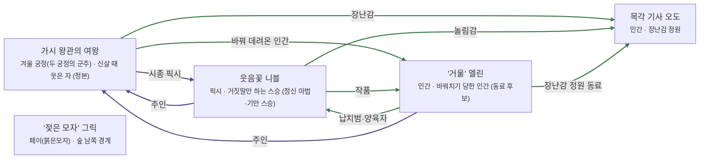

# 가시안개 숲 관계도

> 자동 생성 문서 — `python3 tools/build_relations.py` 로 다시 만든다. 직접 고치지 말 것.

선: 굵은 검정 = 혈연, 보라 = 위계, 초록 = 호감·연모, 빨강 = 적대, 갈색 = 거래·빚, 점선 = 비밀

## 관계 목록

| 누가 | 관계 | 누구에게 | 공개 | 메모 |
|---|---|---|---|---|
| 가시 왕관의 여왕 | 위계 · 시종 픽시 | 웃음꽃 니블 | 공개 |  |
| 가시 왕관의 여왕 | 감정 · 바꿔 데려온 인간 | '거울' 엘린 | 공개 |  |
| 가시 왕관의 여왕 | 감정 · 장난감 | 목각 기사 오도 | 공개 |  |
| 웃음꽃 니블 | 위계 · 주인 | 가시 왕관의 여왕 | 공개 |  |
| 웃음꽃 니블 | 감정 · 작품 | '거울' 엘린 | 공개 |  |
| 웃음꽃 니블 | 감정 · 놀림감 | 목각 기사 오도 | 공개 |  |
| '거울' 엘린 | 감정 · 납치범·양육자 | 웃음꽃 니블 | 공개 |  |
| '거울' 엘린 | 위계 · 주인 | 가시 왕관의 여왕 | 공개 |  |
| '거울' 엘린 | 감정 · 장난감 정원 동료 | 목각 기사 오도 | 공개 |  |
