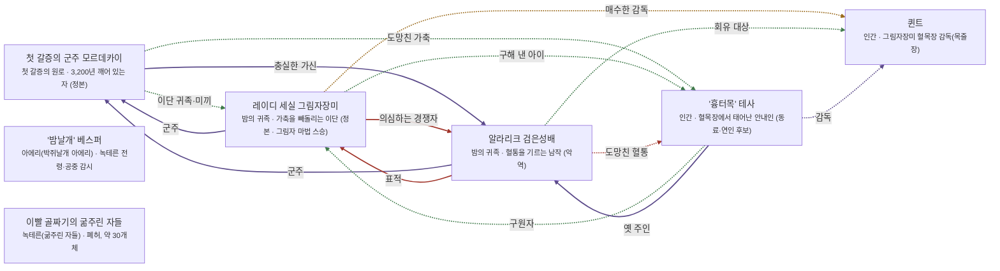

# 녹테른 밤의 영지 관계도

> 자동 생성 문서 — `python3 tools/build_relations.py` 로 다시 만든다. 직접 고치지 말 것.

선: 굵은 검정 = 혈연, 보라 = 위계, 초록 = 호감·연모, 빨강 = 적대, 갈색 = 거래·빚, 점선 = 비밀

## 관계 목록

| 누가 | 관계 | 누구에게 | 공개 | 메모 |
|---|---|---|---|---|
| 첫 갈증의 군주 모르데카이 | 감정 · 이단 귀족·미끼 | 레이디 세실 그림자장미 | 비밀 | 알면서 방치 |
| 첫 갈증의 군주 모르데카이 | 위계 · 충실한 가신 | 알라리크 검은성배 | 공개 |  |
| 첫 갈증의 군주 모르데카이 | 감정 · 도망친 가축 | '흉터목' 테사 | 비밀 |  |
| 레이디 세실 그림자장미 | 위계 · 군주 | 첫 갈증의 군주 모르데카이 | 공개 |  |
| 레이디 세실 그림자장미 | 적대 · 의심하는 경쟁자 | 알라리크 검은성배 | 공개 |  |
| 레이디 세실 그림자장미 | 감정 · 구해 낸 아이 | '흉터목' 테사 | 비밀 |  |
| 레이디 세실 그림자장미 | 거래 · 매수한 감독 | 퀸트 | 비밀 |  |
| 알라리크 검은성배 | 위계 · 군주 | 첫 갈증의 군주 모르데카이 | 공개 |  |
| 알라리크 검은성배 | 적대 · 표적 | 레이디 세실 그림자장미 | 공개 |  |
| 알라리크 검은성배 | 감정 · 회유 대상 | 퀸트 | 비밀 |  |
| 알라리크 검은성배 | 적대 · 도망친 혈통 | '흉터목' 테사 | 비밀 | 혈통 번호 기억 |
| '흉터목' 테사 | 감정 · 구원자 | 레이디 세실 그림자장미 | 비밀 |  |
| '흉터목' 테사 | 위계 · 옛 주인 | 알라리크 검은성배 | 공개 |  |
| '흉터목' 테사 | 위계 · 감독 | 퀸트 | 비밀 |  |
