# 녹테른 밤의 영지 관계도

> 자동 생성 문서 — `python3 tools/build_relations.py` 로 다시 만든다. 직접 고치지 말 것.

선: 굵은 검정 = 혈연, 보라 = 위계, 초록 = 호감·연모, 빨강 = 적대, 갈색 = 거래·빚, 점선 = 비밀

```mermaid
graph LR
  npc_mordecai["첫 갈증의 군주 모르데카이<br/><small>첫 갈증의 원로 · 3,200년 깨어 있는 자 (정본)</small>"]
  npc_cecile["레이디 세실 그림자장미<br/><small>밤의 귀족 · 가축을 빼돌리는 이단 (정본 · 그림자 마법 스승)</small>"]
  npc_alaric["알라리크 검은성배<br/><small>밤의 귀족 · 혈통을 기르는 남작 (악역)</small>"]
  npc_tessa["'흉터목' 테사<br/><small>인간 · 혈목장에서 태어난 안내인 (동료·연인 후보)</small>"]
  npc_quint["퀸트<br/><small>인간 · 그림자장미 혈목장 감독(목줄장)</small>"]
  npc_vesper["'밤날개' 베스퍼<br/><small>아에리(박쥐날개 아에리) · 녹테른 전령·공중 감시</small>"]
  npc_starved_pack["이빨 골짜기의 굶주린 자들<br/><small>녹테른(굶주린 자들) · 폐허, 약 30개체</small>"]
  npc_iserda["이세르다 열한째밤<br/><small>굶주린 자(돌아온 자) · 굶주림에서 돌아온 유일한 녹테른</small>"]
  npc_eloise["시종 엘로이즈<br/><small>첫 갈증의 원로 · 군주의 시종 — 군주의 중얼거림을 아는 사람</small>"]
  npc_carnon["집행인 카르논<br/><small>밤의 귀족 · 사형 집행인 — '공물 아님' 줄의 관리자</small>"]
  npc_marcius["집전관 마르시우스 붉은잔<br/><small>밤의 귀족 · 갈증의 밤 집전관 — 결번을 비워 두는 사람</small>"]
  npc_basilisa["바실리사 붉은달<br/><small>첫 잔의 가문 · 붉은 달 가문 가주 (맹약회의 313 녹테른 대표)</small>"]
  npc_adriel["아드리엘 핏빛유리<br/><small>밤의 귀족 · 붉은 우리 영주 — 장부와 숫자의 차이를 외면하는 자</small>"]
  npc_kasimir["카시미르 재의 잔<br/><small>밤의 귀족 · 공물 담당, 하얀 우리 영주</small>"]
  npc_zrag["크릭 목동장 '울타리 혀' 즈라그<br/><small>감독관 크릭 · 크릭 목동장 — 크릭의 숫자표를 가진 자</small>"]
  npc_orphe["집사 오르페<br/><small>인간 · 그림자장미 저택 집사 — 홈으로 위조하는 인간</small>"]
  npc_pips["정원지기 크릭 핍스<br/><small>감독관 크릭 · 그림자장미 온실 정원지기, 세실의 사람</small>"]
  npc_marian["열두 번째 아이 마리안<br/><small>인간 · 하얀 우리의 소녀 — 잘못 고른 잔향 후보</small>"]
  npc_baltasar["발타사르 흑수정<br/><small>첫 잔의 가문 · 흑수정 가문 가주, 잿빛 탑 원로 겸임</small>"]
  npc_silas_bell["사일라스 침묵종<br/><small>첫 잔의 가문 · 침묵종 가주 — 사냥·암살 의뢰를 받는 자</small>"]
  npc_ninth_hunter["사냥꾼 '아홉째'<br/><small>인간 (갈증받이) · 갈증받이 사냥꾼 400 가운데 아홉째</small>"]
  npc_marendis["마렌디스 고요물<br/><small>첫 잔의 가문 · 고요물 가문 가주 — 밤 부두의 피 교역</small>"]
  npc_rosalie["로잘리<br/><small>인간 · 루멘 공물 40명 가운데 잿빛 실 요원</small>"]
  npc_chik_tally["크릭 서기 '나무패 지기' 칙딱<br/><small>감독관 크릭 · 채혈 헛간 기록판의 크릭 서기</small>"]
  npc_hedwig["간호인 노파 헤트<br/><small>인간 · 회복 막사 간호인 — 쑥 탕약의 노파</small>"]
  npc_mordecai -.->|이단 귀족·미끼| npc_cecile
  npc_mordecai -->|충실한 가신| npc_alaric
  npc_mordecai -.->|도망친 가축| npc_tessa
  npc_cecile -->|군주| npc_mordecai
  npc_cecile -->|의심하는 경쟁자| npc_alaric
  npc_cecile -.->|구해 낸 아이| npc_tessa
  npc_cecile -.->|매수한 감독| npc_quint
  npc_alaric -->|군주| npc_mordecai
  npc_alaric -->|표적| npc_cecile
  npc_alaric -.->|회유 대상| npc_quint
  npc_alaric -.->|도망친 혈통| npc_tessa
  npc_tessa -.->|구원자| npc_cecile
  npc_tessa -->|옛 주인| npc_alaric
  npc_tessa -.->|감독| npc_quint
  npc_iserda -->|사냥을 거둔 군주| npc_mordecai
  npc_iserda -.->|짐승 피로 버티는 자 — 같은 길의 앞| npc_cecile
  npc_iserda -->|옛 동무들| npc_starved_pack
  npc_iserda -.->|끝을 약속한 인간| npc_tessa
  npc_eloise -->|군주| npc_mordecai
  npc_eloise -.->|서신의 상대| npc_cecile
  npc_eloise -->|같은 군주의 손| npc_carnon
  npc_eloise -->|집전관| npc_marcius
  npc_eloise -->|탑의 전령| npc_vesper
  npc_carnon -->|군주| npc_mordecai
  npc_carnon -->|시종| npc_eloise
  npc_carnon -->|밀고를 쥔 귀족| npc_alaric
  npc_carnon -.->|집행 대상 후보| npc_cecile
  npc_carnon -.->|하얀 우리 소녀| npc_marian
  npc_marcius -->|자리를 노리는 후보| npc_alaric
  npc_marcius -.->|결번의 수령자| npc_cecile
  npc_marcius -->|군주| npc_mordecai
  npc_marcius -->|시종| npc_eloise
  npc_marcius -->|공물 담당| npc_kasimir
  npc_basilisa -->|아래 영주| npc_adriel
  npc_basilisa -->|견제 대상| npc_cecile
  npc_basilisa -->|군주| npc_mordecai
  npc_basilisa -->|비슷한 야심가| npc_alaric
  npc_basilisa -->|집전관| npc_marcius
  npc_adriel -->|가주| npc_basilisa
  npc_adriel -->|목동장| npc_zrag
  npc_adriel -->|책임을 돌릴 대상| npc_cecile
  npc_adriel -.->|쑥 탕약의 노파| npc_hedwig
  npc_adriel -->|기록판 서기| npc_chik_tally
  npc_kasimir -.->|하얀 우리의 소녀| npc_marian
  npc_kasimir -->|집전관| npc_marcius
  npc_kasimir -->|목동장| npc_zrag
  npc_kasimir -->|가주| npc_basilisa
  npc_zrag -->|영주| npc_adriel
  npc_zrag -.->|쑥 노파| npc_hedwig
  npc_zrag -->|서기| npc_chik_tally
  npc_zrag -->|정원지기 크릭| npc_pips
  npc_zrag -.->|세실| npc_cecile
  npc_orphe -.->|주인| npc_cecile
  npc_orphe -->|장미 우리 감독| npc_quint
  npc_orphe -.->|정원지기 크릭| npc_pips
  npc_orphe -->|기록판 서기| npc_chik_tally
  npc_orphe -.->|구해 낸 아이| npc_tessa
  npc_pips -.->|주인| npc_cecile
  npc_pips -.->|집사| npc_orphe
  npc_pips -->|목동장| npc_zrag
  npc_pips -.->|은신처의 안내인| npc_tessa
  npc_marian -->|영주| npc_kasimir
  npc_marian -.->|줄 관리자| npc_carnon
  npc_baltasar -->|군주| npc_mordecai
  npc_baltasar -->|가주| npc_basilisa
  npc_silas_bell -.->|의뢰인| npc_alaric
  npc_silas_bell -.->|오랜 고객| npc_cecile
  npc_silas_bell -->|사냥꾼| npc_ninth_hunter
  npc_silas_bell -->|군주| npc_mordecai
  npc_ninth_hunter -->|가주| npc_silas_bell
  npc_ninth_hunter -.->|풀어 준 이| npc_tessa
  npc_ninth_hunter -.->|어린 시절 주인| npc_alaric
  npc_marendis -->|병이 비는 우리| npc_cecile
  npc_marendis -->|가주| npc_basilisa
  npc_rosalie -.->|접선 상대| npc_cecile
  npc_rosalie -.->|결번의 집전관| npc_marcius
  npc_rosalie -.->|공물 담당| npc_kasimir
  npc_chik_tally -->|목동장| npc_zrag
  npc_chik_tally -->|영주| npc_adriel
  npc_chik_tally -.->|의심하는 인간| npc_orphe
  npc_hedwig -.->|목동장| npc_zrag
  npc_hedwig -.->|영주| npc_adriel
  npc_hedwig -.->|피를 파는 귀족| npc_cecile
  linkStyle 0 stroke:#3f7a4a,stroke-width:2px
  linkStyle 1 stroke:#5b4a8a,stroke-width:2px
  linkStyle 2 stroke:#3f7a4a,stroke-width:2px
  linkStyle 3 stroke:#5b4a8a,stroke-width:2px
  linkStyle 4 stroke:#a1342a,stroke-width:2px
  linkStyle 5 stroke:#3f7a4a,stroke-width:2px
  linkStyle 6 stroke:#9a6a1c,stroke-width:2px
  linkStyle 7 stroke:#5b4a8a,stroke-width:2px
  linkStyle 8 stroke:#a1342a,stroke-width:2px
  linkStyle 9 stroke:#3f7a4a,stroke-width:2px
  linkStyle 10 stroke:#a1342a,stroke-width:2px
  linkStyle 11 stroke:#3f7a4a,stroke-width:2px
  linkStyle 12 stroke:#5b4a8a,stroke-width:2px
  linkStyle 13 stroke:#5b4a8a,stroke-width:2px
  linkStyle 14 stroke:#5b4a8a,stroke-width:2px
  linkStyle 15 stroke:#3f7a4a,stroke-width:2px
  linkStyle 16 stroke:#3f7a4a,stroke-width:2px
  linkStyle 17 stroke:#3f7a4a,stroke-width:2px
  linkStyle 18 stroke:#5b4a8a,stroke-width:2px
  linkStyle 19 stroke:#a1342a,stroke-width:2px
  linkStyle 20 stroke:#5b4a8a,stroke-width:2px
  linkStyle 21 stroke:#3f7a4a,stroke-width:2px
  linkStyle 22 stroke:#3f7a4a,stroke-width:2px
  linkStyle 23 stroke:#5b4a8a,stroke-width:2px
  linkStyle 24 stroke:#5b4a8a,stroke-width:2px
  linkStyle 25 stroke:#a1342a,stroke-width:2px
  linkStyle 26 stroke:#a1342a,stroke-width:2px
  linkStyle 27 stroke:#3f7a4a,stroke-width:2px
  linkStyle 28 stroke:#a1342a,stroke-width:2px
  linkStyle 29 stroke:#3f7a4a,stroke-width:2px
  linkStyle 30 stroke:#5b4a8a,stroke-width:2px
  linkStyle 31 stroke:#5b4a8a,stroke-width:2px
  linkStyle 32 stroke:#3f7a4a,stroke-width:2px
  linkStyle 33 stroke:#5b4a8a,stroke-width:2px
  linkStyle 34 stroke:#a1342a,stroke-width:2px
  linkStyle 35 stroke:#5b4a8a,stroke-width:2px
  linkStyle 36 stroke:#a1342a,stroke-width:2px
  linkStyle 37 stroke:#3f7a4a,stroke-width:2px
  linkStyle 38 stroke:#a1342a,stroke-width:2px
  linkStyle 39 stroke:#3f7a4a,stroke-width:2px
  linkStyle 40 stroke:#a1342a,stroke-width:2px
  linkStyle 41 stroke:#3f7a4a,stroke-width:2px
  linkStyle 42 stroke:#3f7a4a,stroke-width:2px
  linkStyle 43 stroke:#3f7a4a,stroke-width:2px
  linkStyle 44 stroke:#3f7a4a,stroke-width:2px
  linkStyle 45 stroke:#3f7a4a,stroke-width:2px
  linkStyle 46 stroke:#a1342a,stroke-width:2px
  linkStyle 47 stroke:#5b4a8a,stroke-width:2px
  linkStyle 48 stroke:#3f7a4a,stroke-width:2px
  linkStyle 49 stroke:#3f7a4a,stroke-width:2px
  linkStyle 50 stroke:#3f7a4a,stroke-width:2px
  linkStyle 51 stroke:#a1342a,stroke-width:2px
  linkStyle 52 stroke:#5b4a8a,stroke-width:2px
  linkStyle 53 stroke:#5b4a8a,stroke-width:2px
  linkStyle 54 stroke:#3f7a4a,stroke-width:2px
  linkStyle 55 stroke:#a1342a,stroke-width:2px
  linkStyle 56 stroke:#3f7a4a,stroke-width:2px
  linkStyle 57 stroke:#5b4a8a,stroke-width:2px
  linkStyle 58 stroke:#5b4a8a,stroke-width:2px
  linkStyle 59 stroke:#3f7a4a,stroke-width:2px
  linkStyle 60 stroke:#3f7a4a,stroke-width:2px
  linkStyle 61 stroke:#5b4a8a,stroke-width:2px
  linkStyle 62 stroke:#3f7a4a,stroke-width:2px
  linkStyle 63 stroke:#5b4a8a,stroke-width:2px
  linkStyle 64 stroke:#a1342a,stroke-width:2px
  linkStyle 65 stroke:#a1342a,stroke-width:2px
  linkStyle 66 stroke:#9a6a1c,stroke-width:2px
  linkStyle 67 stroke:#3f7a4a,stroke-width:2px
  linkStyle 68 stroke:#5b4a8a,stroke-width:2px
  linkStyle 69 stroke:#3f7a4a,stroke-width:2px
  linkStyle 70 stroke:#3f7a4a,stroke-width:2px
  linkStyle 71 stroke:#5b4a8a,stroke-width:2px
  linkStyle 72 stroke:#a1342a,stroke-width:2px
  linkStyle 73 stroke:#a1342a,stroke-width:2px
  linkStyle 74 stroke:#3f7a4a,stroke-width:2px
  linkStyle 75 stroke:#3f7a4a,stroke-width:2px
  linkStyle 76 stroke:#a1342a,stroke-width:2px
  linkStyle 77 stroke:#3f7a4a,stroke-width:2px
  linkStyle 78 stroke:#5b4a8a,stroke-width:2px
  linkStyle 79 stroke:#a1342a,stroke-width:2px
  linkStyle 80 stroke:#3f7a4a,stroke-width:2px
  linkStyle 81 stroke:#5b4a8a,stroke-width:2px
  linkStyle 82 stroke:#3f7a4a,stroke-width:2px
```

## 관계 목록

| 누가 | 관계 | 누구에게 | 공개 | 메모 |
|---|---|---|---|---|
| 첫 갈증의 군주 모르데카이 | 감정 · 이단 귀족·미끼 | 레이디 세실 그림자장미 | 비밀 | 알면서 방치 |
| 첫 갈증의 군주 모르데카이 | 위계 · 충실한 가신 | 알라리크 검은성배 | 공개 |  |
| 첫 갈증의 군주 모르데카이 | 감정 · 도망친 가축 | '흉터목' 테사 | 비밀 |  |
| 레이디 세실 그림자장미 | 위계 · 군주 | 첫 갈증의 군주 모르데카이 | 공개 |  |
| 레이디 세실 그림자장미 | 적대 · 의심하는 경쟁자 | 알라리크 검은성배 | 공개 |  |
| 레이디 세실 그림자장미 | 감정 · 구해 낸 아이 | '흉터목' 테사 | 비밀 |  |
| 레이디 세실 그림자장미 | 거래 · 매수한 감독 | 퀸트 | 비밀 |  |
| 알라리크 검은성배 | 위계 · 군주 | 첫 갈증의 군주 모르데카이 | 공개 |  |
| 알라리크 검은성배 | 적대 · 표적 | 레이디 세실 그림자장미 | 공개 |  |
| 알라리크 검은성배 | 감정 · 회유 대상 | 퀸트 | 비밀 |  |
| 알라리크 검은성배 | 적대 · 도망친 혈통 | '흉터목' 테사 | 비밀 | 혈통 번호 기억 |
| '흉터목' 테사 | 감정 · 구원자 | 레이디 세실 그림자장미 | 비밀 |  |
| '흉터목' 테사 | 위계 · 옛 주인 | 알라리크 검은성배 | 공개 |  |
| '흉터목' 테사 | 위계 · 감독 | 퀸트 | 비밀 |  |
| 이세르다 열한째밤 | 위계 · 사냥을 거둔 군주 | 첫 갈증의 군주 모르데카이 | 공개 |  |
| 이세르다 열한째밤 | 감정 · 짐승 피로 버티는 자 — 같은 길의 앞 | 레이디 세실 그림자장미 | 비밀 |  |
| 이세르다 열한째밤 | 감정 · 옛 동무들 | 이빨 골짜기의 굶주린 자들 | 공개 |  |
| 이세르다 열한째밤 | 감정 · 끝을 약속한 인간 | '흉터목' 테사 | 비밀 |  |
| 시종 엘로이즈 | 위계 · 군주 | 첫 갈증의 군주 모르데카이 | 공개 | 3,000년을 곁에서 섬겼다 |
| 시종 엘로이즈 | 적대 · 서신의 상대 | 레이디 세실 그림자장미 | 비밀 | 사본을 올려 주는 길목 |
| 시종 엘로이즈 | 위계 · 같은 군주의 손 | 집행인 카르논 | 공개 | 집행과 시종 |
| 시종 엘로이즈 | 감정 · 집전관 | 집전관 마르시우스 붉은잔 | 공개 | 우물 순례의 동료 |
| 시종 엘로이즈 | 감정 · 탑의 전령 | '밤날개' 베스퍼 | 공개 | 서신을 받는 입 |
| 집행인 카르논 | 위계 · 군주 | 첫 갈증의 군주 모르데카이 | 공개 | 명령을 집행하는 손 |
| 집행인 카르논 | 위계 · 시종 | 시종 엘로이즈 | 공개 | 같은 군주의 손 |
| 집행인 카르논 | 적대 · 밀고를 쥔 귀족 | 알라리크 검은성배 | 공개 | 명을 내리게 할 자 |
| 집행인 카르논 | 적대 · 집행 대상 후보 | 레이디 세실 그림자장미 | 비밀 | 오래 지켜본 장미 |
| 집행인 카르논 | 감정 · 하얀 우리 소녀 | 열두 번째 아이 마리안 | 비밀 | 얼굴을 한 번 본 적이 있다 |
| 집전관 마르시우스 붉은잔 | 적대 · 자리를 노리는 후보 | 알라리크 검은성배 | 공개 | 결번의 이유를 캐려 한다 |
| 집전관 마르시우스 붉은잔 | 감정 · 결번의 수령자 | 레이디 세실 그림자장미 | 비밀 | 서신 한 번 없이 맞물리는 사이 |
| 집전관 마르시우스 붉은잔 | 위계 · 군주 | 첫 갈증의 군주 모르데카이 | 공개 | 우물에서 듣는 목소리 |
| 집전관 마르시우스 붉은잔 | 위계 · 시종 | 시종 엘로이즈 | 공개 | 우물 순례의 동료 |
| 집전관 마르시우스 붉은잔 | 감정 · 공물 담당 | 카시미르 재의 잔 | 공개 | 명단과 도착의 두 끝 |
| 바실리사 붉은달 | 위계 · 아래 영주 | 아드리엘 핏빛유리 | 공개 | 쥔 목줄 |
| 바실리사 붉은달 | 적대 · 견제 대상 | 레이디 세실 그림자장미 | 공개 | 장부 위조의 의심 |
| 바실리사 붉은달 | 위계 · 군주 | 첫 갈증의 군주 모르데카이 | 공개 | 잔향의 소리를 듣는 이 |
| 바실리사 붉은달 | 적대 · 비슷한 야심가 | 알라리크 검은성배 | 공개 | 집전관 자리를 노린다 |
| 바실리사 붉은달 | 감정 · 집전관 | 집전관 마르시우스 붉은잔 | 공개 | 명단의 확정자 |
| 아드리엘 핏빛유리 | 적대 · 가주 | 바실리사 붉은달 | 공개 | 목줄을 쥔 이 |
| 아드리엘 핏빛유리 | 감정 · 목동장 | 크릭 목동장 '울타리 혀' 즈라그 | 공개 | 숫자를 가진 크릭 |
| 아드리엘 핏빛유리 | 적대 · 책임을 돌릴 대상 | 레이디 세실 그림자장미 | 공개 | 사라진 인간의 원흉으로 지목 |
| 아드리엘 핏빛유리 | 감정 · 쑥 탕약의 노파 | 간호인 노파 헤트 | 비밀 | 알면서 눈감는다 |
| 아드리엘 핏빛유리 | 감정 · 기록판 서기 | 크릭 서기 '나무패 지기' 칙딱 | 공개 | 홈의 숫자 |
| 카시미르 재의 잔 | 감정 · 하얀 우리의 소녀 | 열두 번째 아이 마리안 | 비밀 | 납품 대상 |
| 카시미르 재의 잔 | 감정 · 집전관 | 집전관 마르시우스 붉은잔 | 공개 | 명단과 도착의 두 끝 |
| 카시미르 재의 잔 | 감정 · 목동장 | 크릭 목동장 '울타리 혀' 즈라그 | 공개 | 공물 문 경비 |
| 카시미르 재의 잔 | 적대 · 가주 | 바실리사 붉은달 | 공개 | 붉은 달의 큰 영향 아래 |
| 크릭 목동장 '울타리 혀' 즈라그 | 위계 · 영주 | 아드리엘 핏빛유리 | 공개 | 장부를 믿지 않는 상관 |
| 크릭 목동장 '울타리 혀' 즈라그 | 감정 · 쑥 노파 | 간호인 노파 헤트 | 비밀 | 쑥 한 자루의 거래 |
| 크릭 목동장 '울타리 혀' 즈라그 | 감정 · 서기 | 크릭 서기 '나무패 지기' 칙딱 | 공개 | 숫자표의 동료 |
| 크릭 목동장 '울타리 혀' 즈라그 | 감정 · 정원지기 크릭 | 정원지기 크릭 핍스 | 공개 | 같은 크릭 |
| 크릭 목동장 '울타리 혀' 즈라그 | 적대 · 세실 | 레이디 세실 그림자장미 | 비밀 | 장미의 의미를 알지만 모른 척한다 |
| 집사 오르페 | 위계 · 주인 | 레이디 세실 그림자장미 | 비밀 | 장부를 맡긴 이 |
| 집사 오르페 | 위계 · 장미 우리 감독 | 퀸트 | 공개 | 같은 저택 아래 |
| 집사 오르페 | 감정 · 정원지기 크릭 | 정원지기 크릭 핍스 | 비밀 | 장미 꽃잎의 동료 |
| 집사 오르페 | 적대 · 기록판 서기 | 크릭 서기 '나무패 지기' 칙딱 | 공개 | 홈을 알아본 크릭 |
| 집사 오르페 | 감정 · 구해 낸 아이 | '흉터목' 테사 | 비밀 | 세실이 아끼는 이 |
| 정원지기 크릭 핍스 | 위계 · 주인 | 레이디 세실 그림자장미 | 비밀 | 처음 꽃잎을 건넨 이 |
| 정원지기 크릭 핍스 | 위계 · 집사 | 집사 오르페 | 비밀 | 장미 꽃잎의 동료 |
| 정원지기 크릭 핍스 | 감정 · 목동장 | 크릭 목동장 '울타리 혀' 즈라그 | 공개 | 같은 크릭 |
| 정원지기 크릭 핍스 | 감정 · 은신처의 안내인 | '흉터목' 테사 | 비밀 | 꽃잎의 반대쪽 끝 |
| 열두 번째 아이 마리안 | 위계 · 영주 | 카시미르 재의 잔 | 공개 | 선별한 이 |
| 열두 번째 아이 마리안 | 감정 · 줄 관리자 | 집행인 카르논 | 비밀 | 얼굴을 본 적 있는 집행인 |
| 발타사르 흑수정 | 위계 · 군주 | 첫 갈증의 군주 모르데카이 | 공개 | 탑과 영지의 연결 |
| 발타사르 흑수정 | 적대 · 가주 | 바실리사 붉은달 | 공개 | 붉은 달의 큰 그늘 |
| 사일라스 침묵종 | 적대 · 의뢰인 | 알라리크 검은성배 | 비밀 | 세실 의뢰 |
| 사일라스 침묵종 | 거래 · 오랜 고객 | 레이디 세실 그림자장미 | 비밀 | 죽이고 싶지 않다 |
| 사일라스 침묵종 | 감정 · 사냥꾼 | 사냥꾼 '아홉째' | 공개 | 아홉째 |
| 사일라스 침묵종 | 위계 · 군주 | 첫 갈증의 군주 모르데카이 | 공개 | 의뢰의 상급 |
| 사냥꾼 '아홉째' | 감정 · 가주 | 사일라스 침묵종 | 공개 | 의뢰를 주는 이 |
| 사냥꾼 '아홉째' | 감정 · 풀어 준 이 | '흉터목' 테사 | 비밀 | 테사는 그가 풀어 준 줄 모른다 |
| 사냥꾼 '아홉째' | 위계 · 어린 시절 주인 | 알라리크 검은성배 | 비밀 | 검은성배 우리의 장부 |
| 마렌디스 고요물 | 적대 · 병이 비는 우리 | 레이디 세실 그림자장미 | 공개 | 병 수가 맞지 않는다 |
| 마렌디스 고요물 | 적대 · 가주 | 바실리사 붉은달 | 공개 | 붉은 달의 큰 그늘 |
| 로잘리 | 감정 · 접선 상대 | 레이디 세실 그림자장미 | 비밀 | 서신 한 번 없이 기대한다 |
| 로잘리 | 감정 · 결번의 집전관 | 집전관 마르시우스 붉은잔 | 비밀 | 결번이 자신인지 모른다 |
| 로잘리 | 적대 · 공물 담당 | 카시미르 재의 잔 | 비밀 | 마당에서 고를 사람 |
| 크릭 서기 '나무패 지기' 칙딱 | 감정 · 목동장 | 크릭 목동장 '울타리 혀' 즈라그 | 공개 | 숫자표의 동료 |
| 크릭 서기 '나무패 지기' 칙딱 | 위계 · 영주 | 아드리엘 핏빛유리 | 공개 | 보고하지 않은 상대 |
| 크릭 서기 '나무패 지기' 칙딱 | 적대 · 의심하는 인간 | 집사 오르페 | 비밀 | 홈의 깊이를 알아본 상대 |
| 간호인 노파 헤트 | 감정 · 목동장 | 크릭 목동장 '울타리 혀' 즈라그 | 비밀 | 쑥 한 자루의 거래 |
| 간호인 노파 헤트 | 위계 · 영주 | 아드리엘 핏빛유리 | 비밀 | 알면서 눈감는 이 |
| 간호인 노파 헤트 | 감정 · 피를 파는 귀족 | 레이디 세실 그림자장미 | 비밀 | 쑥과 피 거래의 반대쪽 끝 |
