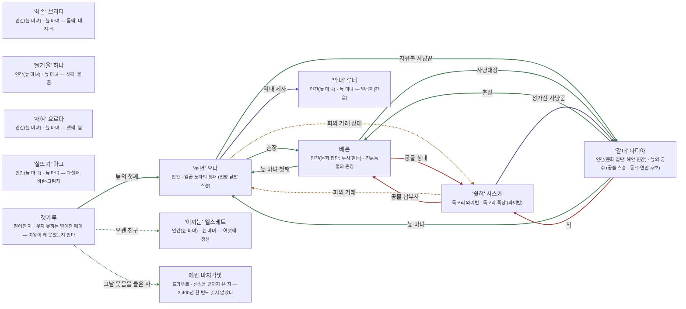

# 모르바 늪 관계도

> 자동 생성 문서 — `python3 tools/build_relations.py` 로 다시 만든다. 직접 고치지 말 것.

선: 굵은 검정 = 혈연, 보라 = 위계, 초록 = 호감·연모, 빨강 = 적대, 갈색 = 거래·빚, 점선 = 비밀

## 관계 목록

| 누가 | 관계 | 누구에게 | 공개 | 메모 |
|---|---|---|---|---|
| '눈먼' 오다 | 감정 · 촌장 | 베른 | 공개 |  |
| '눈먼' 오다 | 거래 · 피의 거래 상대 | '쉿혀' 사스카 | 비밀 |  |
| '눈먼' 오다 | 위계 · 막내 제자 | '막내' 루네 | 공개 |  |
| '눈먼' 오다 | 감정 · 자유촌 사냥꾼 | '갈대' 나디아 | 공개 |  |
| 베른 | 감정 · 늪 마녀 첫째 | '눈먼' 오다 | 공개 |  |
| 베른 | 적대 · 공물 상대 | '쉿혀' 사스카 | 공개 |  |
| 베른 | 감정 · 사냥대장 | '갈대' 나디아 | 공개 |  |
| '갈대' 나디아 | 감정 · 촌장 | 베른 | 공개 |  |
| '갈대' 나디아 | 감정 · 늪 마녀 | '눈먼' 오다 | 공개 |  |
| '갈대' 나디아 | 적대 · 적 | '쉿혀' 사스카 | 공개 |  |
| '쉿혀' 사스카 | 거래 · 피의 거래 | '눈먼' 오다 | 비밀 |  |
| '쉿혀' 사스카 | 적대 · 공물 납부자 | 베른 | 공개 |  |
| '쉿혀' 사스카 | 위계 · 성가신 사냥꾼 | '갈대' 나디아 | 공개 |  |
| 잿가루 | 감정 · 오랜 친구 | '이끼눈' 엘스베트 | 비밀 |  |
| 잿가루 | 감정 · 늪의 첫째 | '눈먼' 오다 | 공개 |  |
| 잿가루 | 감정 · 그날 웃음을 들은 자 | 에뮌 마지막빛 | 비밀 | 그는 왜인지 모른다 |
