# 모르바 늪 관계도

> 자동 생성 문서 — `python3 tools/build_relations.py` 로 다시 만든다. 직접 고치지 말 것.

선: 굵은 검정 = 혈연, 보라 = 위계, 초록 = 호감·연모, 빨강 = 적대, 갈색 = 거래·빚, 점선 = 비밀

```mermaid
graph LR
  npc_oda["'눈먼' 오다<br/><small>인간 · 일곱 노파의 첫째 (진명 낱말 스승)</small>"]
  npc_bern["베른<br/><small>인간(문화 집단: 투사 혈통) · 진흙등불의 촌장</small>"]
  npc_nadia["'갈대' 나디아<br/><small>인간(문화 집단: 해안 인간) · 늪의 궁수 (궁술 스승 · 동료·연인 후보)</small>"]
  npc_saska["'쉿혀' 사스카<br/><small>독꼬리 와이번 · 독꼬리 족장 (와이번)</small>"]
  npc_hag_brita["'쇠손' 브리타<br/><small>인간(늪 마녀) · 늪 마녀 — 둘째. 대지·쇠</small>"]
  npc_hag_hana["'물거울' 하나<br/><small>인간(늪 마녀) · 늪 마녀 — 셋째. 물·꿈</small>"]
  npc_hag_jorda["'재혀' 요르다<br/><small>인간(늪 마녀) · 늪 마녀 — 넷째. 불</small>"]
  npc_hag_mag["'실뜨기' 마그<br/><small>인간(늪 마녀) · 늪 마녀 — 다섯째. 바람·그림자</small>"]
  npc_hag_elsbet["'이끼눈' 엘스베트<br/><small>인간(늪 마녀) · 늪 마녀 — 여섯째. 정신</small>"]
  npc_hag_rune["'막내' 루네<br/><small>인간(늪 마녀) · 늪 마녀 — 일곱째(견습)</small>"]
  npc_emyn["에뮌 마지막빛<br/><small>드라우르 · 신살을 끝까지 본 자 — 3,400년 한 번도 잊지 않았다</small>"]
  npc_ashdust["잿가루<br/><small>떨어진 자 · 웃지 못하는 떨어진 페이 — 여왕이 왜 웃었는지 안다</small>"]
  npc_mv_alek["알렉<br/><small>인간(바알카르 도시 인간) · 뿌리마을 뿌리 모임 대표, 진흙판 학교 선생</small>"]
  npc_mv_torr["대장장이 토르<br/><small>인간(탈주 노예) · 뿌리마을 대장장이 (회색여울 브란의 옛 스승)</small>"]
  npc_mv_beni["망꾼장 베니<br/><small>인간(늪 자유민) · 늪 어귀 망꾼장 (외팔)</small>"]
  npc_mv_jude["어린 쥬드<br/><small>인간(늪 자유민) · 왜가리 둥지 망꾼 (열네 살)</small>"]
  npc_mv_hilke["솥지기 힐케<br/><small>인간(늪 자유민) · 뿌리마을 공동 솥 지기</small>"]
  npc_mv_nanne["바구니지기 난네<br/><small>인간(탈주 노예) · 이름 바구니 지기 (성 412개의 매듭)</small>"]
  npc_mv_rif["리프<br/><small>인간(늪 자유민) · 진흙판 학교 학생 (열두 살 장어 덫 소년)</small>"]
  npc_mv_shirel["'미끄럼' 쉬렐<br/><small>라미아 · 뱀장어 길 밀수꾼</small>"]
  npc_mv_gur["구르<br/><small>굴 크릭 · 늪 크릭 우두머리 (일곱 노파의 심부름꾼 무리, 열일곱 살)</small>"]
  npc_mv_marek["훈제 장수 마레크<br/><small>인간(늪 자유민) · 장어 훈제 장수 (바르그의 밀정)</small>"]
  npc_mv_sunni["순니<br/><small>인간(늪 마녀) · 쑥 계보의 딸 — 빌린 피 저장고지기</small>"]
  npc_mv_hedwiga["헤드비가<br/><small>인간(늪 마녀) · 버들 계보의 딸 — 세렌 약초 연락</small>"]
  npc_mv_garr["손님 제자 가르<br/><small>인간(늪 자유민) · 손님 제자 (전직 바르그 노예사냥꾼)</small>"]
  npc_mv_sirra["시라<br/><small>독꼬리 와이번 · 사스카의 딸 (후계 후보)</small>"]
  npc_mv_bren["브렌<br/><small>인간(늪 자유민) · 공물 사냥꾼 (갈대 우리의 맏이)</small>"]
  npc_mv_rena["레나<br/><small>인간(늪 자유민) · 물안개 둑 책임자 (모르바 등잔)</small>"]
  npc_oda -->|촌장| npc_bern
  npc_oda -.->|피의 거래 상대| npc_saska
  npc_oda -->|막내 제자| npc_hag_rune
  npc_oda -->|자유촌 사냥꾼| npc_nadia
  npc_bern -->|늪 마녀 첫째| npc_oda
  npc_bern -->|공물 상대| npc_saska
  npc_bern -->|사냥대장| npc_nadia
  npc_nadia -->|촌장| npc_bern
  npc_nadia -->|늪 마녀| npc_oda
  npc_nadia -->|적| npc_saska
  npc_saska -.->|피의 거래| npc_oda
  npc_saska -->|공물 납부자| npc_bern
  npc_saska -->|성가신 사냥꾼| npc_nadia
  npc_ashdust -.->|오랜 친구| npc_hag_elsbet
  npc_ashdust -->|늪의 첫째| npc_oda
  npc_ashdust -.->|그날 웃음을 들은 자| npc_emyn
  npc_mv_alek -->|첫 제자이자 촌장| npc_bern
  npc_mv_alek -.->|서로를 의심하는 동지| npc_mv_rena
  npc_mv_alek -->|가장 빠른 학생| npc_mv_rif
  npc_mv_alek -.->|숫자 쪽지의 배달부| npc_mv_hedwiga
  npc_mv_alek -->|바위의 노파| npc_oda
  npc_mv_torr -.->|가스 함정의 공범| npc_mv_beni
  npc_mv_torr -->|진흙등불 촌장| npc_bern
  npc_mv_torr -->|학교 선생| npc_mv_alek
  npc_mv_torr -->|활촉을 주문하는 사냥대장| npc_nadia
  npc_mv_beni ---|조카 같은 망꾼| npc_mv_jude
  npc_mv_beni -.->|장어 장수| npc_mv_marek
  npc_mv_beni -.->|가스 함정의 공범| npc_mv_torr
  npc_mv_beni -.->|호루라기를 고쳐 준 전직 사냥꾼| npc_mv_garr
  npc_mv_beni -->|진흙등불 촌장| npc_bern
  npc_mv_jude -->|보호자| npc_mv_beni
  npc_mv_jude -.->|장어 훈제를 주는 아저씨| npc_mv_marek
  npc_mv_jude -->|또래| npc_mv_rif
  npc_mv_hilke -->|오랜 이웃| npc_mv_nanne
  npc_mv_hilke -->|아이들의 선생| npc_mv_alek
  npc_mv_hilke -->|솥에 숨어드는 아이| npc_mv_rif
  npc_mv_hilke -->|병든 노파| npc_oda
  npc_mv_nanne -->|이웃| npc_mv_hilke
  npc_mv_nanne -->|학교 선생| npc_mv_alek
  npc_mv_nanne -.->|매듭 문자의 창시자| npc_hag_mag
  npc_mv_nanne -->|진흙등불 촌장| npc_bern
  npc_mv_rif -->|선생| npc_mv_alek
  npc_mv_rif -->|또래| npc_mv_jude
  npc_mv_rif -->|솥지기| npc_mv_hilke
  npc_mv_rif -.->|막내 노파| npc_hag_rune
  npc_mv_shirel -->|약초 값 거래| npc_mv_hedwiga
  npc_mv_shirel -->|장어 훈제 값 거래| npc_mv_garr
  npc_mv_shirel -->|소금 값을 받는 노파| npc_oda
  npc_mv_gur -->|약 심부름을 주는 노파| npc_oda
  npc_mv_gur -->|꿈 심문의 노파| npc_hag_elsbet
  npc_mv_gur ---|항아리 곁의 딸| npc_mv_sunni
  npc_mv_marek -.->|늪 어귀 망꾼장| npc_mv_beni
  npc_mv_marek -->|장어를 얻어 가는 아이| npc_mv_jude
  npc_mv_marek -.->|꿈 심문의 노파| npc_hag_elsbet
  npc_mv_sunni -->|첫째 노파| npc_oda
  npc_mv_sunni -->|쑥 즙의 동료| npc_mv_gur
  npc_mv_sunni -->|둘째 노파| npc_hag_brita
  npc_mv_hedwiga -->|스승 노파| npc_hag_hana
  npc_mv_hedwiga -.->|숫자 쪽지의 수령자| npc_mv_alek
  npc_mv_hedwiga -->|배의 뱃사공| npc_mv_shirel
  npc_mv_garr -->|입문을 허락한 노파| npc_oda
  npc_mv_garr -.->|호루라기를 알려 준 망꾼장| npc_mv_beni
  npc_mv_garr -.->|장어 냄새 속의 목줄꾼| npc_mv_marek
  npc_mv_garr -->|의심하는 노파| npc_hag_brita
  npc_mv_sirra ---|어미·족장| npc_saska
  npc_mv_sirra -.->|말을 가르쳐 주는 공물| npc_mv_bren
  npc_mv_sirra -.->|마주친 적 있는 전직 사냥꾼| npc_mv_garr
  npc_mv_sirra -->|시끄러운 사냥꾼| npc_nadia
  npc_mv_bren -.->|옛 동료| npc_nadia
  npc_mv_bren -.->|말을 배우는 와이번| npc_mv_sirra
  npc_mv_bren -->|와이번 족장| npc_saska
  npc_mv_bren -->|공물로 보낸 촌장| npc_bern
  npc_mv_rena -.->|등잔을 떠난 선생| npc_mv_alek
  npc_mv_rena -.->|매듭 문자의 창시자| npc_hag_mag
  linkStyle 0 stroke:#3f7a4a,stroke-width:2px
  linkStyle 1 stroke:#9a6a1c,stroke-width:2px
  linkStyle 2 stroke:#5b4a8a,stroke-width:2px
  linkStyle 3 stroke:#3f7a4a,stroke-width:2px
  linkStyle 4 stroke:#3f7a4a,stroke-width:2px
  linkStyle 5 stroke:#a1342a,stroke-width:2px
  linkStyle 6 stroke:#3f7a4a,stroke-width:2px
  linkStyle 7 stroke:#3f7a4a,stroke-width:2px
  linkStyle 8 stroke:#3f7a4a,stroke-width:2px
  linkStyle 9 stroke:#a1342a,stroke-width:2px
  linkStyle 10 stroke:#9a6a1c,stroke-width:2px
  linkStyle 11 stroke:#a1342a,stroke-width:2px
  linkStyle 12 stroke:#5b4a8a,stroke-width:2px
  linkStyle 13 stroke:#3f7a4a,stroke-width:2px
  linkStyle 14 stroke:#3f7a4a,stroke-width:2px
  linkStyle 15 stroke:#3f7a4a,stroke-width:2px
  linkStyle 16 stroke:#5b4a8a,stroke-width:2px
  linkStyle 17 stroke:#a1342a,stroke-width:2px
  linkStyle 18 stroke:#3f7a4a,stroke-width:2px
  linkStyle 19 stroke:#3f7a4a,stroke-width:2px
  linkStyle 20 stroke:#3f7a4a,stroke-width:2px
  linkStyle 21 stroke:#2f6f86,stroke-width:1.5px
  linkStyle 22 stroke:#3f7a4a,stroke-width:2px
  linkStyle 23 stroke:#3f7a4a,stroke-width:2px
  linkStyle 24 stroke:#3f7a4a,stroke-width:2px
  linkStyle 25 stroke:#2a2521,stroke-width:3px
  linkStyle 26 stroke:#3f7a4a,stroke-width:2px
  linkStyle 27 stroke:#2f6f86,stroke-width:1.5px
  linkStyle 28 stroke:#3f7a4a,stroke-width:2px
  linkStyle 29 stroke:#3f7a4a,stroke-width:2px
  linkStyle 30 stroke:#3f7a4a,stroke-width:2px
  linkStyle 31 stroke:#3f7a4a,stroke-width:2px
  linkStyle 32 stroke:#3f7a4a,stroke-width:2px
  linkStyle 33 stroke:#3f7a4a,stroke-width:2px
  linkStyle 34 stroke:#3f7a4a,stroke-width:2px
  linkStyle 35 stroke:#3f7a4a,stroke-width:2px
  linkStyle 36 stroke:#3f7a4a,stroke-width:2px
  linkStyle 37 stroke:#3f7a4a,stroke-width:2px
  linkStyle 38 stroke:#3f7a4a,stroke-width:2px
  linkStyle 39 stroke:#3f7a4a,stroke-width:2px
  linkStyle 40 stroke:#3f7a4a,stroke-width:2px
  linkStyle 41 stroke:#3f7a4a,stroke-width:2px
  linkStyle 42 stroke:#3f7a4a,stroke-width:2px
  linkStyle 43 stroke:#3f7a4a,stroke-width:2px
  linkStyle 44 stroke:#3f7a4a,stroke-width:2px
  linkStyle 45 stroke:#9a6a1c,stroke-width:2px
  linkStyle 46 stroke:#9a6a1c,stroke-width:2px
  linkStyle 47 stroke:#3f7a4a,stroke-width:2px
  linkStyle 48 stroke:#3f7a4a,stroke-width:2px
  linkStyle 49 stroke:#3f7a4a,stroke-width:2px
  linkStyle 50 stroke:#2a2521,stroke-width:3px
  linkStyle 51 stroke:#3f7a4a,stroke-width:2px
  linkStyle 52 stroke:#3f7a4a,stroke-width:2px
  linkStyle 53 stroke:#3f7a4a,stroke-width:2px
  linkStyle 54 stroke:#3f7a4a,stroke-width:2px
  linkStyle 55 stroke:#3f7a4a,stroke-width:2px
  linkStyle 56 stroke:#a1342a,stroke-width:2px
  linkStyle 57 stroke:#5b4a8a,stroke-width:2px
  linkStyle 58 stroke:#3f7a4a,stroke-width:2px
  linkStyle 59 stroke:#3f7a4a,stroke-width:2px
  linkStyle 60 stroke:#3f7a4a,stroke-width:2px
  linkStyle 61 stroke:#3f7a4a,stroke-width:2px
  linkStyle 62 stroke:#a1342a,stroke-width:2px
  linkStyle 63 stroke:#a1342a,stroke-width:2px
  linkStyle 64 stroke:#2a2521,stroke-width:3px
  linkStyle 65 stroke:#3f7a4a,stroke-width:2px
  linkStyle 66 stroke:#a1342a,stroke-width:2px
  linkStyle 67 stroke:#a1342a,stroke-width:2px
  linkStyle 68 stroke:#3f7a4a,stroke-width:2px
  linkStyle 69 stroke:#3f7a4a,stroke-width:2px
  linkStyle 70 stroke:#a1342a,stroke-width:2px
  linkStyle 71 stroke:#a1342a,stroke-width:2px
  linkStyle 72 stroke:#3f7a4a,stroke-width:2px
  linkStyle 73 stroke:#3f7a4a,stroke-width:2px
```

## 관계 목록

| 누가 | 관계 | 누구에게 | 공개 | 메모 |
|---|---|---|---|---|
| '눈먼' 오다 | 감정 · 촌장 | 베른 | 공개 |  |
| '눈먼' 오다 | 거래 · 피의 거래 상대 | '쉿혀' 사스카 | 비밀 |  |
| '눈먼' 오다 | 위계 · 막내 제자 | '막내' 루네 | 공개 |  |
| '눈먼' 오다 | 감정 · 자유촌 사냥꾼 | '갈대' 나디아 | 공개 |  |
| 베른 | 감정 · 늪 마녀 첫째 | '눈먼' 오다 | 공개 |  |
| 베른 | 적대 · 공물 상대 | '쉿혀' 사스카 | 공개 |  |
| 베른 | 감정 · 사냥대장 | '갈대' 나디아 | 공개 |  |
| '갈대' 나디아 | 감정 · 촌장 | 베른 | 공개 |  |
| '갈대' 나디아 | 감정 · 늪 마녀 | '눈먼' 오다 | 공개 |  |
| '갈대' 나디아 | 적대 · 적 | '쉿혀' 사스카 | 공개 |  |
| '쉿혀' 사스카 | 거래 · 피의 거래 | '눈먼' 오다 | 비밀 |  |
| '쉿혀' 사스카 | 적대 · 공물 납부자 | 베른 | 공개 |  |
| '쉿혀' 사스카 | 위계 · 성가신 사냥꾼 | '갈대' 나디아 | 공개 |  |
| 잿가루 | 감정 · 오랜 친구 | '이끼눈' 엘스베트 | 비밀 |  |
| 잿가루 | 감정 · 늪의 첫째 | '눈먼' 오다 | 공개 |  |
| 잿가루 | 감정 · 그날 웃음을 들은 자 | 에뮌 마지막빛 | 비밀 | 그는 왜인지 모른다 |
| 알렉 | 위계 · 첫 제자이자 촌장 | 베른 | 공개 | 진흙판 학교의 첫 어른 학생 |
| 알렉 | 적대 · 서로를 의심하는 동지 | 레나 | 비밀 | 등잔과 선생 |
| 알렉 | 감정 · 가장 빠른 학생 | 리프 | 공개 | 장어 덫 소년 |
| 알렉 | 감정 · 숫자 쪽지의 배달부 | 헤드비가 | 비밀 | 세렌 소식 |
| 알렉 | 감정 · 바위의 노파 | '눈먼' 오다 | 공개 | 이끼 한 줌을 청해 거절당했다 |
| 대장장이 토르 | 조직 · 가스 함정의 공범 | 망꾼장 베니 | 비밀 | 위치를 나눠 쥔 사이 |
| 대장장이 토르 | 감정 · 진흙등불 촌장 | 베른 | 공개 | 호미와 칼을 대는 거래 |
| 대장장이 토르 | 감정 · 학교 선생 | 알렉 | 공개 | 쇠 글자를 만들어 준다 |
| 대장장이 토르 | 감정 · 활촉을 주문하는 사냥대장 | '갈대' 나디아 | 공개 | 화살촉 값을 깎지 않는다 |
| 망꾼장 베니 | 혈연 · 조카 같은 망꾼 | 어린 쥬드 | 공개 | 거울 빛 이야기를 한 번 들었다 |
| 망꾼장 베니 | 감정 · 장어 장수 | 훈제 장수 마레크 | 비밀 | 사라지는 배의 주인으로 의심 |
| 망꾼장 베니 | 조직 · 가스 함정의 공범 | 대장장이 토르 | 비밀 | 위치를 나눠 쥔 사이 |
| 망꾼장 베니 | 감정 · 호루라기를 고쳐 준 전직 사냥꾼 | 손님 제자 가르 | 비밀 | 장어 장수로 들리게 |
| 망꾼장 베니 | 감정 · 진흙등불 촌장 | 베른 | 공개 |  |
| 어린 쥬드 | 감정 · 보호자 | 망꾼장 베니 | 공개 | 거울 빛 이야기를 믿어 주지 않았다 |
| 어린 쥬드 | 감정 · 장어 훈제를 주는 아저씨 | 훈제 장수 마레크 | 비밀 | 거울 빛의 주인인 줄 모른다 |
| 어린 쥬드 | 감정 · 또래 | 리프 | 공개 | 글을 가르쳐 달라고 조른다 |
| 솥지기 힐케 | 감정 · 오랜 이웃 | 바구니지기 난네 | 공개 | 매듭과 국자의 사이 |
| 솥지기 힐케 | 감정 · 아이들의 선생 | 알렉 | 공개 | 공부하는 아이의 죽은 몫을 조금 더 준다 |
| 솥지기 힐케 | 감정 · 솥에 숨어드는 아이 | 리프 | 공개 | 국자 자국을 아이처럼 센다 |
| 솥지기 힐케 | 감정 · 병든 노파 | '눈먼' 오다 | 공개 | 쑥 즙 한 병을 보답으로 받는다 |
| 바구니지기 난네 | 감정 · 이웃 | 솥지기 힐케 | 공개 | 국자와 매듭 |
| 바구니지기 난네 | 감정 · 학교 선생 | 알렉 | 공개 | 글과 매듭 |
| 바구니지기 난네 | 감정 · 매듭 문자의 창시자 | '실뜨기' 마그 | 비밀 | 영번째 끈을 알려 준 사람 |
| 바구니지기 난네 | 감정 · 진흙등불 촌장 | 베른 | 공개 | 섬 마을 이름을 받아 온다 |
| 리프 | 감정 · 선생 | 알렉 | 공개 | 가장 빠른 학생 |
| 리프 | 감정 · 또래 | 어린 쥬드 | 공개 | 글을 가르쳐 달라고 조른다 |
| 리프 | 감정 · 솥지기 | 솥지기 힐케 | 공개 | 솥 곁을 맴돈다 |
| 리프 | 감정 · 막내 노파 | '막내' 루네 | 비밀 | 같은 또래에 가까운 어른 |
| '미끄럼' 쉬렐 | 거래 · 약초 값 거래 | 헤드비가 | 공개 | 세렌 소식을 같이 싣는다 |
| '미끄럼' 쉬렐 | 거래 · 장어 훈제 값 거래 | 손님 제자 가르 | 공개 | 바르그 냄새가 나는 사람 |
| '미끄럼' 쉬렐 | 감정 · 소금 값을 받는 노파 | '눈먼' 오다 | 공개 |  |
| 구르 | 감정 · 약 심부름을 주는 노파 | '눈먼' 오다 | 공개 | 쑥 즙을 받는 줄 |
| 구르 | 감정 · 꿈 심문의 노파 | '이끼눈' 엘스베트 | 공개 | 꿈에서 호루라기를 들은 날의 심문 |
| 구르 | 혈연 · 항아리 곁의 딸 | 순니 | 공개 | 쑥 즙을 같이 준비 |
| 훈제 장수 마레크 | 감정 · 늪 어귀 망꾼장 | 망꾼장 베니 | 비밀 | 사라지는 배를 눈치챈 사람 |
| 훈제 장수 마레크 | 감정 · 장어를 얻어 가는 아이 | 어린 쥬드 | 공개 | 거울 빛을 본 줄 모른다 |
| 훈제 장수 마레크 | 감정 · 꿈 심문의 노파 | '이끼눈' 엘스베트 | 비밀 | 한 번 꿈에서 그를 보았다 |
| 순니 | 감정 · 첫째 노파 | '눈먼' 오다 | 공개 | 병 마흔한 개를 맡긴 사람 |
| 순니 | 감정 · 쑥 즙의 동료 | 구르 | 공개 |  |
| 순니 | 적대 · 둘째 노파 | '쇠손' 브리타 | 공개 | 병을 열려는 눈초리 |
| 헤드비가 | 위계 · 스승 노파 | '물거울' 하나 | 공개 | 버들 계보의 제자 |
| 헤드비가 | 감정 · 숫자 쪽지의 수령자 | 알렉 | 비밀 | 세렌 소식 |
| 헤드비가 | 감정 · 배의 뱃사공 | '미끄럼' 쉬렐 | 공개 | 같은 선에 서 있다 |
| 손님 제자 가르 | 감정 · 입문을 허락한 노파 | '눈먼' 오다 | 공개 | 서른일곱 이름을 매일 듣는다 |
| 손님 제자 가르 | 감정 · 호루라기를 알려 준 망꾼장 | 망꾼장 베니 | 비밀 |  |
| 손님 제자 가르 | 적대 · 장어 냄새 속의 목줄꾼 | 훈제 장수 마레크 | 비밀 | 같은 냄새를 알아본다 |
| 손님 제자 가르 | 적대 · 의심하는 노파 | '쇠손' 브리타 | 공개 | 사냥꾼은 사냥꾼이라는 말 |
| 시라 | 혈연 · 어미·족장 | '쉿혀' 사스카 | 공개 | 어미를 닮고 싶지 않은 부분 |
| 시라 | 감정 · 말을 가르쳐 주는 공물 | 브렌 | 비밀 | 활줄 이야기 |
| 시라 | 적대 · 마주친 적 있는 전직 사냥꾼 | 손님 제자 가르 | 비밀 | 냄새를 기억한다 |
| 시라 | 적대 · 시끄러운 사냥꾼 | '갈대' 나디아 | 공개 | 화살 한 대를 맞을 뻔했다 |
| 브렌 | 감정 · 옛 동료 | '갈대' 나디아 | 비밀 | 작별 줄 한 가닥을 남겼다 |
| 브렌 | 감정 · 말을 배우는 와이번 | 시라 | 비밀 | 활줄의 사연 |
| 브렌 | 적대 · 와이번 족장 | '쉿혀' 사스카 | 공개 | 거래는 지킨다 |
| 브렌 | 적대 · 공물로 보낸 촌장 | 베른 | 공개 | '사냥 원정'이라 들었다 |
| 레나 | 감정 · 등잔을 떠난 선생 | 알렉 | 비밀 | 서로를 정확히 모른다 |
| 레나 | 감정 · 매듭 문자의 창시자 | '실뜨기' 마그 | 비밀 | 암호를 받아 온다 |
