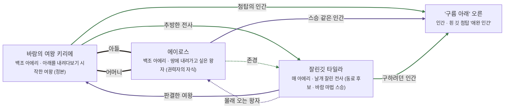

# 바람첨탑 관계도

> 자동 생성 문서 — `python3 tools/build_relations.py` 로 다시 만든다. 직접 고치지 말 것.

선: 굵은 검정 = 혈연, 보라 = 위계, 초록 = 호감·연모, 빨강 = 적대, 갈색 = 거래·빚, 점선 = 비밀

## 관계 목록

| 누가 | 관계 | 누구에게 | 공개 | 메모 |
|---|---|---|---|---|
| 바람의 여왕 키리에 | 혈연 · 아들 | 에이로스 | 공개 |  |
| 바람의 여왕 키리에 | 감정 · 추방한 전사 | 잘린깃 타일라 | 공개 | 처벌은 그녀가 승인 |
| 바람의 여왕 키리에 | 감정 · 첨탑의 인간 | '구름 아래' 오른 | 공개 |  |
| 에이로스 | 혈연 · 어머니 | 바람의 여왕 키리에 | 공개 |  |
| 에이로스 | 감정 · 존경 | 잘린깃 타일라 | 비밀 |  |
| 에이로스 | 위계 · 스승 같은 인간 | '구름 아래' 오른 | 공개 |  |
| 잘린깃 타일라 | 위계 · 판결한 여왕 | 바람의 여왕 키리에 | 공개 |  |
| 잘린깃 타일라 | 위계 · 몰래 오는 왕자 | 에이로스 | 비밀 |  |
| 잘린깃 타일라 | 감정 · 구하려던 인간 | '구름 아래' 오른 | 공개 |  |
