# 바람첨탑 관계도

> 자동 생성 문서 — `python3 tools/build_relations.py` 로 다시 만든다. 직접 고치지 말 것.

선: 굵은 검정 = 혈연, 보라 = 위계, 초록 = 호감·연모, 빨강 = 적대, 갈색 = 거래·빚, 점선 = 비밀

```mermaid
graph LR
  npc_kyrie["바람의 여왕 키리에<br/><small>백조 아에리 · 아래를 내려다보기 시작한 여왕 (정본)</small>"]
  npc_eiros["에이로스<br/><small>백조 아에리 · 땅에 내려가고 싶은 왕자 (권력자의 자식)</small>"]
  npc_tyla["잘린깃 타일라<br/><small>매 아에리 · 날개 잘린 전사 (동료 후보 · 바람 마법 스승)</small>"]
  npc_orn["'구름 아래' 오른<br/><small>인간 · 흰 깃 첨탑 '애완 인간'</small>"]
  npc_korak["코라크<br/><small>까마귀 아에리 · 역행하는 별을 세는 늙은 까마귀</small>"]
  npc_ws_kair["전쟁장 카이르 번개깃<br/><small>매 아에리 · 폭풍깃 전쟁장 (깃털 의회 가주)</small>"]
  npc_ws_rei["정찰장 레이 눈먼바람<br/><small>매 아에리 · 매눈 정찰장 (깃털 의회 가주)</small>"]
  npc_ws_celes["셀레스 긴목<br/><small>백조 아에리 · 올려다보는 자들 수장 (깃털 의회 가주 후보)</small>"]
  npc_ws_sirun["시룬 매눈<br/><small>매 아에리 · 땅 관찰자 수장 (키리에 직속)</small>"]
  npc_ws_launa["라우나 셋째깃<br/><small>까마귀 아에리 · 깃 서고지기 (까마귀 아에리 기록 학자)</small>"]
  npc_ws_ask["아스크 재깃<br/><small>까마귀 아에리 · 정찰 고리 대장 (까마귀 아에리)</small>"]
  npc_ws_sera["줄지기 세라 바람매듭<br/><small>매 아에리 · 줄지기 (줄내림 장터 관리, 줄지기 20의 장)</small>"]
  npc_ws_tur["매 사육사 투르<br/><small>매 아에리 · 일곱 손가락 매 사육사 (매 사육장 관리)</small>"]
  npc_ws_mir["미르 찢긴깃<br/><small>매 아에리 · 날지 못하나 뛰어내리지 않은 아에리 (땅손 마을 거주)</small>"]
  npc_ws_orea["오리아 폭풍넘은<br/><small>백조 아에리 · 하늘 장례 집전자</small>"]
  npc_ws_feris["페리스 흰날개<br/><small>백조 아에리 · 갇힌 백조 귀족 (줄내림 장터 계곡 도적의 철망 새장)</small>"]
  npc_ws_aela["아엘라 구름위<br/><small>백조 아에리 · 하늘만 보는 자들의 가주 (깃털 의회 둥지 가문)</small>"]
  npc_ws_marco["마르코<br/><small>인간(땅손) · 바람 정원 땅손 원로 (줄지기 아래, 인간 140의 어른)</small>"]
  npc_ws_anskar["안스가르<br/><small>인간(땅손 출신) · 줄내림 장터 두르강 상인의 짐꾼 (바람첨탑에서 살아서 계곡까지 떨어진 유일한 인간)</small>"]
  npc_ws_branka["브란카<br/><small>인간(땅손) · 폭풍깃 절벽 땅손 (글을 아는 인간)</small>"]
  npc_ws_ulla["울라<br/><small>인간(땅손) · 바람 정원 줄 땋는 이 (마르코의 제자)</small>"]
  npc_ws_ratz["라츠<br/><small>인간(떠돌이) · 계곡 도적 두목 (줄내림 장터)</small>"]
  npc_ws_anton["안톤<br/><small>인간(땅손) · 바닥 마을 대장간 땅손</small>"]
  npc_ws_torin["상인장 토린 쇳줄<br/><small>산 두르강 · 줄내림 장터 두르강 상인장 (상인 조합 회장)</small>"]
  npc_ws_erden["전령 에르덴 바람발굽<br/><small>바람발굽 · 하르칸 전령 (테무르 칸의 서신)</small>"]
  npc_kyrie ---|아들| npc_eiros
  npc_kyrie -->|추방한 전사| npc_tyla
  npc_kyrie -->|첨탑의 인간| npc_orn
  npc_eiros ---|어머니| npc_kyrie
  npc_eiros -.->|존경| npc_tyla
  npc_eiros -->|스승 같은 인간| npc_orn
  npc_tyla -->|판결한 여왕| npc_kyrie
  npc_tyla -.->|몰래 오는 왕자| npc_eiros
  npc_tyla -->|구하려던 인간| npc_orn
  npc_korak -->|기록을 비밀에 부친 여왕| npc_kyrie
  npc_korak -->|땅의 이야기꾼| npc_orn
  npc_korak -->|땅에 내려가고 싶은 왕자| npc_eiros
  npc_korak -->|잘린 깃| npc_tyla
  npc_ws_kair -.->|올려다보는 자들 수장| npc_ws_celes
  npc_ws_kair -->|왕자| npc_eiros
  npc_ws_kair -->|여왕| npc_kyrie
  npc_ws_kair -.->|글 아는 땅손| npc_ws_branka
  npc_ws_rei -->|정찰 고리 대장| npc_ws_ask
  npc_ws_rei -->|여왕| npc_kyrie
  npc_ws_rei -->|땅 관찰자| npc_ws_sirun
  npc_ws_celes -->|여왕| npc_kyrie
  npc_ws_celes -->|왕자| npc_eiros
  npc_ws_celes -.->|폭풍깃 가주| npc_ws_kair
  npc_ws_celes -->|하늘만 보는 가주| npc_ws_aela
  npc_ws_sirun -->|여왕| npc_kyrie
  npc_ws_sirun -->|정찰장| npc_ws_rei
  npc_ws_sirun -->|정찰 고리 대장| npc_ws_ask
  npc_ws_launa -->|선배 기록관| npc_korak
  npc_ws_launa -->|땅손| npc_orn
  npc_ws_launa -->|여왕| npc_kyrie
  npc_ws_ask -->|정찰장| npc_ws_rei
  npc_ws_ask -->|서고지기| npc_ws_launa
  npc_ws_sera -->|상인장| npc_ws_torin
  npc_ws_sera -->|떨어진 자| npc_ws_anskar
  npc_ws_sera -->|여왕| npc_kyrie
  npc_ws_sera -->|땅손 원로| npc_ws_marco
  npc_ws_tur -.->|땅손| npc_ws_ulla
  npc_ws_tur -.->|하르칸 전령| npc_ws_erden
  npc_ws_tur -->|왕자| npc_eiros
  npc_ws_mir -->|땅손 원로| npc_ws_marco
  npc_ws_mir -.->|줄 땋는 이| npc_ws_ulla
  npc_ws_mir -->|날개 잘린 전사| npc_tyla
  npc_ws_mir -.->|왕자| npc_eiros
  npc_ws_orea -.->|날개를 자른 전사| npc_tyla
  npc_ws_orea -->|여왕| npc_kyrie
  npc_ws_orea -->|왕자| npc_eiros
  npc_ws_orea -->|늙은 기록관| npc_korak
  npc_ws_feris -->|가둔 자| npc_ws_ratz
  npc_ws_feris -.->|곡식을 파는 상인| npc_ws_torin
  npc_ws_feris -.->|여왕| npc_kyrie
  npc_ws_feris -.->|왕자| npc_eiros
  npc_ws_aela -->|올려다보는 자들 수장| npc_ws_celes
  npc_ws_aela -->|여왕| npc_kyrie
  npc_ws_aela -->|줄지기| npc_ws_sera
  npc_ws_aela -.->|땅손 원로| npc_ws_marco
  npc_ws_marco -->|땅손 후배| npc_orn
  npc_ws_marco -->|줄 땋는 이| npc_ws_ulla
  npc_ws_marco -->|날개 없는 아에리| npc_ws_mir
  npc_ws_marco -->|줄지기| npc_ws_sera
  npc_ws_marco -.->|떨어진 자| npc_ws_anskar
  npc_ws_anskar -.->|스승| npc_ws_marco
  npc_ws_anskar -->|주인| npc_ws_torin
  npc_ws_anskar -->|줄지기| npc_ws_sera
  npc_ws_anskar -.->|땅손 후배| npc_orn
  npc_ws_branka -->|폭풍깃 전쟁장| npc_ws_kair
  npc_ws_branka -.->|땅손 원로| npc_ws_marco
  npc_ws_branka -.->|땅손| npc_orn
  npc_ws_branka -.->|왕자| npc_eiros
  npc_ws_ulla -->|스승| npc_ws_marco
  npc_ws_ulla -.->|사육사| npc_ws_tur
  npc_ws_ulla -.->|날개 없는 아에리| npc_ws_mir
  npc_ws_ulla -.->|떨어진 선배| npc_ws_anskar
  npc_ws_ratz -->|포로| npc_ws_feris
  npc_ws_ratz -.->|곡식 상인| npc_ws_torin
  npc_ws_ratz -->|하르칸 전령| npc_ws_erden
  npc_ws_ratz -->|줄지기| npc_ws_sera
  npc_ws_anton -.->|쇠 상인| npc_ws_torin
  npc_ws_anton -.->|줄 땋는 이| npc_ws_ulla
  npc_ws_anton -->|원로| npc_ws_marco
  npc_ws_torin -->|줄지기| npc_ws_sera
  npc_ws_torin -.->|곡식 상대| npc_ws_ratz
  npc_ws_torin -->|짐꾼| npc_ws_anskar
  npc_ws_torin -.->|대장장이| npc_ws_anton
  npc_ws_erden -->|줄지기| npc_ws_sera
  npc_ws_erden -.->|사육사| npc_ws_tur
  npc_ws_erden -.->|여왕| npc_kyrie
  linkStyle 0 stroke:#2a2521,stroke-width:3px
  linkStyle 1 stroke:#3f7a4a,stroke-width:2px
  linkStyle 2 stroke:#3f7a4a,stroke-width:2px
  linkStyle 3 stroke:#2a2521,stroke-width:3px
  linkStyle 4 stroke:#3f7a4a,stroke-width:2px
  linkStyle 5 stroke:#5b4a8a,stroke-width:2px
  linkStyle 6 stroke:#5b4a8a,stroke-width:2px
  linkStyle 7 stroke:#5b4a8a,stroke-width:2px
  linkStyle 8 stroke:#3f7a4a,stroke-width:2px
  linkStyle 9 stroke:#6b6b6b,stroke-width:1.5px,stroke-dasharray:4 3
  linkStyle 10 stroke:#3f7a4a,stroke-width:2px
  linkStyle 11 stroke:#5b4a8a,stroke-width:2px
  linkStyle 12 stroke:#3f7a4a,stroke-width:2px
  linkStyle 13 stroke:#3f7a4a,stroke-width:2px
  linkStyle 14 stroke:#5b4a8a,stroke-width:2px
  linkStyle 15 stroke:#5b4a8a,stroke-width:2px
  linkStyle 16 stroke:#a1342a,stroke-width:2px
  linkStyle 17 stroke:#3f7a4a,stroke-width:2px
  linkStyle 18 stroke:#5b4a8a,stroke-width:2px
  linkStyle 19 stroke:#3f7a4a,stroke-width:2px
  linkStyle 20 stroke:#5b4a8a,stroke-width:2px
  linkStyle 21 stroke:#5b4a8a,stroke-width:2px
  linkStyle 22 stroke:#3f7a4a,stroke-width:2px
  linkStyle 23 stroke:#3f7a4a,stroke-width:2px
  linkStyle 24 stroke:#5b4a8a,stroke-width:2px
  linkStyle 25 stroke:#3f7a4a,stroke-width:2px
  linkStyle 26 stroke:#3f7a4a,stroke-width:2px
  linkStyle 27 stroke:#3f7a4a,stroke-width:2px
  linkStyle 28 stroke:#3f7a4a,stroke-width:2px
  linkStyle 29 stroke:#5b4a8a,stroke-width:2px
  linkStyle 30 stroke:#3f7a4a,stroke-width:2px
  linkStyle 31 stroke:#3f7a4a,stroke-width:2px
  linkStyle 32 stroke:#a1342a,stroke-width:2px
  linkStyle 33 stroke:#3f7a4a,stroke-width:2px
  linkStyle 34 stroke:#5b4a8a,stroke-width:2px
  linkStyle 35 stroke:#3f7a4a,stroke-width:2px
  linkStyle 36 stroke:#3f7a4a,stroke-width:2px
  linkStyle 37 stroke:#3f7a4a,stroke-width:2px
  linkStyle 38 stroke:#5b4a8a,stroke-width:2px
  linkStyle 39 stroke:#3f7a4a,stroke-width:2px
  linkStyle 40 stroke:#3f7a4a,stroke-width:2px
  linkStyle 41 stroke:#3f7a4a,stroke-width:2px
  linkStyle 42 stroke:#5b4a8a,stroke-width:2px
  linkStyle 43 stroke:#3f7a4a,stroke-width:2px
  linkStyle 44 stroke:#5b4a8a,stroke-width:2px
  linkStyle 45 stroke:#5b4a8a,stroke-width:2px
  linkStyle 46 stroke:#3f7a4a,stroke-width:2px
  linkStyle 47 stroke:#a1342a,stroke-width:2px
  linkStyle 48 stroke:#a1342a,stroke-width:2px
  linkStyle 49 stroke:#5b4a8a,stroke-width:2px
  linkStyle 50 stroke:#5b4a8a,stroke-width:2px
  linkStyle 51 stroke:#3f7a4a,stroke-width:2px
  linkStyle 52 stroke:#5b4a8a,stroke-width:2px
  linkStyle 53 stroke:#3f7a4a,stroke-width:2px
  linkStyle 54 stroke:#a1342a,stroke-width:2px
  linkStyle 55 stroke:#3f7a4a,stroke-width:2px
  linkStyle 56 stroke:#3f7a4a,stroke-width:2px
  linkStyle 57 stroke:#3f7a4a,stroke-width:2px
  linkStyle 58 stroke:#3f7a4a,stroke-width:2px
  linkStyle 59 stroke:#3f7a4a,stroke-width:2px
  linkStyle 60 stroke:#5b4a8a,stroke-width:2px
  linkStyle 61 stroke:#5b4a8a,stroke-width:2px
  linkStyle 62 stroke:#3f7a4a,stroke-width:2px
  linkStyle 63 stroke:#3f7a4a,stroke-width:2px
  linkStyle 64 stroke:#a1342a,stroke-width:2px
  linkStyle 65 stroke:#3f7a4a,stroke-width:2px
  linkStyle 66 stroke:#3f7a4a,stroke-width:2px
  linkStyle 67 stroke:#5b4a8a,stroke-width:2px
  linkStyle 68 stroke:#5b4a8a,stroke-width:2px
  linkStyle 69 stroke:#3f7a4a,stroke-width:2px
  linkStyle 70 stroke:#3f7a4a,stroke-width:2px
  linkStyle 71 stroke:#3f7a4a,stroke-width:2px
  linkStyle 72 stroke:#a1342a,stroke-width:2px
  linkStyle 73 stroke:#3f7a4a,stroke-width:2px
  linkStyle 74 stroke:#3f7a4a,stroke-width:2px
  linkStyle 75 stroke:#a1342a,stroke-width:2px
  linkStyle 76 stroke:#3f7a4a,stroke-width:2px
  linkStyle 77 stroke:#3f7a4a,stroke-width:2px
  linkStyle 78 stroke:#3f7a4a,stroke-width:2px
  linkStyle 79 stroke:#3f7a4a,stroke-width:2px
  linkStyle 80 stroke:#3f7a4a,stroke-width:2px
  linkStyle 81 stroke:#3f7a4a,stroke-width:2px
  linkStyle 82 stroke:#3f7a4a,stroke-width:2px
  linkStyle 83 stroke:#3f7a4a,stroke-width:2px
  linkStyle 84 stroke:#3f7a4a,stroke-width:2px
  linkStyle 85 stroke:#5b4a8a,stroke-width:2px
```

## 관계 목록

| 누가 | 관계 | 누구에게 | 공개 | 메모 |
|---|---|---|---|---|
| 바람의 여왕 키리에 | 혈연 · 아들 | 에이로스 | 공개 |  |
| 바람의 여왕 키리에 | 감정 · 추방한 전사 | 잘린깃 타일라 | 공개 | 처벌은 그녀가 승인 |
| 바람의 여왕 키리에 | 감정 · 첨탑의 인간 | '구름 아래' 오른 | 공개 |  |
| 에이로스 | 혈연 · 어머니 | 바람의 여왕 키리에 | 공개 |  |
| 에이로스 | 감정 · 존경 | 잘린깃 타일라 | 비밀 |  |
| 에이로스 | 위계 · 스승 같은 인간 | '구름 아래' 오른 | 공개 |  |
| 잘린깃 타일라 | 위계 · 판결한 여왕 | 바람의 여왕 키리에 | 공개 |  |
| 잘린깃 타일라 | 위계 · 몰래 오는 왕자 | 에이로스 | 비밀 |  |
| 잘린깃 타일라 | 감정 · 구하려던 인간 | '구름 아래' 오른 | 공개 |  |
| 코라크 | 비밀 · 기록을 비밀에 부친 여왕 | 바람의 여왕 키리에 | 공개 |  |
| 코라크 | 감정 · 땅의 이야기꾼 | '구름 아래' 오른 | 공개 |  |
| 코라크 | 위계 · 땅에 내려가고 싶은 왕자 | 에이로스 | 공개 |  |
| 코라크 | 감정 · 잘린 깃 | 잘린깃 타일라 | 공개 |  |
| 전쟁장 카이르 번개깃 | 감정 · 올려다보는 자들 수장 | 셀레스 긴목 | 비밀 | 표를 놓고 같은 편이 된 상대 |
| 전쟁장 카이르 번개깃 | 위계 · 왕자 | 에이로스 | 공개 | 땅을 걷는 왕자를 못마땅해한다 |
| 전쟁장 카이르 번개깃 | 위계 · 여왕 | 바람의 여왕 키리에 | 공개 | 하강을 걱정하되 대놓고 반대하지 않는다 |
| 전쟁장 카이르 번개깃 | 적대 · 글 아는 땅손 | 브란카 | 비밀 | 절벽 인간 7 가운데 한 사람이 글을 안다는 것을 알면서 신경 쓰지 않는다 |
| 정찰장 레이 눈먼바람 | 감정 · 정찰 고리 대장 | 아스크 재깃 | 공개 | 같은 정찰의 까마귀 쪽 |
| 정찰장 레이 눈먼바람 | 위계 · 여왕 | 바람의 여왕 키리에 | 공개 | 땅 관찰자 명령의 한쪽을 맡는다 |
| 정찰장 레이 눈먼바람 | 감정 · 땅 관찰자 | 시룬 매눈 | 공개 | 시룬이 가져오는 새 선을 지도에 얹는다 |
| 셀레스 긴목 | 위계 · 여왕 | 바람의 여왕 키리에 | 공개 | 같은 높이의 일족이 하늘을 아래로 기울이는 것을 지켜본다 |
| 셀레스 긴목 | 위계 · 왕자 | 에이로스 | 공개 | 대표 자리를 두고 맞서는 상대 |
| 셀레스 긴목 | 감정 · 폭풍깃 가주 | 전쟁장 카이르 번개깃 | 비밀 | 표를 놓고 맺은 비밀 서약 |
| 셀레스 긴목 | 감정 · 하늘만 보는 가주 | 아엘라 구름위 | 공개 | 같은 입장 |
| 시룬 매눈 | 위계 · 여왕 | 바람의 여왕 키리에 | 공개 | 직속 명령자 — 이유를 묻지 않는다 |
| 시룬 매눈 | 감정 · 정찰장 | 정찰장 레이 눈먼바람 | 공개 | 새 선을 지도에 얹는다 |
| 시룬 매눈 | 감정 · 정찰 고리 대장 | 아스크 재깃 | 공개 | 같은 고리의 까마귀 |
| 라우나 셋째깃 | 감정 · 선배 기록관 | 코라크 | 공개 | 은퇴한 하늘 기록관 |
| 라우나 셋째깃 | 감정 · 땅손 | '구름 아래' 오른 | 공개 | 땅의 이야기를 말해 준 인간 |
| 라우나 셋째깃 | 위계 · 여왕 | 바람의 여왕 키리에 | 공개 | 서고를 후원하지만 가장 안쪽 매듭은 묻지 않는다 |
| 아스크 재깃 | 감정 · 정찰장 | 정찰장 레이 눈먼바람 | 공개 | 같은 정찰의 매 쪽 |
| 아스크 재깃 | 감정 · 서고지기 | 라우나 셋째깃 | 공개 | 서고에 정찰 매듭을 보낸다 |
| 줄지기 세라 바람매듭 | 적대 · 상인장 | 상인장 토린 쇳줄 | 공개 | 금속 고리 빚의 상대 |
| 줄지기 세라 바람매듭 | 감정 · 떨어진 자 | 안스가르 | 공개 | 한 번 떨어진 인간을 장터에서 지켜본다 |
| 줄지기 세라 바람매듭 | 위계 · 여왕 | 바람의 여왕 키리에 | 공개 | 줄 거둠 규정의 원천 |
| 줄지기 세라 바람매듭 | 감정 · 땅손 원로 | 마르코 | 공개 | 줄 위의 인간을 가장 책임지는 사람 |
| 매 사육사 투르 | 감정 · 땅손 | 울라 | 비밀 | 줄 한 타래를 받는 사람 |
| 매 사육사 투르 | 감정 · 하르칸 전령 | 전령 에르덴 바람발굽 | 비밀 | 전령 매의 다른 끝 |
| 매 사육사 투르 | 위계 · 왕자 | 에이로스 | 공개 | 땅 이야기를 매에게도 들려준 사람 |
| 미르 찢긴깃 | 감정 · 땅손 원로 | 마르코 | 공개 | 같은 식탁에서 먹는 사이 |
| 미르 찢긴깃 | 감정 · 줄 땋는 이 | 울라 | 비밀 | 활공 날개 틀을 같이 만든다 |
| 미르 찢긴깃 | 감정 · 날개 잘린 전사 | 잘린깃 타일라 | 공개 | 같은 날개 없는 자 |
| 미르 찢긴깃 | 위계 · 왕자 | 에이로스 | 비밀 | 땅 이야기에 열광하는 젊은 왕족 |
| 오리아 폭풍넘은 | 감정 · 날개를 자른 전사 | 잘린깃 타일라 | 비밀 | 날개를 맡긴 사형의 집행인이 아닌 집전자 |
| 오리아 폭풍넘은 | 위계 · 여왕 | 바람의 여왕 키리에 | 공개 | 처벌을 승인한 여왕 |
| 오리아 폭풍넘은 | 위계 · 왕자 | 에이로스 | 공개 | 타일라의 판결에 반대표를 던진 젊은이 |
| 오리아 폭풍넘은 | 감정 · 늙은 기록관 | 코라크 | 공개 | 같은 봉우리 근처에서 사는 노인 |
| 페리스 흰날개 | 적대 · 가둔 자 | 라츠 | 공개 | 몸값 때문에 가둔 사람 |
| 페리스 흰날개 | 적대 · 곡식을 파는 상인 | 상인장 토린 쇳줄 | 비밀 | 새장 앞에 곡식을 놓고 간 두르강 |
| 페리스 흰날개 | 위계 · 여왕 | 바람의 여왕 키리에 | 비밀 | 하늘에 소식이 닿기를 바라는 상대 |
| 페리스 흰날개 | 위계 · 왕자 | 에이로스 | 비밀 | 땅 이야기를 아는 왕족 — 그가 가장 먼저 와 줄 거라 짐작한다 |
| 아엘라 구름위 | 감정 · 올려다보는 자들 수장 | 셀레스 긴목 | 공개 | 같은 입장 |
| 아엘라 구름위 | 위계 · 여왕 | 바람의 여왕 키리에 | 공개 | 하강을 부끄러워한다 |
| 아엘라 구름위 | 감정 · 줄지기 | 줄지기 세라 바람매듭 | 공개 | 줄 거둠의 집행자로 쓰려는 상대 |
| 아엘라 구름위 | 적대 · 땅손 원로 | 마르코 | 비밀 | 그의 이름은 한 번도 입에 올리지 않았다 |
| 마르코 | 감정 · 땅손 후배 | '구름 아래' 오른 | 공개 | 아에리어를 배운 청년이자 노래를 듣고 놀란 사람 |
| 마르코 | 감정 · 줄 땋는 이 | 울라 | 공개 | 제자 |
| 마르코 | 감정 · 날개 없는 아에리 | 미르 찢긴깃 | 공개 | 같은 식탁의 이웃 |
| 마르코 | 감정 · 줄지기 | 줄지기 세라 바람매듭 | 공개 | 줄을 허락하고 거두는 상대 |
| 마르코 | 감정 · 떨어진 자 | 안스가르 | 비밀 | 줄 시험으로 떨어진 제자 |
| 안스가르 | 위계 · 스승 | 마르코 | 비밀 | 줄을 가르쳐 준 어른 |
| 안스가르 | 위계 · 주인 | 상인장 토린 쇳줄 | 공개 | 계약서에 서명한 상인 |
| 안스가르 | 감정 · 줄지기 | 줄지기 세라 바람매듭 | 공개 | 줄 거둠의 집행자 — 그가 한 번 떨어진 것을 안다 |
| 안스가르 | 감정 · 땅손 후배 | '구름 아래' 오른 | 비밀 | 같은 땅손이지만 만난 적은 없다 |
| 브란카 | 적대 · 폭풍깃 전쟁장 | 전쟁장 카이르 번개깃 | 공개 | 그가 모르는 돌판의 존재 |
| 브란카 | 감정 · 땅손 원로 | 마르코 | 비밀 | 바람 정원의 지도자 — 이름만 안다 |
| 브란카 | 감정 · 땅손 | '구름 아래' 오른 | 비밀 | 흰 깃 첨탑의 인간 — 소식을 들은 적이 있다 |
| 브란카 | 위계 · 왕자 | 에이로스 | 비밀 | 땅 이야기에 열광한다는 왕자 |
| 울라 | 위계 · 스승 | 마르코 | 공개 | 줄을 가르쳐 준 어른 |
| 울라 | 감정 · 사육사 | 매 사육사 투르 | 비밀 | 줄 한 타래를 주는 아에리 |
| 울라 | 감정 · 날개 없는 아에리 | 미르 찢긴깃 | 비밀 | 활공 날개 틀을 같이 만든다 |
| 울라 | 감정 · 떨어진 선배 | 안스가르 | 비밀 | 떨어진 높이를 들어 보았다 |
| 라츠 | 적대 · 포로 | 페리스 흰날개 | 공개 | 그가 가둔 백조 귀족 |
| 라츠 | 감정 · 곡식 상인 | 상인장 토린 쇳줄 | 비밀 | 곡식을 파는 상인장 |
| 라츠 | 감정 · 하르칸 전령 | 전령 에르덴 바람발굽 | 공개 | 전령을 구하려 눈여겨본 상대 |
| 라츠 | 적대 · 줄지기 | 줄지기 세라 바람매듭 | 공개 | 장터 줄을 지키는 아에리 |
| 안톤 | 감정 · 쇠 상인 | 상인장 토린 쇳줄 | 비밀 | 몰래 쇠를 파는 두르강 |
| 안톤 | 감정 · 줄 땋는 이 | 울라 | 비밀 | 줄 고리를 주문하는 소녀 |
| 안톤 | 감정 · 원로 | 마르코 | 공개 | 줄 고리 열네 벌을 맡긴 어른 |
| 상인장 토린 쇳줄 | 감정 · 줄지기 | 줄지기 세라 바람매듭 | 공개 | 금속 고리 빚을 준 상대 |
| 상인장 토린 쇳줄 | 감정 · 곡식 상대 | 라츠 | 비밀 | 새장을 알면서 장부를 지움 |
| 상인장 토린 쇳줄 | 감정 · 짐꾼 | 안스가르 | 공개 | 구조한 뒤 계약서에 서명하게 한 사람 |
| 상인장 토린 쇳줄 | 감정 · 대장장이 | 안톤 | 비밀 | 가벼운 쇠를 몰래 파는 상대 |
| 전령 에르덴 바람발굽 | 감정 · 줄지기 | 줄지기 세라 바람매듭 | 공개 | 서신을 받아야 하는 아에리 |
| 전령 에르덴 바람발굽 | 감정 · 사육사 | 매 사육사 투르 | 비밀 | 전령 매의 다른 끝 |
| 전령 에르덴 바람발굽 | 위계 · 여왕 | 바람의 여왕 키리에 | 비밀 | 서신의 받는 이 |
