# 세렌 해안 관계도

> 자동 생성 문서 — `python3 tools/build_relations.py` 로 다시 만든다. 직접 고치지 말 것.

선: 굵은 검정 = 혈연, 보라 = 위계, 초록 = 호감·연모, 빨강 = 적대, 갈색 = 거래·빚, 점선 = 비밀

```mermaid
graph LR
  npc_beatrix["의장 베아트릭스 몬달리<br/><small>왕관 나가 · 양쪽에 돈을 빌려준 자 (정본)</small>"]
  npc_ophelia["오필리아 몬달리<br/><small>왕관 나가 · 시민권 초안을 쓴 상속녀 (권력자의 자식)</small>"]
  npc_severo["세베로 칼레스<br/><small>왕관 나가(하위 가문) · 노예 중개인 (악역 · 상인)</small>"]
  npc_miko["'스물두 해' 미코<br/><small>인간(문화 집단: 해안 인간) · 빚을 세는 선원 (동료·연인 후보)</small>"]
  npc_lupo["'빈 장부' 루포<br/><small>라미아 · 빚을 지우는 라미아 (물 진명 스승)</small>"]
  npc_sahar["'줄무늬' 사하르<br/><small>수인족(타이란) · 의회 경호대장</small>"]
  npc_jan["얀<br/><small>인간 · 빚진 골목 목수</small>"]
  npc_reni["'여우눈' 레니<br/><small>수인족(바울피) · 굽은 닻 선술집 정보상</small>"]
  npc_deep_naga["심해의 사절<br/><small>나가(심해 나가) · 세렌 만 바닥 '고인 피의 문'</small>"]
  npc_morana["모라나 일곱허물<br/><small>심해 나가 · 올라가 본 유일한 심해 나가 — 피의 말을 들은 자</small>"]
  npc_sr_sirenna["대사제 시렌나 우델<br/><small>왕관 나가 · 제7의석 (깊은 바다 사원·제사), 도둑맞은 알의 보관자</small>"]
  npc_sr_dona["조합장 도나 벨렌<br/><small>왕관 나가 · 먹물비늘 조합 조합장 (인장 아홉)</small>"]
  npc_sr_sebo["세보 리크<br/><small>왕관 나가 · 회색여울 담당 현장 중개인</small>"]
  npc_sr_oscar["'반쪽 혀' 오스카<br/><small>인간(계약민) · 계약 감정사, 세렌 등잔</small>"]
  npc_sr_oral["시르 오랄<br/><small>왕관 나가(오랄 가) · 푸른 장부관 등록소 실무</small>"]
  npc_sr_catarina["카타리나 셈손<br/><small>인간(자유민) · 셈 모임 대표 (빚을 갚은 1,900 중 하나)</small>"]
  npc_sr_run["경매관 룬 카이르<br/><small>왕관 나가 · 계약 시장 경매관</small>"]
  npc_sr_olaf["등대지기 올라프<br/><small>인간(계약민) · 눈먼 등대지기 (밀수 신호)</small>"]
  npc_sr_dominic["도미닉 베스페린<br/><small>용인(방계) · 갈림목 항만관</small>"]
  npc_sr_sepa["채석감 세파 레이<br/><small>왕관 나가 · 산호 채석장 채석감</small>"]
  npc_sr_norval["노르발 세스<br/><small>왕관 나가 · 제12의석 (외교·통역·맹약회의 대표)</small>"]
  npc_sr_zolak["졸라크 니에바<br/><small>왕관 나가 · 제9의석 (금고·장부·첩보)</small>"]
  npc_sr_skre["스크레<br/><small>하역 크릭 · 세렌 하역꾼 우두머리</small>"]
  npc_sr_lis["리스<br/><small>인간(계약민) · 오필 상가 필경소 서기 (별의 집 둘째 열쇠)</small>"]
  npc_sr_mardi["마르디 카예<br/><small>왕관 나가 · 제8의석 (향신료·약재)</small>"]
  npc_sr_pescar["페스카르 오스윈<br/><small>왕관 나가 · 제10의석 (어업·조선)</small>"]
  npc_sr_lucio["루치오 카셀론<br/><small>왕관 나가 · 제2의석 (해운·노예 운송)</small>"]
  npc_beatrix ---|딸·후계자| npc_ophelia
  npc_beatrix -->|하위 가문 중개인| npc_severo
  npc_beatrix -->|거슬리는 변호인| npc_lupo
  npc_beatrix -->|경호대장| npc_sahar
  npc_ophelia ---|어머니| npc_beatrix
  npc_ophelia -.->|초안 공저자| npc_lupo
  npc_ophelia -->|등록소에서 만난 계약민| npc_miko
  npc_ophelia -->|혐오| npc_severo
  npc_severo -->|상위 가문| npc_beatrix
  npc_severo -->|경멸하는 상속녀| npc_ophelia
  npc_miko -->|고용주| npc_severo
  npc_miko -->|등록소의 나가| npc_ophelia
  npc_miko -.->|빚 상담| npc_lupo
  npc_lupo -.->|공저자| npc_ophelia
  npc_lupo -->|의장| npc_beatrix
  npc_lupo -.->|의뢰인| npc_miko
  npc_lupo -->|법정의 적| npc_severo
  npc_morana -.->|아래와 위 사이의 사절| npc_deep_naga
  npc_morana -.->|피 한 모금을 청한 장사치| npc_beatrix
  npc_morana -.->|물의 이름을 아는 라미아| npc_lupo
  npc_morana -.->|값을 골라 오는 손| npc_severo
  npc_sr_sirenna -.->|바다 밑의 대화 상대| npc_deep_naga
  npc_sr_sirenna -->|의장| npc_beatrix
  npc_sr_sirenna -.->|올라가 본 심해 나가| npc_morana
  npc_sr_sirenna -->|의석 이웃| npc_sr_lucio
  npc_sr_sirenna -->|중립 의석 이웃| npc_sr_norval
  npc_sr_dona -->|상위 가문| npc_beatrix
  npc_sr_dona -->|계약 감정사| npc_sr_oscar
  npc_sr_dona -->|현장 중개인| npc_sr_sebo
  npc_sr_dona -.->|장부의 주인| npc_sr_zolak
  npc_sr_dona -->|하위 가문 중개인| npc_severo
  npc_sr_sebo -->|상위 중개인| npc_severo
  npc_sr_sebo -->|조합장| npc_sr_dona
  npc_sr_sebo -->|등록소 서기| npc_sr_oral
  npc_sr_oscar -.->|증명을 나눈 변호인| npc_lupo
  npc_sr_oscar -.->|셈 모임 대표| npc_sr_catarina
  npc_sr_oscar -->|조합장| npc_sr_dona
  npc_sr_oscar -->|등록소| npc_sr_oral
  npc_sr_oral -->|현장 중개인| npc_sr_sebo
  npc_sr_oral -.->|서류 열람자| npc_lupo
  npc_sr_oral -->|감정사| npc_sr_oscar
  npc_sr_oral -->|상관| npc_severo
  npc_sr_catarina -.->|숫자의 동지| npc_sr_oscar
  npc_sr_catarina -->|무료 변호인| npc_lupo
  npc_sr_catarina -.->|변장하고 오는 상속녀| npc_ophelia
  npc_sr_catarina -->|하역꾼| npc_miko
  npc_sr_run -->|위탁자| npc_severo
  npc_sr_run -->|중개인| npc_sr_sebo
  npc_sr_run -->|등록소| npc_sr_oral
  npc_sr_olaf -->|이웃| npc_sr_catarina
  npc_sr_olaf -->|하역꾼| npc_miko
  npc_sr_dominic -.->|카셀론| npc_sr_lucio
  npc_sr_sepa -->|조합장| npc_sr_dona
  npc_sr_sepa -->|경호대장| npc_sahar
  npc_sr_norval -.->|시민권 초안 발의자| npc_ophelia
  npc_sr_norval -->|의장| npc_beatrix
  npc_sr_norval -->|중립 의석 이웃| npc_sr_sirenna
  npc_sr_norval -.->|증명을 가진 감정사| npc_sr_oscar
  npc_sr_zolak -->|의장| npc_beatrix
  npc_sr_zolak -.->|조합장| npc_sr_dona
  npc_sr_zolak -->|약재 상가| npc_sr_mardi
  npc_sr_skre -->|하역 동료| npc_miko
  npc_sr_skre -->|소금 나루 상관| npc_severo
  npc_sr_skre -->|해운 상가| npc_sr_lucio
  npc_sr_lis -->|이웃| npc_sr_catarina
  npc_sr_mardi -->|장부의 주인| npc_sr_zolak
  npc_sr_pescar -.->|셈 모임| npc_sr_catarina
  npc_sr_pescar -->|해운 이웃| npc_sr_lucio
  npc_sr_pescar -->|선원| npc_miko
  npc_sr_lucio -->|위탁 상인| npc_severo
  npc_sr_lucio -.->|갈림목 항만관| npc_sr_dominic
  npc_sr_lucio -->|의장| npc_beatrix
  linkStyle 0 stroke:#2a2521,stroke-width:3px
  linkStyle 1 stroke:#9a6a1c,stroke-width:2px
  linkStyle 2 stroke:#a1342a,stroke-width:2px
  linkStyle 3 stroke:#3f7a4a,stroke-width:2px
  linkStyle 4 stroke:#2a2521,stroke-width:3px
  linkStyle 5 stroke:#3f7a4a,stroke-width:2px
  linkStyle 6 stroke:#9a6a1c,stroke-width:2px
  linkStyle 7 stroke:#a1342a,stroke-width:2px
  linkStyle 8 stroke:#3f7a4a,stroke-width:2px
  linkStyle 9 stroke:#a1342a,stroke-width:2px
  linkStyle 10 stroke:#5b4a8a,stroke-width:2px
  linkStyle 11 stroke:#3f7a4a,stroke-width:2px
  linkStyle 12 stroke:#9a6a1c,stroke-width:2px
  linkStyle 13 stroke:#3f7a4a,stroke-width:2px
  linkStyle 14 stroke:#a1342a,stroke-width:2px
  linkStyle 15 stroke:#3f7a4a,stroke-width:2px
  linkStyle 16 stroke:#a1342a,stroke-width:2px
  linkStyle 17 stroke:#3f7a4a,stroke-width:2px
  linkStyle 18 stroke:#a1342a,stroke-width:2px
  linkStyle 19 stroke:#3f7a4a,stroke-width:2px
  linkStyle 20 stroke:#a1342a,stroke-width:2px
  linkStyle 21 stroke:#3f7a4a,stroke-width:2px
  linkStyle 22 stroke:#3f7a4a,stroke-width:2px
  linkStyle 23 stroke:#3f7a4a,stroke-width:2px
  linkStyle 24 stroke:#a1342a,stroke-width:2px
  linkStyle 25 stroke:#3f7a4a,stroke-width:2px
  linkStyle 26 stroke:#3f7a4a,stroke-width:2px
  linkStyle 27 stroke:#9a6a1c,stroke-width:2px
  linkStyle 28 stroke:#9a6a1c,stroke-width:2px
  linkStyle 29 stroke:#5b4a8a,stroke-width:2px
  linkStyle 30 stroke:#9a6a1c,stroke-width:2px
  linkStyle 31 stroke:#9a6a1c,stroke-width:2px
  linkStyle 32 stroke:#3f7a4a,stroke-width:2px
  linkStyle 33 stroke:#3f7a4a,stroke-width:2px
  linkStyle 34 stroke:#3f7a4a,stroke-width:2px
  linkStyle 35 stroke:#3f7a4a,stroke-width:2px
  linkStyle 36 stroke:#a1342a,stroke-width:2px
  linkStyle 37 stroke:#3f7a4a,stroke-width:2px
  linkStyle 38 stroke:#9a6a1c,stroke-width:2px
  linkStyle 39 stroke:#3f7a4a,stroke-width:2px
  linkStyle 40 stroke:#3f7a4a,stroke-width:2px
  linkStyle 41 stroke:#5b4a8a,stroke-width:2px
  linkStyle 42 stroke:#3f7a4a,stroke-width:2px
  linkStyle 43 stroke:#3f7a4a,stroke-width:2px
  linkStyle 44 stroke:#3f7a4a,stroke-width:2px
  linkStyle 45 stroke:#3f7a4a,stroke-width:2px
  linkStyle 46 stroke:#3f7a4a,stroke-width:2px
  linkStyle 47 stroke:#9a6a1c,stroke-width:2px
  linkStyle 48 stroke:#3f7a4a,stroke-width:2px
  linkStyle 49 stroke:#3f7a4a,stroke-width:2px
  linkStyle 50 stroke:#3f7a4a,stroke-width:2px
  linkStyle 51 stroke:#3f7a4a,stroke-width:2px
  linkStyle 52 stroke:#3f7a4a,stroke-width:2px
  linkStyle 53 stroke:#3f7a4a,stroke-width:2px
  linkStyle 54 stroke:#3f7a4a,stroke-width:2px
  linkStyle 55 stroke:#3f7a4a,stroke-width:2px
  linkStyle 56 stroke:#3f7a4a,stroke-width:2px
  linkStyle 57 stroke:#3f7a4a,stroke-width:2px
  linkStyle 58 stroke:#3f7a4a,stroke-width:2px
  linkStyle 59 stroke:#a1342a,stroke-width:2px
  linkStyle 60 stroke:#3f7a4a,stroke-width:2px
  linkStyle 61 stroke:#3f7a4a,stroke-width:2px
  linkStyle 62 stroke:#5b4a8a,stroke-width:2px
  linkStyle 63 stroke:#3f7a4a,stroke-width:2px
  linkStyle 64 stroke:#3f7a4a,stroke-width:2px
  linkStyle 65 stroke:#5b4a8a,stroke-width:2px
  linkStyle 66 stroke:#3f7a4a,stroke-width:2px
  linkStyle 67 stroke:#3f7a4a,stroke-width:2px
  linkStyle 68 stroke:#3f7a4a,stroke-width:2px
  linkStyle 69 stroke:#3f7a4a,stroke-width:2px
  linkStyle 70 stroke:#3f7a4a,stroke-width:2px
  linkStyle 71 stroke:#3f7a4a,stroke-width:2px
```

## 관계 목록

| 누가 | 관계 | 누구에게 | 공개 | 메모 |
|---|---|---|---|---|
| 의장 베아트릭스 몬달리 | 혈연 · 딸·후계자 | 오필리아 몬달리 | 공개 |  |
| 의장 베아트릭스 몬달리 | 거래 · 하위 가문 중개인 | 세베로 칼레스 | 공개 |  |
| 의장 베아트릭스 몬달리 | 적대 · 거슬리는 변호인 | '빈 장부' 루포 | 공개 |  |
| 의장 베아트릭스 몬달리 | 감정 · 경호대장 | '줄무늬' 사하르 | 공개 |  |
| 오필리아 몬달리 | 혈연 · 어머니 | 의장 베아트릭스 몬달리 | 공개 |  |
| 오필리아 몬달리 | 감정 · 초안 공저자 | '빈 장부' 루포 | 비밀 |  |
| 오필리아 몬달리 | 거래 · 등록소에서 만난 계약민 | '스물두 해' 미코 | 공개 |  |
| 오필리아 몬달리 | 적대 · 혐오 | 세베로 칼레스 | 공개 |  |
| 세베로 칼레스 | 감정 · 상위 가문 | 의장 베아트릭스 몬달리 | 공개 |  |
| 세베로 칼레스 | 적대 · 경멸하는 상속녀 | 오필리아 몬달리 | 공개 |  |
| '스물두 해' 미코 | 위계 · 고용주 | 세베로 칼레스 | 공개 |  |
| '스물두 해' 미코 | 감정 · 등록소의 나가 | 오필리아 몬달리 | 공개 |  |
| '스물두 해' 미코 | 거래 · 빚 상담 | '빈 장부' 루포 | 비밀 |  |
| '빈 장부' 루포 | 감정 · 공저자 | 오필리아 몬달리 | 비밀 |  |
| '빈 장부' 루포 | 적대 · 의장 | 의장 베아트릭스 몬달리 | 공개 |  |
| '빈 장부' 루포 | 감정 · 의뢰인 | '스물두 해' 미코 | 비밀 |  |
| '빈 장부' 루포 | 적대 · 법정의 적 | 세베로 칼레스 | 공개 |  |
| 모라나 일곱허물 | 감정 · 아래와 위 사이의 사절 | 심해의 사절 | 비밀 |  |
| 모라나 일곱허물 | 적대 · 피 한 모금을 청한 장사치 | 의장 베아트릭스 몬달리 | 비밀 |  |
| 모라나 일곱허물 | 감정 · 물의 이름을 아는 라미아 | '빈 장부' 루포 | 비밀 | 시험관 |
| 모라나 일곱허물 | 적대 · 값을 골라 오는 손 | 세베로 칼레스 | 비밀 |  |
| 대사제 시렌나 우델 | 감정 · 바다 밑의 대화 상대 | 심해의 사절 | 비밀 | 그믐 밤에만 말한다 |
| 대사제 시렌나 우델 | 감정 · 의장 | 의장 베아트릭스 몬달리 | 공개 | 같은 아홉 비늘의 오랜 의석 |
| 대사제 시렌나 우델 | 감정 · 올라가 본 심해 나가 | 모라나 일곱허물 | 비밀 | 알이 들어온 날을 본 증인 |
| 대사제 시렌나 우델 | 적대 · 의석 이웃 | 루치오 카셀론 | 공개 | 해운 상가 |
| 대사제 시렌나 우델 | 감정 · 중립 의석 이웃 | 노르발 세스 | 공개 | 맹약회의 표의 같은 쪽 |
| 조합장 도나 벨렌 | 감정 · 상위 가문 | 의장 베아트릭스 몬달리 | 공개 | 조합의 자금줄 |
| 조합장 도나 벨렌 | 거래 · 계약 감정사 | '반쪽 혀' 오스카 | 공개 | 숫자에 기대면서도 한 쪽을 숨긴다 |
| 조합장 도나 벨렌 | 거래 · 현장 중개인 | 세보 리크 | 공개 |  |
| 조합장 도나 벨렌 | 위계 · 장부의 주인 | 졸라크 니에바 | 비밀 | 일곱째 인장의 열쇠 |
| 조합장 도나 벨렌 | 거래 · 하위 가문 중개인 | 세베로 칼레스 | 공개 | 자기 인장 아래의 사람 |
| 세보 리크 | 거래 · 상위 중개인 | 세베로 칼레스 | 공개 | 서류를 속이는 상대 |
| 세보 리크 | 감정 · 조합장 | 조합장 도나 벨렌 | 공개 | 인장 자리를 바라는 윗사람 |
| 세보 리크 | 감정 · 등록소 서기 | 시르 오랄 | 공개 | 서류를 같이 올리는 사이 |
| '반쪽 혀' 오스카 | 감정 · 증명을 나눈 변호인 | '빈 장부' 루포 | 비밀 | 일곱째 쪽까지의 대가 |
| '반쪽 혀' 오스카 | 감정 · 셈 모임 대표 | 카타리나 셈손 | 비밀 | 숫자의 동지 |
| '반쪽 혀' 오스카 | 적대 · 조합장 | 조합장 도나 벨렌 | 공개 | 공식의 설계자 |
| '반쪽 혀' 오스카 | 감정 · 등록소 | 시르 오랄 | 공개 | 같은 숫자를 다르게 읽는 사이 |
| 시르 오랄 | 거래 · 현장 중개인 | 세보 리크 | 공개 | 서류를 같이 올리는 사이 |
| 시르 오랄 | 감정 · 서류 열람자 | '빈 장부' 루포 | 비밀 | 번진 인장을 찾는 변호인 |
| 시르 오랄 | 감정 · 감정사 | '반쪽 혀' 오스카 | 공개 |  |
| 시르 오랄 | 위계 · 상관 | 세베로 칼레스 | 공개 | 서류를 가져다주는 사람 |
| 카타리나 셈손 | 감정 · 숫자의 동지 | '반쪽 혀' 오스카 | 비밀 | 세렌 등잔 |
| 카타리나 셈손 | 감정 · 무료 변호인 | '빈 장부' 루포 | 공개 | 같은 숫자를 센다 |
| 카타리나 셈손 | 감정 · 변장하고 오는 상속녀 | 오필리아 몬달리 | 비밀 | 믿을 수 없는 나가 |
| 카타리나 셈손 | 감정 · 하역꾼 | '스물두 해' 미코 | 공개 | 1,140의 증인 |
| 경매관 룬 카이르 | 감정 · 위탁자 | 세베로 칼레스 | 공개 | 경매 순서를 맞춘다 |
| 경매관 룬 카이르 | 거래 · 중개인 | 세보 리크 | 공개 | 로트 서류를 받는다 |
| 경매관 룬 카이르 | 감정 · 등록소 | 시르 오랄 | 공개 |  |
| 등대지기 올라프 | 감정 · 이웃 | 카타리나 셈손 | 공개 |  |
| 등대지기 올라프 | 감정 · 하역꾼 | '스물두 해' 미코 | 공개 | 등대 계단 아래 술벗 |
| 도미닉 베스페린 | 감정 · 카셀론 | 루치오 카셀론 | 비밀 | 사망 보고의 대가를 받는다 |
| 채석감 세파 레이 | 감정 · 조합장 | 조합장 도나 벨렌 | 공개 | 계약서의 윗사람 |
| 채석감 세파 레이 | 감정 · 경호대장 | '줄무늬' 사하르 | 공개 | 채석장 순찰 협력 |
| 노르발 세스 | 감정 · 시민권 초안 발의자 | 오필리아 몬달리 | 비밀 | 초안의 첫 독자 |
| 노르발 세스 | 감정 · 의장 | 의장 베아트릭스 몬달리 | 공개 | 맹약회의 표의 조정자 |
| 노르발 세스 | 감정 · 중립 의석 이웃 | 대사제 시렌나 우델 | 공개 | 같은 표의 쪽 |
| 노르발 세스 | 감정 · 증명을 가진 감정사 | '반쪽 혀' 오스카 | 비밀 | 이름만 안다 |
| 졸라크 니에바 | 감정 · 의장 | 의장 베아트릭스 몬달리 | 공개 | 서로의 장부를 의식한다 |
| 졸라크 니에바 | 적대 · 조합장 | 조합장 도나 벨렌 | 비밀 | 일곱째 인장의 열쇠 |
| 졸라크 니에바 | 감정 · 약재 상가 | 마르디 카예 | 공개 | 늪 약초 값 카드를 쥐는 상대 |
| 스크레 | 감정 · 하역 동료 | '스물두 해' 미코 | 공개 | 숫자의 증인과 장부의 주인 |
| 스크레 | 위계 · 소금 나루 상관 | 세베로 칼레스 | 공개 | 밤 하선의 지시자 |
| 스크레 | 감정 · 해운 상가 | 루치오 카셀론 | 공개 | 노예선 주인 |
| 리스 | 감정 · 이웃 | 카타리나 셈손 | 공개 | 숙소의 이자 이야기를 같이 듣는 사이 |
| 마르디 카예 | 위계 · 장부의 주인 | 졸라크 니에바 | 공개 | 늪 숫자를 사 가는 이웃 |
| 페스카르 오스윈 | 감정 · 셈 모임 | 카타리나 셈손 | 비밀 | 같은 숫자의 다른 쪽 |
| 페스카르 오스윈 | 감정 · 해운 이웃 | 루치오 카셀론 | 공개 | 배를 사 가는 상가 |
| 페스카르 오스윈 | 감정 · 선원 | '스물두 해' 미코 | 공개 | 갑판 수리 때 일하는 계약민 |
| 루치오 카셀론 | 감정 · 위탁 상인 | 세베로 칼레스 | 공개 | 소금 바늘의 화물 주인 |
| 루치오 카셀론 | 감정 · 갈림목 항만관 | 도미닉 베스페린 | 비밀 | 사망 보고의 대가를 주는 상대 |
| 루치오 카셀론 | 감정 · 의장 | 의장 베아트릭스 몬달리 | 공개 | 같은 아홉 비늘 |
