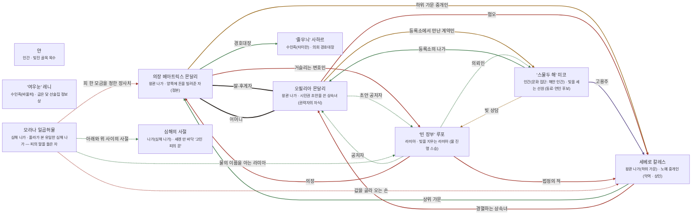

# 세렌 해안 관계도

> 자동 생성 문서 — `python3 tools/build_relations.py` 로 다시 만든다. 직접 고치지 말 것.

선: 굵은 검정 = 혈연, 보라 = 위계, 초록 = 호감·연모, 빨강 = 적대, 갈색 = 거래·빚, 점선 = 비밀

## 관계 목록

| 누가 | 관계 | 누구에게 | 공개 | 메모 |
|---|---|---|---|---|
| 의장 베아트릭스 몬달리 | 혈연 · 딸·후계자 | 오필리아 몬달리 | 공개 |  |
| 의장 베아트릭스 몬달리 | 거래 · 하위 가문 중개인 | 세베로 칼레스 | 공개 |  |
| 의장 베아트릭스 몬달리 | 적대 · 거슬리는 변호인 | '빈 장부' 루포 | 공개 |  |
| 의장 베아트릭스 몬달리 | 감정 · 경호대장 | '줄무늬' 사하르 | 공개 |  |
| 오필리아 몬달리 | 혈연 · 어머니 | 의장 베아트릭스 몬달리 | 공개 |  |
| 오필리아 몬달리 | 감정 · 초안 공저자 | '빈 장부' 루포 | 비밀 |  |
| 오필리아 몬달리 | 거래 · 등록소에서 만난 계약민 | '스물두 해' 미코 | 공개 |  |
| 오필리아 몬달리 | 적대 · 혐오 | 세베로 칼레스 | 공개 |  |
| 세베로 칼레스 | 감정 · 상위 가문 | 의장 베아트릭스 몬달리 | 공개 |  |
| 세베로 칼레스 | 적대 · 경멸하는 상속녀 | 오필리아 몬달리 | 공개 |  |
| '스물두 해' 미코 | 위계 · 고용주 | 세베로 칼레스 | 공개 |  |
| '스물두 해' 미코 | 감정 · 등록소의 나가 | 오필리아 몬달리 | 공개 |  |
| '스물두 해' 미코 | 거래 · 빚 상담 | '빈 장부' 루포 | 비밀 |  |
| '빈 장부' 루포 | 감정 · 공저자 | 오필리아 몬달리 | 비밀 |  |
| '빈 장부' 루포 | 적대 · 의장 | 의장 베아트릭스 몬달리 | 공개 |  |
| '빈 장부' 루포 | 감정 · 의뢰인 | '스물두 해' 미코 | 비밀 |  |
| '빈 장부' 루포 | 적대 · 법정의 적 | 세베로 칼레스 | 공개 |  |
| 모라나 일곱허물 | 감정 · 아래와 위 사이의 사절 | 심해의 사절 | 비밀 |  |
| 모라나 일곱허물 | 적대 · 피 한 모금을 청한 장사치 | 의장 베아트릭스 몬달리 | 비밀 |  |
| 모라나 일곱허물 | 감정 · 물의 이름을 아는 라미아 | '빈 장부' 루포 | 비밀 | 시험관 |
| 모라나 일곱허물 | 적대 · 값을 골라 오는 손 | 세베로 칼레스 | 비밀 |  |
