# 아르카스 탑섬 관계도

> 자동 생성 문서 — `python3 tools/build_relations.py` 로 다시 만든다. 직접 고치지 말 것.

선: 굵은 검정 = 혈연, 보라 = 위계, 초록 = 호감·연모, 빨강 = 적대, 갈색 = 거래·빚, 점선 = 비밀

```mermaid
graph LR
  npc_irene_bold["탑주 이레네 볼드<br/><small>용인(비늘혈) · 시험법을 만드는 학자 (정본 · 악역)</small>"]
  npc_ottilie["오틸리 철서판<br/><small>잿불 두르강 · 맹세의 틈으로 가르치는 학자 (읽고쓰기·학식·공학 스승)</small>"]
  npc_halla["'세 번 고발된' 할라<br/><small>인간 · 30년째 기준체 (잘못 고발된 징후자 · 진명어 읽기 스승)</small>"]
  npc_milo["'잉크' 마일로<br/><small>인간 · 먼지 서고 서기 노예</small>"]
  npc_corvina["코르비나<br/><small>아에리(까마귀 아에리) · 탑 기록 학자</small>"]
  npc_ar_opil["원로 오필 시라<br/><small>왕관 나가 · 일곱 의자 기록학파 수장 (세렌 제5의석 겸임)</small>"]
  npc_ar_mathis["마티스 그레이브<br/><small>용인(비늘혈) · 사냥꾼 부서 '귀' 부서장</small>"]
  npc_ar_karba["카르바<br/><small>용인 · 잿빛 눈 대장 (잔향 사냥꾼 12)</small>"]
  npc_ar_hester["'먹물 할멈' 헤스터<br/><small>인간(서기 노예) · 서기실장, 이름 없는 자들 아르카스 등잔</small>"]
  npc_ar_ishi["부두장 이쉬<br/><small>라미아 · 아르카스 부두장</small>"]
  npc_ar_brick["간수 브릭<br/><small>용인 · 번호 회랑 간수</small>"]
  npc_ar_old0213["0213호의 노인<br/><small>인간(탑 태생) · 최고령 피험자 (대조군, 99세)</small>"]
  npc_ar_borte["원로 보르테 바람실<br/><small>일곱샘 · 균열학파 원로 (정착병을 무릅쓰고 머무는 추방 학자)</small>"]
  npc_ar_tik["원로 틱 셈쟁이<br/><small>굴 크릭 · 기록학파 원로 (크릭 최초의 원로)</small>"]
  npc_ar_orvel["금고지기 오르벨<br/><small>용인 · 금고지기 (첫째 칼 '첫 침묵')</small>"]
  npc_ar_rail["시간 측정관 라일<br/><small>용인(학자) · 시간 측정관 (둘째 칼 '정오' 소지자)</small>"]
  npc_ar_nere["네레<br/><small>인간(열병 징후자) · 피험자 (열네 살, 셋째 시험 후보)</small>"]
  npc_ar_fisher["어부 '조개'<br/><small>인간(전 서기 노예) · 등대 바위 어부 (이름 없는 아이들의 끝지기)</small>"]
  npc_ar_marga["급식 노파 마르가<br/><small>인간(잡역) · 피험자 식당 급식 노예</small>"]
  npc_ar_yona["서기 요나<br/><small>인간(서기 노예) · 구멍 글 보관 서기</small>"]
  npc_ar_dessa["약사 데사<br/><small>인간(약사 노예) · 회랑 약사 (자극 후유증 담당)</small>"]
  npc_irene_bold -->|기준체| npc_halla
  npc_irene_bold -->|수석 학자| npc_ottilie
  npc_ottilie -->|탑주| npc_irene_bold
  npc_ottilie -.->|오랜 벗| npc_halla
  npc_ottilie -.->|서기 제자| npc_milo
  npc_halla -.->|벗| npc_ottilie
  npc_halla -->|간수| npc_irene_bold
  npc_halla -.->|이웃 서기| npc_milo
  npc_ar_opil -->|탑주| npc_irene_bold
  npc_ar_opil -->|같은 기록학파 정학자| npc_ottilie
  npc_ar_opil -->|크릭 원로| npc_ar_tik
  npc_ar_mathis -->|탑주| npc_irene_bold
  npc_ar_mathis -->|잿빛 눈 대장| npc_ar_karba
  npc_ar_mathis -->|하늘 기록 학자| npc_corvina
  npc_ar_karba -->|부서장| npc_ar_mathis
  npc_ar_karba -->|탑주| npc_irene_bold
  npc_ar_hester -.->|서기 제자| npc_milo
  npc_ar_hester -.->|두르강 학자| npc_ottilie
  npc_ar_hester -.->|구멍 글 서기| npc_ar_yona
  npc_ar_hester -->|탑주| npc_irene_bold
  npc_ar_ishi -->|탑 경비의 사냥꾼| npc_ar_karba
  npc_ar_ishi -.->|읽기를 가르치는 학자| npc_ottilie
  npc_ar_brick -.->|노인| npc_ar_old0213
  npc_ar_brick -.->|13층 독방의 노인 같은 피험자| npc_halla
  npc_ar_brick -.->|열병의 소녀| npc_ar_nere
  npc_ar_old0213 -.->|간수| npc_ar_brick
  npc_ar_old0213 -.->|벽 너머 이웃| npc_halla
  npc_ar_old0213 -.->|읽기 소리를 들려준 학자| npc_ottilie
  npc_ar_old0213 -->|열병의 소녀| npc_ar_nere
  npc_ar_borte -->|탑주| npc_irene_bold
  npc_ar_borte -->|시간 측정관| npc_ar_rail
  npc_ar_borte -->|하늘 기록 학자| npc_corvina
  npc_ar_tik -->|기록학파 선배| npc_ar_opil
  npc_ar_tik -->|서기실장| npc_ar_hester
  npc_ar_orvel -->|탑주| npc_irene_bold
  npc_ar_orvel -->|둘째 칼 소지자| npc_ar_rail
  npc_ar_rail -->|탑주| npc_irene_bold
  npc_ar_rail -->|같은 방 사람| npc_ar_mathis
  npc_ar_rail -->|균열학파 선배| npc_ar_borte
  npc_ar_rail -->|첫째 칼의 금고지기| npc_ar_orvel
  npc_ar_nere -->|벽 너머 노인| npc_ar_old0213
  npc_ar_nere -.->|서기 이웃| npc_milo
  npc_ar_nere -.->|간수| npc_ar_brick
  npc_ar_nere -.->|탑주| npc_irene_bold
  npc_ar_fisher -.->|서기 시절 필사 동료| npc_halla
  npc_ar_fisher -.->|서기 후배| npc_milo
  npc_ar_fisher -->|부두장| npc_ar_ishi
  npc_ar_marga -.->|서기| npc_milo
  npc_ar_marga -.->|열병의 소녀| npc_ar_nere
  npc_ar_marga -->|간수| npc_ar_brick
  npc_ar_yona -.->|서기실장| npc_ar_hester
  npc_ar_yona -.->|서기 동료| npc_milo
  npc_ar_yona -.->|읽기 스승| npc_ottilie
  npc_ar_dessa -.->|13층 독방| npc_halla
  npc_ar_dessa -.->|두르강 학자| npc_ottilie
  npc_ar_dessa -.->|열병의 소녀| npc_ar_nere
  linkStyle 0 stroke:#3f7a4a,stroke-width:2px
  linkStyle 1 stroke:#3f7a4a,stroke-width:2px
  linkStyle 2 stroke:#a1342a,stroke-width:2px
  linkStyle 3 stroke:#3f7a4a,stroke-width:2px
  linkStyle 4 stroke:#5b4a8a,stroke-width:2px
  linkStyle 5 stroke:#3f7a4a,stroke-width:2px
  linkStyle 6 stroke:#a1342a,stroke-width:2px
  linkStyle 7 stroke:#3f7a4a,stroke-width:2px
  linkStyle 8 stroke:#3f7a4a,stroke-width:2px
  linkStyle 9 stroke:#a1342a,stroke-width:2px
  linkStyle 10 stroke:#3f7a4a,stroke-width:2px
  linkStyle 11 stroke:#3f7a4a,stroke-width:2px
  linkStyle 12 stroke:#3f7a4a,stroke-width:2px
  linkStyle 13 stroke:#3f7a4a,stroke-width:2px
  linkStyle 14 stroke:#3f7a4a,stroke-width:2px
  linkStyle 15 stroke:#3f7a4a,stroke-width:2px
  linkStyle 16 stroke:#5b4a8a,stroke-width:2px
  linkStyle 17 stroke:#3f7a4a,stroke-width:2px
  linkStyle 18 stroke:#3f7a4a,stroke-width:2px
  linkStyle 19 stroke:#a1342a,stroke-width:2px
  linkStyle 20 stroke:#a1342a,stroke-width:2px
  linkStyle 21 stroke:#3f7a4a,stroke-width:2px
  linkStyle 22 stroke:#3f7a4a,stroke-width:2px
  linkStyle 23 stroke:#3f7a4a,stroke-width:2px
  linkStyle 24 stroke:#3f7a4a,stroke-width:2px
  linkStyle 25 stroke:#3f7a4a,stroke-width:2px
  linkStyle 26 stroke:#3f7a4a,stroke-width:2px
  linkStyle 27 stroke:#3f7a4a,stroke-width:2px
  linkStyle 28 stroke:#3f7a4a,stroke-width:2px
  linkStyle 29 stroke:#3f7a4a,stroke-width:2px
  linkStyle 30 stroke:#3f7a4a,stroke-width:2px
  linkStyle 31 stroke:#3f7a4a,stroke-width:2px
  linkStyle 32 stroke:#3f7a4a,stroke-width:2px
  linkStyle 33 stroke:#3f7a4a,stroke-width:2px
  linkStyle 34 stroke:#3f7a4a,stroke-width:2px
  linkStyle 35 stroke:#3f7a4a,stroke-width:2px
  linkStyle 36 stroke:#3f7a4a,stroke-width:2px
  linkStyle 37 stroke:#3f7a4a,stroke-width:2px
  linkStyle 38 stroke:#3f7a4a,stroke-width:2px
  linkStyle 39 stroke:#3f7a4a,stroke-width:2px
  linkStyle 40 stroke:#3f7a4a,stroke-width:2px
  linkStyle 41 stroke:#3f7a4a,stroke-width:2px
  linkStyle 42 stroke:#3f7a4a,stroke-width:2px
  linkStyle 43 stroke:#a1342a,stroke-width:2px
  linkStyle 44 stroke:#3f7a4a,stroke-width:2px
  linkStyle 45 stroke:#3f7a4a,stroke-width:2px
  linkStyle 46 stroke:#3f7a4a,stroke-width:2px
  linkStyle 47 stroke:#3f7a4a,stroke-width:2px
  linkStyle 48 stroke:#3f7a4a,stroke-width:2px
  linkStyle 49 stroke:#3f7a4a,stroke-width:2px
  linkStyle 50 stroke:#3f7a4a,stroke-width:2px
  linkStyle 51 stroke:#3f7a4a,stroke-width:2px
  linkStyle 52 stroke:#5b4a8a,stroke-width:2px
  linkStyle 53 stroke:#3f7a4a,stroke-width:2px
  linkStyle 54 stroke:#3f7a4a,stroke-width:2px
  linkStyle 55 stroke:#3f7a4a,stroke-width:2px
```

## 관계 목록

| 누가 | 관계 | 누구에게 | 공개 | 메모 |
|---|---|---|---|---|
| 탑주 이레네 볼드 | 감정 · 기준체 | '세 번 고발된' 할라 | 공개 |  |
| 탑주 이레네 볼드 | 감정 · 수석 학자 | 오틸리 철서판 | 공개 |  |
| 오틸리 철서판 | 적대 · 탑주 | 탑주 이레네 볼드 | 공개 |  |
| 오틸리 철서판 | 감정 · 오랜 벗 | '세 번 고발된' 할라 | 비밀 |  |
| 오틸리 철서판 | 위계 · 서기 제자 | '잉크' 마일로 | 비밀 |  |
| '세 번 고발된' 할라 | 감정 · 벗 | 오틸리 철서판 | 비밀 |  |
| '세 번 고발된' 할라 | 적대 · 간수 | 탑주 이레네 볼드 | 공개 |  |
| '세 번 고발된' 할라 | 감정 · 이웃 서기 | '잉크' 마일로 | 비밀 |  |
| 원로 오필 시라 | 감정 · 탑주 | 탑주 이레네 볼드 | 공개 | 순서를 알고 눈감는 사이 |
| 원로 오필 시라 | 적대 · 같은 기록학파 정학자 | 오틸리 철서판 | 공개 | 맹세의 틈을 아는 동료 |
| 원로 오필 시라 | 감정 · 크릭 원로 | 원로 틱 셈쟁이 | 공개 | 숫자를 아는 후배 |
| 마티스 그레이브 | 감정 · 탑주 | 탑주 이레네 볼드 | 공개 |  |
| 마티스 그레이브 | 감정 · 잿빛 눈 대장 | 카르바 | 공개 | 사냥과 지도의 선 |
| 마티스 그레이브 | 감정 · 하늘 기록 학자 | 코르비나 | 공개 | 같은 방에서 일한다 |
| 카르바 | 감정 · 부서장 | 마티스 그레이브 | 공개 |  |
| 카르바 | 감정 · 탑주 | 탑주 이레네 볼드 | 공개 | 명령을 서면으로 받는다 |
| '먹물 할멈' 헤스터 | 위계 · 서기 제자 | '잉크' 마일로 | 비밀 | 명단 열넷의 필기사 |
| '먹물 할멈' 헤스터 | 감정 · 두르강 학자 | 오틸리 철서판 | 비밀 | 서고의 읽기를 지키는 동료 |
| '먹물 할멈' 헤스터 | 감정 · 구멍 글 서기 | 서기 요나 | 비밀 | 판자 틈의 서른한 권 |
| '먹물 할멈' 헤스터 | 적대 · 탑주 | 탑주 이레네 볼드 | 공개 | 서기실을 맡긴 사람 |
| 부두장 이쉬 | 적대 · 탑 경비의 사냥꾼 | 카르바 | 공개 |  |
| 부두장 이쉬 | 감정 · 읽기를 가르치는 학자 | 오틸리 철서판 | 비밀 | 책 상자를 몰래 부두로 받는다 |
| 간수 브릭 | 감정 · 노인 | 0213호의 노인 | 비밀 | 매일 빵 한 조각을 더 넣는 사람 |
| 간수 브릭 | 감정 · 13층 독방의 노인 같은 피험자 | '세 번 고발된' 할라 | 비밀 |  |
| 간수 브릭 | 감정 · 열병의 소녀 | 네레 | 비밀 | 숯 한 조각을 몰래 건넨다 |
| 0213호의 노인 | 감정 · 간수 | 간수 브릭 | 비밀 | 빵 한 조각 |
| 0213호의 노인 | 감정 · 벽 너머 이웃 | '세 번 고발된' 할라 | 비밀 | 같은 층이 아닌 층의 목소리 |
| 0213호의 노인 | 감정 · 읽기 소리를 들려준 학자 | 오틸리 철서판 | 비밀 | 문 앞에서 읽고 지나간다 |
| 0213호의 노인 | 감정 · 열병의 소녀 | 네레 | 공개 | 방 앞에서 이야기를 해 준다 |
| 원로 보르테 바람실 | 감정 · 탑주 | 탑주 이레네 볼드 | 공개 | 추방 학자를 받아 준 사람 |
| 원로 보르테 바람실 | 감정 · 시간 측정관 | 시간 측정관 라일 | 공개 | 같은 균열학파 |
| 원로 보르테 바람실 | 감정 · 하늘 기록 학자 | 코르비나 | 공개 | 별을 같이 센다 |
| 원로 틱 셈쟁이 | 감정 · 기록학파 선배 | 원로 오필 시라 | 공개 | 같은 학파의 나가 |
| 원로 틱 셈쟁이 | 감정 · 서기실장 | '먹물 할멈' 헤스터 | 공개 | 서기 숫자 교육의 동료 |
| 금고지기 오르벨 | 감정 · 탑주 | 탑주 이레네 볼드 | 공개 | 금고의 윗사람 |
| 금고지기 오르벨 | 감정 · 둘째 칼 소지자 | 시간 측정관 라일 | 공개 | 같은 칼의 자매 |
| 시간 측정관 라일 | 감정 · 탑주 | 탑주 이레네 볼드 | 공개 | 시간 학파의 상관 |
| 시간 측정관 라일 | 감정 · 같은 방 사람 | 마티스 그레이브 | 공개 | 지도의 바늘과 보고서의 사이 |
| 시간 측정관 라일 | 감정 · 균열학파 선배 | 원로 보르테 바람실 | 공개 |  |
| 시간 측정관 라일 | 감정 · 첫째 칼의 금고지기 | 금고지기 오르벨 | 공개 |  |
| 네레 | 감정 · 벽 너머 노인 | 0213호의 노인 | 공개 | 이야기를 해 주는 사람 |
| 네레 | 감정 · 서기 이웃 | '잉크' 마일로 | 비밀 | 그림을 보고 가는 사람 |
| 네레 | 감정 · 간수 | 간수 브릭 | 비밀 | 숯을 몰래 주는 사람 |
| 네레 | 적대 · 탑주 | 탑주 이레네 볼드 | 비밀 | 질문을 묻는 눈 |
| 어부 '조개' | 감정 · 서기 시절 필사 동료 | '세 번 고발된' 할라 | 비밀 | 편지 한 줄을 건네는 사람 |
| 어부 '조개' | 감정 · 서기 후배 | '잉크' 마일로 | 비밀 | 소식을 전하는 어부 |
| 어부 '조개' | 감정 · 부두장 | 부두장 이쉬 | 공개 | 물고기와 소식을 바꾼다 |
| 급식 노파 마르가 | 감정 · 서기 | '잉크' 마일로 | 비밀 | 명단과 그릇의 일치 |
| 급식 노파 마르가 | 감정 · 열병의 소녀 | 네레 | 비밀 | 한 그릇 더 |
| 급식 노파 마르가 | 감정 · 간수 | 간수 브릭 | 공개 | 노인의 빵을 같이 챙긴다 |
| 서기 요나 | 감정 · 서기실장 | '먹물 할멈' 헤스터 | 비밀 | 문법을 가르친 사람 |
| 서기 요나 | 감정 · 서기 동료 | '잉크' 마일로 | 비밀 | 명단을 구멍으로 옮긴다 |
| 서기 요나 | 위계 · 읽기 스승 | 오틸리 철서판 | 비밀 |  |
| 약사 데사 | 감정 · 13층 독방 | '세 번 고발된' 할라 | 비밀 | 약 대신 책을 한 권 전해 준다 |
| 약사 데사 | 감정 · 두르강 학자 | 오틸리 철서판 | 비밀 | 약초 부탁 |
| 약사 데사 | 감정 · 열병의 소녀 | 네레 | 비밀 | 열 내리는 약을 몰래 더 준다 |
