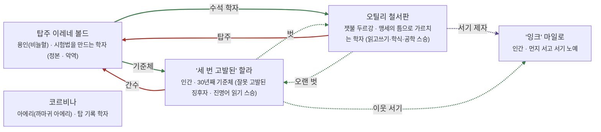

# 아르카스 탑섬 관계도

> 자동 생성 문서 — `python3 tools/build_relations.py` 로 다시 만든다. 직접 고치지 말 것.

선: 굵은 검정 = 혈연, 보라 = 위계, 초록 = 호감·연모, 빨강 = 적대, 갈색 = 거래·빚, 점선 = 비밀

## 관계 목록

| 누가 | 관계 | 누구에게 | 공개 | 메모 |
|---|---|---|---|---|
| 탑주 이레네 볼드 | 감정 · 기준체 | '세 번 고발된' 할라 | 공개 |  |
| 탑주 이레네 볼드 | 감정 · 수석 학자 | 오틸리 철서판 | 공개 |  |
| 오틸리 철서판 | 적대 · 탑주 | 탑주 이레네 볼드 | 공개 |  |
| 오틸리 철서판 | 감정 · 오랜 벗 | '세 번 고발된' 할라 | 비밀 |  |
| 오틸리 철서판 | 위계 · 서기 제자 | '잉크' 마일로 | 비밀 |  |
| '세 번 고발된' 할라 | 감정 · 벗 | 오틸리 철서판 | 비밀 |  |
| '세 번 고발된' 할라 | 적대 · 간수 | 탑주 이레네 볼드 | 공개 |  |
| '세 번 고발된' 할라 | 감정 · 이웃 서기 | '잉크' 마일로 | 비밀 |  |
