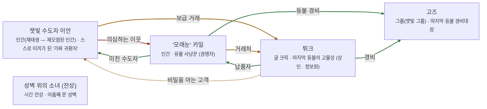

# 재의 황무지 관계도

> 자동 생성 문서 — `python3 tools/build_relations.py` 로 다시 만든다. 직접 고치지 말 것.

선: 굵은 검정 = 혈연, 보라 = 위계, 초록 = 호감·연모, 빨강 = 적대, 갈색 = 거래·빚, 점선 = 비밀

## 관계 목록

| 누가 | 관계 | 누구에게 | 공개 | 메모 |
|---|---|---|---|---|
| 잿빛 수도자 이안 | 적대 · 의심하는 이웃 | '모래눈' 카일 | 공개 |  |
| 잿빛 수도자 이안 | 거래 · 보급 거래 | 튀크 | 공개 |  |
| '모래눈' 카일 | 거래 · 거래처 | 튀크 | 공개 |  |
| '모래눈' 카일 | 감정 · 미친 수도자 | 잿빛 수도자 이안 | 공개 |  |
| '모래눈' 카일 | 감정 · 등불 경비 | 고즈 | 공개 |  |
| 튀크 | 감정 · 납품자 | '모래눈' 카일 | 공개 |  |
| 튀크 | 거래 · 비밀을 아는 고객 | 잿빛 수도자 이안 | 비밀 |  |
| 튀크 | 감정 · 경비 | 고즈 | 공개 |  |
