# 재의 황무지 관계도

> 자동 생성 문서 — `python3 tools/build_relations.py` 로 다시 만든다. 직접 고치지 말 것.

선: 굵은 검정 = 혈연, 보라 = 위계, 초록 = 호감·연모, 빨강 = 적대, 갈색 = 거래·빚, 점선 = 비밀

```mermaid
graph LR
  npc_ian_ash["잿빛 수도자 이안<br/><small>인간(재태생 — 재오염된 인간) · 스스로 미끼가 된 '가짜 귀환자'</small>"]
  npc_kyle_sandeye["'모래눈' 카일<br/><small>인간 · 유물 사냥꾼 (경쟁자)</small>"]
  npc_tuk["튀크<br/><small>굴 크릭 · 마지막 등불의 고물상 (상인 · 정보원)</small>"]
  npc_goz["고즈<br/><small>그롬(잿빛 그롬) · 마지막 등불 경비대장</small>"]
  npc_echo_wall_girl["성벽 위의 소녀 (잔상)<br/><small>시간 잔상 · 아홉째 문 성벽</small>"]
  npc_gromak["그로마크 검댕<br/><small>진룡(검댕 혈통) · 대붕괴 전날을 사는 용 — 오지 않는 사절을 기다린다</small>"]
  npc_aw_halgrim["등불지기 할그림 반돌<br/><small>돌피(추방) · 마지막 등불 등불지기 (깨진 맹세, 왼팔·왼쪽 얼굴이 돌)</small>"]
  npc_aw_mog["수석 길잡이 모그<br/><small>인간(탈주 사냥꾼) · 수석 길잡이 (황무지 23번을 살아 나온 유일한 인간)</small>"]
  npc_aw_des["'유리눈' 데스<br/><small>몰락 기사 · 허가 사냥꾼 (시간 잔상을 보는 의안)</small>"]
  npc_aw_chirk["치륵<br/><small>재굴 크릭 · 재굴 길잡이 (잔상을 냄새로 맡는다)</small>"]
  npc_aw_serena["관측장 세레나 펠<br/><small>용인(학자) · 잿빛 탑 재눈 초소 관측장</small>"]
  npc_aw_hael["재의 목소리 하엘<br/><small>인간(잔상 노출) · 회색 순례자 재의 목소리 (30년째 늙지 않는다)</small>"]
  npc_aw_gret["'두 손톱' 그렛<br/><small>추방 그롬 · 재먹이 — 성소 수호</small>"]
  npc_aw_silene["실레네<br/><small>몰락 용인 · 재먹이 — 잿불석 담당 (전 베르미온 가문 하녀장)</small>"]
  npc_aw_bes["화덕지기 베스<br/><small>인간(탈주 노예) · 재 성소 화덕지기 (아이들을 먹이는 노파)</small>"]
  npc_aw_receiver["받아들임지기 오렐<br/><small>몰락 용인(하인) · 받아들임지기 (새로 온 이에게 재를 올린다)</small>"]
  npc_aw_dagan["다간<br/><small>인간(탈주 사냥꾼) · 모래눈 패의 패원 (잿빛 눈 열둘의 하나)</small>"]
  npc_aw_merita["메리타<br/><small>인간(탈주 사냥꾼) · 주춧돌의 등잔 (이름 없는 자들 재의 황무지 등잔)</small>"]
  npc_aw_til["끝지기 틸<br/><small>인간(탈주 사냥꾼) · 멈춘 광장의 끝지기</small>"]
  npc_aw_ott["물지기 오트<br/><small>인간(탈주 노예) · 물 저장고 물지기</small>"]
  npc_aw_kora["여관 주인 코라<br/><small>인간(탈주 노예) · 판잣집 여관 주인</small>"]
  npc_aw_jena["제나<br/><small>인간(두 번째 등불 생존자) · 두 번째 등불의 유일한 생존자 (열두 살)</small>"]
  npc_aw_uma["'한쪽 귀' 우마<br/><small>그롬 낙오자 · 그롬 낙오자 30의 우두머리</small>"]
  npc_ian_ash -->|의심하는 이웃| npc_kyle_sandeye
  npc_ian_ash -->|보급 거래| npc_tuk
  npc_kyle_sandeye -->|거래처| npc_tuk
  npc_kyle_sandeye -->|미친 수도자| npc_ian_ash
  npc_kyle_sandeye -->|등불 경비| npc_goz
  npc_tuk -->|납품자| npc_kyle_sandeye
  npc_tuk -.->|비밀을 아는 고객| npc_ian_ash
  npc_tuk -->|경비| npc_goz
  npc_gromak -.->|성벽 위에서 손 흔드는 아이| npc_echo_wall_girl
  npc_gromak -.->|둥지 아래를 지나는 인간| npc_kyle_sandeye
  npc_aw_halgrim -.->|맹세를 들은 길잡이| npc_aw_mog
  npc_aw_halgrim -->|경비대장| npc_goz
  npc_aw_halgrim -->|고물상| npc_tuk
  npc_aw_mog -.->|등불지기| npc_aw_halgrim
  npc_aw_mog -->|재굴 길잡이| npc_aw_chirk
  npc_aw_mog -->|경비대장| npc_goz
  npc_aw_mog -->|경쟁 사냥꾼| npc_kyle_sandeye
  npc_aw_des -->|생존 소녀| npc_aw_jena
  npc_aw_des -->|재눈 초소 관측장| npc_aw_serena
  npc_aw_chirk -->|수석 길잡이| npc_aw_mog
  npc_aw_chirk -->|고물상 크릭| npc_tuk
  npc_aw_chirk -->|소녀| npc_aw_jena
  npc_aw_serena -->|순례자| npc_aw_hael
  npc_aw_serena -->|유리눈| npc_aw_des
  npc_aw_hael -->|수호 재먹이| npc_aw_gret
  npc_aw_hael -->|잿불석 재먹이| npc_aw_silene
  npc_aw_hael -->|화덕지기| npc_aw_bes
  npc_aw_hael -->|가짜 귀환자| npc_ian_ash
  npc_aw_hael -->|탑 관측장| npc_aw_serena
  npc_aw_gret -->|재의 목소리| npc_aw_hael
  npc_aw_gret -->|화덕지기| npc_aw_bes
  npc_aw_gret -->|같은 추방 그롬| npc_goz
  npc_aw_silene -->|재의 목소리| npc_aw_hael
  npc_aw_bes -->|재의 목소리| npc_aw_hael
  npc_aw_bes -->|수호 재먹이| npc_aw_gret
  npc_aw_receiver -->|재의 목소리| npc_aw_hael
  npc_aw_receiver -->|같은 몰락 용인| npc_aw_silene
  npc_aw_receiver -->|재눈 초소의 용인| npc_aw_serena
  npc_aw_dagan -->|패 두목| npc_kyle_sandeye
  npc_aw_dagan -->|고물상| npc_tuk
  npc_aw_merita -.->|미끼| npc_ian_ash
  npc_aw_merita -.->|광장의 끝지기| npc_aw_til
  npc_aw_til -.->|주춧돌의 등잔| npc_aw_merita
  npc_aw_til -.->|성벽 위 소녀| npc_echo_wall_girl
  npc_aw_til -->|길잡이| npc_aw_mog
  npc_aw_ott -.->|등불지기| npc_aw_halgrim
  npc_aw_ott -->|고물상| npc_tuk
  npc_aw_kora -.->|숙박한 밀정| npc_aw_dagan
  npc_aw_kora -->|소녀| npc_aw_jena
  npc_aw_kora -.->|수호 재먹이| npc_aw_gret
  npc_aw_jena -->|유리눈| npc_aw_des
  npc_aw_jena -->|여관 주인| npc_aw_kora
  npc_aw_jena -->|길잡이 크릭| npc_aw_chirk
  npc_aw_uma -->|경비대장| npc_goz
  npc_aw_uma -->|등불지기| npc_aw_halgrim
  linkStyle 0 stroke:#a1342a,stroke-width:2px
  linkStyle 1 stroke:#9a6a1c,stroke-width:2px
  linkStyle 2 stroke:#9a6a1c,stroke-width:2px
  linkStyle 3 stroke:#3f7a4a,stroke-width:2px
  linkStyle 4 stroke:#3f7a4a,stroke-width:2px
  linkStyle 5 stroke:#3f7a4a,stroke-width:2px
  linkStyle 6 stroke:#9a6a1c,stroke-width:2px
  linkStyle 7 stroke:#3f7a4a,stroke-width:2px
  linkStyle 8 stroke:#3f7a4a,stroke-width:2px
  linkStyle 9 stroke:#3f7a4a,stroke-width:2px
  linkStyle 10 stroke:#3f7a4a,stroke-width:2px
  linkStyle 11 stroke:#3f7a4a,stroke-width:2px
  linkStyle 12 stroke:#3f7a4a,stroke-width:2px
  linkStyle 13 stroke:#3f7a4a,stroke-width:2px
  linkStyle 14 stroke:#3f7a4a,stroke-width:2px
  linkStyle 15 stroke:#3f7a4a,stroke-width:2px
  linkStyle 16 stroke:#a1342a,stroke-width:2px
  linkStyle 17 stroke:#3f7a4a,stroke-width:2px
  linkStyle 18 stroke:#3f7a4a,stroke-width:2px
  linkStyle 19 stroke:#3f7a4a,stroke-width:2px
  linkStyle 20 stroke:#3f7a4a,stroke-width:2px
  linkStyle 21 stroke:#3f7a4a,stroke-width:2px
  linkStyle 22 stroke:#a1342a,stroke-width:2px
  linkStyle 23 stroke:#3f7a4a,stroke-width:2px
  linkStyle 24 stroke:#3f7a4a,stroke-width:2px
  linkStyle 25 stroke:#3f7a4a,stroke-width:2px
  linkStyle 26 stroke:#3f7a4a,stroke-width:2px
  linkStyle 27 stroke:#a1342a,stroke-width:2px
  linkStyle 28 stroke:#a1342a,stroke-width:2px
  linkStyle 29 stroke:#3f7a4a,stroke-width:2px
  linkStyle 30 stroke:#3f7a4a,stroke-width:2px
  linkStyle 31 stroke:#3f7a4a,stroke-width:2px
  linkStyle 32 stroke:#3f7a4a,stroke-width:2px
  linkStyle 33 stroke:#3f7a4a,stroke-width:2px
  linkStyle 34 stroke:#3f7a4a,stroke-width:2px
  linkStyle 35 stroke:#3f7a4a,stroke-width:2px
  linkStyle 36 stroke:#3f7a4a,stroke-width:2px
  linkStyle 37 stroke:#a1342a,stroke-width:2px
  linkStyle 38 stroke:#3f7a4a,stroke-width:2px
  linkStyle 39 stroke:#3f7a4a,stroke-width:2px
  linkStyle 40 stroke:#3f7a4a,stroke-width:2px
  linkStyle 41 stroke:#3f7a4a,stroke-width:2px
  linkStyle 42 stroke:#3f7a4a,stroke-width:2px
  linkStyle 43 stroke:#3f7a4a,stroke-width:2px
  linkStyle 44 stroke:#3f7a4a,stroke-width:2px
  linkStyle 45 stroke:#3f7a4a,stroke-width:2px
  linkStyle 46 stroke:#3f7a4a,stroke-width:2px
  linkStyle 47 stroke:#2f6f86,stroke-width:1.5px
  linkStyle 48 stroke:#3f7a4a,stroke-width:2px
  linkStyle 49 stroke:#3f7a4a,stroke-width:2px
  linkStyle 50 stroke:#3f7a4a,stroke-width:2px
  linkStyle 51 stroke:#5b4a8a,stroke-width:2px
  linkStyle 52 stroke:#3f7a4a,stroke-width:2px
  linkStyle 53 stroke:#3f7a4a,stroke-width:2px
  linkStyle 54 stroke:#3f7a4a,stroke-width:2px
```

## 관계 목록

| 누가 | 관계 | 누구에게 | 공개 | 메모 |
|---|---|---|---|---|
| 잿빛 수도자 이안 | 적대 · 의심하는 이웃 | '모래눈' 카일 | 공개 |  |
| 잿빛 수도자 이안 | 거래 · 보급 거래 | 튀크 | 공개 |  |
| '모래눈' 카일 | 거래 · 거래처 | 튀크 | 공개 |  |
| '모래눈' 카일 | 감정 · 미친 수도자 | 잿빛 수도자 이안 | 공개 |  |
| '모래눈' 카일 | 감정 · 등불 경비 | 고즈 | 공개 |  |
| 튀크 | 감정 · 납품자 | '모래눈' 카일 | 공개 |  |
| 튀크 | 거래 · 비밀을 아는 고객 | 잿빛 수도자 이안 | 비밀 |  |
| 튀크 | 감정 · 경비 | 고즈 | 공개 |  |
| 그로마크 검댕 | 감정 · 성벽 위에서 손 흔드는 아이 | 성벽 위의 소녀 (잔상) | 비밀 | 매일 해 질 녘 그쪽을 본다 |
| 그로마크 검댕 | 감정 · 둥지 아래를 지나는 인간 | '모래눈' 카일 | 비밀 |  |
| 등불지기 할그림 반돌 | 감정 · 맹세를 들은 길잡이 | 수석 길잡이 모그 | 비밀 | 깊은 문 아래 이야기의 단 한 청자 |
| 등불지기 할그림 반돌 | 감정 · 경비대장 | 고즈 | 공개 | 방벽을 지키는 반쪽 그롬 |
| 등불지기 할그림 반돌 | 감정 · 고물상 | 튀크 | 공개 | 유물 값의 눈 |
| 수석 길잡이 모그 | 감정 · 등불지기 | 등불지기 할그림 반돌 | 비밀 | 맹세를 들은 사람 |
| 수석 길잡이 모그 | 감정 · 재굴 길잡이 | 치륵 | 공개 | 냄새를 신뢰하는 후임 |
| 수석 길잡이 모그 | 감정 · 경비대장 | 고즈 | 공개 |  |
| 수석 길잡이 모그 | 적대 · 경쟁 사냥꾼 | '모래눈' 카일 | 공개 | 잔상 주기표를 서로 안다 |
| '유리눈' 데스 | 감정 · 생존 소녀 | 제나 | 공개 | 같은 시각에 같은 쪽을 보는 사이 |
| '유리눈' 데스 | 감정 · 재눈 초소 관측장 | 관측장 세레나 펠 | 공개 | 같은 렌즈 계열 |
| 치륵 | 감정 · 수석 길잡이 | 수석 길잡이 모그 | 공개 | 냄새를 믿어 준 사람 |
| 치륵 | 감정 · 고물상 크릭 | 튀크 | 공개 | 같은 종족의 다른 길 |
| 치륵 | 감정 · 소녀 | 제나 | 공개 | 같은 해 질 녘의 사람 |
| 관측장 세레나 펠 | 적대 · 순례자 | 재의 목소리 하엘 | 공개 | 잿불석 매장을 눈치챈 상대 |
| 관측장 세레나 펠 | 감정 · 유리눈 | '유리눈' 데스 | 공개 |  |
| 재의 목소리 하엘 | 감정 · 수호 재먹이 | '두 손톱' 그렛 | 공개 | 재를 혀에 올리지 않는 사람을 아는 단 하나 |
| 재의 목소리 하엘 | 감정 · 잿불석 재먹이 | 실레네 | 공개 | 동기를 모르는 헌신자 |
| 재의 목소리 하엘 | 감정 · 화덕지기 | 화덕지기 베스 | 공개 | 아이들의 먹이를 쥔 노파 |
| 재의 목소리 하엘 | 적대 · 가짜 귀환자 | 잿빛 수도자 이안 | 공개 | 신의 이름을 도용한 자 |
| 재의 목소리 하엘 | 적대 · 탑 관측장 | 관측장 세레나 펠 | 공개 |  |
| '두 손톱' 그렛 | 감정 · 재의 목소리 | 재의 목소리 하엘 | 공개 | 재를 올리지 않아도 받아 준 사람 |
| '두 손톱' 그렛 | 감정 · 화덕지기 | 화덕지기 베스 | 공개 |  |
| '두 손톱' 그렛 | 감정 · 같은 추방 그롬 | 고즈 | 공개 | 서로를 멀리서 안다 |
| 실레네 | 감정 · 재의 목소리 | 재의 목소리 하엘 | 공개 | 동기를 모르는 헌신자 |
| 화덕지기 베스 | 감정 · 재의 목소리 | 재의 목소리 하엘 | 공개 |  |
| 화덕지기 베스 | 감정 · 수호 재먹이 | '두 손톱' 그렛 | 공개 |  |
| 받아들임지기 오렐 | 감정 · 재의 목소리 | 재의 목소리 하엘 | 공개 |  |
| 받아들임지기 오렐 | 감정 · 같은 몰락 용인 | 실레네 | 공개 |  |
| 받아들임지기 오렐 | 적대 · 재눈 초소의 용인 | 관측장 세레나 펠 | 공개 | 같은 종족의 다른 길 |
| 다간 | 감정 · 패 두목 | '모래눈' 카일 | 공개 | 모르고 믿어 주는 사람 |
| 다간 | 감정 · 고물상 | 튀크 | 공개 |  |
| 메리타 | 감정 · 미끼 | 잿빛 수도자 이안 | 비밀 | 미끼 계획의 접선 |
| 메리타 | 감정 · 광장의 끝지기 | 끝지기 틸 | 비밀 | 같은 주춧돌 |
| 끝지기 틸 | 감정 · 주춧돌의 등잔 | 메리타 | 비밀 |  |
| 끝지기 틸 | 감정 · 성벽 위 소녀 | 성벽 위의 소녀 (잔상) | 비밀 | 아홉째 문의 잔상 |
| 끝지기 틸 | 감정 · 길잡이 | 수석 길잡이 모그 | 공개 |  |
| 물지기 오트 | 감정 · 등불지기 | 등불지기 할그림 반돌 | 비밀 | 돌 약 값을 내는 사람 |
| 물지기 오트 | 감정 · 고물상 | 튀크 | 공개 |  |
| 여관 주인 코라 | 조직 · 숙박한 밀정 | 다간 | 비밀 | 막대 끝을 꺾은 손님 |
| 여관 주인 코라 | 감정 · 소녀 | 제나 | 공개 | 식탁을 내주는 사람 |
| 여관 주인 코라 | 감정 · 수호 재먹이 | '두 손톱' 그렛 | 비밀 | 풀어 준 아이를 함께 지킨 사이 |
| 제나 | 감정 · 유리눈 | '유리눈' 데스 | 공개 | 같은 시각 같은 쪽을 보는 사이 |
| 제나 | 위계 · 여관 주인 | 여관 주인 코라 | 공개 |  |
| 제나 | 감정 · 길잡이 크릭 | 치륵 | 공개 | 빵 냄새를 같이 맡는다 |
| '한쪽 귀' 우마 | 감정 · 경비대장 | 고즈 | 공개 | 같은 반쪽의 길 |
| '한쪽 귀' 우마 | 감정 · 등불지기 | 등불지기 할그림 반돌 | 공개 |  |
