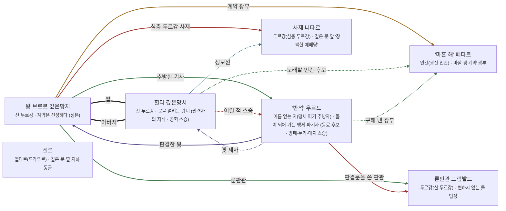

# 카즈둠 산맥 관계도

> 자동 생성 문서 — `python3 tools/build_relations.py` 로 다시 만든다. 직접 고치지 말 것.

선: 굵은 검정 = 혈연, 보라 = 위계, 초록 = 호감·연모, 빨강 = 적대, 갈색 = 거래·빚, 점선 = 비밀

## 관계 목록

| 누가 | 관계 | 누구에게 | 공개 | 메모 |
|---|---|---|---|---|
| 왕 브로르 깊은망치 | 혈연 · 딸 | 힐다 깊은망치 | 공개 |  |
| 왕 브로르 깊은망치 | 감정 · 추방한 기사 | '반석' 우르드 | 공개 | 판결은 그가 내렸다 |
| 왕 브로르 깊은망치 | 감정 · 룬판관 | 룬판관 그림발드 | 공개 |  |
| 왕 브로르 깊은망치 | 거래 · 계약 광부 | '마흔 해' 페타르 | 공개 |  |
| 왕 브로르 깊은망치 | 적대 · 심층 두르강 사제 | 사제 니다르 | 공개 |  |
| 힐다 깊은망치 | 혈연 · 아버지 | 왕 브로르 깊은망치 | 공개 |  |
| 힐다 깊은망치 | 조직 · 정보원 | 사제 니다르 | 비밀 |  |
| 힐다 깊은망치 | 적대 · 어릴 적 스승 | '반석' 우르드 | 비밀 |  |
| 힐다 깊은망치 | 감정 · 노래할 인간 후보 | '마흔 해' 페타르 | 비밀 |  |
| '반석' 우르드 | 위계 · 판결한 왕 | 왕 브로르 깊은망치 | 공개 |  |
| '반석' 우르드 | 위계 · 옛 제자 | 힐다 깊은망치 | 비밀 |  |
| '반석' 우르드 | 감정 · 구해 낸 광부 | '마흔 해' 페타르 | 비밀 |  |
| '반석' 우르드 | 적대 · 판결문을 쓴 판관 | 룬판관 그림발드 | 공개 |  |
