# 하르칸 초원 관계도

> 자동 생성 문서 — `python3 tools/build_relations.py` 로 다시 만든다. 직접 고치지 말 것.

선: 굵은 검정 = 혈연, 보라 = 위계, 초록 = 호감·연모, 빨강 = 적대, 갈색 = 거래·빚, 점선 = 비밀

```mermaid
graph LR
  npc_temur["칸 테무르 아르슬란<br/><small>바람발굽 · 초원을 통일하는 자 (정본)</small>"]
  npc_soran["소란 아르슬란<br/><small>바람발굽 · 칸의 딸 (권력자의 자식)</small>"]
  npc_batar["'느린발' 바타르<br/><small>바람발굽(강등 — 무거운발굽 야영지 거주) · 달리지 못하는 창술사 (창·장병기 스승)</small>"]
  npc_dua["두아<br/><small>인간 · 짐꾼들의 우두머리 (승마·초원어 스승)</small>"]
  npc_oktai["옥타이<br/><small>하르칸(무거운발굽) · 무거운발굽 짐 야영지 우두머리</small>"]
  npc_hiak["'웃는' 히악<br/><small>수인족(그나르) · 말뼈 샘 시체 청소부 겸 고물상</small>"]
  npc_hk_borte["보르테 흰갈기<br/><small>바람발굽 · 칸의 반려·전략가 (붉은갈기 출신)</small>"]
  npc_hk_batu["바투 아르슬란<br/><small>바람발굽 · 칸의 아들·아르슬란 기병대장 (후계 후보)</small>"]
  npc_hk_orduk["오르두 검은바람<br/><small>바람발굽 · 검은바람 부족장 (반란 준비)</small>"]
  npc_hk_boris["보리스<br/><small>인간(짐꾼) · 등짐 행렬 짐 맏이 (이삭 줍기 조직자)</small>"]
  npc_hk_sorin["소린 회색갈기<br/><small>바람발굽 · 꺾인 깃발 진영 씨족장 (패배 씨족의 마지막 진영)</small>"]
  npc_hk_ezel["에젤 붉은갈기<br/><small>바람발굽 · 붉은갈기 부족장 (칸의 장인, 원형장 투사 공급)</small>"]
  npc_hk_ila["일라 일곱샘<br/><small>바람발굽 · 일곱샘 여족장 (물값 노래)</small>"]
  npc_hk_boro["보로 마지막발굽<br/><small>바람발굽 · 마지막발굽 부족장 (칸의 숙적)</small>"]
  npc_hk_yesun["예순 늙은굽<br/><small>바람발굽 · 옛 바람파 수장 (떠나지 않은 늙은이)</small>"]
  npc_hk_kasar["카사르 붉은발굽<br/><small>바람발굽 · 칸의 이복형제 (사냥 축제 주관자)</small>"]
  npc_hk_ayla["아일라 바람귀<br/><small>바람발굽 · 바람 무녀 (서 있는 돌 열둘)</small>"]
  npc_hk_altan["알탄 바람귀<br/><small>바람발굽 · 바람 읽는 자 (날씨·냄새·먼 소리)</small>"]
  npc_hk_hulun["홀룬 잿빛꼬리<br/><small>바람발굽 · 채찍 기수 대장 (짐꾼 감독)</small>"]
  npc_hk_jax["잭스<br/><small>감독관 크릭 · 소금 호수 감독 크릭 (노역장 인간 3,000)</small>"]
  npc_hk_ida["붉은 실 이다<br/><small>인간(짐꾼) · 아이 짐꾼 (소란의 갈기에 실을 엮는 아이)</small>"]
  npc_hk_ssok["크릭 장부지기 쏙<br/><small>감독관 크릭 · 크릭 장부지기 (칸의 외상 장부)</small>"]
  npc_hk_nesta["돌무더기 네스타<br/><small>인간(버려진 자) · 버려진 자들의 마을 어른</small>"]
  npc_hk_turga["투르가 돌피<br/><small>산 두르강(추방 씨족 돌피) · 두르강 무기상 (돌피 씨족 출신)</small>"]
  npc_hk_ile["일레 얼룩<br/><small>바람발굽 · 경주 재판관</small>"]
  npc_temur ---|딸| npc_soran
  npc_temur -->|옛 스승| npc_batar
  npc_temur -->|짐꾼 우두머리| npc_dua
  npc_soran ---|아버지| npc_temur
  npc_soran -.->|신뢰하는 짐꾼| npc_dua
  npc_soran -.->|몰래 배우는 스승| npc_batar
  npc_batar -->|옛 제자| npc_temur
  npc_batar -.->|몰래 제자| npc_soran
  npc_batar -->|인간 이웃| npc_dua
  npc_dua -->|주인| npc_temur
  npc_dua -.->|약속한 공주| npc_soran
  npc_dua -->|이웃| npc_batar
  npc_hk_borte -->|반려·칸| npc_temur
  npc_hk_borte ---|딸| npc_soran
  npc_hk_borte ---|아버지| npc_hk_ezel
  npc_hk_borte ---|칸의 아들| npc_hk_batu
  npc_hk_borte -.->|눈감아 준 스승| npc_batar
  npc_hk_borte -->|장부지기| npc_hk_ssok
  npc_hk_batu ---|아버지·칸| npc_temur
  npc_hk_batu -->|이복 누이| npc_soran
  npc_hk_batu ---|아버지의 반려| npc_hk_borte
  npc_hk_batu ---|외할머니| npc_hk_ila
  npc_hk_batu -.->|갈기를 내민 늙은이| npc_hk_yesun
  npc_hk_batu -->|채찍 기수| npc_hk_hulun
  npc_hk_batu -->|외종조부 격| npc_hk_ezel
  npc_hk_orduk -->|맹세한 칸| npc_temur
  npc_hk_orduk -.->|세우려는 칸| npc_soran
  npc_hk_orduk -.->|철 상인| npc_hk_turga
  npc_hk_orduk -.->|옛 바람파 수장| npc_hk_yesun
  npc_hk_orduk -->|짐꾼 맏이| npc_dua
  npc_hk_orduk -->|짐꾼 맏이| npc_hk_boris
  npc_hk_orduk ---|멍에 진 형제| npc_oktai
  npc_hk_boris -->|다른 길의 짐 맏이| npc_dua
  npc_hk_boris -->|채찍 기수| npc_hk_hulun
  npc_hk_boris -.->|마을 어른| npc_hk_nesta
  npc_hk_boris -.->|유품 청소부| npc_hiak
  npc_hk_boris -->|약속한 공주| npc_soran
  npc_hk_boris -->|아이 짐꾼| npc_hk_ida
  npc_hk_sorin -->|숙적| npc_temur
  npc_hk_sorin -->|옛 칸위 곁의 벗| npc_batar
  npc_hk_sorin -.->|소문의 공주| npc_soran
  npc_hk_sorin -.->|소문의 짐 맏이| npc_dua
  npc_hk_sorin -->|다른 마지막| npc_hk_boro
  npc_hk_sorin -.->|마을 어른| npc_hk_nesta
  npc_hk_ezel ---|딸| npc_hk_borte
  npc_hk_ezel ---|손녀| npc_soran
  npc_hk_ezel -.->|걸어 둔 가닥| npc_hk_batu
  npc_hk_ezel -->|장부지기| npc_hk_ssok
  npc_hk_ila ---|외손자| npc_hk_batu
  npc_hk_ila -->|마지못한 칸| npc_temur
  npc_hk_ila ---|외손자의 이복 누이| npc_soran
  npc_hk_boro -->|숙적| npc_temur
  npc_hk_boro -->|다른 마지막| npc_hk_sorin
  npc_hk_boro -->|옛 법의 벗| npc_hk_yesun
  npc_hk_boro -.->|바람 읽는 자| npc_hk_altan
  npc_hk_yesun -.->|돌려받은 가닥의 상대| npc_hk_batu
  npc_hk_yesun -->|함께 선 늙은이| npc_batar
  npc_hk_yesun -.->|멍에 서약의 증인| npc_oktai
  npc_hk_yesun -->|옛 법의 벗| npc_hk_boro
  npc_hk_yesun -->|법을 깬 칸| npc_temur
  npc_hk_kasar ---|이복형| npc_temur
  npc_hk_kasar ---|조카| npc_soran
  npc_hk_kasar -->|짐꾼 맏이| npc_hk_boris
  npc_hk_kasar -->|채찍 기수| npc_hk_hulun
  npc_hk_ayla -->|축복을 청한 칸| npc_temur
  npc_hk_ayla -->|바람 읽는 자| npc_hk_altan
  npc_hk_ayla -->|옛 법의 늙은이| npc_hk_yesun
  npc_hk_ayla ---|찾아오는 칸의 딸| npc_soran
  npc_hk_altan -->|명을 내린 칸| npc_temur
  npc_hk_altan -->|바람 무녀| npc_hk_ayla
  npc_hk_altan -.->|옛 법의 늙은이| npc_hk_yesun
  npc_hk_altan -->|이동 설계자| npc_hk_borte
  npc_hk_hulun -->|행렬 지휘자| npc_hk_boris
  npc_hk_hulun -->|짐 맏이| npc_dua
  npc_hk_hulun -->|눈감는 후계| npc_hk_batu
  npc_hk_hulun -->|칸| npc_temur
  npc_hk_jax -.->|고물상| npc_hiak
  npc_hk_jax -->|크릭 장부지기| npc_hk_ssok
  npc_hk_jax -->|소금을 바치는 칸| npc_temur
  npc_hk_ida -->|보호자| npc_dua
  npc_hk_ida -->|갈기 주인| npc_soran
  npc_hk_ida -->|짐꾼 맏이| npc_hk_boris
  npc_hk_ssok -->|계산 상대| npc_hk_borte
  npc_hk_ssok -->|이빨 셈의 상대| npc_hk_ezel
  npc_hk_ssok -->|크릭 동료| npc_hk_jax
  npc_hk_nesta -.->|줍는 이| npc_hk_boris
  npc_hk_nesta -.->|다른 길의 짐 맏이| npc_dua
  npc_hk_nesta -.->|소문의 벡| npc_hk_sorin
  npc_hk_nesta -->|유품 청소부| npc_hiak
  npc_hk_turga -.->|철 거래 상대| npc_hk_orduk
  npc_hk_turga -->|손님| npc_temur
  npc_hk_turga -->|크릭 장부지기| npc_hk_ssok
  npc_hk_ile -->|칸| npc_temur
  npc_hk_ile -->|옛 법의 늙은이| npc_hk_yesun
  npc_hk_ile -->|경주 재판 구경꾼| npc_soran
  linkStyle 0 stroke:#2a2521,stroke-width:3px
  linkStyle 1 stroke:#5b4a8a,stroke-width:2px
  linkStyle 2 stroke:#3f7a4a,stroke-width:2px
  linkStyle 3 stroke:#2a2521,stroke-width:3px
  linkStyle 4 stroke:#3f7a4a,stroke-width:2px
  linkStyle 5 stroke:#5b4a8a,stroke-width:2px
  linkStyle 6 stroke:#5b4a8a,stroke-width:2px
  linkStyle 7 stroke:#5b4a8a,stroke-width:2px
  linkStyle 8 stroke:#3f7a4a,stroke-width:2px
  linkStyle 9 stroke:#5b4a8a,stroke-width:2px
  linkStyle 10 stroke:#3f7a4a,stroke-width:2px
  linkStyle 11 stroke:#3f7a4a,stroke-width:2px
  linkStyle 12 stroke:#3f7a4a,stroke-width:2px
  linkStyle 13 stroke:#2a2521,stroke-width:3px
  linkStyle 14 stroke:#2a2521,stroke-width:3px
  linkStyle 15 stroke:#2a2521,stroke-width:3px
  linkStyle 16 stroke:#5b4a8a,stroke-width:2px
  linkStyle 17 stroke:#3f7a4a,stroke-width:2px
  linkStyle 18 stroke:#2a2521,stroke-width:3px
  linkStyle 19 stroke:#3f7a4a,stroke-width:2px
  linkStyle 20 stroke:#2a2521,stroke-width:3px
  linkStyle 21 stroke:#2a2521,stroke-width:3px
  linkStyle 22 stroke:#3f7a4a,stroke-width:2px
  linkStyle 23 stroke:#3f7a4a,stroke-width:2px
  linkStyle 24 stroke:#3f7a4a,stroke-width:2px
  linkStyle 25 stroke:#a1342a,stroke-width:2px
  linkStyle 26 stroke:#3f7a4a,stroke-width:2px
  linkStyle 27 stroke:#3f7a4a,stroke-width:2px
  linkStyle 28 stroke:#3f7a4a,stroke-width:2px
  linkStyle 29 stroke:#3f7a4a,stroke-width:2px
  linkStyle 30 stroke:#3f7a4a,stroke-width:2px
  linkStyle 31 stroke:#2a2521,stroke-width:3px
  linkStyle 32 stroke:#3f7a4a,stroke-width:2px
  linkStyle 33 stroke:#a1342a,stroke-width:2px
  linkStyle 34 stroke:#3f7a4a,stroke-width:2px
  linkStyle 35 stroke:#3f7a4a,stroke-width:2px
  linkStyle 36 stroke:#3f7a4a,stroke-width:2px
  linkStyle 37 stroke:#3f7a4a,stroke-width:2px
  linkStyle 38 stroke:#a1342a,stroke-width:2px
  linkStyle 39 stroke:#3f7a4a,stroke-width:2px
  linkStyle 40 stroke:#3f7a4a,stroke-width:2px
  linkStyle 41 stroke:#3f7a4a,stroke-width:2px
  linkStyle 42 stroke:#3f7a4a,stroke-width:2px
  linkStyle 43 stroke:#3f7a4a,stroke-width:2px
  linkStyle 44 stroke:#2a2521,stroke-width:3px
  linkStyle 45 stroke:#2a2521,stroke-width:3px
  linkStyle 46 stroke:#3f7a4a,stroke-width:2px
  linkStyle 47 stroke:#3f7a4a,stroke-width:2px
  linkStyle 48 stroke:#2a2521,stroke-width:3px
  linkStyle 49 stroke:#a1342a,stroke-width:2px
  linkStyle 50 stroke:#2a2521,stroke-width:3px
  linkStyle 51 stroke:#a1342a,stroke-width:2px
  linkStyle 52 stroke:#3f7a4a,stroke-width:2px
  linkStyle 53 stroke:#3f7a4a,stroke-width:2px
  linkStyle 54 stroke:#3f7a4a,stroke-width:2px
  linkStyle 55 stroke:#3f7a4a,stroke-width:2px
  linkStyle 56 stroke:#3f7a4a,stroke-width:2px
  linkStyle 57 stroke:#3f7a4a,stroke-width:2px
  linkStyle 58 stroke:#3f7a4a,stroke-width:2px
  linkStyle 59 stroke:#a1342a,stroke-width:2px
  linkStyle 60 stroke:#2a2521,stroke-width:3px
  linkStyle 61 stroke:#2a2521,stroke-width:3px
  linkStyle 62 stroke:#3f7a4a,stroke-width:2px
  linkStyle 63 stroke:#3f7a4a,stroke-width:2px
  linkStyle 64 stroke:#a1342a,stroke-width:2px
  linkStyle 65 stroke:#3f7a4a,stroke-width:2px
  linkStyle 66 stroke:#3f7a4a,stroke-width:2px
  linkStyle 67 stroke:#2a2521,stroke-width:3px
  linkStyle 68 stroke:#3f7a4a,stroke-width:2px
  linkStyle 69 stroke:#3f7a4a,stroke-width:2px
  linkStyle 70 stroke:#3f7a4a,stroke-width:2px
  linkStyle 71 stroke:#3f7a4a,stroke-width:2px
  linkStyle 72 stroke:#5b4a8a,stroke-width:2px
  linkStyle 73 stroke:#3f7a4a,stroke-width:2px
  linkStyle 74 stroke:#3f7a4a,stroke-width:2px
  linkStyle 75 stroke:#3f7a4a,stroke-width:2px
  linkStyle 76 stroke:#3f7a4a,stroke-width:2px
  linkStyle 77 stroke:#3f7a4a,stroke-width:2px
  linkStyle 78 stroke:#3f7a4a,stroke-width:2px
  linkStyle 79 stroke:#3f7a4a,stroke-width:2px
  linkStyle 80 stroke:#5b4a8a,stroke-width:2px
  linkStyle 81 stroke:#3f7a4a,stroke-width:2px
  linkStyle 82 stroke:#3f7a4a,stroke-width:2px
  linkStyle 83 stroke:#3f7a4a,stroke-width:2px
  linkStyle 84 stroke:#3f7a4a,stroke-width:2px
  linkStyle 85 stroke:#3f7a4a,stroke-width:2px
  linkStyle 86 stroke:#3f7a4a,stroke-width:2px
  linkStyle 87 stroke:#3f7a4a,stroke-width:2px
  linkStyle 88 stroke:#3f7a4a,stroke-width:2px
  linkStyle 89 stroke:#9a6a1c,stroke-width:2px
  linkStyle 90 stroke:#9a6a1c,stroke-width:2px
  linkStyle 91 stroke:#3f7a4a,stroke-width:2px
  linkStyle 92 stroke:#a1342a,stroke-width:2px
  linkStyle 93 stroke:#3f7a4a,stroke-width:2px
  linkStyle 94 stroke:#3f7a4a,stroke-width:2px
```

## 관계 목록

| 누가 | 관계 | 누구에게 | 공개 | 메모 |
|---|---|---|---|---|
| 칸 테무르 아르슬란 | 혈연 · 딸 | 소란 아르슬란 | 공개 |  |
| 칸 테무르 아르슬란 | 위계 · 옛 스승 | '느린발' 바타르 | 공개 | 다리를 부쉈다 |
| 칸 테무르 아르슬란 | 감정 · 짐꾼 우두머리 | 두아 | 공개 |  |
| 소란 아르슬란 | 혈연 · 아버지 | 칸 테무르 아르슬란 | 공개 |  |
| 소란 아르슬란 | 감정 · 신뢰하는 짐꾼 | 두아 | 비밀 |  |
| 소란 아르슬란 | 위계 · 몰래 배우는 스승 | '느린발' 바타르 | 비밀 |  |
| '느린발' 바타르 | 위계 · 옛 제자 | 칸 테무르 아르슬란 | 공개 |  |
| '느린발' 바타르 | 위계 · 몰래 제자 | 소란 아르슬란 | 비밀 |  |
| '느린발' 바타르 | 감정 · 인간 이웃 | 두아 | 공개 |  |
| 두아 | 위계 · 주인 | 칸 테무르 아르슬란 | 공개 |  |
| 두아 | 감정 · 약속한 공주 | 소란 아르슬란 | 비밀 |  |
| 두아 | 감정 · 이웃 | '느린발' 바타르 | 공개 |  |
| 보르테 흰갈기 | 감정 · 반려·칸 | 칸 테무르 아르슬란 | 공개 | 달리는 사람을 이어 주는 끈의 쪽 |
| 보르테 흰갈기 | 혈연 · 딸 | 소란 아르슬란 | 공개 | 창이 아니라 매듭을 쥐여 주려는 딸 |
| 보르테 흰갈기 | 혈연 · 아버지 | 에젤 붉은갈기 | 공개 | 등 뒤에서 갈기를 바꾸는 사람일까 의심하는 아버지 |
| 보르테 흰갈기 | 혈연 · 칸의 아들 | 바투 아르슬란 | 공개 | 한 걸음 뒤에서 달리는 의붓아들 |
| 보르테 흰갈기 | 위계 · 눈감아 준 스승 | '느린발' 바타르 | 비밀 | 딸의 창을 모른 척하는 대가로 서 있는 사람 |
| 보르테 흰갈기 | 감정 · 장부지기 | 크릭 장부지기 쏙 | 공개 | 말 값을 매듭으로 헤아리는 작은 발 |
| 바투 아르슬란 | 혈연 · 아버지·칸 | 칸 테무르 아르슬란 | 공개 | 이길 수 없다고 아는 아버지 |
| 바투 아르슬란 | 감정 · 이복 누이 | 소란 아르슬란 | 공개 | 칸이 되면 자기보다 나을 동생 |
| 바투 아르슬란 | 혈연 · 아버지의 반려 | 보르테 흰갈기 | 공개 | 한 걸음 앞에서 길을 설계하는 사람 |
| 바투 아르슬란 | 혈연 · 외할머니 | 일라 일곱샘 | 비밀 | 어머니의 물맛 노래를 가르쳐 준 사람 |
| 바투 아르슬란 | 감정 · 갈기를 내민 늙은이 | 예순 늙은굽 | 비밀 | 돌려보낸 갈기 가닥의 주인 |
| 바투 아르슬란 | 감정 · 채찍 기수 | 홀룬 잿빛꼬리 | 공개 | 알고도 눈감는 사람 |
| 바투 아르슬란 | 감정 · 외종조부 격 | 에젤 붉은갈기 | 공개 | 붉은갈기의 눈이 어디로 향하는지 모르는 벡 |
| 오르두 검은바람 | 적대 · 맹세한 칸 | 칸 테무르 아르슬란 | 공개 | 갈기는 건넸으나 등을 대지는 않는다 |
| 오르두 검은바람 | 감정 · 세우려는 칸 | 소란 아르슬란 | 비밀 | 짐꾼을 풀어 줄 사람이라 믿는 딸 |
| 오르두 검은바람 | 감정 · 철 상인 | 투르가 돌피 | 비밀 | 돌피의 철을 대는 두르강 상인 |
| 오르두 검은바람 | 감정 · 옛 바람파 수장 | 예순 늙은굽 | 비밀 | 함께 비껴 달릴 늙은이 |
| 오르두 검은바람 | 감정 · 짐꾼 맏이 | 두아 | 공개 | 말을 태우고 싶은 짐 맏이 |
| 오르두 검은바람 | 감정 · 짐꾼 맏이 | 보리스 | 공개 | 탈출한 이삭을 맞을 수 있다는 소문 |
| 오르두 검은바람 | 혈연 · 멍에 진 형제 | 옥타이 | 공개 | 서약 만료를 같이 아는 무거운발굽 |
| 보리스 | 감정 · 다른 길의 짐 맏이 | 두아 | 공개 | 같은 막사에서 자란 — 믿는 길이 다른 사람 |
| 보리스 | 적대 · 채찍 기수 | 홀룬 잿빛꼬리 | 공개 | 알고도 눈감는 이유를 모르는 채찍 |
| 보리스 | 감정 · 마을 어른 | 돌무더기 네스타 | 비밀 | 줍힌 사람을 받는 마을의 어른 |
| 보리스 | 감정 · 유품 청소부 | '웃는' 히악 | 비밀 | 돌무더기 자리에 손대지 않는 웃는 사람 |
| 보리스 | 감정 · 약속한 공주 | 소란 아르슬란 | 공개 | 약속은 바람에게 하는 말이라 믿지 않는다 |
| 보리스 | 감정 · 아이 짐꾼 | 붉은 실 이다 | 공개 | 갈기에 실을 엮는 아이 |
| 소린 회색갈기 | 적대 · 숙적 | 칸 테무르 아르슬란 | 공개 | 이름까지 지우려는 칸 |
| 소린 회색갈기 | 감정 · 옛 칸위 곁의 벗 | '느린발' 바타르 | 공개 | 창을 든 채 같이 달린 사람 |
| 소린 회색갈기 | 감정 · 소문의 공주 | 소란 아르슬란 | 비밀 | 짐꾼에게 몫을 주겠다는 소문의 상대 |
| 소린 회색갈기 | 감정 · 소문의 짐 맏이 | 두아 | 비밀 | 약속의 상대로 소문난 여자 |
| 소린 회색갈기 | 감정 · 다른 마지막 | 보로 마지막발굽 | 공개 | 같은 바람을 맞는 서쪽 늙은이 |
| 소린 회색갈기 | 감정 · 마을 어른 | 돌무더기 네스타 | 비밀 | 인간을 보낼 만한 마을 |
| 에젤 붉은갈기 | 혈연 · 딸 | 보르테 흰갈기 | 공개 | 칸의 반려가 된 딸이 아버지의 속을 의심한다 |
| 에젤 붉은갈기 | 혈연 · 손녀 | 소란 아르슬란 | 공개 | 짐꾼 약속이 장사를 끊을 아이 |
| 에젤 붉은갈기 | 감정 · 걸어 둔 가닥 | 바투 아르슬란 | 비밀 | 몰래 가닥을 걸어 둔 외손자 격 |
| 에젤 붉은갈기 | 감정 · 장부지기 | 크릭 장부지기 쏙 | 공개 | 이빨 셈을 아는 작은 발 |
| 일라 일곱샘 | 혈연 · 외손자 | 바투 아르슬란 | 비밀 | 어머니의 물맛 노래를 가르친 사람 |
| 일라 일곱샘 | 적대 · 마지못한 칸 | 칸 테무르 아르슬란 | 공개 | 딸을 잃은 해의 칸 |
| 일라 일곱샘 | 혈연 · 외손자의 이복 누이 | 소란 아르슬란 | 공개 | 짐꾼에게 몫을 주겠다는 아이 |
| 보로 마지막발굽 | 적대 · 숙적 | 칸 테무르 아르슬란 | 공개 | 평생 싸운 칸 |
| 보로 마지막발굽 | 감정 · 다른 마지막 | 소린 회색갈기 | 공개 | 같은 바람을 맞는 벡 |
| 보로 마지막발굽 | 감정 · 옛 법의 벗 | 예순 늙은굽 | 공개 | 서풍 금지를 같이 믿는 늙은이 |
| 보로 마지막발굽 | 감정 · 바람 읽는 자 | 알탄 바람귀 | 비밀 | 재 냄새의 날짜를 아는 사람 |
| 예순 늙은굽 | 감정 · 돌려받은 가닥의 상대 | 바투 아르슬란 | 비밀 | 칸의 아들이 받아 주기를 바라는 사람 |
| 예순 늙은굽 | 감정 · 함께 선 늙은이 | '느린발' 바타르 | 공개 | 정주병을 같이 겪는 벗 |
| 예순 늙은굽 | 감정 · 멍에 서약의 증인 | 옥타이 | 비밀 | 원문을 외운다는 것을 아는 무거운발굽 |
| 예순 늙은굽 | 감정 · 옛 법의 벗 | 보로 마지막발굽 | 공개 | 서풍 금지를 같이 믿는 서쪽 늙은이 |
| 예순 늙은굽 | 적대 · 법을 깬 칸 | 칸 테무르 아르슬란 | 공개 | 서풍 날 서진을 처음 깬 사람 |
| 카사르 붉은발굽 | 혈연 · 이복형 | 칸 테무르 아르슬란 | 공개 | 사냥대장을 맡길 칸 |
| 카사르 붉은발굽 | 혈연 · 조카 | 소란 아르슬란 | 공개 | 활을 잘 쏘는 아이 |
| 카사르 붉은발굽 | 감정 · 짐꾼 맏이 | 보리스 | 공개 | 활 배우는 짐꾼을 아는 사람 |
| 카사르 붉은발굽 | 감정 · 채찍 기수 | 홀룬 잿빛꼬리 | 공개 | 사냥감 목록을 같이 짜는 사람 |
| 아일라 바람귀 | 적대 · 축복을 청한 칸 | 칸 테무르 아르슬란 | 공개 | 서진 축복을 거절한 사람 |
| 아일라 바람귀 | 감정 · 바람 읽는 자 | 알탄 바람귀 | 공개 | 서풍 냄새를 바람 소리와 같이 읽는 사람 |
| 아일라 바람귀 | 감정 · 옛 법의 늙은이 | 예순 늙은굽 | 공개 | 서풍 금지를 같이 기억하는 사람 |
| 아일라 바람귀 | 혈연 · 찾아오는 칸의 딸 | 소란 아르슬란 | 공개 | 맹세 없이 바람을 듣고 가는 아이 |
| 알탄 바람귀 | 감정 · 명을 내린 칸 | 칸 테무르 아르슬란 | 공개 | 서풍 경고를 올리지 말라 한 사람 |
| 알탄 바람귀 | 감정 · 바람 무녀 | 아일라 바람귀 | 공개 | 서풍을 같이 듣는 사람 |
| 알탄 바람귀 | 감정 · 옛 법의 늙은이 | 예순 늙은굽 | 비밀 | 검은 매듭을 받는 사람 |
| 알탄 바람귀 | 감정 · 이동 설계자 | 보르테 흰갈기 | 공개 | 방향을 같이 묶는 사람 |
| 홀룬 잿빛꼬리 | 위계 · 행렬 지휘자 | 보리스 | 공개 | 알고도 눈감는 이유를 숨기는 짐 맏이 |
| 홀룬 잿빛꼬리 | 감정 · 짐 맏이 | 두아 | 공개 | 낙오를 막으려는 짐 맏이 |
| 홀룬 잿빛꼬리 | 감정 · 눈감는 후계 | 바투 아르슬란 | 공개 | 채찍 장부를 고치는 칸의 아들 |
| 홀룬 잿빛꼬리 | 감정 · 칸 | 칸 테무르 아르슬란 | 공개 | 짐 값을 따지는 칸 |
| 잭스 | 감정 · 고물상 | '웃는' 히악 | 비밀 | 유물 값을 같이 치르는 웃는 사람 |
| 잭스 | 감정 · 크릭 장부지기 | 크릭 장부지기 쏙 | 공개 | 같은 길드의 작은 발 |
| 잭스 | 감정 · 소금을 바치는 칸 | 칸 테무르 아르슬란 | 공개 | 공납의 상대 |
| 붉은 실 이다 | 감정 · 보호자 | 두아 | 공개 | 데려다 키운 짐 맏이 |
| 붉은 실 이다 | 위계 · 갈기 주인 | 소란 아르슬란 | 공개 | 매듭을 장난감으로 아는 칸의 딸 |
| 붉은 실 이다 | 감정 · 짐꾼 맏이 | 보리스 | 공개 | 행렬 이야기를 해 주는 아저씨 |
| 크릭 장부지기 쏙 | 감정 · 계산 상대 | 보르테 흰갈기 | 공개 | 말 값을 같이 헤아리는 반려 |
| 크릭 장부지기 쏙 | 감정 · 이빨 셈의 상대 | 에젤 붉은갈기 | 공개 | 원형장 판매의 큰손 |
| 크릭 장부지기 쏙 | 감정 · 크릭 동료 | 잭스 | 공개 | 소금 호수 감독 |
| 돌무더기 네스타 | 감정 · 줍는 이 | 보리스 | 비밀 | 줍힌 사람을 보내는 짐 맏이 |
| 돌무더기 네스타 | 감정 · 다른 길의 짐 맏이 | 두아 | 비밀 | 짐 속 사람을 보내는 여자 |
| 돌무더기 네스타 | 감정 · 소문의 벡 | 소린 회색갈기 | 비밀 | 인간을 보낼 만한 마지막 진영 |
| 돌무더기 네스타 | 감정 · 유품 청소부 | '웃는' 히악 | 공개 | 돌무더기에 손대지 않는 웃는 사람 |
| 투르가 돌피 | 거래 · 철 거래 상대 | 오르두 검은바람 | 비밀 | 돌피의 철을 대는 벡 |
| 투르가 돌피 | 거래 · 손님 | 칸 테무르 아르슬란 | 공개 | 같은 수레에서 창날을 사 가는 칸 |
| 투르가 돌피 | 감정 · 크릭 장부지기 | 크릭 장부지기 쏙 | 공개 | 철 값을 장부에 적는 작은 발 |
| 일레 얼룩 | 적대 · 칸 | 칸 테무르 아르슬란 | 공개 | 판결을 뒤집지 못하는 칸 |
| 일레 얼룩 | 감정 · 옛 법의 늙은이 | 예순 늙은굽 | 공개 | 법의 이유를 아는 사람 |
| 일레 얼룩 | 감정 · 경주 재판 구경꾼 | 소란 아르슬란 | 공개 | 말뚝 곁에서 길이를 세는 칸의 딸 |
