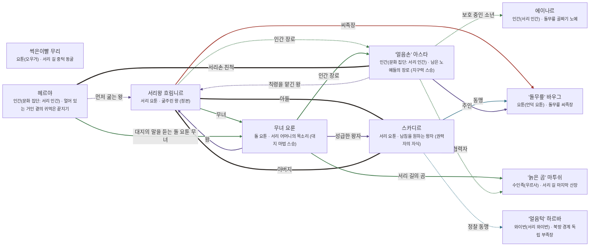

# 흐로스가르드 관계도

> 자동 생성 문서 — `python3 tools/build_relations.py` 로 다시 만든다. 직접 고치지 말 것.

선: 굵은 검정 = 혈연, 보라 = 위계, 초록 = 호감·연모, 빨강 = 적대, 갈색 = 거래·빚, 점선 = 비밀

## 관계 목록

| 누가 | 관계 | 누구에게 | 공개 | 메모 |
|---|---|---|---|---|
| 서리왕 흐림니르 | 혈연 · 아들 | 스카디르 | 공개 | 남침파 |
| 서리왕 흐림니르 | 감정 · 무녀 | 무녀 요룬 | 공개 |  |
| 서리왕 흐림니르 | 적대 · 씨족장 | '돌무릎' 바우그 | 공개 |  |
| 서리왕 흐림니르 | 감정 · 인간 장로 | '얼음손' 아스타 | 비밀 | 칙령의 전달자 |
| 스카디르 | 혈연 · 아버지 | 서리왕 흐림니르 | 공개 |  |
| 스카디르 | 조직 · 동맹 | '돌무릎' 바우그 | 공개 |  |
| 스카디르 | 조직 · 정찰 동맹 | '얼음턱' 하르바 | 비밀 |  |
| 무녀 요룬 | 위계 · 왕 | 서리왕 흐림니르 | 공개 |  |
| 무녀 요룬 | 감정 · 인간 장로 | '얼음손' 아스타 | 공개 |  |
| 무녀 요룬 | 위계 · 성급한 왕자 | 스카디르 | 공개 |  |
| 무녀 요룬 | 감정 · 서리 길의 곰 | '늙은 곰' 마투쉬 | 공개 |  |
| '얼음손' 아스타 | 감정 · 보호 중인 소년 | 에이나르 | 비밀 |  |
| '얼음손' 아스타 | 위계 · 주인 | '돌무릎' 바우그 | 공개 |  |
| '얼음손' 아스타 | 위계 · 칙령을 맡긴 왕 | 서리왕 흐림니르 | 비밀 |  |
| '얼음손' 아스타 | 감정 · 산장 협력자 | '늙은 곰' 마투쉬 | 비밀 |  |
| 헤르야 | 혈연 · 서리손 친척 | '얼음손' 아스타 | 비밀 |  |
| 헤르야 | 감정 · 대지의 말을 듣는 돌 요툰 무녀 | 무녀 요룬 | 공개 |  |
| 헤르야 | 위계 · 먼저 굶는 왕 | 서리왕 흐림니르 | 비밀 |  |
