# 흐로스가르드 관계도

> 자동 생성 문서 — `python3 tools/build_relations.py` 로 다시 만든다. 직접 고치지 말 것.

선: 굵은 검정 = 혈연, 보라 = 위계, 초록 = 호감·연모, 빨강 = 적대, 갈색 = 거래·빚, 점선 = 비밀

```mermaid
graph LR
  npc_hrimnir["서리왕 흐림니르<br/><small>서리 요툰 · 굶주린 왕 (정본)</small>"]
  npc_skadir["스카디르<br/><small>서리 요툰 · 남침을 원하는 왕자 (권력자의 자식)</small>"]
  npc_yorun["무녀 요룬<br/><small>돌 요툰 · 서리 어머니의 목소리 (대지 마법 스승)</small>"]
  npc_asta["'얼음손' 아스타<br/><small>인간(문화 집단: 서리 인간) · 남은 노예들의 장로 (지구력 스승)</small>"]
  npc_baug["'돌무릎' 바우그<br/><small>요툰(언덕 요툰) · 돌무릎 씨족장</small>"]
  npc_einar["에이나르<br/><small>인간(서리 인간) · 돌무릎 골짜기 노예</small>"]
  npc_matusz["'늙은 곰' 마투쉬<br/><small>수인족(우르사) · 서리 길 마지막 산장</small>"]
  npc_harva["'얼음턱' 하르바<br/><small>와이번(서리 와이번) · 북방 경계 독립 부족장</small>"]
  npc_ogre_pack["썩은이빨 무리<br/><small>요툰(오우거) · 서리 길 중턱 동굴</small>"]
  npc_herja["헤르야<br/><small>인간(문화 집단: 서리 인간) · 얼어 있는 거인 곁의 귀먹은 끝지기</small>"]
  npc_hg_skala["왕비 스칼라<br/><small>서리 요툰 · 왕비 (깊은우물 씨족 출신, 전당 안살림)</small>"]
  npc_hg_ugra["바위배 우그라<br/><small>서리 요툰 · 바위배 씨족장 (서리땅 동부)</small>"]
  npc_hg_helda["눈늑대가죽 헬다<br/><small>서리 요툰 · 눈늑대가죽 씨족장 (서리 이빨 동쪽)</small>"]
  npc_hg_brimir["노파 브리미르<br/><small>돌 요툰 · 깊은우물 씨족장 (남쪽 온천 지대, 최고령 거인)</small>"]
  npc_hg_heimla["노래 거인 헤임라<br/><small>서리 요툰 · 노래 거인 장로 (구전 역사 보관)</small>"]
  npc_hg_orr["쇠무릎 오르<br/><small>서리 요툰 · 남침파 선봉 (거인 전쟁 생존자)</small>"]
  npc_hg_bragi["곡창지기 브라기<br/><small>서리 요툰 · 얼음턱 전당 곡창지기</small>"]
  npc_hg_hallgrid["사제 할그리드<br/><small>돌 요툰 · 서리 어머니 빙하 사당 사제 (요툰 사제 셋의 장)</small>"]
  npc_hg_utga["돌팔 우트가<br/><small>서리 요툰 · 돌팔 씨족장 (서리땅 남쪽, 남침 찬성)</small>"]
  npc_hg_sven["스벤<br/><small>인간(서리 인간) · 뼈울타리 노예 맏이 (서리 목줄)</small>"]
  npc_hg_inge["잉에<br/><small>인간(서리 인간) · 마지막 불 안내인 (얼음 실, 시그리드의 동생)</small>"]
  npc_hg_hordis["호르디스<br/><small>인간(서리 인간) · 불 오두막지기 (서리손, 군데의 말 전승자)</small>"]
  npc_hg_ragna["라그나<br/><small>인간(서리 인간) · 노래 거인의 제자 (인간 노예 소녀)</small>"]
  npc_hg_halr["서리 목줄 하랄<br/><small>인간(서리 인간) · 전당 노예 맏이 (서리 목줄)</small>"]
  npc_hg_pik["크릭 거간 삑<br/><small>감독관 크릭 · 크릭 곡물·모피 거간</small>"]
  npc_hg_torvald["셈쟁이 토르발트<br/><small>인간(서리 인간) · 돌무릎 씨족 노예 셈쟁이</small>"]
  npc_hrimnir ---|아들| npc_skadir
  npc_hrimnir -->|무녀| npc_yorun
  npc_hrimnir -->|씨족장| npc_baug
  npc_hrimnir -.->|인간 장로| npc_asta
  npc_skadir ---|아버지| npc_hrimnir
  npc_skadir -->|동맹| npc_baug
  npc_skadir -.->|정찰 동맹| npc_harva
  npc_yorun -->|왕| npc_hrimnir
  npc_yorun -->|인간 장로| npc_asta
  npc_yorun -->|성급한 왕자| npc_skadir
  npc_yorun -->|서리 길의 곰| npc_matusz
  npc_asta -.->|보호 중인 소년| npc_einar
  npc_asta -->|주인| npc_baug
  npc_asta -.->|칙령을 맡긴 왕| npc_hrimnir
  npc_asta -.->|산장 협력자| npc_matusz
  npc_herja ---|서리손 친척| npc_asta
  npc_herja -->|대지의 말을 듣는 돌 요툰 무녀| npc_yorun
  npc_herja -.->|먼저 굶는 왕| npc_hrimnir
  npc_hg_skala ---|남편·왕| npc_hrimnir
  npc_hg_skala -.->|고향의 어른| npc_hg_brimir
  npc_hg_skala -.->|곡창지기| npc_hg_bragi
  npc_hg_skala -->|노래 거인| npc_hg_heimla
  npc_hg_skala ---|아들| npc_skadir
  npc_hg_skala -.->|불 오두막지기| npc_hg_hordis
  npc_hg_ugra -->|왕| npc_hrimnir
  npc_hg_ugra -->|같은 남침파| npc_hg_utga
  npc_hg_ugra -->|왕자| npc_skadir
  npc_hg_ugra -->|씨족장| npc_hg_helda
  npc_hg_helda -.->|서리 와이번 부족장| npc_harva
  npc_hg_helda -->|씨족장| npc_hg_ugra
  npc_hg_helda -->|왕자| npc_skadir
  npc_hg_helda -->|왕| npc_hrimnir
  npc_hg_brimir -.->|통역| npc_asta
  npc_hg_brimir ---|손녀뻘 왕비| npc_hg_skala
  npc_hg_brimir -->|무녀| npc_yorun
  npc_hg_brimir -->|왕| npc_hrimnir
  npc_hg_heimla -.->|제자| npc_hg_ragna
  npc_hg_heimla -->|왕비| npc_hg_skala
  npc_hg_heimla -->|왕| npc_hrimnir
  npc_hg_heimla -->|무녀| npc_yorun
  npc_hg_heimla -.->|사당 인간| npc_herja
  npc_hg_orr -->|왕자| npc_skadir
  npc_hg_orr -->|남침파 씨족장| npc_hg_utga
  npc_hg_orr -->|선봉감| npc_ogre_pack
  npc_hg_orr -->|왕| npc_hrimnir
  npc_hg_bragi -->|왕| npc_hrimnir
  npc_hg_bragi -.->|왕비| npc_hg_skala
  npc_hg_bragi -.->|불 오두막지기| npc_hg_hordis
  npc_hg_bragi -->|왕자| npc_skadir
  npc_hg_hallgrid -.->|얼음 쓰는 이| npc_herja
  npc_hg_hallgrid -->|무녀| npc_yorun
  npc_hg_hallgrid -->|왕| npc_hrimnir
  npc_hg_hallgrid -->|노래 거인| npc_hg_heimla
  npc_hg_utga -->|왕자| npc_skadir
  npc_hg_utga -->|씨족장| npc_baug
  npc_hg_utga -->|노예 맏이| npc_hg_sven
  npc_hg_utga -->|와이번| npc_harva
  npc_hg_utga -->|씨족장| npc_hg_ugra
  npc_hg_sven -->|주인| npc_hg_utga
  npc_hg_sven -.->|노예 장로| npc_asta
  npc_hg_sven -.->|안내인| npc_hg_inge
  npc_hg_sven -->|서리 목줄| npc_hg_halr
  npc_hg_inge ---|사촌| npc_asta
  npc_hg_inge ---|낙오한 동생| npc_einar
  npc_hg_inge -.->|산장지기| npc_matusz
  npc_hg_inge -.->|뼈울타리 맏이| npc_hg_sven
  npc_hg_hordis -.->|왕비| npc_hg_skala
  npc_hg_hordis ---|서리손 친척| npc_asta
  npc_hg_hordis -.->|노래 제자| npc_hg_ragna
  npc_hg_hordis -.->|곡창지기| npc_hg_bragi
  npc_hg_ragna -.->|스승| npc_hg_heimla
  npc_hg_ragna -.->|불 오두막지기| npc_hg_hordis
  npc_hg_ragna -->|서리 목줄| npc_hg_halr
  npc_hg_ragna -.->|왕비| npc_hg_skala
  npc_hg_halr -.->|노래 소녀| npc_hg_ragna
  npc_hg_halr -->|뼈울타리 맏이| npc_hg_sven
  npc_hg_halr -->|돌팔 씨족장| npc_hg_utga
  npc_hg_halr -.->|불 오두막지기| npc_hg_hordis
  npc_hg_pik -->|왕| npc_hrimnir
  npc_hg_pik -->|돌팔 씨족장| npc_hg_utga
  npc_hg_pik -->|군량 셈 상대| npc_baug
  npc_hg_torvald -->|주인| npc_baug
  npc_hg_torvald -.->|장로| npc_asta
  npc_hg_torvald -.->|숨겨진 소년| npc_einar
  npc_hg_torvald -->|크릭 거간| npc_hg_pik
  linkStyle 0 stroke:#2a2521,stroke-width:3px
  linkStyle 1 stroke:#3f7a4a,stroke-width:2px
  linkStyle 2 stroke:#a1342a,stroke-width:2px
  linkStyle 3 stroke:#3f7a4a,stroke-width:2px
  linkStyle 4 stroke:#2a2521,stroke-width:3px
  linkStyle 5 stroke:#2f6f86,stroke-width:1.5px
  linkStyle 6 stroke:#2f6f86,stroke-width:1.5px
  linkStyle 7 stroke:#5b4a8a,stroke-width:2px
  linkStyle 8 stroke:#3f7a4a,stroke-width:2px
  linkStyle 9 stroke:#5b4a8a,stroke-width:2px
  linkStyle 10 stroke:#3f7a4a,stroke-width:2px
  linkStyle 11 stroke:#3f7a4a,stroke-width:2px
  linkStyle 12 stroke:#5b4a8a,stroke-width:2px
  linkStyle 13 stroke:#5b4a8a,stroke-width:2px
  linkStyle 14 stroke:#3f7a4a,stroke-width:2px
  linkStyle 15 stroke:#2a2521,stroke-width:3px
  linkStyle 16 stroke:#3f7a4a,stroke-width:2px
  linkStyle 17 stroke:#5b4a8a,stroke-width:2px
  linkStyle 18 stroke:#2a2521,stroke-width:3px
  linkStyle 19 stroke:#3f7a4a,stroke-width:2px
  linkStyle 20 stroke:#3f7a4a,stroke-width:2px
  linkStyle 21 stroke:#3f7a4a,stroke-width:2px
  linkStyle 22 stroke:#2a2521,stroke-width:3px
  linkStyle 23 stroke:#3f7a4a,stroke-width:2px
  linkStyle 24 stroke:#5b4a8a,stroke-width:2px
  linkStyle 25 stroke:#3f7a4a,stroke-width:2px
  linkStyle 26 stroke:#5b4a8a,stroke-width:2px
  linkStyle 27 stroke:#3f7a4a,stroke-width:2px
  linkStyle 28 stroke:#3f7a4a,stroke-width:2px
  linkStyle 29 stroke:#3f7a4a,stroke-width:2px
  linkStyle 30 stroke:#5b4a8a,stroke-width:2px
  linkStyle 31 stroke:#5b4a8a,stroke-width:2px
  linkStyle 32 stroke:#3f7a4a,stroke-width:2px
  linkStyle 33 stroke:#2a2521,stroke-width:3px
  linkStyle 34 stroke:#3f7a4a,stroke-width:2px
  linkStyle 35 stroke:#5b4a8a,stroke-width:2px
  linkStyle 36 stroke:#5b4a8a,stroke-width:2px
  linkStyle 37 stroke:#5b4a8a,stroke-width:2px
  linkStyle 38 stroke:#5b4a8a,stroke-width:2px
  linkStyle 39 stroke:#3f7a4a,stroke-width:2px
  linkStyle 40 stroke:#3f7a4a,stroke-width:2px
  linkStyle 41 stroke:#5b4a8a,stroke-width:2px
  linkStyle 42 stroke:#3f7a4a,stroke-width:2px
  linkStyle 43 stroke:#a1342a,stroke-width:2px
  linkStyle 44 stroke:#5b4a8a,stroke-width:2px
  linkStyle 45 stroke:#5b4a8a,stroke-width:2px
  linkStyle 46 stroke:#5b4a8a,stroke-width:2px
  linkStyle 47 stroke:#3f7a4a,stroke-width:2px
  linkStyle 48 stroke:#5b4a8a,stroke-width:2px
  linkStyle 49 stroke:#3f7a4a,stroke-width:2px
  linkStyle 50 stroke:#3f7a4a,stroke-width:2px
  linkStyle 51 stroke:#5b4a8a,stroke-width:2px
  linkStyle 52 stroke:#3f7a4a,stroke-width:2px
  linkStyle 53 stroke:#5b4a8a,stroke-width:2px
  linkStyle 54 stroke:#3f7a4a,stroke-width:2px
  linkStyle 55 stroke:#5b4a8a,stroke-width:2px
  linkStyle 56 stroke:#3f7a4a,stroke-width:2px
  linkStyle 57 stroke:#3f7a4a,stroke-width:2px
  linkStyle 58 stroke:#5b4a8a,stroke-width:2px
  linkStyle 59 stroke:#5b4a8a,stroke-width:2px
  linkStyle 60 stroke:#3f7a4a,stroke-width:2px
  linkStyle 61 stroke:#a1342a,stroke-width:2px
  linkStyle 62 stroke:#2a2521,stroke-width:3px
  linkStyle 63 stroke:#2a2521,stroke-width:3px
  linkStyle 64 stroke:#3f7a4a,stroke-width:2px
  linkStyle 65 stroke:#3f7a4a,stroke-width:2px
  linkStyle 66 stroke:#5b4a8a,stroke-width:2px
  linkStyle 67 stroke:#2a2521,stroke-width:3px
  linkStyle 68 stroke:#5b4a8a,stroke-width:2px
  linkStyle 69 stroke:#3f7a4a,stroke-width:2px
  linkStyle 70 stroke:#5b4a8a,stroke-width:2px
  linkStyle 71 stroke:#3f7a4a,stroke-width:2px
  linkStyle 72 stroke:#a1342a,stroke-width:2px
  linkStyle 73 stroke:#5b4a8a,stroke-width:2px
  linkStyle 74 stroke:#a1342a,stroke-width:2px
  linkStyle 75 stroke:#a1342a,stroke-width:2px
  linkStyle 76 stroke:#a1342a,stroke-width:2px
  linkStyle 77 stroke:#3f7a4a,stroke-width:2px
  linkStyle 78 stroke:#5b4a8a,stroke-width:2px
  linkStyle 79 stroke:#a1342a,stroke-width:2px
  linkStyle 80 stroke:#3f7a4a,stroke-width:2px
  linkStyle 81 stroke:#5b4a8a,stroke-width:2px
  linkStyle 82 stroke:#3f7a4a,stroke-width:2px
  linkStyle 83 stroke:#3f7a4a,stroke-width:2px
  linkStyle 84 stroke:#3f7a4a,stroke-width:2px
```

## 관계 목록

| 누가 | 관계 | 누구에게 | 공개 | 메모 |
|---|---|---|---|---|
| 서리왕 흐림니르 | 혈연 · 아들 | 스카디르 | 공개 | 남침파 |
| 서리왕 흐림니르 | 감정 · 무녀 | 무녀 요룬 | 공개 |  |
| 서리왕 흐림니르 | 적대 · 씨족장 | '돌무릎' 바우그 | 공개 |  |
| 서리왕 흐림니르 | 감정 · 인간 장로 | '얼음손' 아스타 | 비밀 | 칙령의 전달자 |
| 스카디르 | 혈연 · 아버지 | 서리왕 흐림니르 | 공개 |  |
| 스카디르 | 조직 · 동맹 | '돌무릎' 바우그 | 공개 |  |
| 스카디르 | 조직 · 정찰 동맹 | '얼음턱' 하르바 | 비밀 |  |
| 무녀 요룬 | 위계 · 왕 | 서리왕 흐림니르 | 공개 |  |
| 무녀 요룬 | 감정 · 인간 장로 | '얼음손' 아스타 | 공개 |  |
| 무녀 요룬 | 위계 · 성급한 왕자 | 스카디르 | 공개 |  |
| 무녀 요룬 | 감정 · 서리 길의 곰 | '늙은 곰' 마투쉬 | 공개 |  |
| '얼음손' 아스타 | 감정 · 보호 중인 소년 | 에이나르 | 비밀 |  |
| '얼음손' 아스타 | 위계 · 주인 | '돌무릎' 바우그 | 공개 |  |
| '얼음손' 아스타 | 위계 · 칙령을 맡긴 왕 | 서리왕 흐림니르 | 비밀 |  |
| '얼음손' 아스타 | 감정 · 산장 협력자 | '늙은 곰' 마투쉬 | 비밀 |  |
| 헤르야 | 혈연 · 서리손 친척 | '얼음손' 아스타 | 비밀 |  |
| 헤르야 | 감정 · 대지의 말을 듣는 돌 요툰 무녀 | 무녀 요룬 | 공개 |  |
| 헤르야 | 위계 · 먼저 굶는 왕 | 서리왕 흐림니르 | 비밀 |  |
| 왕비 스칼라 | 혈연 · 남편·왕 | 서리왕 흐림니르 | 공개 | 왕이 먼저 굶는 법을 지키는 것을 지켜보는 눈 |
| 왕비 스칼라 | 감정 · 고향의 어른 | 노파 브리미르 | 비밀 | 브리미르의 꿈을 전할 사람을 찾는 중 |
| 왕비 스칼라 | 감정 · 곡창지기 | 곡창지기 브라기 | 비밀 | 쪽문과 열두 섬의 공범 |
| 왕비 스칼라 | 감정 · 노래 거인 | 노래 거인 헤임라 | 공개 | 안살림과 노래의 연락선 |
| 왕비 스칼라 | 혈연 · 아들 | 스카디르 | 공개 | 막사의 고기를 알면서 말하지 못한다 |
| 왕비 스칼라 | 감정 · 불 오두막지기 | 호르디스 | 비밀 | 열두 섬이 간 곳 |
| 바위배 우그라 | 위계 · 왕 | 서리왕 흐림니르 | 공개 | 왕이 먼저 굶는 것을 못마땅해한다 |
| 바위배 우그라 | 감정 · 같은 남침파 | 돌팔 우트가 | 공개 | 같은 고기를 먹은 사이 |
| 바위배 우그라 | 위계 · 왕자 | 스카디르 | 공개 | 남침의 칼날로 본다 |
| 바위배 우그라 | 감정 · 씨족장 | 눈늑대가죽 헬다 | 공개 | 같은 식탁의 남침 찬성자 |
| 눈늑대가죽 헬다 | 감정 · 서리 와이번 부족장 | '얼음턱' 하르바 | 비밀 | 싸우지 않겠다는 약속의 상대 |
| 눈늑대가죽 헬다 | 감정 · 씨족장 | 바위배 우그라 | 공개 | 같은 남침파 |
| 눈늑대가죽 헬다 | 위계 · 왕자 | 스카디르 | 공개 | 남침의 칼로 인정 |
| 눈늑대가죽 헬다 | 위계 · 왕 | 서리왕 흐림니르 | 공개 | 먼저 굶는 왕이라 존중한다 |
| 노파 브리미르 | 감정 · 통역 | '얼음손' 아스타 | 비밀 | 서리손 인간 — 작은 자의 입 |
| 노파 브리미르 | 혈연 · 손녀뻘 왕비 | 왕비 스칼라 | 비밀 | 꿈을 왕에게 전할 입을 부탁했다 |
| 노파 브리미르 | 감정 · 무녀 | 무녀 요룬 | 공개 | 같은 돌의 말을 듣는 이 |
| 노파 브리미르 | 위계 · 왕 | 서리왕 흐림니르 | 공개 | 먼저 굶는 왕을 믿는다 |
| 노래 거인 헤임라 | 위계 · 제자 | 라그나 | 비밀 | 노래를 넘기는 소녀 |
| 노래 거인 헤임라 | 위계 · 왕비 | 왕비 스칼라 | 공개 | 안살림과 노래의 연락선 |
| 노래 거인 헤임라 | 위계 · 왕 | 서리왕 흐림니르 | 공개 | 노래가 없으면 왕이 선례를 모른다 |
| 노래 거인 헤임라 | 감정 · 무녀 | 무녀 요룬 | 공개 | 서리 어머니의 말과 노래의 말 |
| 노래 거인 헤임라 | 감정 · 사당 인간 | 헤르야 | 비밀 | 군데 노래를 얼음굴에서 지키는 노파 |
| 쇠무릎 오르 | 위계 · 왕자 | 스카디르 | 공개 | 같은 고기를 거절한 채 따른다 |
| 쇠무릎 오르 | 감정 · 남침파 씨족장 | 돌팔 우트가 | 공개 | 서리 길을 아는 선봉의 짝 |
| 쇠무릎 오르 | 적대 · 선봉감 | 썩은이빨 무리 | 공개 | 길들여진 오우거를 불쾌해한다 |
| 쇠무릎 오르 | 위계 · 왕 | 서리왕 흐림니르 | 공개 | 전쟁 때의 어린 요툰을 기억한다 |
| 곡창지기 브라기 | 위계 · 왕 | 서리왕 흐림니르 | 공개 | 왕의 곡창을 지키는 약속 |
| 곡창지기 브라기 | 위계 · 왕비 | 왕비 스칼라 | 비밀 | 쪽문과 열두 섬의 공범 |
| 곡창지기 브라기 | 감정 · 불 오두막지기 | 호르디스 | 비밀 | 열두 섬을 받은 사람 |
| 곡창지기 브라기 | 위계 · 왕자 | 스카디르 | 공개 | 곡창 열쇠를 요구한 적이 있다 |
| 사제 할그리드 | 감정 · 얼음 쓰는 이 | 헤르야 | 비밀 | 바쳐진 소녀를 살린 후견 |
| 사제 할그리드 | 감정 · 무녀 | 무녀 요룬 | 공개 | 거인의 눈 이야기를 같이 듣는다 |
| 사제 할그리드 | 위계 · 왕 | 서리왕 흐림니르 | 공개 | 사당에서 기도할 때마다 먼저 굶는 왕을 본다 |
| 사제 할그리드 | 감정 · 노래 거인 | 노래 거인 헤임라 | 공개 | 서리 어머니의 노래와 말 |
| 돌팔 우트가 | 위계 · 왕자 | 스카디르 | 공개 | 남침의 칼과 입 |
| 돌팔 우트가 | 감정 · 씨족장 | '돌무릎' 바우그 | 공개 | 군량 셈을 대 주는 동맹 |
| 돌팔 우트가 | 위계 · 노예 맏이 | 스벤 | 공개 | 머릿수를 보고받는 서리 목줄 |
| 돌팔 우트가 | 감정 · 와이번 | '얼음턱' 하르바 | 공개 | 정찰을 사는 거래 |
| 돌팔 우트가 | 감정 · 씨족장 | 바위배 우그라 | 공개 | 같은 남침파 |
| 스벤 | 위계 · 주인 | 돌팔 우트가 | 공개 | 머릿수를 매달 보고하는 씨족장 |
| 스벤 | 위계 · 노예 장로 | '얼음손' 아스타 | 비밀 | 같은 서리손 이야기를 서로 모른 체한다 |
| 스벤 | 감정 · 안내인 | 잉에 | 비밀 | 한 무리가 마지막 불로 가는 길의 첫 매듭 |
| 스벤 | 적대 · 서리 목줄 | 서리 목줄 하랄 | 공개 | 같은 서리 목줄이지만 방식이 다르다 |
| 잉에 | 혈연 · 사촌 | '얼음손' 아스타 | 비밀 | 돌무릎 골짜기에서 무리를 보내는 이 |
| 잉에 | 혈연 · 낙오한 동생 | 에이나르 | 비밀 | 죽은 줄 알고 이름을 룬으로 새겼다 |
| 잉에 | 감정 · 산장지기 | '늙은 곰' 마투쉬 | 비밀 | 서리 길 첫 밤의 곰 |
| 잉에 | 감정 · 뼈울타리 맏이 | 스벤 | 비밀 | 해마다 한 무리를 놓아주는 첫 매듭 |
| 호르디스 | 위계 · 왕비 | 왕비 스칼라 | 비밀 | 열두 섬을 보낸 손 |
| 호르디스 | 혈연 · 서리손 친척 | '얼음손' 아스타 | 비밀 | 같은 노래를 아는 사촌의 사촌 |
| 호르디스 | 위계 · 노래 제자 | 라그나 | 비밀 | 입 모양으로 외우는 소녀를 곁에 앉혀 준다 |
| 호르디스 | 감정 · 곡창지기 | 곡창지기 브라기 | 비밀 | 열두 섬을 내린 요툰 |
| 라그나 | 위계 · 스승 | 노래 거인 헤임라 | 비밀 | 구절을 넘겨주는 노래 거인 |
| 라그나 | 감정 · 불 오두막지기 | 호르디스 | 비밀 | 입 모양으로 외우는 것을 곁에서 가려 준다 |
| 라그나 | 적대 · 서리 목줄 | 서리 목줄 하랄 | 공개 | 전당 쪽 머릿수 맏이 — 소리를 가장 먼저 듣는 귀 |
| 라그나 | 위계 · 왕비 | 왕비 스칼라 | 비밀 | 아이 시중에게 몫을 덜어 주는 요툰 |
| 서리 목줄 하랄 | 적대 · 노래 소녀 | 라그나 | 비밀 | 소리를 가장 먼저 들을 귀가 자기라는 것을 안다 |
| 서리 목줄 하랄 | 적대 · 뼈울타리 맏이 | 스벤 | 공개 | 같은 서리 목줄이지만 방식이 다르다 |
| 서리 목줄 하랄 | 적대 · 돌팔 씨족장 | 돌팔 우트가 | 공개 | 머릿수 장부를 올리는 주인 |
| 서리 목줄 하랄 | 감정 · 불 오두막지기 | 호르디스 | 비밀 | 매일 밤 두 사람이 지나는 불 곁 |
| 크릭 거간 삑 | 위계 · 왕 | 서리왕 흐림니르 | 공개 | 조건을 전할 수 있는 유일한 입 |
| 크릭 거간 삑 | 적대 · 돌팔 씨족장 | 돌팔 우트가 | 공개 | 군량 셈을 같이 한다 |
| 크릭 거간 삑 | 감정 · 군량 셈 상대 | '돌무릎' 바우그 | 공개 | 남침 군량의 값을 같이 센다 |
| 셈쟁이 토르발트 | 위계 · 주인 | '돌무릎' 바우그 | 공개 | 서리땅에서 가장 정확한 셈을 대는 사람 |
| 셈쟁이 토르발트 | 감정 · 장로 | '얼음손' 아스타 | 비밀 | 지운 오십의 자리를 아는 유일한 이 |
| 셈쟁이 토르발트 | 감정 · 숨겨진 소년 | 에이나르 | 비밀 | 지운 오십 안에 넣지 않은 이름 |
| 셈쟁이 토르발트 | 감정 · 크릭 거간 | 크릭 거간 삑 | 공개 | 군량 값을 같이 센다 |
